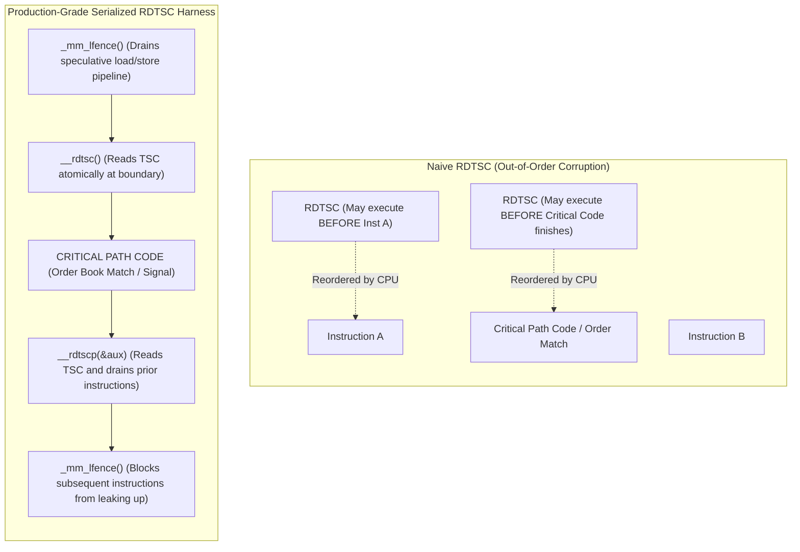

> [!summary]
> The x86 Time Stamp Counter (TSC) is a 64-bit hardware register incremented at a constant clock frequency on modern CPUs (Invariant TSC), providing sub-nanosecond cycle-accurate measurement. Capturing true microbenchmarks requires explicit instruction serialization (`LFENCE`) before and after the counter read to prevent the CPU's out-of-order execution engine from hoisting instructions past the measurement boundaries.

---

## Why it matters
In high-frequency trading and matching engine development, syscalls like `clock_gettime(CLOCK_MONOTONIC)` or `std::chrono::high_resolution_clock` are too slow for inner loops—they cost **15–30 ns (60–120 cycles)** and can trigger context switches or VDSO overhead. 

The `RDTSC` instruction executes in user-space in **~15–25 cycles (~4–6 ns)** without kernel involvement. However, using `RDTSC` naively produces completely bogus data—including zero or negative latencies—because modern superscalar out-of-order execution engines reorder instructions around the TSC read.



---

## Mechanism

### 1. Invariant TSC vs Legacy TSC
- **Legacy TSC**: Incremented with every CPU internal clock cycle. If the CPU entered power-saving states (C-states) or changed frequency (P-states / Turbo Boost / SpeedStep), the TSC ticked slower or stopped completely.
- **Constant / Invariant TSC (`CPUID.80000007H:EDX[8]`)**: In modern Intel (Nehalem onwards) and AMD (Zen) processors, the TSC ticks at a **constant, fixed nominal frequency** regardless of current core frequency, Turbo Boost, or C-state transitions. It stays synchronized across all cores on the same physical socket.

### 2. Out-of-Order Execution Reordering Hazards
Modern x86 CPUs feature out-of-order (OoO) execution windows holding 512+ micro-ops (ROB - Reorder Buffer). The CPU is free to execute `RDTSC` before preceding loads/stores complete or after subsequent arithmetic instructions have already started.
- `RDTSC` is **not a serializing instruction**.
- `RDTSCP` is **partially serializing**: it guarantees that all previous instructions retire before the TSC is read, but it **does not** prevent subsequent instructions from executing *before* the read!
- `CPUID` is fully serializing but prohibitively expensive (**~100–250 cycles**), which pollutes pipeline state and invalidates microbenchmarks.
- **`LFENCE` (Load Fence)**: Per Intel architecture guidelines, `LFENCE` acts as an instruction execution barrier with low overhead (**~10–15 cycles**). Placing `LFENCE` before `RDTSC` serializes the instruction pipeline without cache flushing.

---

## In Practice

```cpp
#include <x86intrin.h>
#include <cstdint>
#include <chrono>
#include <thread>
#include <iostream>

class FastTimestamp {
public:
    // Calibrate TSC frequency against monotonic clock at startup
    static double calibrate_tsc_freq_ghz() noexcept {
        uint64_t tsc_start = rdtsc_start();
        auto wall_start = std::chrono::steady_clock::now();
        
        std::this_thread::sleep_for(std::chrono::milliseconds(100));
        
        uint64_t tsc_end = rdtsc_end();
        auto wall_end = std::chrono::steady_clock::now();
        
        std::chrono::duration<double, std::nano> duration_ns = wall_end - wall_start;
        uint64_t elapsed_cycles = tsc_end - tsc_start;
        
        // Cycles per nanosecond (GHz)
        return static_cast<double>(elapsed_cycles) / duration_ns.count();
    }

    // Precise start of critical path
    [[nodiscard]] static inline uint64_t rdtsc_start() noexcept {
        _mm_lfence(); // Serialize pipeline: drain all previous instructions
        uint64_t tsc = __rdtsc();
        _mm_lfence(); // Prevent critical path code from executing before RDTSC
        return tsc;
    }

    // Precise end of critical path
    [[nodiscard]] static inline uint64_t rdtsc_end() noexcept {
        unsigned int aux;
        // rdtscp waits until all prior instructions in critical path retire
        uint64_t tsc = __rdtscp(&aux);
        _mm_lfence(); // Prevent subsequent instructions from executing before RDTSCP
        return tsc;
    }

    // Measure the baseline overhead of the measurement harness itself
    static uint64_t harness_overhead_cycles() noexcept {
        uint64_t min_overhead = UINT64_MAX;
        for (int i = 0; i < 1000; ++i) {
            uint64_t t0 = rdtsc_start();
            uint64_t t1 = rdtsc_end();
            uint64_t delta = t1 - t0;
            if (delta < min_overhead) {
                min_overhead = delta;
            }
        }
        return min_overhead;
    }
};
```

---

## Numbers

*Hardware Baseline: Intel Core i9-13900K / Xeon Sapphire Rapids @ 4.0 GHz.*

| Measurement Mechanism | Latency (Cycles) | Latency (Time) | Serializing Safety | Suitability for Hot Paths |
| :--- | :--- | :--- | :--- | :--- |
| **`clock_gettime(CLOCK_MONOTONIC)`** | 60–120 cycles | **15–30 ns** | Yes (VDSO/Syscall) | Slow; unacceptable for <100ns paths. |
| **Raw `__rdtsc()` (Unfenced)** | 15–20 cycles | **~4–5 ns** | **NO (Corrupted by OoO)** | Dangerous; invalid measurements. |
| **`CPUID` + `__rdtsc()`** | 150–250 cycles | **38–65 ns** | Yes (Full Pipeline Drain) | Too slow; disrupts cache/pipeline. |
| **`LFENCE` + `RDTSC` + `LFENCE`** | 25–35 cycles | **~6–9 ns** | **YES (Optimal)** | **Industry Gold Standard.** |
| **`RDTSCP` + `LFENCE`** | 20–30 cycles | **~5–8 ns** | **YES (Optimal End)** | **Industry Gold Standard.** |

---

## Trade-offs

| Profiling Approach | Advantages | Disadvantages / Failure Modes |
| :--- | :--- | :--- |
| **In-Line RDTSC Instrumentation** | Zero syscall overhead; cycle-accurate resolution ($0.25\text{ ns}$). | Adds 20–30 cycles (~7 ns) of probe effect / measurement bias to the hot path. |
| **Hardware NIC Timestamps (PTP/MAC)** | Zero software probe effect on the CPU; measures true wire-to-wire. | Requires hardware support (Solarflare/Mellanox); cannot profile internal C++ sub-functions. |
| **Optical Network Taps + Packet Capture** | Completely non-intrusive out-of-band monitoring. | Captures only ingress/egress boundaries; high infrastructure hardware cost. |

---

> [!warning] Gotchas
> 1. **Cross-Socket TSC Drift**: While invariant TSC is synchronized across cores within a single socket, multi-socket motherboards can experience TSC phase drift between Socket 0 and Socket 1. *Always pin measurement threads to a single socket.*
> 2. **Virtual Machine / Cloud VM TSC Trapping**: In cloud environments (AWS/GCP), executing `RDTSC` inside a VM may trigger a VM-Exit trap to the hypervisor if not configured with `tsc_deadline_timer` or invariant TSC pass-through, inflating latency from **5 ns to 1,500 ns**.
> 3. **Omitting Measurement Overhead Subtraction**: Measuring a 10 ns function with a 7 ns `RDTSC` harness will report 17 ns (+70% error) unless the calibration overhead is subtracted.

---

## Lab
**Objective**: Build a cycle-accurate C++ benchmarking harness that computes the frequency of your CPU, measures the baseline `LFENCE` + `RDTSC` harness overhead, and logs a histogram of 1,000,000 runs of a dummy critical-path function.

**Success Criteria**:
1. Measure the minimum, median ($p50$), and tail ($p99.9$) overhead of the measurement harness itself.
2. Demonstrate that omitting `_mm_lfence()` causes the harness to occasionally measure 0 cycles or out-of-order latency artifacts.

---

> [!question]- Self-test
> 1. **Why does `RDTSCP` require an accompanying `_mm_lfence()` after it to guarantee clean timing boundaries?**
>    *Answer*: `RDTSCP` is only partially serializing: it guarantees that all instructions *preceding* it retire before the timestamp is read. However, it does not prevent instructions *following* `RDTSCP` from being speculatively executed before `RDTSCP` finishes. The trailing `_mm_lfence()` acts as a barrier preventing downstream code from leaking into the measured region.
> 2. **What is the difference between Constant TSC and Invariant TSC?**
>    *Answer*: Constant TSC ticks at a constant rate even if CPU core frequency changes (P-states), but can stop or drift when the CPU enters deep sleep states (C-states). Invariant TSC runs at a fixed nominal frequency across all P-states, C-states, and Turbo Boost transitions, guaranteeing a synchronized, reliable timebase across all cores on the socket.
> 3. **How do you convert raw RDTSC cycles into wall-clock nanoseconds in production without performing costly floating-point division in the hot path?**
>    *Answer*: Precompute a fixed-point conversion factor at startup: $\text{mult} = \frac{10^9 \times 2^{32}}{\text{TSC\_Frequency\_Hz}}$. During runtime, convert cycles via fast integer multiplication and bit-shift: $\text{time\_ns} = (\text{cycles} \times \text{mult}) \gg 32$.

---

## Related
- [[Notes/Latency Numbers Every Trading Engineer Knows]]
- [[Notes/Coordinated Omission in Low Latency Systems]]
- [[Notes/One-Way Latency vs Round-Trip Time Measurement]]
- [[Notes/Clock Sources and Hardware Timestamping]]
- [[MOC - 07 Time & Measurement]]

## Sources
- [[Sources/How NOT to Measure Latency by Gil Tene]]
- [[Sources/Intel 64 and IA-32 Architectures Software Developer's Manual - Volume 3B]]
- [[Sources/CppCon 2017 - When a Microsecond is an Eternity by Carl Cook]]
