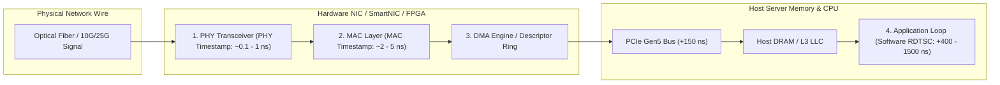

> [!summary]
> Software timestamps captured by the CPU operating system stack introduce 500–5,000 nanoseconds of non-deterministic PCIe, DMA, and interrupt jitter. Hardware timestamping records the arrival and departure of Ethernet frames directly at the physical transceiver (PHY) or MAC layer inside the Network Interface Card (NIC) with sub-nanosecond resolution, providing the ground truth for wire-to-wire latency measurement and MiFID II RTS 25 compliance.

---

## Why it matters
If your trading system measures packet latency inside the C++ application loop (`rdtsc` at the socket read), your measurement includes:
1. Physical wire propagation and PHY deserialization.
2. NIC RX FIFO buffering.
3. PCIe DMA transfer to host memory.
4. CPU cache line allocation and polling detection.

This software measurement introduces **300 to 1,500 ns of measurement noise (probe error)**. If an exchange claims a 2 µs matching engine turnaround, software timestamps cannot tell whether jitter originated on the physical network switch, the PCIe bus, or the exchange matching engine. Hardware timestamping at the NIC eliminates all host-side noise.



---

## Mechanism

### 1. Timestamping Locations Inside the NIC
1. **PHY Layer Timestamping**: Captures the exact moment the physical start-of-frame delimiter (SFD) transitions across the optical/copper transceiver. Accuracy: **<1 nanosecond**.
2. **MAC Layer Timestamping**: Captures timestamp as the Ethernet frame passes through the Media Access Control (MAC) block. Standard for Solarflare (XtremeScale) and Mellanox (ConnectX) NICs. Accuracy: **~2–5 nanoseconds**.
3. **DMA / Software Timestamping**: Generated when the host driver receives the packet descriptor in RAM. Subject to PCIe TLP queueing and CPU polling jitter (**100–1,500 ns error**).

### 2. Oscillator Stability and Clock Drift
The hardware clock inside a NIC is driven by an oscillator:
- **Standard Quartz Crystal**: Drifts by **10–50 ppm (parts per million)** $\implies 10\text{–}50\text{ µs}$ of drift per second under thermal variations.
- **TCXO (Temperature-Compensated Crystal Oscillator)**: Drifts by **0.1–1.0 ppm**.
- **OCXO (Oven-Controlled Crystal Oscillator)**: Housed in a miniature temperature-regulated oven, maintaining stability within **1–10 ppb (parts per billion)** $\implies 1\text{–}10\text{ ns}$ drift per second.
- **Atomic Rubidium / Cesium Clocks**: **<0.001 ppb**, used as the master grandmaster clock in colocation data centers.

### 3. Regulatory Mandate: MiFID II RTS 25
European regulatory framework (MiFID II RTS 25) strictly mandates time synchronization across all electronic venues and algorithmic participants:
- **Standard Algorithmic Trading**: Maximum divergence of **100 µs** from UTC, with 100 µs granularity.
- **High-Frequency Trading (HFT)**: Maximum divergence of **1 µs** from UTC, with **100 nanosecond** timestamp resolution.

---

## In Practice

### 1. Enabling Linux Socket Hardware Timestamps (`SO_TIMESTAMPING`)

```cpp
#include <sys/socket.h>
#include <linux/net_tstamp.h>
#include <linux/sockios.h>
#include <sys/ioctl.h>
#include <net/if.h>
#include <cstring>
#include <iostream>
#include <stdexcept>

void enable_hw_timestamps(int socket_fd, const char* interface_name) {
    // 1. Configure Hardware Timestamping filter on NIC via ioctl
    struct ifreq ifr;
    std::memset(&ifr, 0, sizeof(ifr));
    std::strncpy(ifr.ifr_name, interface_name, sizeof(ifr.ifr_name) - 1);

    struct hwtstamp_config hw_config;
    std::memset(&hw_config, 0, sizeof(hw_config));
    hw_config.tx_type = HWTSTAMP_TX_ON;
    hw_config.rx_filter = HWTSTAMP_FILTER_ALL;
    ifr.ifr_data = reinterpret_cast<char*>(&hw_config);

    if (ioctl(socket_fd, SIOCSHWTSTAMP, &ifr) < 0) {
        std::cerr << "Warning: SIOCSHWTSTAMP ioctl failed. Hardware timestamping may not be supported by NIC driver.\n";
    }

    // 2. Enable SO_TIMESTAMPING socket flags
    int flags = SOF_TIMESTAMPING_RX_HARDWARE |
                SOF_TIMESTAMPING_RAW_HARDWARE |
                SOF_TIMESTAMPING_SYS_HARDWARE |
                SOF_TIMESTAMPING_SOFTWARE;

    if (setsockopt(socket_fd, SOL_SOCKET, SO_TIMESTAMPING, &flags, sizeof(flags)) < 0) {
        throw std::runtime_error("Failed to set SO_TIMESTAMPING on socket");
    }
}
```

### 2. Extracting Hardware Timestamp from Control Message (`recvmsg`)

```cpp
#include <sys/socket.h>
#include <linux/net_tstamp.h>
#include <cstdint>

uint64_t extract_hw_timestamp_ns(struct msghdr* msg) {
    for (struct cmsghdr* cmsg = CMSG_FIRSTHDR(msg); cmsg != nullptr; cmsg = CMSG_NXTHDR(msg, cmsg)) {
        if (cmsg->cmsg_level == SOL_SOCKET && cmsg->cmsg_type == SCM_TIMESTAMPING) {
            // SCM_TIMESTAMPING returns 3 timestamps:
            // ts[0] = Software Host timestamp
            // ts[1] = Legacy Hardware Transformed
            // ts[2] = Raw Hardware NIC PHY/MAC timestamp
            struct timespec* ts = reinterpret_cast<struct timespec*>(CMSG_DATA(cmsg));
            return static_cast<uint64_t>(ts[2].tv_sec) * 1'000'000'000ULL + ts[2].tv_nsec;
        }
    }
    return 0; // Hardware timestamp not present
}
```

---

## Numbers

| Timestamping Level | Resolution / Accuracy | Noise / Jitter Introduced | Measurement Application |
| :--- | :--- | :--- | :--- |
| **User-Space `rdtsc` at `recv()`** | 0.25 ns resolution | **+300–1,500 ns jitter** | Application-level processing duration. |
| **Linux Kernel `SO_TIMESTAMP`** | 1,000 ns (1 µs) | **+1,500–4,000 ns jitter** | Basic logging (Too noisy for HFT). |
| **Solarflare `ef_vi` Packet Stamp**| **~2–4 ns** | **<5 ns jitter** | Production tick-to-trade wire profiling. |
| **NIC Hardware MAC Timestamp** | **~1–2 ns** | **<2 ns jitter** | Ingress/Egress packet accounting. |
| **FPGA PHY Transceiver Stamp** | **<0.5 ns (Sub-ns)** | **<0.2 ns jitter** | Tier-1 exchange matching engine gateway. |

---

## Trade-offs

| Timestamping Strategy | Accuracy / Fidelity | Overhead / Complexity |
| :--- | :--- | :--- |
| **Hardware NIC Timestamps (PTP synced)**| Sub-10ns true wire time; immune to host CPU load. | Requires PTP grandmaster infrastructure, PTP-aware switches, and hardware NIC support. |
| **Software RDTSC Timestamping** | Simple to implement; zero hardware dependencies; profiles internal functions. | Blind to network/PCIe queueing; contaminated by cache misses and core migrations. |
| **Optical Tap + Packet Capture (Endace/cPacket)**| Complete non-intrusive wire truth; zero overhead on production trading servers. | Extremely expensive hardware appliances ($50k+ per rack); offline analysis only. |

---

> [!warning] Gotchas
> 1. **The Ingress/Egress Asymmetry of Hardware Timestamps**: Ingress (RX) timestamps are attached directly to the packet descriptor and read immediately. Egress (TX) hardware timestamps are generated *as the packet leaves the PHY*, meaning the timestamp is written asynchronously into the NIC's TX error/completion queue. To read a TX hardware timestamp, the application must poll the socket error queue (`recvmsg(..., MSG_ERRQUEUE)`).
> 2. **NIC Internal Clock Slew vs Step**: When synchronizing the NIC hardware clock via PTP (`phc2sys`), stepping the clock introduces backward or discontinuous timestamp jumps. *Always configure PTP daemons to slew (gradually discipline frequency) during trading hours.*

---

## Lab
**Objective**: Enable hardware timestamping on a Linux network interface using `SO_TIMESTAMPING`, generate incoming UDP traffic, and compare the hardware MAC timestamp against the software CPU timestamp.

**Success Criteria**:
1. Run `ethtool -T <interface>` to verify hardware timestamping capabilities.
2. Capture 10,000 UDP packets using `recvmsg()`.
3. Compute `Delta = Software_TSC_ns - Hardware_NIC_ns` and prove that software timestamps fluctuate with 300–1,000 ns of PCIe/OS jitter while hardware timestamps maintain strict monotonic linearity.

---

> [!question]- Self-test
> 1. **Why is a software timestamp captured via `rdtsc` immediately after `recv()` incapable of measuring true one-way wire latency?**
>    *Answer*: The software timestamp is captured after the packet has already traversed the network switch, PHY layer, MAC layer, NIC RX FIFO buffer, PCIe bus DMA transfer, and CPU cache-allocation loop. This adds hundreds of nanoseconds of non-deterministic hardware and bus jitter that masks the true wire arrival time.
> 2. **What is the difference between an RX hardware timestamp and a TX hardware timestamp in terms of software retrieval?**
>    *Answer*: An RX hardware timestamp is embedded directly in the packet descriptor or metadata delivered alongside the packet payload in the standard receive path. A TX hardware timestamp is generated as the packet leaves the physical transceiver, requiring the host application to asynchronously read the socket error queue (`MSG_ERRQUEUE`) to retrieve the looped-back completion timestamp.
> 3. **What is the maximum allowed clock divergence from UTC for High-Frequency Trading systems under MiFID II RTS 25?**
>    *Answer*: Under MiFID II RTS 25, high-frequency algorithmic trading systems must maintain a maximum time divergence of **1 microsecond (1 µs)** from UTC (traceable to an official UTC national laboratory), with a minimum timestamp resolution/granularity of **100 nanoseconds**.

---

## Related
- [[Notes/Precision Time Protocol and White Rabbit]]
- [[Notes/One-Way Latency vs Round-Trip Time Measurement]]
- [[Notes/CPU Timestamp Counter RDTSC Mechanics]]
- [[Notes/Latency Numbers Every Trading Engineer Knows]]
- [[MOC - 07 Time & Measurement]]

## Sources
- [[Sources/IEEE 1588-2019 Standard for Precision Clock Synchronization]]
- [[Sources/Solarflare ef_vi User Guide]]
- [[Sources/Linux Kernel Documentation - networking/timestamping.rst]]
