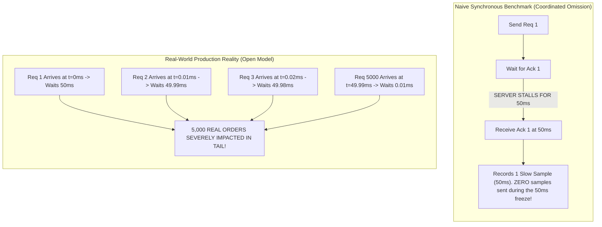

> [!summary]
> Coordinated Omission occurs when a benchmarking tool measures only Service Time instead of Response Time, inadvertently synchronizing with system stalls. When a server freezes for 100 milliseconds, a synchronous load generator pauses and sends nothing, recording a single slow sample while omitting the thousands of requests that would have backed up in reality—drastically hiding the true $p99.99$ tail latency.

---

## Why it matters
In high-frequency trading and exchange matching engines, presenting an average or standard percentile chart generated by a naive benchmark is fatal. 

If your matching engine processes 100,000 orders/sec (1 order every 10 µs) and takes a **50-millisecond OS jitter pause**:
- A naive load generator records **1 single slow request** taking 50 ms.
- In reality, **5,000 subsequent orders** queued up on the network wire. The 2nd order waited 49.99 ms; the 3rd waited 49.98 ms; the 5000th waited 10 µs.
- The true $p99.9$ and $p99.99$ response times were **ruined for 5,000 market participants**, but the benchmark reports a $99.9\text{th}$ percentile of **1.5 microseconds**.

Understanding and correcting for Coordinated Omission is mandatory for measuring real-world trading performance.



---

## Mechanism

### 1. Service Time vs Response Time
- **Service Time**: The time the system takes to process a request *after* it begins working on it.
- **Wait Time (Queueing Delay)**: The time the request sits unserviced in network buffers, socket queues, or ring buffers.
- **Response Time**: The true end-to-end latency experienced by the participant:
  $$\text{Response Time} = \text{Wait Time} + \text{Service Time}$$

Synchronous closed-loop test harnesses (`send -> wait -> send`) measure only Service Time, completely ignoring Wait Time.

### 2. The Mathematical Correction for Coordinated Omission
When measuring an open-arrival stream with an intended constant or Poisson arrival rate of interval $I$:
If a measured request takes duration $L$, and $L > I$:
1. The measurement tool records the primary sample $L$.
2. The tool must synthetically generate and insert additional sample entries into the histogram representing the omitted requests that arrived during the stall:
   $$\text{Synthetic Latencies} = \{ L - I, \ L - 2I, \ L - 3I, \ \dots, \ L - kI \} \quad \text{for } kI < L$$

This mathematically reconstructs the true response-time distribution experienced by an open-system market.

### 3. High Dynamic Range (HDR) Histograms
Traditional linear histograms cannot track nanosecond-to-minute latencies without consuming gigabytes of memory or sacrificing precision in the tail.
- **HdrHistogram (invented by Gil Tene)** uses **logarithmic sub-bucket indexing** with constant relative accuracy (e.g., maintaining 3 significant decimal digits of precision across a $1\text{ ns}$ to $1\text{ hour}$ range) in a fixed, allocation-free memory footprint (~100 KB).

---

## In Practice

### Zero-Allocation C++ Coordinated Omission Corrected Histogram Entry

```cpp
#include <cstdint>
#include <vector>
#include <cmath>
#include <algorithm>
#include <iostream>

class CoordinatedOmissionTracker {
private:
    uint64_t expected_interval_ns_;
    std::vector<uint64_t> raw_samples_;
    std::vector<uint64_t> corrected_samples_;

public:
    explicit CoordinatedOmissionTracker(uint64_t expected_interval_ns, size_t reserve_capacity = 1'000'000)
        : expected_interval_ns_(expected_interval_ns) {
        raw_samples_.reserve(reserve_capacity);
        corrected_samples_.reserve(reserve_capacity * 2);
    }

    // Record an event duration and automatically generate corrected samples if stalled
    void record_value(uint64_t latency_ns) {
        raw_samples_.push_back(latency_ns);
        corrected_samples_.push_back(latency_ns);

        // If latency exceeded expected arrival interval, compensate for omitted events
        if (expected_interval_ns_ > 0 && latency_ns > expected_interval_ns_) {
            uint64_t missing_latency = latency_ns - expected_interval_ns_;
            while (missing_latency > 0) {
                corrected_samples_.push_back(missing_latency);
                if (missing_latency <= expected_interval_ns_) break;
                missing_latency -= expected_interval_ns_;
            }
        }
    }

    uint64_t get_percentile(double percentile, bool corrected = true) {
        auto& target = corrected ? corrected_samples_ : raw_samples_;
        if (target.empty()) return 0;
        
        std::sort(target.begin(), target.end());
        size_t idx = static_cast<size_t>(std::floor((percentile / 100.0) * (target.size() - 1)));
        return target[idx];
    }
};
```

---

## Numbers

*Example Scenario: 100,000 orders/sec stream (Interval $I = 10\text{ µs}$) over 10 seconds (1,000,000 total orders). A single 50 ms OS defrag pause occurs.*

| Metric / Percentile | Uncorrected (Raw Naive Generator) | Corrected (True Real-World Impact) | Error Factor |
| :--- | :--- | :--- | :--- |
| **Total Recorded Samples** | 995,001 samples | **1,000,000 samples** | 5,000 omitted! |
| **50th Percentile ($p50$)** | **0.85 µs** | **0.85 µs** | 1.0x (Accurate) |
| **90th Percentile ($p90$)** | **1.20 µs** | **1.25 µs** | 1.04x |
| **99th Percentile ($p99$)** | **1.85 µs** | **25,000 µs (25 ms)** | **~13,500x Under-reported!** |
| **99.9th Percentile ($p99.9$)**| **2.40 µs** | **47,500 µs (47.5 ms)**| **~19,800x Under-reported!** |
| **Max Latency** | **50,000 µs (50 ms)** | **50,000 µs (50 ms)** | 1.0x |

---

## Trade-offs

| Profiling Model | Advantages | Pitfalls / Blindspots |
| :--- | :--- | :--- |
| **Open-Model Load Generator** | Emulates independent market arrivals; captures true queuing delays and tail latency. | Requires multi-threaded or hardware-driven packet injection (e.g. MoonGen / DPDK generator). |
| **Closed-Loop (Ping-Pong) Test** | Simple to build; measures pure unloaded code path service time. | **Completely blind to Coordinated Omission**; hides catastrophic tail spikes. |
| **Passive Tap Ingress/Egress Matching**| Ground truth with zero synthetic assumptions; non-intrusive. | Requires high-precision PTP clock sync between tap appliances. |

---

> [!warning] Gotchas
> 1. **The "Average Latency" Trap**: Never use arithmetic mean or standard deviation in low-latency performance reports. Financial latency distributions are multimodal with fat power-law tails. A mean of 2 µs can conceal multi-second trading freezes.
> 2. **Benchmark Generator Co-location**: Running a load generator on the *same physical machine* as the matching engine being tested invalidates the benchmark. When the matching engine spikes CPU usage, it steals cycles from the load generator, exacerbating Coordinated Omission.

---

## Lab
**Objective**: Build a benchmark simulating a 100k msg/sec service loop with an intentional 20 ms simulated stall. Compare the raw uncorrected percentile output against the Coordinated-Omission-corrected distribution.

**Success Criteria**:
1. Output $p50, p90, p99, p99.9, p99.99$ for both uncorrected and corrected metrics.
2. Prove that the uncorrected metric shows $p99 < 5\text{ µs}$ while the corrected metric shows $p99 > 10\text{ ms}$, exposing the hidden stall.

---

> [!question]- Self-test
> 1. **What is the fundamental difference between Service Time and Response Time?**
>    *Answer*: Service Time is the time elapsed between when a server begins actively executing a request and when it finishes. Response Time is the total elapsed time between when the client sent the request (or when the event occurred) and when the response is received, comprising both queueing wait time and service time ($\text{Response Time} = \text{Wait Time} + \text{Service Time}$).
> 2. **Why does a synchronous closed-loop benchmarking tool (e.g., `send() -> wait_response()`) suffer from Coordinated Omission?**
>    *Answer*: A closed-loop generator only issues the next request after receiving the response to the previous one. If the target server stalls for 100 ms, the generator also halts and sends zero requests during that 100 ms window, recording only a single slow sample while omitting the thousands of requests that would have arrived and queued up in an open production environment.
> 3. **How does HdrHistogram maintain constant relative accuracy across a wide range of values without using excessive memory?**
>    *Answer*: HdrHistogram organizes data using logarithmic buckets with linear sub-bucket arrays. Each bucket covers a power-of-two range with a fixed number of precision subdivisions (e.g., 3 significant figures), ensuring that whether a value is 100 ns or 100 seconds, the measurement resolution remains within a constant $\pm 0.1\%$ relative error while using a fixed, pre-allocated array.

---

## Related
- [[Notes/Clock Sources and Hardware Timestamping]]
- [[Notes/Precision Time Protocol and White Rabbit]]
- [[Notes/One-Way Latency vs Round-Trip Time Measurement]]
- [[Notes/Latency Numbers Every Trading Engineer Knows]]
- [[MOC - 07 Time & Measurement]]

## Sources
- [[Sources/How NOT to Measure Latency by Gil Tene]]
- [[Sources/HdrHistogram Repository and Documentation]]
- [[Sources/Systems Performance by Brendan Gregg]]
