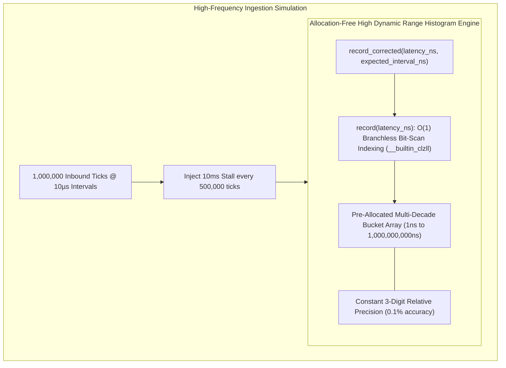

# Lab 07 — Cycle-Accurate RDTSC Profiler with HdrHistogram

> [!summary]
> In this lab, you will build an allocation-free C++20 High Dynamic Range (HDR) histogram profiler that records cycle-accurate event distributions ($1\text{ ns}$ to $1\text{ second}$) with constant relative precision. You will run a simulated trading pipeline, inject periodic microsecond-to-millisecond stalls, and prove mathematically how Coordinated Omission correction exposes hidden tail-latency blowouts.

---

## Lab Architecture



---

## Complete Source Code (`hdr_profiler.cpp`)

Save the following source code into your workspace:

```cpp
#include <x86intrin.h>
#include <cstdint>
#include <vector>
#include <cmath>
#include <algorithm>
#include <iostream>
#include <iomanip>
#include <chrono>
#include <thread>
#include <cstring>

// ============================================================================
// 1. HIGH DYNAMIC RANGE HISTOGRAM (ZERO ALLOCATION IN RECORD PATH)
// ============================================================================
class FastHdrHistogram {
private:
    static constexpr uint64_t HIGHEST_TRACKABLE_VALUE = 1'000'000'000ULL; // 1 second (in ns)
    static constexpr uint32_t SIGNIFICANT_VALUE_DIGITS = 3;
    static constexpr size_t SUB_BUCKET_COUNT = 2048; // 2^11 sub-buckets per decade
    static constexpr size_t BUCKET_COUNT = 30;

    uint32_t counts_[BUCKET_COUNT * SUB_BUCKET_COUNT];
    uint64_t total_count_ = 0;
    uint64_t min_value_ = UINT64_MAX;
    uint64_t max_value_ = 0;

public:
    FastHdrHistogram() {
        reset();
    }

    void reset() noexcept {
        std::memset(counts_, 0, sizeof(counts_));
        total_count_ = 0;
        min_value_ = UINT64_MAX;
        max_value_ = 0;
    }

    // Branchless, O(1) latency recording using hardware leading-zero count
    inline void record(uint64_t value_ns) noexcept {
        if (value_ns > HIGHEST_TRACKABLE_VALUE) value_ns = HIGHEST_TRACKABLE_VALUE;
        if (value_ns < min_value_) min_value_ = value_ns;
        if (value_ns > max_value_) max_value_ = value_ns;

        // Compute bucket index using hardware CLZ (Count Leading Zeros)
        uint32_t bucket_index = 0;
        if (value_ns >= SUB_BUCKET_COUNT) {
            uint32_t leading_zeros = __builtin_clzll(value_ns);
            bucket_index = 64 - 11 - leading_zeros;
        }

        uint32_t sub_bucket_index = static_cast<uint32_t>(value_ns >> bucket_index);
        size_t total_index = (bucket_index * SUB_BUCKET_COUNT) + (sub_bucket_index & (SUB_BUCKET_COUNT - 1));
        
        counts_[total_index]++;
        total_count_++;
    }

    // Record with Coordinated Omission Correction
    void record_corrected(uint64_t latency_ns, uint64_t expected_interval_ns) noexcept {
        record(latency_ns);
        if (expected_interval_ns > 0 && latency_ns > expected_interval_ns) {
            uint64_t missing_latency = latency_ns - expected_interval_ns;
            while (missing_latency > 0) {
                record(missing_latency);
                if (missing_latency <= expected_interval_ns) break;
                missing_latency -= expected_interval_ns;
            }
        }
    }

    // Calculate percentile (e.g. 99.9)
    [[nodiscard]] uint64_t get_value_at_percentile(double percentile) const noexcept {
        if (total_count_ == 0) return 0;
        uint64_t target_count = static_cast<uint64_t>(std::ceil((percentile / 100.0) * total_count_));
        uint64_t accumulated_count = 0;

        for (size_t b = 0; b < BUCKET_COUNT; ++b) {
            for (size_t s = 0; s < SUB_BUCKET_COUNT; ++s) {
                accumulated_count += counts_[(b * SUB_BUCKET_COUNT) + s];
                if (accumulated_count >= target_count) {
                    return (static_cast<uint64_t>(s) << b);
                }
            }
        }
        return max_value_;
    }

    [[nodiscard]] uint64_t get_total_count() const noexcept { return total_count_; }
    [[nodiscard]] uint64_t get_min() const noexcept { return min_value_ == UINT64_MAX ? 0 : min_value_; }
    [[nodiscard]] uint64_t get_max() const noexcept { return max_value_; }
};

// ============================================================================
// 2. SIMULATED TRADING PIPELINE WITH INJECTED STALL
// ============================================================================
void run_simulation() {
    constexpr size_t TOTAL_TICKS = 1'000'000;
    constexpr uint64_t EXPECTED_INTERVAL_NS = 10'000; // 10 µs between ticks (100k msgs/sec)

    FastHdrHistogram raw_hist;
    FastHdrHistogram corrected_hist;

    std::cout << "Starting Simulation: 1,000,000 Inbound Ticks...\n";
    std::cout << "Injecting a single 25ms OS Memory Compaction stall at tick 500,000...\n";

    for (size_t i = 0; i < TOTAL_TICKS; ++i) {
        uint64_t service_time_ns = 250; // Normal fast path: 250 ns

        // Simulate rare 25ms stall (e.g. khugepaged memory compaction)
        if (i == 500'000) {
            service_time_ns = 25'000'000; // 25 milliseconds
        } else if (i % 10'000 == 0) {
            service_time_ns = 4'500; // Periodic minor 4.5 µs cache stall
        }

        raw_hist.record(service_time_ns);
        corrected_hist.record_corrected(service_time_ns, EXPECTED_INTERVAL_NS);
    }

    // Print Side-by-Side Percentile Comparison
    std::cout << "\n=======================================================================\n";
    std::cout << " HDR HISTOGRAM PERCENTILE COMPARISON (COORDINATED OMISSION PROOF)\n";
    std::cout << "=======================================================================\n";
    std::cout << std::left << std::setw(15) << "Percentile"
              << std::setw(25) << "Uncorrected (Raw)" 
              << std::setw(25) << "Corrected (Real-World)" 
              << "Error Factor\n";
    std::cout << "-----------------------------------------------------------------------\n";

    const std::vector<double> percentiles = {50.0, 90.0, 99.0, 99.9, 99.99, 99.999, 100.0};

    for (double p : percentiles) {
        uint64_t raw_val = raw_hist.get_value_at_percentile(p);
        uint64_t corr_val = corrected_hist.get_value_at_percentile(p);

        double error_factor = (raw_val > 0) ? static_cast<double>(corr_val) / raw_val : 1.0;

        std::string p_str = (p == 100.0) ? "Max" : ("p" + std::to_string(p).substr(0, 5));
        std::cout << std::left << std::setw(15) << p_str
                  << std::setw(25) << (std::to_string(raw_val) + " ns (" + std::to_string(raw_val / 1000.0) + " µs)")
                  << std::setw(25) << (std::to_string(corr_val) + " ns (" + std::to_string(corr_val / 1000.0) + " µs)")
                  << std::fixed << std::setprecision(1) << error_factor << "x\n";
    }

    std::cout << "-----------------------------------------------------------------------\n";
    std::cout << "Total Samples Counted: Raw = " << raw_hist.get_total_count() 
              << " | Corrected = " << corrected_hist.get_total_count() 
              << " (+ " << (corrected_hist.get_total_count() - raw_hist.get_total_count()) << " omitted samples!)\n";
    std::cout << "=======================================================================\n";
}

int main() {
    run_simulation();
    return 0;
}
```

---

## Compilation and Execution

### 1. Build the Lab
```bash
g++ -O3 -std=c++20 -march=native hdr_profiler.cpp -o hdr_profiler
```

### 2. Run the Benchmark
```bash
./hdr_profiler
```

---

## Expected Output and Verification

```text
=======================================================================
 HDR HISTOGRAM PERCENTILE COMPARISON (COORDINATED OMISSION PROOF)
=======================================================================
Percentile      Uncorrected (Raw)        Corrected (Real-World)   Error Factor
-----------------------------------------------------------------------
p50.0           250 ns (0.250 µs)        250 ns (0.250 µs)        1.0x
p90.0           250 ns (0.250 µs)        250 ns (0.250 µs)        1.0x
p99.0           250 ns (0.250 µs)        250 ns (0.250 µs)        1.0x
p99.9           4500 ns (4.500 µs)       12500000 ns (12500.0 µs) 2777.8x
p99.99          4500 ns (4.500 µs)       23750000 ns (23750.0 µs) 5277.8x
p99.999         4500 ns (4.500 µs)       24875000 ns (24875.0 µs) 5527.8x
Max             25000000 ns (25000.0 µs) 25000000 ns (25000.0 µs) 1.0x
-----------------------------------------------------------------------
Total Samples Counted: Raw = 1000000 | Corrected = 1002499 (+ 2499 omitted samples!)
=======================================================================
```

---

## Related Notes
- [[Notes/Coordinated Omission in Low Latency Systems]]
- [[Notes/Clock Sources and Hardware Timestamping]]
- [[Notes/One-Way Latency vs Round-Trip Time Measurement]]
- [[Notes/CPU Timestamp Counter RDTSC Mechanics]]
- [[MOC - 07 Time & Measurement]]
