> [!summary]
> In electronic trading, network paths are fundamentally asymmetric: inbound market data arrives via lightweight UDP multicast, while outbound execution travels over stateful TCP/IP through exchange risk gateways. Dividing Round-Trip Time by two ($\text{RTT}/2$) is an invalid assumption that conceals queueing bottlenecks, necessitating independent one-way hardware timestamping at every physical boundary.

---

## Why it matters
Many non-HFT engineers measure network latency using `ping` or TCP request-reply RTT and divide by 2 to estimate one-way transit time. 

In financial markets, this assumption fails catastrophically:
1. **Protocol Asymmetry**: Ingress is UDP multicast (stateless, zero-handshake, small packets); Egress is TCP unicast (TCP ACKs, congestion windows, TLS/session framing).
2. **Gateway Processing Asymmetry**: Ingress feed handlers broadcast at wire speed; Egress exchange order gateways execute credit checks, risk validation, and sequencing before generating an acknowledgment.
3. **Physical Route Asymmetry**: Telecom providers frequently route outbound fiber over different physical paths than inbound fiber due to dynamic BGP routing and optical carrier constraints.

Accurate tick-to-trade optimization requires decomposing latency into discrete, one-way hardware-measured stages.

```mermaid
flowchart LR
    subgraph IngressPath ["1. INGRESS PATH: Fast UDP Multicast (Wire to Tick)"]
        EX_PUB[Exchange Publisher] -->|UDP Multicast Frame| SW1[Switch Ingress]
        SW1 -->|Direct Cut-Through| NIC_RX[Participant NIC RX]
        NIC_RX -->|Hardware RX Timestamp: T_ingress| FH[Feed Handler]
    end

    subgraph HostPath ["2. HOST PATH: Decision Critical Path (Tick to Trade)"]
        FH -->|Decoded Book Delta| OB[Order Book Engine]
        OB -->|Alpha Signal| STRAT[Trading Strategy]
        STRAT -->|Outbound Order| RISK[Pre-Trade Risk Gate]
        RISK -->|Formatted TCP Packet| NIC_TX[Participant NIC TX]
    end

    subgraph EgressPath ["3. EGRESS PATH: Stateful TCP Unicast (Trade to Ack)"]
        NIC_TX -->|Hardware TX Timestamp: T_egress| SW2[Switch Egress]
        SW2 -->|Unicast TCP Frame| GW[Exchange Gateway]
        GW -->|Pre-Trade Risk + Sequencer| ME[Matching Engine]
        ME -->|Execution Report / Ack| EX_PUB
    end
```



---

## Mechanism

### 1. The Tick-to-Trade Latency Decomposition
A complete trading event lifecycle is decomposed into four discrete, non-overlapping intervals:

$$\text{Total Tick-to-Ack Latency} = \Delta t_{\text{ingress}} + \Delta t_{\text{host}} + \Delta t_{\text{egress}} + \Delta t_{\text{exchange}}$$

1. **Ingress Wire Latency ($\Delta t_{\text{ingress}}$)**: Exchange PHY $\to$ Participant NIC PHY (Fiber propagation + L1/L2 switch traversal).
2. **Host Tick-to-Trade Latency ($\Delta t_{\text{host}}$)**: Ingress NIC PHY $\to$ Feed Handler $\to$ Strategy $\to$ Pre-Trade Risk $\to$ Egress NIC PHY.
3. **Egress Wire Latency ($\Delta t_{\text{egress}}$)**: Egress NIC PHY $\to$ Exchange Gateway PHY.
4. **Exchange Processing Latency ($\Delta t_{\text{exchange}}$)**: Gateway Ingress $\to$ Risk Validation $\to$ Sequencer $\to$ Matching Engine $\to$ Ack Outbound PHY.

### 2. Cross-Colocation Latency: New York to Chicago
Long-distance latency arbitrage between CME (Aurora, IL) and NASDAQ/BATS/ICE (Carteret/Secaucus/Mahwah, NJ) illustrates extreme physical medium asymmetry:

- **Distance**: ~1,180 km (733 miles) straight-line.
- **Standard Terrestrial Fiber ($n \approx 1.468$)**: One-way transit time is **~7.5–8.0 ms** ($\text{RTT} \approx 15.0\text{–}16.0\text{ ms}$).
- **Shortest-Path Fiber (Spread Networks)**: $\text{RTT} \approx \mathbf{13.1\text{ ms}}$.
- **Microwave / Millimeter-Wave Line-of-Sight ($n \approx 1.0003$)**: Radio signals travel at the speed of light in air ($~3.3\text{ ns/m}$), cutting one-way transit time to **~4.0–4.2 ms** ($\text{RTT} \approx \mathbf{8.0\text{–}8.4\text{ ms}}$)—nearly **2x faster than fiber**.

---

## In Practice

### High-Resolution Tick-to-Trade Instrumentation in C++

```cpp
#include <x86intrin.h>
#include <cstdint>
#include <iostream>

struct TickToTradeProfile {
    uint64_t t_nic_ingress_hw_ns;  // Ingress frame PHY timestamp from NIC
    uint64_t t_feed_parsed_tsc;     // Software TSC after zero-copy parse
    uint64_t t_book_updated_tsc;    // Software TSC after LOB delta applied
    uint64_t t_signal_computed_tsc; // Software TSC after pricing model evaluates
    uint64_t t_risk_cleared_tsc;    // Software TSC after pre-trade risk check
    uint64_t t_nic_egress_hw_ns;   // Egress frame PHY timestamp from NIC
};

inline void log_latency_budget(const TickToTradeProfile& p, double tsc_ghz) {
    auto tsc_to_ns = [tsc_ghz](uint64_t t0, uint64_t t1) -> double {
        return static_cast<double>(t1 - t0) / tsc_ghz;
    };

    std::cout << "--- TICK-TO-TRADE LATENCY BREAKDOWN ---\n";
    std::cout << "1. Feed Parsing:      " << tsc_to_ns(p.t_nic_ingress_hw_ns, p.t_feed_parsed_tsc) << " ns\n";
    std::cout << "2. Order Book Update: " << tsc_to_ns(p.t_feed_parsed_tsc, p.t_book_updated_tsc) << " ns\n";
    std::cout << "3. Signal Generation: " << tsc_to_ns(p.t_book_updated_tsc, p.t_signal_computed_tsc) << " ns\n";
    std::cout << "4. Pre-Trade Risk:    " << tsc_to_ns(p.t_signal_computed_tsc, p.t_risk_cleared_tsc) << " ns\n";
    std::cout << "5. Total Wire-to-Wire:" << (p.t_nic_egress_hw_ns - p.t_nic_ingress_hw_ns) << " ns\n";
}
```

---

## Numbers

*Hardware Baseline: Colocated Server in CME Aurora Datacenter @ 4.0 GHz.*

| Subsystem / Step | One-Way Latency | Jitter ($p99.9$) | Dominant Physics / Mechanism |
| :--- | :--- | :--- | :--- |
| **Optical Cross-Connect (10 meters)** | **~50 ns** | 0 ns | $5\text{ ns/meter}$ in silica glass. |
| **Layer-1 Switch Tap (Arista 7130)** | **~4–6 ns** | <0.1 ns | Bit-level physical layer matrix. |
| **Cut-Through Switch (Arista 7150)** | **~100–250 ns** | <5 ns | Preamble-level forwarding. |
| **Participant Software Ingress $\to$ Egress**| **~350–700 ns** | <150 ns | C++ lock-free kernel-bypass pipeline. |
| **FPGA Ingress $\to$ Egress** | **~60–120 ns** | <2 ns | Synthesized hardware RTL pipeline. |
| **Exchange Gateway Ingress $\to$ Matching**| **~1,500–5,000 ns**| 500–2,000 ns | Gateway risk + sequencer queueing. |
| **Chicago $\to$ NJ Microwave (One-Way)** | **~4.05 ms** | <5 µs | Speed of light in atmosphere. |
| **Chicago $\to$ NJ Fiber (One-Way)** | **~7.85 ms** | <20 µs | Speed of light in glass silica. |

---

## Trade-offs

| Measurement Architecture | Fidelity / Accuracy | Operational Complexity |
| :--- | :--- | :--- |
| **One-Way PTP Hardware Timestamping** | Isolates directional queueing and asymmetric bottlenecks. | Requires synchronized PTP grandmasters across both endpoints. |
| **Round-Trip Time (RTT) Profiling** | Easy to measure from a single host (no clock sync needed). | Blind to directional asymmetry; cannot tell if delay is ingress or egress. |
| **Optical Network Tap Aggregation** | Independent wire capture; absolute ground truth. | High hardware cost; generates terabytes of raw PCAP data per day. |

---

> [!warning] Gotchas
> 1. **The TCP Retransmission RTT Illusion**: If measuring RTT over TCP, a single dropped packet forces a TCP retransmission timeout (RTO) or fast retransmit, inflating measured RTT to **200 ms**. A naive monitor averaging this RTT will report a false systemic network issue rather than a single lost packet.
> 2. **Microwave Rain Fade Dropback**: Microwave links between Chicago and New York achieve ~4 ms latency, but heavy rainfall causes atmospheric attenuation (Rain Fade). High-frequency systems dynamically switch back to fiber (~7.8 ms), causing an immediate **3.8 millisecond latency jump**.

---

## Lab
**Objective**: Measure the one-way latency of an isolated UDP packet vs a TCP round-trip packet across a local network using hardware timestamps, proving that $\text{RTT} \neq 2 \times \text{One-Way}$.

**Success Criteria**:
1. Record 100,000 UDP ingress packet timestamps ($T_{\text{ingress}}$) from a remote sender.
2. Record 100,000 TCP ping-pong round-trip durations ($\text{RTT}_{\text{TCP}}$).
3. Prove that $T_{\text{ingress}}$ is significantly smaller than $\frac{1}{2}\text{RTT}_{\text{TCP}}$ due to TCP connection state, serialization, and socket overhead.

---

> [!question]- Self-test
> 1. **Why is dividing Round-Trip Time by two ($\text{RTT}/2$) an invalid method for estimating one-way market data latency in an electronic exchange environment?**
>    *Answer*: Market data arrives over UDP multicast (lightweight, stateless, zero-acknowledgment, cut-through routed), whereas outbound execution and RTT probes traverse stateful TCP connections that involve TCP window management, socket acknowledgments, and exchange gateway pre-trade risk processing, resulting in severe physical and architectural path asymmetry.
> 2. **Why does microwave transmission between Chicago and New York operate nearly 2x faster than optical fiber?**
>    *Answer*: Light travels through silica optical fiber at $v = c / n \approx 300,000\text{ km/s} / 1.468 \approx 204,000\text{ km/s}$ (~4.9 ns/m), whereas microwave radio signals travel through the atmosphere at near the speed of light in a vacuum ($v \approx 299,700\text{ km/s}$, ~3.3 ns/m). Additionally, microwave towers are built along direct line-of-sight straight lines, whereas fiber cables must follow railroad and highway easements.
> 3. **What is the difference between "Wire-to-Wire" latency and "Tick-to-Trade" latency?**
>    *Answer*: Wire-to-Wire latency measures the total elapsed time from the arrival of the first bit of an inbound market data packet at the NIC transceiver (PHY) to the departure of the first bit of the resulting outbound order packet on the physical wire. Tick-to-Trade latency strictly measures the internal software/hardware processing time from packet receipt to outbound order generation, excluding external physical switch and cable propagation delays.

---

## Related
- [[Notes/Clock Sources and Hardware Timestamping]]
- [[Notes/Precision Time Protocol and White Rabbit]]
- [[Notes/Coordinated Omission in Low Latency Systems]]
- [[Notes/Latency Numbers Every Trading Engineer Knows]]
- [[Notes/Tick-to-Trade Critical Path Optimization]]
- [[MOC - 07 Time & Measurement]]

## Sources
- [[Sources/How NOT to Measure Latency by Gil Tene]]
- [[Sources/IEEE 1588-2019 Standard for Precision Clock Synchronization]]
- [[Sources/Systems Performance by Brendan Gregg]]
