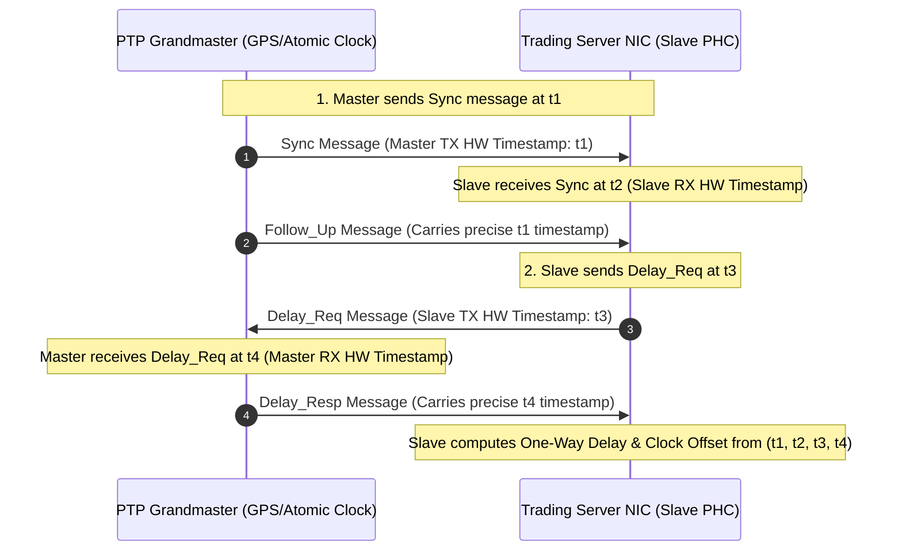

> [!summary]
> Precision Time Protocol (IEEE 1588v2) synchronizes distributed clocks across trading infrastructure with sub-microsecond to sub-10ns accuracy by timestamping synchronization packets at the physical network layer. White Rabbit extends IEEE 1588 with Synchronous Ethernet (SyncE) and sub-picosecond phase detection, delivering sub-nanosecond clock alignment across entire exchange datacenters.

---

## Why it matters
In distributed electronic trading, you cannot compute one-way wire latency or verify exchange queue fairness without synchronized clocks. 

- **NTP (Network Time Protocol)**: Synchronizes via software over UDP, providing **1–10 milliseconds** of accuracy—useless when tick-to-trade decisions occur in under 500 nanoseconds.
- **PTP (IEEE 1588v2)**: Uses hardware timestamping at network PHYs to achieve **10–50 nanoseconds** accuracy across a local datacenter.
- **White Rabbit (IEEE 1588-2019 HA)**: Achieves **<1 nanosecond (sub-nanosecond)** synchronization, enabling cycle-accurate distributed order sequencing and cross-venue latency arbitrage measurement.



---

## Mechanism

### 1. The PTP Four-Timestamp Exchange
To calculate clock offset and propagation delay, the Master and Slave exchange four hardware timestamps:
1. $t_1$: Master TX time of `Sync`.
2. $t_2$: Slave RX time of `Sync`.
3. $t_3$: Slave TX time of `Delay_Req`.
4. $t_4$: Master RX time of `Delay_Req`.

Assuming symmetric network delay in forward and reverse directions:
$$\text{One-Way Path Delay} = \frac{(t_4 - t_1) - (t_3 - t_2)}{2}$$
$$\text{Clock Offset from Master} = (t_2 - t_1) - \text{One-Way Path Delay} = \frac{(t_2 - t_1) - (t_4 - t_3)}{2}$$

### 2. Network Switches: Boundary Clocks vs Transparent Clocks
Standard Layer-2/3 switches introduce queueing jitter that ruins PTP accuracy. PTP requires specialized switches:
- **Boundary Clock (BC)**: The switch acts as a PTP slave on its uplink port and as a PTP master on all downlink ports, terminating and regenerating PTP packets.
- **Transparent Clock (TC)**: The switch measures the exact time a PTP packet spends inside the switch (**Residence Time**) using ingress/egress hardware timestamps, and updates a 64-bit `correctionField` inside the packet header as it leaves the egress port.

### 3. White Rabbit (Sub-Nanosecond Synchronization)
Developed at CERN and standardized in IEEE 1588-2019 (High Accuracy Profile), White Rabbit achieves sub-nanosecond accuracy by combining two mechanisms:
1. **Synchronous Ethernet (SyncE)**: The 1.25 Gbps / 10 Gbps Ethernet physical carrier frequency is derived directly from the master atomic clock, guaranteeing **zero frequency drift** across physical links.
2. **Digital Dual-Mixer Time Difference (DDMTD)**: Measures the phase offset between the transmitted and received optical signals down to the **picosecond** level, eliminating sub-nanosecond asymmetric delays in transceivers.

---

## In Practice

### 1. Linux PTP Stack Architecture
On an enterprise trading server, PTP synchronization requires two daemons:
1. `ptp4l`: Synchronizes the NIC's Physical Hardware Clock (PHC) to the network Grandmaster clock via PTP Ethernet frames.
2. `phc2sys`: Synchronizes the Linux system clock (`CLOCK_REALTIME`) to the NIC's PHC clock.

```mermaid
flowchart LR
    GM[PTP Grandmaster] -->|IEEE 1588 Packets| NIC[NIC Hardware Clock - PHC]
    NIC <-->|ptp4l (Disciplines Hardware Oscillator)| PTP4L[ptp4l Daemon]
    NIC -->|phc2sys (Disciplines Linux CLOCK_REALTIME)| SYS[Linux System Clock]
    SYS -->|clock_gettime| APP[Trading Application]
```

### 2. Production `ptp4l.conf` Configuration
```ini
[global]
# Use Hardware Timestamping on physical interface
time_stamping           hardware
network_transport       UDPv4
delay_mechanism         E2E
tx_timestamp_timeout    50

# Log synchronization state
summary_interval        1
logMinDelayReqInterval  -4   # 16 sync packets per second
logSyncInterval         -4   # 16 sync packets per second

# Clock servo configuration (Proportional-Integral)
clock_servo             pi
step_threshold          0.00002 # Step only if offset > 20 µs at startup; otherwise SLEW
```

Run daemons:
```bash
# 1. Synchronize NIC Hardware Clock to Grandmaster
sudo ptp4l -i eth0 -f /etc/ptp4l.conf -m

# 2. Synchronize System Clock to NIC Hardware Clock
sudo phc2sys -s eth0 -c CLOCK_REALTIME -w -m -O 0
```

---

## Numbers

| Protocol / Standard | Typical Accuracy | Underlying Physical Mechanism | Jitter / Stability |
| :--- | :--- | :--- | :--- |
| **NTP (Software / UDP)** | **1–10 ms** (1,000,000 ns) | Software socket timestamps | High (Influenced by OS scheduling) |
| **PTP (Standard IEEE 1588v2)**| **10–50 ns** | Hardware MAC/PHY timestamps | Low (Limited by switch asymmetry) |
| **PTP with Transparent Clocks**| **5–15 ns** | In-switch Residence Time Correction | Very Low |
| **White Rabbit (IEEE 1588-HA)**| **<0.5 ns (Sub-ns)** | SyncE Frequency + DDMTD Phase Lock | **Atomic clock stability (<100 ps)**|

---

## Trade-offs

| Synchronization Method | Advantages | Costs / Failure Modes |
| :--- | :--- | :--- |
| **White Rabbit** | Absolute sub-nanosecond wire truth; eliminates all cross-venue timing doubts. | Requires specialized White Rabbit switches (e.g. Seven Solutions/Safran) and compliant SFPs. |
| **PTP IEEE 1588v2** | Widely supported on modern trading NICs (Solarflare, Mellanox); 20ns accuracy. | Vulnerable to fiber propagation asymmetry (unequal RX/TX fiber patch cables). |
| **NTP** | Zero infrastructure cost; works across public internet. | Completely unviable for financial execution latency profiling. |

---

> [!warning] Gotchas
> 1. **The Fiber Asymmetry Trap in PTP**: PTP assumes that the forward delay ($\text{Master} \to \text{Slave}$) equals the reverse delay ($\text{Slave} \to \text{Master}$). If a technician replaces a dual-strand fiber patch cable with strands of unequal lengths (e.g., RX strand is 2 meters longer than TX strand), PTP introduces an undetected **~10 ns static timing error** into all recorded timestamps.
> 2. **Clock Stepping During Trading**: If `phc2sys` or `ptp4l` is configured with `step_threshold 0.0`, any temporary network glitch will cause the system clock to **jump backward or forward by microseconds**, corrupting internal order book sequence timers and throwing exceptions in latency monitors. *Always use clock slewing during live trading hours.*

---

## Lab
**Objective**: Configure `ptp4l` and `phc2sys` on a Linux host, measure the master-slave offset distribution, and verify that clock jitter remains under 50 nanoseconds.

**Success Criteria**:
1. Run `ptp4l` connected to a local PTP grandmaster or secondary test machine.
2. Inspect `ptp4l` output logs and verify:
   ```text
   ptp4l[1204.55]: master offset        -12 s2 freq   -4522 path delay       182
   ```
3. Confirm that the `master offset` settles between **-25 ns and +25 ns** in steady state.

---

> [!question]- Self-test
> 1. **Why does PTP require four distinct timestamps ($t_1, t_2, t_3, t_4$) instead of two to synchronize clocks?**
>    *Answer*: Two timestamps ($t_1, t_2$) can only measure the combined sum of (Clock Offset + One-Way Network Delay). By transmitting a reverse packet (`Delay_Req` at $t_3$, received at $t_4$), the system obtains a second equation, allowing it to algebraically solve for both the unknown one-way propagation delay and the clock offset independently.
> 2. **What is a Transparent Clock (TC) in PTP and how does it prevent switch queueing jitter?**
>    *Answer*: A Transparent Clock is a PTP-aware network switch that records the exact hardware ingress timestamp and egress timestamp of each passing PTP event packet. It calculates the switch's internal queueing and processing delay (Residence Time) and adds this duration directly into the packet's `correctionField`, allowing the receiving slave to subtract internal switch delays from its network path calculation.
> 3. **How does White Rabbit achieve sub-nanosecond accuracy over standard optical fiber?**
>    *Answer*: White Rabbit combines Synchronous Ethernet (SyncE)—which derives the physical bit clock directly from the master's oscillator to eliminate frequency drift—with Digital Dual-Mixer Time Difference (DDMTD) phase detection, which measures sub-nanosecond phase alignment between optical transceivers at the physical layer.

---

## Related
- [[Notes/Clock Sources and Hardware Timestamping]]
- [[Notes/One-Way Latency vs Round-Trip Time Measurement]]
- [[Notes/Coordinated Omission in Low Latency Systems]]
- [[Notes/Latency Numbers Every Trading Engineer Knows]]
- [[MOC - 07 Time & Measurement]]

## Sources
- [[Sources/IEEE 1588-2019 Standard for Precision Clock Synchronization]]
- [[Sources/White Rabbit Project Technical Specification - CERN]]
- [[Sources/Red Hat Enterprise Linux for Real Time Tuning Guide]]
