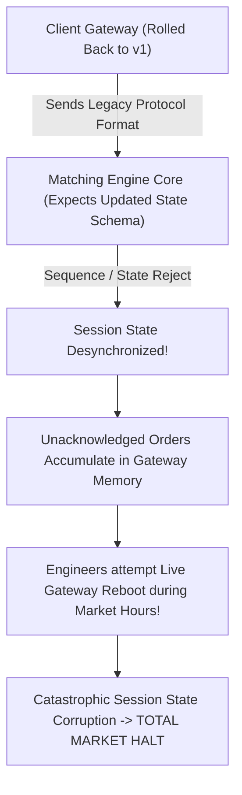

# War Story — The July 8, 2015 NYSE 3.5-Hour Gateway Freeze: Protocol State Mismatches & Live Reconfiguration Cascades

> [!summary]
> On July 8, 2015, between 11:32:00 and 15:10:00 EST, the New York Stock Exchange (NYSE) suffered a total, unprecedented 3.5-hour market-wide trading suspension across all listed equities. A pre-market software release on client gateway communication handlers triggered an internal protocol state and sequence verification desynchronization with the matching engine, demonstrating the fatal danger of live session reconfigurations during active market hours.

---

## 1. Incident Timeline & Chronology (July 8, 2015 EST)

```mermaid
timeline
    title The July 8, 2015 NYSE Market Outage Timeline
    06:00:00 : NYSE engineers deploy a routine software upgrade across client communication gateways to support upcoming SIP industry protocol changes.
    08:30:00 : Pre-market testing reveals gateway communication anomalies. Customers experience repeated session disconnections and sequence sync failures.
    09:00:00 : NYSE operations decides to roll back the gateway software on all primary communication units prior to market open.
    09:30:00 : US Market Opens. Continuous trading begins; however, residual state configuration mismatches remain between the rolled-back gateways and the matching engine core.
    11:00:00 : Under rising morning trade volume, client gateways begin dropping TCP sessions and rejecting inbound order frames due to sequence mismatches.
    11:32:00 : NYSE engineers attempt a live gateway reboot and configuration reload during continuous trading. The action corrupts active session order states, forcing NYSE to issue an emergency halt on ALL trading.
    15:10:00 : After rolling back all components, re-verifying sequence numbers, and clearing queue backlogs, NYSE resumes trading in time for the 16:00:00 Closing Auction.
```

---

## 2. Technical & Protocol Root Cause Analysis

### A. The Gateway-to-Matching-Engine Protocol State Mismatch
- **The Deployment**: NYSE operates hundreds of distributed **Client Communication Gateways (CCGs)** that terminate participant TCP connections, validate binary framing, and transcode client orders into internal message formats for the core matching engines.
- **The Defect**: The morning software release modified the internal sequence numbering and session recovery handshake protocol. When NYSE rolled back the gateways to the previous version at 09:00, **a subset of internal configuration tables remained formatted for the new protocol schema**.



### B. The Live Reconfiguration Hazard
- When morning volume peaked at 11:00, hundreds of algorithmic participant connections (e.g. Citadel, Virtu, Morgan Stanley) were dropped by the gateways due to unexpected session rejects.
- **The Fatal Engineering Mistake**: Rather than isolating affected gateways and routing traffic to warm standbys, NYSE operations attempted to **reboot and reconfigure the gateway clusters live during continuous market trading**.
- **The Consequence**: Rebooting the gateways while thousands of in-flight orders were actively being processed by the matching engine caused the gateways to **lose their in-memory token mapping tables**. The matching engine continued executing orders whose client owners could no longer be notified, leaving the exchange in an un-auditable split-state condition.

---

## 3. The 3 Architectural & Operational Remediations

| Failure Domain | 2015 NYSE Failure Mode | Modern Exchange Engineering Standard |
| :--- | :--- | :--- |
| **Change Management** | Deploying major protocol software updates on the morning of a live trading day. | **Weekend Deployment Windows & Automated Rollback Validation**: All core upgrades must be deployed and validated 48 hours prior to market open with automated canary verification. |
| **Live Troubleshooting** | Rebooting production gateway nodes live during active trading hours. | **Zero Live-Session Reconfiguration**: Never restart stateful gateways during trading. Isolate defective gateways and allow client sessions to reconnect to standby nodes. |
| **Session State Isolation** | In-memory token mapping tables were lost during gateway crashes. | **Persistent Session Token Registries**: Ingress gateways write session token mappings to memory-mapped shared memory or persistent journals before acknowledging orders. |

---

## 4. Key Engineering Lessons for Low-Latency Systems

1. **Never Conduct Live In-Session Gateway Restarts**: In electronic trading, rebooting a gateway process while orders are resting in the matching engine creates an immediate split-state condition. If a gateway malfunctions, **fail over to a secondary standby node or shed load**, never restart the active node in-band.
2. **Enforce Atomic Multi-Service Deployments**: When updating communication protocols between gateways and matching engines, ensure the build system enforces version compatibility checks during session handshake. If a gateway detects a protocol version mismatch with the matching core, it must refuse to initialize rather than running in an undefined state.
3. **Decouple Gateway Session State from Matching Engine Execution**: The matching engine must maintain its own independent audit trail of client MPIDs and order reference IDs so that even if a frontend gateway process segfaults, the matching engine can reconcile fills via an independent Drop Copy stream.

---

## Related Notes
- [[02 - Exchange Architecture/Exchange Gateway Architecture]]
- [[02 - Exchange Architecture/The Sequenced-Stream Architecture]]
- [[03 - Matching Engine Internals/Matching Engine Architecture Overview]]
- [[13 - Reliability, Ops & Testing/Disaster Recovery and High Availability Topologies]]
- [[14 - Industry Map & Canon/MOC - 14 Industry Map & Canon]]

## Sources
- [[Sources/SEC Staff Summary of the July 8, 2015 NYSE Trading Halt]]
- [[Sources/Site Reliability Engineering at Scale for Financial Systems]]
- [[Sources/How to Build an Exchange by Jane Street]]
