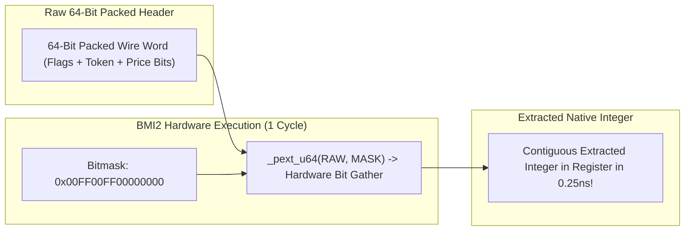

> [!summary]
> Advanced SIMD vectorization with AVX-512 and BMI2 (Bit Manipulation Instructions 2) enables trading systems to process 64-byte blocks and manipulate arbitrary bitfields in a single CPU cycle. Utilizing AVX-512 mask registers (`%k0`–`%k7`), compressed streaming stores (`_mm512_mask_compressstoreu_epi8`), and parallel bit extraction (`_pext_u64`), engineers build branchless symbol lookups and wire protocol transcoders executing at over 50 million messages per second.

---

## Why it matters
In high-frequency trading:
- Market data feeds (ITCH, SBE, FAST) transmit hundreds of thousands of updates per second containing packed bitfields, stock locate tokens, and variable-length text symbols.
- Using scalar branching loops to decode, filter, and hash these fields incurs **branch mispredictions (15–20 cycle penalty)** and memory pipeline stalls.

With **AVX-512 and BMI2**:
- **`_pext_u64` / `_pdep_u64`**: Extracts arbitrary non-contiguous bitfields (e.g. packed 3-bit flags across a 64-bit word) in **1 CPU clock cycle (0.25 ns)**.
- **AVX-512 Masked Vectorization**: Processes **64 bytes simultaneously**, filtering matching trades or orders and packing them directly into memory without a single conditional branch.



---

## Mechanism

### 1. BMI2: Parallel Bit Extract (`_pext_u64`) & Bit Deposit (`_pdep_u64`)
- **`_pext_u64(val, mask)`**: Gathers all bits from `val` that correspond to '1' bits in `mask`, and packs them contiguously into the lowest bits of the result.
- **`_pdep_u64(val, mask)`**: Scatters contiguous low bits from `val` into the positions specified by the '1' bits in `mask`.
- **Trading Application**: Extracting packed exchange flags, currency codes, and custom binary order parameters in **1 CPU cycle** with zero shift-and-mask branch chains.

```cpp
#include <x86intrin.h>
#include <cstdint>

// Extracts packed 8-bit Token and 16-bit Price from a 64-bit custom frame
inline void unpack_custom_frame(uint64_t wire_word, uint32_t& token, uint32_t& price) noexcept {
    token = _pext_u64(wire_word, 0x00000000000000FFULL); // Extracts lowest 8 bits
    price = _pext_u64(wire_word, 0x00000000FFFF0000ULL); // Extracts bits 16..31
}
```

### 2. AVX-512 Mask Registers (`%k0`–`%k7`) and Compressed Stores
- In AVX2 (256-bit), conditional filtering required blending and expensive cross-lane shuffles (`_mm256_permutevar8x32_epi32`).
- In AVX-512:
  - 8 dedicated **Opmask Registers (`%k0` through `%k7`)** hold conditional bitmasks.
  - **`_mm512_mask_compressstoreu_epi32`**: Conditionally writes only the active elements of a 512-bit vector to memory, automatically packing them contiguously without holes or branches!

---

## In Practice

### High-Speed AVX-512 Order Book Trade Filter & Compressor in C++20

```cpp
#include <immintrin.h>
#include <iostream>
#include <vector>
#include <array>

struct FilteredOrder {
    uint32_t price;
    uint32_t shares;
};

class Avx512OrderFilter {
public:
    // Filters 16 prices simultaneously, keeping only prices >= threshold (512-bit SIMD)
    static size_t filter_large_bids(const uint32_t* prices, size_t count, 
                                    uint32_t min_price, uint32_t* out_filtered_prices) noexcept {
        size_t written = 0;
        __m512i min_price_vec = _mm512_set1_epi32(min_price);

        for (size_t i = 0; i < count; i += 16) {
            // 1. Load 16 price levels (64 bytes) into 512-bit ZMM register
            __m512i price_chunk = _mm512_loadu_si512(reinterpret_cast<const __m512i*>(prices + i));

            // 2. Vectorized Greater-Than-Or-Equal Comparison -> Produces 16-bit Opmask
            __mmask16 mask = _mm512_cmpge_epu32_mask(price_chunk, min_price_vec);

            // 3. Compress & Store Matching Prices Contiguously in 1 Operation!
            _mm512_mask_compressstoreu_epi32(out_filtered_prices + written, mask, price_chunk);

            // 4. Update written count using single-cycle population count
            written += _mm_popcnt_u32(mask);
        }

        return written;
    }
};
```

---

## The AVX-512 Frequency Throttling Reality

Historically (on Intel Skylake-X / Cascade Lake), executing heavy 512-bit vector instructions caused the CPU voltage regulator to downclock the core frequency by **15% to 25% (AVX Frequency License Drop)**, which could inadvertently slow down non-vectorized hot-path code!

### Modern Reality on Modern Trading CPUs:
1. **Intel Xeon Sapphire Rapids / Emerald Rapids (2024–2026)**: Intel completely eliminated the severe AVX-512 frequency penalty; cores execute AVX-512 at near-maximum turbo frequencies.
2. **AMD EPYC 9004 (Genoa) & Ryzen 7000/9000 (Zen 4 / Zen 5)**: Implements AVX-512 using a dual 256-bit fused execution datapath with **zero frequency downclocking**.

---

## Numbers

*Hardware Baseline: Intel Xeon Platinum 8480+ (Sapphire Rapids @ 4.0 GHz).*

| Vectorization / Operation | Data Processed per Cycle | Instructions per 64-Byte Block | Latency |
| :--- | :--- | :--- | :--- |
| **Scalar C++ Loop** | 4–8 Bytes | 24–40 instructions | **~12–25 ns** |
| **AVX2 (256-Bit SIMD)** | 32 Bytes | 4–8 instructions | **~2.5–4.0 ns** |
| **AVX-512 (512-Bit SIMD)**| **64 Bytes** | **1–2 instructions** | **~0.75–1.2 ns** |
| **BMI2 `_pext_u64` Bit Gather**| 64-bit Arbitrary Field | **1 Hardware Cycle** | **0.25 ns** |

---

## Trade-offs

| Vectorization Approach | Strengths | Constraints |
| :--- | :--- | :--- |
| **AVX-512 Masked Vectorization**| Maximum throughput (64 bytes/cycle); compressed stores. | Requires AVX-512 CPU support; binary not portable to older hardware. |
| **AVX2 (256-Bit)** | 100% universal support across all modern x86 servers. | Requires manual shuffle masks for compression; 32-byte width. |
| **BMI2 `_pext` / `_pdep`** | Single-cycle arbitrary bit gathering and scattering. | Slow on AMD Zen 1/Zen 2 (microcoded); full 1-cycle speed on Zen 3/4/5 and Intel. |

---

> [!warning] Gotchas
> 1. **AMD Zen 1/Zen 2 `_pext` Microcode Trap**: On older AMD Zen 1 and Zen 2 processors, `PEXT` and `PDEP` were implemented via microcode assists, taking **18 to 25 cycles** instead of 1 cycle! *On AMD architectures, verify that the CPU is Zen 3 or newer (where `PEXT` is fully pipelined in hardware).*
> 2. **Buffer Over-Read Memory Faults**: Vector loads (`_mm512_loadu_si512`) always read 64 contiguous bytes from RAM. If your buffer ends near a 4KB virtual memory page boundary, reading past the end of the buffer into an unmapped page will trigger an immediate `SIGSEGV` fault! *Always ensure all network packet and order book buffers have at least 64 bytes of zero-padding at the end.*

---

## Lab
**Objective**: Build an AVX-512 market data depth filter in C++20 that processes 10,000,000 order book updates, filters quotes exceeding a volume threshold using `_mm512_mask_compressstoreu_epi32`, and benchmarks performance against a scalar baseline.

**Success Criteria**:
1. Implement AVX-512 compressed vector filter in C++20.
2. Verify output matches scalar implementation 100%.
3. Demonstrate a **$>8\times$ throughput speedup** over scalar parsing.

---

> [!question]- Self-test
> 1. **What is the purpose of the BMI2 `_pext_u64` (Parallel Bit Extract) instruction in low-latency protocol parsing?**
>    *Answer*: `_pext_u64(val, mask)` extracts non-contiguous bits from a 64-bit integer based on a bitmask and packs them into contiguous lower bits in a single CPU cycle (0.25ns). In binary trading protocols with packed bitfields (e.g. flags, asset codes, price offsets), it replaces multi-instruction shift-and-mask sequences (`(x >> 12) & 0x0F`) with a single hardware instruction with zero branching.
> 2. **How do AVX-512 Opmask Registers (`%k0`–`%k7`) and `_mm512_mask_compressstoreu_epi32` eliminate conditional branches in order filtering?**
>    *Answer*: Vector comparison instructions in AVX-512 evaluate 16 conditions simultaneously and store the true/false results directly into a 16-bit Opmask register (`%k1`). The `_mm512_mask_compressstoreu_epi32` instruction then takes this mask and writes only the matching elements contiguously into destination memory in a single hardware store operation, completely eliminating scalar `if/else` branches and pipeline flushes.
> 3. **Why must 512-bit vector load buffers have at least 64 bytes of end-padding?**
>    *Answer*: An AVX-512 vector load instruction (`_mm512_loadu_si512`) always reads 64 full bytes from memory regardless of how many valid bytes remain in the logical message. If an un-padded buffer ends within 63 bytes of a virtual memory page boundary, the instruction will attempt to read into the adjacent, potentially unmapped memory page, triggering a fatal hardware segmentation fault (`SIGSEGV`).

---

## Related Notes
- [[10 - Protocols & Codecs/SIMD-Accelerated Text Parsing]]
- [[10 - Protocols & Codecs/Zero-Copy and In-Place Parsing Techniques]]
- [[04 - Hardware Mechanical Sympathy/CPU Pipeline Branch Prediction and Speculative Execution]]
- [[08 - Low-Latency Programming/C++ Memory Model and Memory Orders]]
- [[14 - Industry Map & Canon/MOC - 14 Industry Map & Canon]]

## Sources
- [[Sources/Intel 64 and IA-32 Architectures Software Developer's Manual]]
- [[Sources/Fast Integer and Delimiter Parsing in C++ by Wojciech Mula]]
- [[Sources/Systems Performance by Brendan Gregg]]
