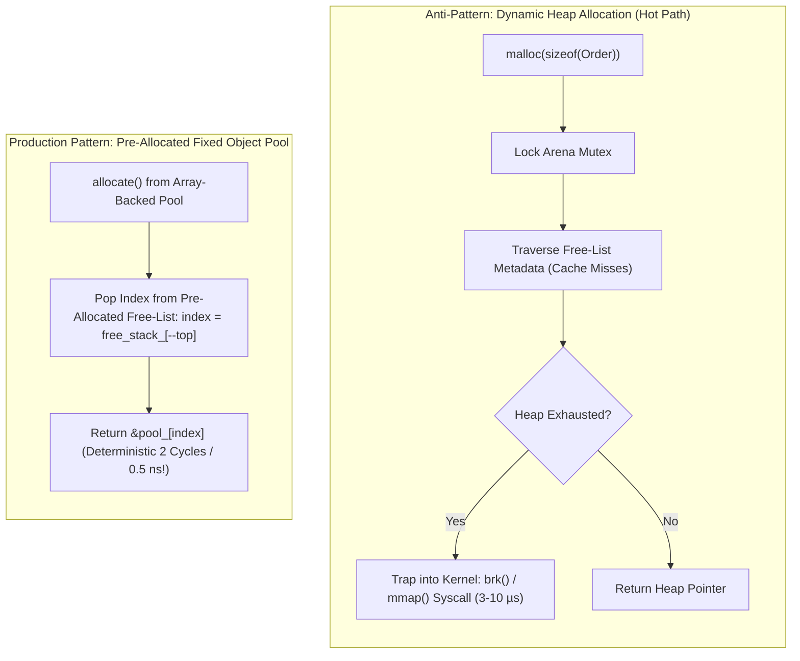

> [!summary]
> Dynamic heap allocation (`malloc`, `new`, `std::shared_ptr`, resizing `std::vector`) is strictly banned on the low-latency critical path due to arena mutex contention, free-list metadata traversal, and kernel `brk`/`mmap` system calls. Achieving deterministic sub-microsecond execution requires pre-allocating all memory at startup using monotonic arena allocators, fixed-size object pools, and intrusive data structures.

---

## Why it matters
A single `malloc()` or `new` call on the hot execution path can turn a 200 ns tick-to-trade decision into a **5 to 50 microsecond latency spike**.

The standard C library allocator (`glibc ptmalloc3`, `jemalloc`):
1. **Acquires Arena Locks**: If multiple threads allocate simultaneously, they block on internal glibc spinlocks.
2. **Traverses Fragmented Free Lists**: Searches free lists (tcache, fastbins, unsorted bins), jumping across memory lines and polluting CPU caches.
3. **Traps into the Kernel**: If the arena runs out of heap chunks, it invokes `brk()` or `mmap()`, triggering a kernel context switch and minor page faults (**1,500–5,000 ns penalty**).

Production low-latency systems pre-allocate **100% of physical memory at host startup** and operate in an **Allocation-Free Steady State**.



---

## Mechanism

### 1. Monotonic Arena Allocator (Bump Allocator)
- A contiguous block of memory (e.g., 64 MB backed by HugeTLBFS) is allocated at startup.
- Allocations advance a single monotonic offset counter:
  $$\text{ptr} = \text{buffer\_base} + \text{offset}; \quad \text{offset} += \text{aligned\_size};$$
- Allocation takes **1 clock cycle (0.25 ns)** with zero locks and zero branching.
- At the end of an event batch or market tick, the entire arena is reset in $O(1)$ by setting `offset = 0`.

### 2. Array-Backed Fixed-Size Object Pool (Intrusive Free-List)
For long-lived objects (e.g., active orders in an order book):
- Pre-allocate a contiguous array of $N$ objects at startup: `Order pool_[MAX_ORDERS]`.
- Maintain a stack or intrusive array of available indices (`free_indices_`).
- Allocation is a single stack pop: `return &pool_[free_indices_[--free_top_]]`.
- Deallocation is a single stack push: `free_indices_[free_top_++] = order_index`.
- Both operations are **Wait-Free, deterministic $O(1)$ operations taking ~1–2 nanoseconds**.

### 3. Intrusive Data Containers
Standard containers like `std::list<Order>` or `std::map<Price, Order>` allocate an external heap node wrapping your data on every insert.
- **Intrusive Containers**: Pointers (`next`, `prev`) are embedded directly inside the `Order` struct itself.
- Inserting an order into a price level linked list requires **zero memory allocation**—the order *is* the list node.

---

## In Practice

### 1. Production-Grade Fixed-Capacity Object Pool in C++20

```cpp
#include <cstdint>
#include <cstddef>
#include <array>
#include <new>
#include <stdexcept>
#include <utility>

template <typename T, size_t MaxObjects>
class FixedObjectPool {
private:
    // Memory storage for objects (aligned to 64-byte boundary)
    alignas(64) std::array<T, MaxObjects> pool_;
    
    // Stack of available free indices
    std::array<uint32_t, MaxObjects> free_stack_;
    size_t free_top_{0};

public:
    FixedObjectPool() {
        // Initialize free stack with all pool indices
        for (size_t i = 0; i < MaxObjects; ++i) {
            free_stack_[i] = static_cast<uint32_t>(i);
        }
        free_top_ = MaxObjects;
    }

    // Non-copyable
    FixedObjectPool(const FixedObjectPool&) = delete;
    FixedObjectPool& operator=(const FixedObjectPool&) = delete;

    // Allocate an object in-place (Deterministic O(1) in 1-2 ns)
    template <typename... Args>
    [[nodiscard]] T* allocate(Args&&... args) noexcept {
        if (__builtin_expect(free_top_ == 0, 0)) {
            return nullptr; // Pool exhausted (Handled via risk limit)
        }

        uint32_t index = free_stack_[--free_top_];
        T* obj_ptr = &pool_[index];
        
        // Placement new to construct object in-place
        new (static_cast<void*>(obj_ptr)) T(std::forward<Args>(args)...);
        return obj_ptr;
    }

    // Return object to pool (Deterministic O(1) in 1-2 ns)
    void deallocate(T* ptr) noexcept {
        if (__builtin_expect(!ptr, 0)) return;

        // Explicit destructor invocation
        ptr->~T();

        // Calculate pool index via pointer arithmetic
        ptrdiff_t index = ptr - &pool_[0];
        free_stack_[free_top_++] = static_cast<uint32_t>(index);
    }

    [[nodiscard]] size_t available() const noexcept { return free_top_; }
    [[nodiscard]] size_t capacity() const noexcept { return MaxObjects; }
};
```

### 2. Global Heap Allocation Guard (Catching Rogue Allocations in CI)

```cpp
#include <new>
#include <cstdlib>
#include <atomic>
#include <iostream>

// Global flag set during steady-state trading hours
inline std::atomic<bool> g_trading_steady_state_active{false};

// Overriding global operator new to guarantee zero heap allocation during live trading
void* operator new(size_t size) {
    if (g_trading_steady_state_active.load(std::memory_order_relaxed)) {
        // Critical breach: rogue allocation detected on hot path!
        std::cerr << "FATAL: Illegal heap allocation of " << size 
                  << " bytes during live steady-state trading!\n";
        std::abort(); // Abort in CI/test environment to catch regressions
    }
    void* ptr = std::malloc(size);
    if (!ptr) throw std::bad_alloc();
    return ptr;
}

void operator delete(void* ptr) noexcept {
    std::free(ptr);
}
```

---

## Numbers

*Hardware Baseline: Intel Xeon Sapphire Rapids @ 4.0 GHz.*

| Allocation Pattern | Latency (Cycles) | Latency (Time) | Determinism | Failure Mode |
| :--- | :--- | :--- | :--- | :--- |
| **`malloc()` / `new` (Clean Cache)** | 80–180 cycles | **20–45 ns** | Non-deterministic | Arena lock contention |
| **`malloc()` triggering `mmap()`** | 6,000–25,000 cycles| **1,500–6,000 ns** | Highly volatile | Kernel page fault + context switch |
| **`std::vector::push_back` Realloc**| 2,000–8,000 cycles | **500–2,000 ns** | Catastrophic | Memory copy + old buffer free |
| **Monotonic Bump Allocator** | 1–2 cycles | **~0.25–0.5 ns** | **100% Deterministic** | Bounded buffer capacity |
| **Fixed Object Pool (`allocate`)** | 4–8 cycles | **~1.0–2.0 ns** | **100% Deterministic** | Bounded pool capacity |

---

## Trade-offs

| Memory Strategy | Performance Advantage | Operational Constraint |
| :--- | :--- | :--- |
| **Pre-Allocated Object Pools** | Constant $O(1)$ time; zero heap fragmentation; cache locality. | Must determine upper capacity bounds at startup (e.g. max 1,000,000 active orders). |
| **Monotonic Arena Allocator** | Ultra-fast (0.25 ns); zero per-object deallocation cost. | Objects cannot be freed individually; entire arena must be reset as a batch. |
| **Dynamic `std::vector` / `std::string`**| Flexible sizing; convenient standard library abstractions. | **UNACCEPTABLE FOR HOT PATH**: random multi-microsecond reallocation pauses. |

---

> [!warning] Gotchas
> 1. **The Hidden `std::string` Dynamic Allocation**: In C++, standard strings longer than 15 bytes (Short String Optimization threshold) trigger dynamic `malloc()` on creation or assignment. *Use fixed-size char arrays (`std::array<char, 16>`) or custom string-view abstractions (`std::string_view`) on the hot path.*
> 2. **`std::shared_ptr` Control Block Allocation**: Calling `std::shared_ptr<T>(new T())` performs **two independent dynamic heap allocations** (one for the object, one for the atomic reference count control block). Even `std::make_shared` allocates dynamic memory. *Pass raw pointers or pool indices by value.*

---

## Lab
**Objective**: Build a benchmark allocating and inserting 1,000,000 orders into an order book structure comparing `new Order()` vs `FixedObjectPool<Order, 1000000>::allocate()`.

**Success Criteria**:
1. Measure the total time and percentile distribution for 1,000,000 operations.
2. Show that `FixedObjectPool` is **at least 15x to 25x faster** than dynamic allocation and eliminates all tail spikes above 50 ns.

---

> [!question]- Self-test
> 1. **What are the three distinct operations inside `glibc malloc` that cause multi-microsecond latency jitter during dynamic heap allocation?**
>    *Answer*: (1) **Arena lock acquisition** (mutex/spinlock contention when concurrent threads allocate); (2) **Free-list traversal and bin splitting** (searching tcache, fastbins, and unsorted bins across non-contiguous memory, causing L1/L2 cache misses); (3) **Kernel system call transitions** (`brk()` or `mmap()`) when pre-allocated heap arenas are exhausted, triggering page faults and context switches.
> 2. **What is an Intrusive Data Container and why is it superior to standard library containers (`std::list`, `std::map`) in high-frequency trading?**
>    *Answer*: An intrusive container embeds the container management pointers (`next`, `prev`, tree child pointers) directly inside the domain data structure (e.g., inside the `Order` struct itself). Standard containers allocate an external wrapper node on the heap for every insert; intrusive containers require zero dynamic heap allocation on insertion, maximize cache locality, and guarantee that the domain object *is* the node.
> 3. **Why does passing a `std::string` containing an 18-character instrument symbol violate the allocation-free steady state rule?**
>    *Answer*: Most C++ standard libraries implement Short String Optimization (SSO) with a capacity of 15 characters. Any string exceeding 15 characters (such as an 18-character option symbol) forces `std::string` to allocate dynamic memory from the heap via `malloc()`, triggering heap locks and cache pollution on the hot path.

---

## Related
- [[Notes/C++ Memory Model and Memory Orders]]
- [[Notes/Lock-Free SPSC Ring Buffer Design]]
- [[Notes/Lock-Free MPMC Queue Mechanics]]
- [[Notes/Cache-Conscious Data Layout]]
- [[Notes/Order Book Data Structures]]
- [[MOC - 08 Low-Latency Programming]]

## Sources
- [[Sources/CppCon 2017 - When a Microsecond is an Eternity by Carl Cook]]
- [[Sources/What Every Programmer Should Know About Memory by Ulrich Drepper]]
- [[Sources/Systems Performance by Brendan Gregg]]
