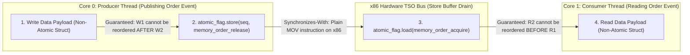

> [!summary]
> The C++ memory model defines how threads synchronize and observe modifications to shared memory across multi-core CPU architectures. On x86-64 hardware (Total Store Order), `acquire` and `release` memory orders are compile-time barriers with zero hardware instruction overhead (plain `MOV`), whereas default `seq_cst` atomics emit expensive hardware bus fences (`MFENCE` or `LOCK XCHG`) that stall the CPU execution pipeline for 15–30 nanoseconds.

---

## Why it matters
In high-frequency trading engines, inter-thread messaging over shared memory or lock-free ring buffers occurs millions of times per second. 

Using default `std::atomic` operations without explicit memory ordering enforces **Sequential Consistency (`std::memory_order_seq_cst`)**:
- On x86-64, every `seq_cst` atomic store emits a `LOCK` prefix or `MFENCE` instruction, draining the hardware store buffer and locking the cache controller (**40–80 cycles / 10–20 ns penalty**).
- By relaxing memory ordering to **Acquire-Release (`memory_order_acquire` / `memory_order_release`)**, the compiler generates simple `MOV` instructions on x86, achieving **zero hardware overhead** while mathematically guaranteeing that data writes are fully visible before sequence flags update.



---

## Mechanism

### 1. The C++11/20 Memory Orders
The C++ standard defines six memory ordering semantics:
1. **`memory_order_relaxed`**: Guarantees atomicity of the single variable, but provides **zero synchronization or ordering constraints** relative to other memory accesses.
2. **`memory_order_release`**: Store operation. Guarantees that **all preceding memory writes** (both atomic and non-atomic) in the current thread cannot be reordered *after* this store.
3. **`memory_order_acquire`**: Load operation. Guarantees that **all subsequent memory reads** in the current thread cannot be reordered *before* this load.
4. **`memory_order_acq_rel`**: Read-Modify-Write (RMW) operation combining acquire and release semantics.
5. **`memory_order_seq_cst`**: Sequential Consistency. Enforces a globally synchronized, total execution order visible to all threads across all cores.

### 2. Hardware Microarchitecture: x86 TSO vs ARM Weak Memory
The cost of C++ memory orders is dictated by the underlying CPU memory model:

- **x86-64 (Total Store Order - TSO)**:
  - Hardware guarantees: Load-Load, Store-Store, and Load-Store are never reordered.
  - The *only* reordering x86 hardware allows is **Store-Load** (a store sitting in the local Store Buffer may be delayed past a subsequent load to a different address).
  - Consequently:
    - `load(memory_order_acquire)` compiles to a plain `mov` instruction (zero cost).
    - `store(memory_order_release)` compiles to a plain `mov` instruction (zero cost).
    - `store(memory_order_seq_cst)` requires preventing Store-Load reordering, emitting an expensive `lock xchg` or `mfence` instruction.

- **ARM64 / AArch64 (Weakly Ordered Memory)**:
  - Hardware freely reorders all loads and stores.
  - `acquire` requires `LDAR` (Load-Acquire Register).
  - `release` requires `STLR` (Store-Release Register).
  - `seq_cst` requires full hardware barriers (`DMB ISH`).

---

## In Practice

### 1. Assembly Inspection: `seq_cst` vs `release` on x86-64

```cpp
#include <atomic>
#include <cstdint>

std::atomic<uint64_t> g_seq{0};
uint64_t g_payload{0};

// Expensive Anti-Pattern (Emits LOCK XCHG on x86)
void publish_seq_cst(uint64_t data) {
    g_payload = data;
    g_seq.store(1); // Default is std::memory_order_seq_cst
    // GCC Assembly Output:
    // mov  QWORD PTR g_payload[rip], rdi
    // mov  eax, 1
    // xchg QWORD PTR g_seq[rip], rax   <-- LOCK FENCE: 15-25 ns penalty!
}

// Production-Grade Low-Latency Pattern (Emits plain MOV on x86)
void publish_acquire_release(uint64_t data) {
    g_payload = data;
    g_seq.store(1, std::memory_order_release);
    // GCC Assembly Output:
    // mov  QWORD PTR g_payload[rip], rdi
    // mov  QWORD PTR g_seq[rip], 1     <-- Plain MOV: ~0.25 ns (Zero Bus Stall!)
}

// Consumer Load with Acquire
uint64_t consume_acquire() {
    if (g_seq.load(std::memory_order_acquire) == 1) {
        return g_payload; // Guaranteed to see the updated g_payload
    }
    return 0;
}
```

---

## Numbers

*Hardware Baseline: Intel Xeon Sapphire Rapids / AMD EPYC Genoa @ 4.0 GHz.*

| Operation / Memory Order | x86 Instruction Emitted | Latency (Cycles) | Latency (Time) | Bus Impact |
| :--- | :--- | :--- | :--- | :--- |
| **`load(relaxed)`** | `mov reg, [mem]` | 1 cycle (L1 hit) | **~0.25 ns** | Pure local register read. |
| **`load(acquire)`** | `mov reg, [mem]` | 1 cycle (L1 hit) | **~0.25 ns** | Zero overhead on x86. |
| **`store(relaxed)`** | `mov [mem], reg` | 1 cycle (Store buffer)| **~0.25 ns** | Written to local store buffer. |
| **`store(release)`** | `mov [mem], reg` | 1 cycle (Store buffer)| **~0.25 ns** | Zero overhead on x86. |
| **`store(seq_cst)`** | `lock xchg [mem], reg` | 40–80 cycles | **~10–20 ns** | Drains store buffer; locks bus. |
| **`fetch_add(relaxed)`** | `lock xadd [mem], reg` | 35–60 cycles | **~9–15 ns** | Hardware RMW atomic lock. |
| **`fetch_add(seq_cst)`** | `lock xadd [mem], reg` | 40–70 cycles | **~10–18 ns** | Hardware RMW atomic lock. |

---

## Trade-offs

| Memory Model Semantic | Synchronization Guarantee | Performance Trade-off |
| :--- | :--- | :--- |
| **Relaxed (`relaxed`)** | Atomicity only; zero ordering guarantees. | Fastest possible; use *only* for independent counters (e.g. dropped packet statistics). |
| **Acquire-Release (`acquire`/`release`)**| Synchronizes-with pairing between producer and consumer. | **Optimal for financial pipelines**: zero hardware fence overhead on x86. |
| **Sequential Consistency (`seq_cst`)** | Total global ordering across all threads. | Slowest; drains store buffer; introduces 15ns pipeline stalls. |

---

> [!warning] Gotchas
> 1. **Relaxed Pointer Publishing Bug**: Publishing data with `memory_order_relaxed` allows the CPU compiler and out-of-order execution units to write the ready flag *before* writing the payload data. The consumer thread sees `flag == true`, reads the payload, and reads uninitialized garbage memory! *Always use `release` on publish, `acquire` on consume.*
> 2. **Double-Checked Locking with Relaxed Atomics**: Attempting lock-free singleton or order book initialization with relaxed loads allows speculative reads of partially-constructed objects.
> 3. **ARM Cross-Compilation Surprises**: Code written and tested on x86 that accidentally uses relaxed ordering may work perfectly on x86 (due to TSO hardware protection) but fail catastrophically with race conditions when ported to ARM64 (AWS Graviton / Apple Silicon).

---

## Lab
**Objective**: Build a high-throughput atomic store benchmark comparing `std::memory_order_seq_cst` against `std::memory_order_release` across 100,000,000 stores.

**Success Criteria**:
1. Measure the nanosecond duration per store for both orders.
2. Inspect the generated assembly using `objdump -d` or Compiler Explorer to prove `seq_cst` emits `lock xchg` / `mfence` while `release` emits a simple `mov`.
3. Prove that `release` is **10x to 20x faster** than `seq_cst`.

---

> [!question]- Self-test
> 1. **Why does an atomic store with `memory_order_release` compile to a plain `mov` instruction on x86-64 without requiring an `MFENCE`?**
>    *Answer*: The x86 hardware architecture enforces Total Store Order (TSO), which guarantees that the processor hardware will never reorder stores past older stores or stores past older loads. Because x86 hardware natively guarantees release semantics, the compiler only needs to prevent compile-time instruction reordering, requiring no special hardware fence instructions.
> 2. **Under what scenario does an atomic operation with `memory_order_relaxed` cause severe data corruption in a multi-threaded trading engine?**
>    *Answer*: When an atomic variable is used as a synchronization flag (e.g., `is_ready` or `sequence_number`) to publish non-atomic order data. With `relaxed` ordering, the CPU or compiler may reorder the memory write of the payload data to execute *after* the atomic flag is set to true. A consumer thread reading the flag will observe `is_ready == true` and read stale or uninitialized payload memory.
> 3. **What is the difference between a compiler memory barrier and a hardware CPU memory barrier?**
>    *Answer*: A compiler barrier (e.g., `asm volatile("" ::: "memory")`) instructs the compiler not to reorder instructions across the boundary during compilation, but emits zero CPU instructions. A hardware memory barrier (e.g., `MFENCE` on x86, `DMB` on ARM) emits physical CPU instructions that drain hardware store buffers, serialize out-of-order execution pipelines, and stall execution until memory transactions are globally visible.

---

## Related
- [[Notes/Lock-Free SPSC Ring Buffer Design]]
- [[Notes/Lock-Free MPMC Queue Mechanics]]
- [[Notes/Allocation-Free Steady State Patterns]]
- [[Notes/False Sharing and Cache Contention]]
- [[MOC - 08 Low-Latency Programming]]

## Sources
- [[Sources/C++ Concurrency in Action by Anthony Williams]]
- [[Sources/CppCon 2017 - When a Microsecond is an Eternity by Carl Cook]]
- [[Sources/Intel 64 and IA-32 Architectures Software Developer's Manual - Volume 3A]]
