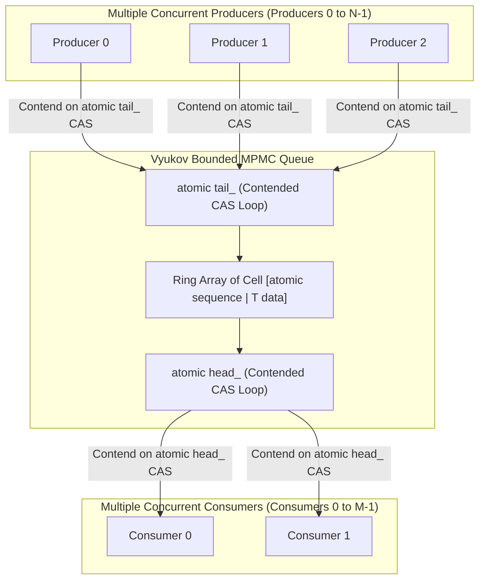

> [!summary]
> Multi-Producer Multi-Consumer (MPMC) lock-free queues enable concurrent enqueue and dequeue operations across arbitrary thread topologies using atomic Compare-And-Swap (CAS) loops. While Dmitry Vyukov's array-based bounded MPMC queue achieves lock-free progression without heap allocation, MPMC queues are fundamentally 5x–10x slower than SPSC rings due to atomic cache-line contention on shared head and tail pointers.

---

## Why it matters
In low-latency systems, choosing the correct concurrency primitive determines throughput limits:
- **SPSC Ring Buffers**: Wait-free ($O(1)$ in finite cycles), zero CAS contention, ~10 ns latency.
- **MPMC Queues**: Lock-free (optimistic CAS retries), heavy RFO cache line bouncing, ~50–150 ns latency.

While SPSC is the mandatory standard for the ultra-fast internal tick-to-trade critical path, MPMC queues are required in outer layers—such as multi-threaded network gateways distributing client TCP connections to worker threads or multi-venue order routing pools.



---

## Mechanism

### 1. Dmitry Vyukov's Bounded MPMC Queue
Vyukov's array-based bounded MPMC queue eliminates dynamic node allocation and avoids the classic ABA problem by assigning a monotonically increasing atomic `sequence` number to every cell in a pre-allocated array:

1. **Cell State**: Each slot contains `std::atomic<uint64_t> sequence` and `T data`.
   - Initial state: Cell $i$ has `sequence = i`.
2. **Enqueue Operation**:
   - Producer loads `tail_` atomically.
   - Producer checks `cell.sequence`:
     - If `sequence == current_tail`: the cell is empty. Producer attempts `CAS(&tail_, current_tail, current_tail + 1)`.
     - If CAS succeeds, producer writes data, sets `cell.sequence = current_tail + 1` with `release`, and completes.
     - If `sequence < current_tail`: buffer is full.
     - If `sequence > current_tail`: another producer advanced; retry CAS loop.
3. **Dequeue Operation**:
   - Consumer checks `cell.sequence == current_head + 1` (data ready).
   - Attempts `CAS(&head_, current_head, current_head + 1)`.
   - If CAS succeeds, reads data, resets `cell.sequence = current_head + Capacity` with `release`, and completes.

### 2. Lock-Free Taxonomy: Wait-Free vs Lock-Free vs Obstruction-Free
- **Wait-Free**: *Every* thread completes in a bounded number of finite steps (e.g. SPSC Ring Buffer).
- **Lock-Free**: *At least one* thread makes forward progress in a finite number of steps, but individual threads may experience contention starvation in CAS retry loops (e.g. Vyukov MPMC Queue).
- **Obstruction-Free**: A thread makes forward progress only if running isolated without concurrent interference.

### 3. The ABA Problem in Node-Based Lock-Free Queues
In pointer-based queues (e.g., Michael-Scott lock-free queue):
1. Thread 1 reads top pointer $A$, whose next pointer is $B$.
2. Thread 1 is preempted.
3. Thread 2 pops $A$, pops $B$, and deallocates both.
4. Thread 2 allocates a new node that the heap allocator places at the **exact same memory address $A$**, but with next pointer $C$.
5. Thread 1 resumes, executes `CAS(&head, A, B)`, observes address matches $A$, and corrupts the queue with a dangling pointer to deallocated node $B$!

**Remediation**:
- **Array-Based Sequence Counters** (Vyukov approach).
- **Hazard Pointers / Epoch-Based Reclamation (EBR)** for safe deferred node deallocation.
- **128-Bit Double-Word CAS (`CMPXCHG16B`)**: Pairs the 64-bit pointer with a 64-bit monotonically increasing ABA version tag.

---

## In Practice

### Production-Grade Vyukov Bounded MPMC Queue in C++20

```cpp
#include <atomic>
#include <cstdint>
#include <new>
#include <type_traits>
#include <utility>

template <typename T, size_t Capacity>
class MPMCQueue {
    static_assert((Capacity & (Capacity - 1)) == 0, "Capacity must be a power of two");
    static_assert(Capacity >= 2, "Capacity must be at least 2");

private:
    struct Cell {
        std::atomic<uint64_t> sequence;
        T data;
    };

    static constexpr size_t CACHE_LINE_SIZE = 64;
    static constexpr size_t MASK = Capacity - 1;

    // Align Head and Tail to independent cache lines to prevent false sharing
    alignas(CACHE_LINE_SIZE) std::atomic<uint64_t> tail_{0};
    alignas(CACHE_LINE_SIZE) std::atomic<uint64_t> head_{0};

    // Pre-allocated array of cells
    alignas(CACHE_LINE_SIZE) Cell buffer_[Capacity];

public:
    MPMCQueue() {
        for (size_t i = 0; i < Capacity; ++i) {
            buffer_[i].sequence.store(i, std::memory_order_relaxed);
        }
    }

    template <typename... Args>
    bool enqueue(Args&&... args) noexcept {
        Cell* cell;
        uint64_t pos = tail_.load(std::memory_order_relaxed);

        for (;;) {
            cell = &buffer_[pos & MASK];
            uint64_t seq = cell->sequence.load(std::memory_order_acquire);
            int64_t diff = static_cast<int64_t>(seq) - static_cast<int64_t>(pos);

            if (diff == 0) {
                // Cell is available: attempt atomic claim on tail position
                if (tail_.compare_exchange_weak(pos, pos + 1, std::memory_order_relaxed)) {
                    break; // Successfully claimed slot
                }
            } else if (diff < 0) {
                return false; // Queue is full
            } else {
                pos = tail_.load(std::memory_order_relaxed); // Retry with updated tail
            }
        }

        // Construct element directly in slot
        new (&cell->data) T(std::forward<Args>(args)...);

        // Advance sequence to notify consumers data is available
        cell->sequence.store(pos + 1, std::memory_order_release);
        return true;
    }

    bool dequeue(T& value) noexcept {
        Cell* cell;
        uint64_t pos = head_.load(std::memory_order_relaxed);

        for (;;) {
            cell = &buffer_[pos & MASK];
            uint64_t seq = cell->sequence.load(std::memory_order_acquire);
            int64_t diff = static_cast<int64_t>(seq) - static_cast<int64_t>(pos + 1);

            if (diff == 0) {
                // Data is ready: attempt atomic claim on head position
                if (head_.compare_exchange_weak(pos, pos + 1, std::memory_order_relaxed)) {
                    break; // Successfully claimed read slot
                }
            } else if (diff < 0) {
                return false; // Queue is empty
            } else {
                pos = head_.load(std::memory_order_relaxed); // Retry with updated head
            }
        }

        value = std::move(cell->data);
        cell->data.~T();

        // Advance sequence to notify producers slot is free for next epoch
        cell->sequence.store(pos + MASK + 1, std::memory_order_release);
        return true;
    }
};
```

---

## Numbers

*Hardware Baseline: Intel Xeon Sapphire Rapids @ 4.0 GHz, 4 Producer Cores & 4 Consumer Cores.*

| Queue Topology | Single-Threaded Latency | High-Contention Latency | Max Throughput | Failure / Jitter Factor |
| :--- | :--- | :--- | :--- | :--- |
| **SPSC Ring Buffer** | **~10 ns** | **~12 ns** | **>65M msgs/sec** | Zero contention (Wait-Free). |
| **Vyukov Bounded MPMC** | **~35 ns** | **~110–180 ns** | **~14M msgs/sec** | CAS retries under contention. |
| **Michael-Scott Lock-Free MPMC**| **~85 ns** | **~450–900 ns** | ~3.5M msgs/sec | Dynamic heap alloc + ABA checks. |
| **`std::mutex` Protected Queue**| **~450 ns** | **~3,500–12,000 ns** | ~0.8M msgs/sec | OS thread sleeping & wakeups. |

---

## Trade-offs

| Design Architecture | When to Choose | When to Avoid |
| :--- | :--- | :--- |
| **Bounded Array MPMC (Vyukov)** | Gateway connection pools, multi-threaded logging collectors. | Ultra-low latency tick-to-trade critical paths (SPSC is 10x faster). |
| **SPSC Single-Writer Mesh** | Internal matching engine pipelines, feed handler to book builder. | Scenarios requiring dynamic arbitrary thread fan-in. |
| **Lock-Based Queues (`std::mutex`)**| Batch non-latency offline utilities. | **Completely banned in trading systems.** |

---

> [!warning] Gotchas
> 1. **CAS Starvation Under Heavy Core Contention**: If 16 producer threads contend on a single `tail_` CAS variable simultaneously, 15 threads will fail on every iteration, wasting CPU cycles in cache-line invalidation storms. *Remedy: Use dedicated thread-local SPSC queues and a single consolidator thread instead of a shared MPMC.*
> 2. **Unbounded MPMC Queue Memory Leaks**: Using unbounded linked-list MPMC queues during sudden market bursts causes memory allocations to outpace consumption, leading to host Out-Of-Memory (OOM) killer crashes. *Always use strictly bounded pre-allocated queues.*

---

## Lab
**Objective**: Build a multi-threaded benchmark comparing the throughput and latency of `SPSCQueue` vs `MPMCQueue` under varying producer/consumer thread counts (1p1c vs 4p4c).

**Success Criteria**:
1. Measure operations per second across 20,000,000 messages.
2. Prove that SPSC achieves **>5x higher throughput** and **sub-15ns latency** compared to MPMC under contention.

---

> [!question]- Self-test
> 1. **Why is an MPMC lock-free queue fundamentally slower than an SPSC lock-free ring buffer?**
>    *Answer*: An MPMC queue requires concurrent producers to contend on atomic Compare-And-Swap (`CAS`) operations to claim the shared `tail_` pointer, and concurrent consumers to contend on the `head_` pointer. Under contention, failed CAS operations force retry loops and trigger hardware Request For Ownership (RFO) bus transactions that repeatedly invalidate cache lines across all participating CPU cores. SPSC has zero contention and zero CAS loops.
> 2. **How does Dmitry Vyukov's bounded MPMC queue eliminate the classic ABA problem without using Hazard Pointers?**
>    *Answer*: Vyukov's queue uses a pre-allocated circular array where every cell contains a monotonically increasing `sequence` number. Because the sequence increments by `Capacity` on every full cycle of the ring, a slot's sequence number is uniquely tied to its exact generation/epoch, preventing a thread from misidentifying a recycled slot as a new one.
> 3. **What is the difference between `compare_exchange_weak` and `compare_exchange_strong` in C++ atomics, and why is `weak` preferred inside loops?**
>    *Answer*: `compare_exchange_weak` is permitted to fail spuriously (e.g. due to hardware interrupt or cache line invalidation) even when the expected value matches the current value. On architectures like ARM (Load-Linked / Store-Conditional), `weak` emits significantly fewer instructions than `strong`. Because lock-free algorithms execute CAS within an explicit retry loop anyway, `compare_exchange_weak` delivers superior performance.

---

## Related
- [[Notes/Lock-Free SPSC Ring Buffer Design]]
- [[Notes/C++ Memory Model and Memory Orders]]
- [[Notes/Allocation-Free Steady State Patterns]]
- [[Notes/False Sharing and Cache Contention]]
- [[MOC - 08 Low-Latency Programming]]

## Sources
- [[Sources/C++ Concurrency in Action by Anthony Williams]]
- [[Sources/Writing Lock-Free Code by Dmitry Vyukov]]
- [[Sources/The Art of Multiprocessor Programming by Herlihy and Shavit]]
