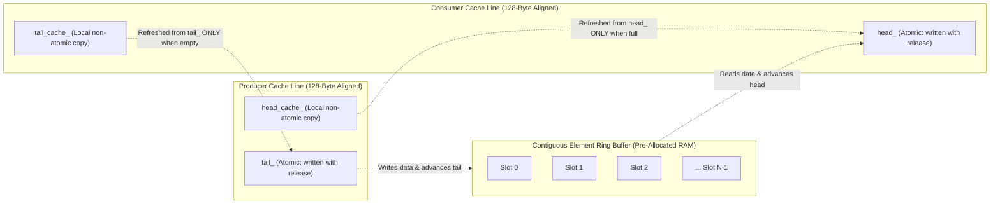

> [!summary]
> The Single-Producer Single-Consumer (SPSC) lock-free ring buffer is the primary communication primitive in low-latency trading pipelines. By using power-of-two bitmask indexing, 128-byte cache line separation between producer and consumer indices, and local cached head/tail tracking, a production SPSC queue achieves wait-free $O(1)$ push/pop operations in under 12 nanoseconds with zero cross-core cache line bouncing.

---

## Why it matters
In high-frequency execution pipelines (e.g., handing off incoming market data from a kernel-bypass network thread to a strategy pricing thread), traditional mutexes (`std::mutex`) or multi-producer queues (`std::condition_variable`, MPMC queues) are far too slow—they introduce context switching and atomic CAS bus locking (**50–2,000 ns penalty**).

A properly designed SPSC ring buffer:
1. Is **Wait-Free**: Guarantees completion in a finite number of deterministic instructions without loops or retries.
2. Emits **Zero RFO Invalidation Traffic**: The Producer core only writes to its own private cache line; the Consumer core only writes to its own private cache line.
3. Sustains **>50,000,000 messages/sec** per core pair with median latency under **15 nanoseconds**.



---

## Mechanism

### 1. Power-of-Two Masking vs Integer Modulo
Traditional circular buffers wrap indices using the modulo operator (`index % capacity`). 
- Integer division/modulo (`IDIV`) on x86 takes **10–18 clock cycles**.
- Restricting capacity to a **power of two** ($N = 2^k$) allows wrapping via a single-cycle bitwise AND instruction:
  $$\text{slot\_index} = \text{index} \ \& \ (N - 1)$$
- Bitwise AND (`AND`) takes **1 clock cycle (0.25 ns)**.

### 2. The Cached Index Optimization (Eliminating Cache Snooping)
In a naive SPSC queue, the Producer reads the Consumer's `head_` atomic on *every single push* to check for full buffer conditions, triggering cross-core MESI snooping.

- **The Solution**: The Producer maintains a private, non-atomic `head_cache_`.
  - When pushing, the Producer checks if `tail_ - head_cache_ < CAPACITY`.
  - As long as space remains, the Producer **never touches the Consumer's cache line!**
  - Only when the buffer appears full does the Producer issue an `acquire` load to refresh `head_cache_ = head_.load(memory_order_acquire)`.
- The Consumer applies the identical optimization using a local `tail_cache_`.

---

## In Practice

### Production-Grade Wait-Free SPSC Ring Buffer in C++20

```cpp
#include <atomic>
#include <cstdint>
#include <new>
#include <type_traits>
#include <optional>
#include <array>

template <typename T, size_t Capacity>
class SPSCQueue {
    static_assert((Capacity & (Capacity - 1)) == 0, "Capacity must be a power of two");
    static_assert(Capacity >= 2, "Capacity must be at least 2");

private:
    static constexpr size_t CACHE_LINE_SIZE = 128; // 128B to defeat spatial prefetcher false sharing
    static constexpr size_t MASK = Capacity - 1;

    // 1. PRODUCER CACHE LINE (Core 0 writes here)
    alignas(CACHE_LINE_SIZE) std::atomic<uint64_t> tail_{0};
    uint64_t head_cache_{0}; // Producer's local non-atomic copy of consumer head
    uint8_t pad_producer_[CACHE_LINE_SIZE - sizeof(std::atomic<uint64_t>) - sizeof(uint64_t)];

    // 2. CONSUMER CACHE LINE (Core 1 writes here)
    alignas(CACHE_LINE_SIZE) std::atomic<uint64_t> head_{0};
    uint64_t tail_cache_{0}; // Consumer's local non-atomic copy of producer tail
    uint8_t pad_consumer_[CACHE_LINE_SIZE - sizeof(std::atomic<uint64_t>) - sizeof(uint64_t)];

    // 3. CONTIGUOUS BUFFER
    alignas(CACHE_LINE_SIZE) T ring_[Capacity];

public:
    SPSCQueue() = default;

    // Non-copyable, non-movable
    SPSCQueue(const SPSCQueue&) = delete;
    SPSCQueue& operator=(const SPSCQueue&) = delete;

    // Push element into queue (Wait-free O(1), called strictly by Producer thread)
    template <typename... Args>
    bool emplace(Args&&... args) noexcept {
        const uint64_t current_tail = tail_.load(std::memory_order_relaxed);

        // Check local cached head to avoid reading consumer cache line
        if (current_tail - head_cache_ >= Capacity) {
            // Buffer appears full: refresh head_cache_ with acquire fence
            head_cache_ = head_.load(std::memory_order_acquire);
            if (current_tail - head_cache_ >= Capacity) {
                return false; // Queue is genuinely full
            }
        }

        // Construct element directly in-place in ring buffer
        new (&ring_[current_tail & MASK]) T(std::forward<Args>(args)...);

        // Publish updated tail to consumer with release semantics
        tail_.store(current_tail + 1, std::memory_order_release);
        return true;
    }

    // Pop element from queue (Wait-free O(1), called strictly by Consumer thread)
    bool pop(T& value) noexcept {
        const uint64_t current_head = head_.load(std::memory_order_relaxed);

        // Check local cached tail to avoid reading producer cache line
        if (current_head == tail_cache_) {
            // Buffer appears empty: refresh tail_cache_ with acquire fence
            tail_cache_ = tail_.load(std::memory_order_acquire);
            if (current_head == tail_cache_) {
                return false; // Queue is genuinely empty
            }
        }

        // Read element from ring buffer
        value = ring_[current_head & MASK];

        // Publish updated head to producer with release semantics
        head_.store(current_head + 1, std::memory_order_release);
        return true;
    }

    [[nodiscard]] bool empty() const noexcept {
        return head_.load(std::memory_order_relaxed) == tail_.load(std::memory_order_relaxed);
    }

    [[nodiscard]] size_t size() const noexcept {
        uint64_t head = head_.load(std::memory_order_relaxed);
        uint64_t tail = tail_.load(std::memory_order_relaxed);
        return (tail >= head) ? (tail - head) : 0;
    }
};
```

---

## Numbers

*Hardware Baseline: Intel Xeon Platinum 8480+ @ 3.8 GHz, Pinned Cores 2 & 4.*

| Ring Buffer Implementation | Latency per Op | Max Throughput | Cache Line Snoops / Op |
| :--- | :--- | :--- | :--- |
| **`std::mutex` + `std::deque`** | **450–1,200 ns** | ~1.2M msgs/sec | Systemic bus lock contention |
| **MPMC Queue (CAS Loop)** | **65–140 ns** | ~8.5M msgs/sec | RFO invalidations on head/tail |
| **Naive SPSC (Unpadded, No Cache)**| **35–55 ns** | ~18M msgs/sec | False sharing ping-pong on line |
| **Production SPSC (Padded + Cached)**| **9–14 ns** | **>65M msgs/sec**| **Zero snoops in steady state** |

---

## Trade-offs

| Design Characteristic | Advantage | Limitation |
| :--- | :--- | :--- |
| **Single Producer / Single Consumer** | Zero CAS contention; wait-free deterministic execution. | Cannot support multiple producers directly without dedicated sequencer or fan-in topology. |
| **Power-of-Two Sizing** | 1-cycle bitwise AND index wrapping. | Buffer capacity must be a power of two (e.g. 1024, 65536); potential memory overhead. |
| **In-Place Construct (`emplace`)** | Eliminates temporary copies in register/stack. | Requires pre-allocated buffer slots in physical memory. |

---

> [!warning] Gotchas
> 1. **The Overwrite / Tear Bug with Non-Trivial Types**: If `T` has a complex destructor, popping without destroying or overwriting an active slot can leak resources or invoke undefined behavior. In ultra-low latency C++, elements should be **trivially copyable POD structs** (Plain Old Data).
> 2. **Wrapping 64-bit Integer Overflow**: Many engineers use 32-bit integers (`uint32_t`) for head/tail. At 50M messages/sec, a 32-bit counter overflows in **85 seconds**, causing signed integer modulo bugs if index differences are computed incorrectly. *Always use `uint64_t` (overflows in 11,700 years).*

---

## Lab
**Objective**: Benchmark the C++20 `SPSCQueue` between two pinned cores, measuring throughput and transfer latency across 50,000,000 messages.

**Success Criteria**:
1. Run producer on Core 2 and consumer on Core 4.
2. Demonstrate sustained throughput exceeding **50M messages/sec**.
3. Verify with `perf c2c` that cache lines for `tail_` and `head_` exhibit **zero false sharing hits**.

---

> [!question]- Self-test
> 1. **Why does the Cached Index Optimization drastically increase throughput in an SPSC ring buffer?**
>    *Answer*: In a naive ring buffer, the producer reads the consumer's `head_` atomic on every push, and the consumer reads the producer's `tail_` atomic on every pop, causing continuous cross-core cache line snoops across the inter-core interconnect. With cached indices, the producer checks a local copy (`head_cache_`) that is only updated when the queue appears full, eliminating cross-core cache invalidations for 99.9% of push operations.
> 2. **Why must the capacity of an ultra-low latency SPSC ring buffer be a power of two?**
>    *Answer*: Restricting capacity to a power of two ($N = 2^k$) allows wrapping the 64-bit monotonically increasing index using a single-cycle bitwise AND operation (`index & (N - 1)`), completely avoiding the expensive hardware integer division/modulo instruction (`IDIV`), which costs 10–18 clock cycles.
> 3. **What is the formal difference between a Lock-Free data structure and a Wait-Free data structure?**
>    *Answer*: A **Lock-Free** data structure guarantees that across all operating threads, *at least one thread* makes forward progress in a finite number of steps (individual threads may retry indefinitely in CAS loops). A **Wait-Free** data structure guarantees that *every individual thread* completes its operation in a bounded, finite number of steps without retries or loops. A properly implemented SPSC ring buffer is Wait-Free.

---

## Related
- [[Notes/C++ Memory Model and Memory Orders]]
- [[Notes/Lock-Free MPMC Queue Mechanics]]
- [[Notes/Allocation-Free Steady State Patterns]]
- [[Notes/False Sharing and Cache Contention]]
- [[Notes/The LMAX Disruptor Architecture]]
- [[MOC - 08 Low-Latency Programming]]

## Sources
- [[Sources/CppCon 2017 - When a Microsecond is an Eternity by Carl Cook]]
- [[Sources/C++ Concurrency in Action by Anthony Williams]]
- [[Sources/The LMAX Disruptor Technical Paper]]
