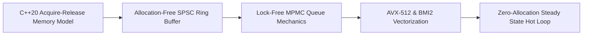

# MOC — 08 Low-Latency Programming (C++/Rust)

Hardware-aligned systems programming: memory models, lock-free data structures, allocation-free paradigms, and advanced SIMD vectorization.

---

## Core Concepts
- [[08 - Low-Latency Programming/C++ Memory Model and Memory Orders]] — `memory_order_relaxed`, `acquire`, `release`, `acq_rel`, `seq_cst`; hardware barriers on x86 vs ARM.
- [[08 - Low-Latency Programming/Lock-Free SPSC Ring Buffer Design]] — Single-Producer Single-Consumer cache-aligned circular buffer with zero atomic contention.
- [[08 - Low-Latency Programming/Lock-Free MPMC Queue Mechanics]] — Multi-Producer Multi-Consumer topologies, CAS loops, ABA problem, hazard pointers vs epoch reclamation.
- [[08 - Low-Latency Programming/Allocation-Free Steady State Patterns]] — Arena allocators, object pools, intrusive containers, eliminating `malloc`/`new` on hot paths.
- [[08 - Low-Latency Programming/Advanced SIMD Vectorization with AVX-512 and BMI2]] — 64-byte vector processing, Opmask registers (`%k0`–`%k7`), `_mm512_mask_compressstoreu_epi32`, and parallel bit extraction (`_pext_u64`).

## Labs & Implementations
- [[08 - Low-Latency Programming/Lab - 08 Ultra-Low Latency SPSC Ring Buffer]] — Implement and benchmark a cache-aligned, wait-free SPSC queue sustaining >50M msgs/sec with <15ns latency.

## Canonical Sources
- [[Sources/C++ Concurrency in Action by Anthony Williams]] — Reference text on the C++ memory model and lock-free implementations.
- [[Sources/Intel 64 and IA-32 Architectures Software Developer's Manual]] — Total Store Order (TSO) and instruction execution.
- [[Sources/Systems Performance by Brendan Gregg]] — Microbenchmarking and memory profiling.
