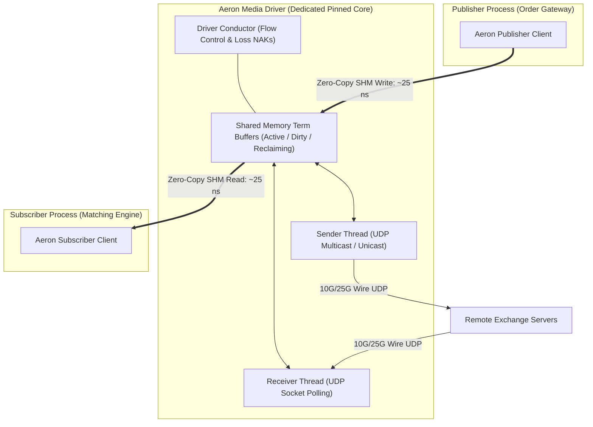

> [!summary]
> Aeron is an open-source, ultra-high-throughput, low-latency messaging transport designed by Real Logic. By separating network I/O into an out-of-process Media Driver that coordinates with client applications via lock-free shared memory term buffers, Aeron achieves sub-50ns IPC latency and wire-speed reliable UDP unicast/multicast with deterministic tail latency.

---

## Why it matters
Traditional messaging brokers (e.g., RabbitMQ, Kafka, ZeroMQ) use heavy TCP connection pooling, dynamic memory serialization, and OS kernel context switches, introducing **100 to 5,000 microseconds** of tail latency.

Aeron was designed from the hardware up for financial exchange and trading architectures:
1. **Zero-Copy Lock-Free Ingestion**: Publishers write directly into memory-mapped shared term buffers.
2. **Deterministic Reliable Multicast**: NAK-based loss recovery with flow-control windows over raw UDP.
3. **Unified Protocol Fabric**: Identical C++ API for inter-process communication (Aeron IPC @ **~25–45 ns**) and cross-server communication (Aeron UDP @ **~800–1,500 ns**).



---

## Mechanism

### 1. The 3-Partition Term Buffer Rotation
Aeron structures shared memory streams into a log consisting of **three rotating Term Buffers** (each typically 16 MB to 64 MB):
- **Term 0 (Active)**: Currently being written by publishers and read by subscribers.
- **Term 1 (Dirty)**: Completed writing; subscribers are draining remaining messages.
- **Term 2 (Reclaiming)**: Completely read; Media Driver resets memory headers to prepare for next epoch.

When the active term fills, Aeron transitions to the next term via a single atomic integer rotation with **zero dynamic allocation and zero garbage collection pauses**.

### 2. Lock-Free Single-Writer / Multi-Publisher Appending
To append a message into an active term buffer:
1. Publisher claims a contiguous byte range using an atomic `fetch_add` on the term tail offset.
2. Publisher writes the message payload directly into the memory-mapped buffer at the claimed offset.
3. Publisher writes the **Aeron Frame Header** (Frame Length, Version, Type, Stream ID, Term ID) with `memory_order_release`.
4. Subscribers polling the buffer detect the length header and read the payload with zero copies.

### 3. NAK-Based Reliable UDP Transport
Unlike TCP, which uses positive ACKs and stops transmission upon packet loss (head-of-line blocking):
- Aeron transmits UDP frames continuously at wire speed.
- If a subscriber detects a gap in sequence numbers, it immediately issues a **NAK (Negative Acknowledgment)** packet back to the Media Driver.
- The Media Driver resends only the missing term slice from its local memory-mapped log buffer without stalling independent streams.

---

## In Practice

### High-Throughput Aeron IPC Publishing Pattern in C++

```cpp
#include <aeron/Aeron.h>
#include <iostream>
#include <cstring>

using namespace aeron;

struct OrderBookDelta {
    uint64_t sequence;
    uint32_t symbol_id;
    uint32_t price;
    uint32_t qty;
    uint8_t  side;
};

void run_aeron_publisher() {
    // 1. Connect to local running Media Driver via Shared Memory IPC
    Context context;
    context.aeronDirectoryName("/dev/shm/aeron-trading");

    std::shared_ptr<Aeron> aeron = Aeron::connect(context);

    // 2. Add exclusive IPC Publication on Stream 1001
    const std::string channel = "aeron:ipc";
    const std::int32_t stream_id = 1001;

    std::int64_t publication_id = aeron->addExclusivePublication(channel, stream_id);
    std::shared_ptr<ExclusivePublication> publication = aeron->findExclusivePublication(publication_id);

    while (!publication) {
        std::this_thread::yield();
        publication = aeron->findExclusivePublication(publication_id);
    }

    // 3. Zero-Copy In-Place Publishing Loop
    OrderBookDelta delta{1, 501, 15025, 100, 0};
    BufferClaim buffer_claim;

    for (uint64_t seq = 1; seq <= 10'000'000; ++seq) {
        delta.sequence = seq;

        // Try to claim space directly in the shared memory term buffer
        while (publication->tryClaim(sizeof(OrderBookDelta), buffer_claim) < 0) {
            _mm_pause(); // Backpressure or term rotation in progress
        }

        // Write directly into the claimed memory buffer (Zero Copy!)
        std::memcpy(buffer_claim.buffer().data() + buffer_claim.offset(), &delta, sizeof(OrderBookDelta));

        // Commit the frame to make it instantly visible to subscribers
        buffer_claim.commit();
    }

    std::cout << "Successfully published 10,000,000 messages over Aeron IPC!\n";
}
```

---

## Numbers

*Hardware Baseline: AMD EPYC Genoa / Intel Xeon Sapphire Rapids @ 4.0 GHz.*

| Messaging Layer | Medium | Median Latency ($p50$) | Tail Latency ($p99.99$) | Throughput |
| :--- | :--- | :--- | :--- | :--- |
| **Aeron IPC (Exclusive Pub)** | POSIX SHM | **~24–38 ns** | **<85 ns** | **>60M msgs/sec** |
| **Aeron UDP (Kernel Bypass)** | 25G Ethernet | **~750–1,200 ns** | **<2.5 µs** | **>15M msgs/sec** |
| **ZeroMQ (IPC transport)** | Unix Domain | **~1,200–2,500 ns**| **18.0–45.0 µs** | ~2.5M msgs/sec |
| **Kafka / RabbitMQ** | TCP / OS Buffer | **~2,000,000 ns** | **25,000–80,000 µs** | ~0.3M msgs/sec |

---

## Trade-offs

| Transport Choice | Advantages | Costs / Operational Constraints |
| :--- | :--- | :--- |
| **Aeron IPC** | Lowest cross-process latency in industry (~25 ns); zero memory copies. | Requires running a dedicated Media Driver process; bound to single host. |
| **Aeron UDP Multicast** | Single publisher fans out to hundreds of subscribers with zero duplicate packets. | Requires PTP-synced network switches supporting IGMP snooping and multicast. |
| **Aeron Cluster (Raft)** | Deterministic distributed consensus and zero-loss log replication. | Adds network consensus round-trip (~15–50 µs) compared to single-node matching. |

---

> [!warning] Gotchas
> 1. **Media Driver Starvation on Shared Cores**: If the Aeron Media Driver conductor thread is scheduled on a busy core shared with batch OS tasks, it fails to send NAKs and process term rotations in time, causing term buffer lockups across all publishers. *Always pin the Media Driver Conductor and Sender threads to dedicated isolated cores.*
> 2. **Buffer Claim Commit Forgetting**: If a publisher claims a byte range via `tryClaim()` and throws an exception or crashes before invoking `buffer_claim.commit()`, the term buffer stream is permanently blocked at that offset.

---

## Lab
**Objective**: Deploy an embedded Aeron C++ Media Driver and execute an Aeron IPC benchmark between two pinned threads using `tryClaim()` zero-copy publishing.

**Success Criteria**:
1. Stream 10,000,000 messages of size 64 bytes.
2. Measure throughput: verify sustained rate exceeds **30,000,000 messages/second**.
3. Measure median end-to-end latency: verify $p50 < 40\text{ ns}$.

---

> [!question]- Self-test
> 1. **What is the structural role of the Aeron Media Driver and why is it separated from client applications?**
>    *Answer*: The Media Driver is an independent background daemon that handles all physical network I/O (UDP socket polling, framing, multicast distribution), reliable NAK-based retransmissions, flow control windows, and term buffer lifecycle rotation. By offloading networking to the Media Driver, client applications interact purely through zero-copy lock-free shared memory log buffers without executing socket system calls.
> 2. **How does Aeron's 3-partition Term Buffer rotation prevent dynamic memory allocation and garbage collection pauses?**
>    *Answer*: Aeron allocates three fixed-size memory-mapped buffers (Active, Dirty, Reclaiming) at startup. While Term 0 is actively written, Term 1 is drained by subscribers, and Term 2 is cleaned by the Media Driver. When Term 0 fills, the active index rotates to Term 1, and the reclaimed Term 2 becomes the next dirty buffer. This circular rotation continues infinitely with zero heap reallocation.
> 3. **What is the performance advantage of Aeron's `tryClaim()` API over standard `offer()`?**
>    *Answer*: Standard `offer()` copies the payload from a client buffer into the Aeron log buffer (1 memory copy). `tryClaim()` atomically reserves a memory slice directly within the shared-memory term buffer and returns a pointer, allowing the application to construct or serialize its message directly in-place in shared memory with **zero memory copies**.

---

## Related
- [[Notes/Shared Memory IPC Topologies]]
- [[Notes/The LMAX Disruptor Architecture]]
- [[Notes/The Sequenced-Stream Architecture]]
- [[Notes/Lock-Free SPSC Ring Buffer Design]]
- [[MOC - 09 Messaging & IPC]]

## Sources
- [[Sources/Aeron Open-Source Repository and Wiki by Real Logic]]
- [[Sources/Mechanical Sympathy by Martin Thompson]]
- [[Sources/Real-Time Systems and Aeron Architecture by Todd Montgomery]]
