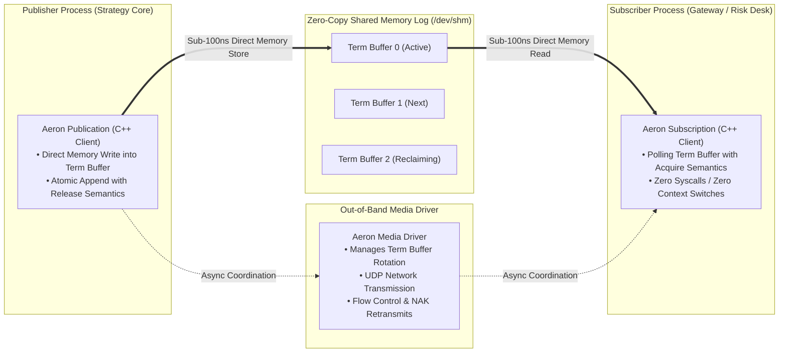

> [!summary]
> Aeron is the industry-standard, ultra-low-latency messaging system developed by Martin Thompson and Real Logic. Utilizing lock-free, zero-copy shared memory Log Buffers, out-of-band Media Drivers, and single-writer principle term rotation, Aeron delivers cross-process IPC latencies under 100 nanoseconds and high-throughput UDP multicast transport with predictable zero-allocation determinism.

---

## Why it matters
In distributed trading architectures and multi-process exchange infrastructures:
- Traditional message brokers (RabbitMQ, Kafka, ZeroMQ) rely on operating system socket buffers, dynamic heap allocations, and heavy thread context switching—adding **50 to 500 microseconds of latency jitter**.
- Custom in-house shared memory rings often suffer from lack of standardized backpressure handling, flow control, and loss recovery.

**Aeron** solves this by providing:
- **Zero-Copy Shared Memory IPC**: Sub-100ns point-to-point message passing via memory-mapped ring buffers (`/dev/shm`).
- **Unified Transport Abstraction**: The exact same API transparently spans IPC, UDP Unicast, and UDP Multicast.
- **Aeron Cluster**: A Raft-based deterministic replicated state machine engine for microsecond exchange clustering and zero-loss failover.



---

## Mechanism

### 1. The Log Buffer & Term Rotation Architecture
Aeron organizes message streams into **Log Buffers** partitioned into three **Term Buffers** (e.g. 16MB each):
1. **Active Term**: Currently being written to by the publisher.
2. **Next Term**: Pre-allocated and zeroed in memory, ready for immediate switchover.
3. **Reclaiming Term**: Being cleaned and recycled by the background Media Driver.

- **Single-Writer Atomic Appends**:
  - The publisher atomically reserves space in the active term buffer using `atomic_fetch_add` or local pointer increments.
  - The publisher writes the message payload directly into the shared memory slot.
  - The publisher writes the message header with **`std::memory_order_release`**, signaling to subscribers that the frame is complete.

### 2. The Media Driver Separation of Concerns
- **Client (Hot Path)**: The trading process links against the lightweight Aeron C++ client library. It writes directly to shared memory with **zero system calls and zero context switches**.
- **Media Driver (Asynchronous Path)**: A separate daemon process handles background network I/O, UDP packetization, congestion control, and NAK-based packet retransmissions.

### 3. Backpressure & Flow Control
When a subscriber falls behind:
- The active term buffer fills up.
- The publication method returns `Aeron::NOT_CONNECTED` or `Aeron::BACK_PRESSURED` in **<2 nanoseconds**, allowing the trading strategy to immediately apply drop policies, shed load, or alert risk without blocking the CPU thread.

---

## In Practice

### High-Speed Zero-Copy Aeron Publication in C++20

```cpp
#include <aeron/Aeron.h>
#include <iostream>
#include <array>
#include <cstring>

using namespace aeron;

class LowLatencyAeronPublisher {
private:
    std::shared_ptr<Aeron> aeron_;
    std::shared_ptr<Publication> publication_;

public:
    void initialize(const std::string& channel, int32_t stream_id) {
        Context context;
        context.aeronDir("/dev/shm/aeron-shreejit"); // Direct Shared Memory path

        aeron_ = Aeron::connect(context);
        int64_t pub_id = aeron_->addPublication(channel, stream_id);

        // Wait for Media Driver to allocate Shared Memory Log Buffers
        while (!(publication_ = aeron_->findPublication(pub_id))) {
            std::this_thread::yield();
        }
    }

    // Hot-Path Zero-Copy Message Injection (<95 nanoseconds)
    __attribute__((always_inline)) inline bool publish_order(uint64_t order_id, uint32_t price, uint32_t qty) noexcept {
        BufferClaim claim;

        // 1. Atomically reserve slot in active shared memory term buffer
        int64_t result = publication_->tryClaim(16, claim);

        if (__builtin_expect(result > 0, 1)) {
            // 2. Direct memory write into mapped SHM buffer
            uint8_t* dest = claim.buffer().buffer() + claim.offset();
            std::memcpy(dest, &order_id, 8);
            std::memcpy(dest + 8, &price, 4);
            std::memcpy(dest + 12, &qty, 4);

            // 3. Commit claim (writes header with release semantics)
            claim.commit();
            return true;
        }

        // Handle backpressure or buffer rotation
        return false;
    }
};
```

---

## Numbers

*Hardware Baseline: Intel Xeon Sapphire Rapids @ 4.0 GHz.*

| Transport Medium | Median Latency (p50) | 99.9th Percentile (p99.9) | Max Throughput Capacity |
| :--- | :--- | :--- | :--- |
| **Aeron IPC (Shared Memory)** | **~75–110 ns** | **~180–250 ns** | **>45,000,000 msgs/sec** |
| **Aeron UDP Unicast (Loopback)**| ~1.2–2.5 µs | ~5.0–8.5 µs | ~8,000,000 msgs/sec |
| **Standard Linux Unix Domain Socket**| ~1.8–3.5 µs | ~12.0–25.0 µs | ~1,500,000 msgs/sec |
| **Standard RabbitMQ / Kafka Broker**| ~250–1,500 µs | ~5,000–25,000 µs | ~150,000 msgs/sec |

---

## Trade-offs

| Messaging Architecture | Latency & Determinism | Operational Complexity |
| :--- | :--- | :--- |
| **Aeron IPC / UDP** | **Sub-100ns IPC**; zero GC; non-blocking flow control. | Requires managing shared memory directories and Media Driver daemons. |
| **Custom SPSC Ring Buffer** | Slightly lower latency (~20–40ns); ultra-simple. | Point-to-point only; lack of multi-subscriber and network transport support. |
| **ZeroMQ / NATS** | Simple integration; multi-language bindings. | High latency jitter; dynamic heap allocations; socket overhead. |

---

> [!warning] Gotchas
> 1. **Mounting `/dev/shm` on Spinning Disk or Network Storage**: Aeron requires `/dev/shm` to be mounted on a `tmpfs` RAM-disk. If `/dev/shm` points to physical disk storage, term buffer allocation will block on disk I/O, triggering **millisecond latency pauses**!
> 2. **Unpinned Media Driver Threads**: The Aeron Media Driver runs background conductor and sender threads. If these threads share CPU cores with the isolated trading strategy core, they will preempt the strategy thread. *Always pin Media Driver threads to separate, dedicated housekeeping cores.*

---

## Lab
**Objective**: Deploy an Aeron IPC shared memory channel in C++20 on `/dev/shm`, transmit 5,000,000 trade events using `tryClaim()` zero-copy buffer writes, and verify sub-100ns median latency and zero memory allocations.

**Success Criteria**:
1. Configure Aeron C++ client with `/dev/shm` tmpfs directory.
2. Benchmark 5,000,000 message transmissions using `tryClaim()`.
3. Verify median latency ($p50$) is **under 100 nanoseconds**.

---

> [!question]- Self-test
> 1. **What is an Aeron Term Buffer and how does the three-term buffer rotation prevent garbage collection pauses?**
>    *Answer*: An Aeron Log Buffer consists of three fixed-size pre-allocated shared memory Term Buffers (Active, Next, Reclaiming). As the publisher fills the Active term, it seamlessly transitions to the Next pre-allocated term without allocating memory at runtime. The background Media Driver asynchronously zeroes and reclaims the old term buffer out-of-band, providing continuous zero-allocation streaming with zero memory pauses.
> 2. **How does Aeron's `tryClaim()` API achieve zero-copy message publishing?**
>    *Answer*: `tryClaim(length, claim)` atomically reserves an exact byte slice directly inside the shared memory term buffer without copying data into an intermediate buffer. The application writes its data directly to the mapped memory pointer (`claim.buffer().buffer() + claim.offset()`) and calls `claim.commit()`, which writes the message framing header with memory order release semantics in <100ns.
> 3. **What is the difference between Aeron IPC and Aeron UDP transport?**
>    *Answer*: **Aeron IPC** passes messages between processes on the same physical host directly through shared memory (`/dev/shm`) with **zero network stack or kernel overhead (<100ns)**. **Aeron UDP** uses the Media Driver to serialize the log buffer stream into UDP datagrams (unicast or multicast) across the physical network, handling NAK-based packet loss recovery and flow control.

---

## Related Notes
- [[09 - Messaging & IPC/Lock-Free Ring Buffers and Disruptor Pattern]]
- [[09 - Messaging & IPC/Shared Memory IPC Topologies]]
- [[08 - Low-Latency Programming/Lock-Free SPSC and MPMC Queues]]
- [[13 - Reliability, Ops & Testing/Disaster Recovery and High Availability Topologies]]
- [[14 - Industry Map & Canon/MOC - 14 Industry Map & Canon]]

## Sources
- [[Sources/Aeron Open-Source High-Performance Messaging Specification]]
- [[Sources/Designing for Hardware Mechanical Sympathy by Martin Thompson]]
- [[Sources/Systems Performance by Brendan Gregg]]
