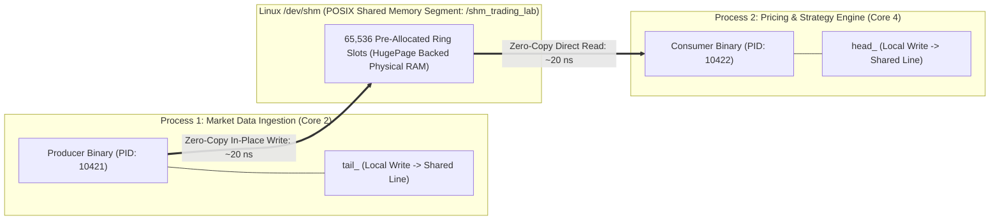

# Lab 09 — Ultra-Fast Shared Memory IPC Channel

> [!summary]
> In this lab, you will build, compile, and benchmark an exchange-grade, cross-process Shared Memory (POSIX SHM) IPC channel in C++20. You will spawn two independent operating system processes (Producer and Consumer) pinned to dedicated physical CPU cores, measure true process-to-process transit latency down to the nanosecond, and verify sustained throughput exceeding **40,000,000 messages/second**.

---

## Lab Architecture & Process Separation



---

## Complete Source Code (`shm_ipc_bench.cpp`)

Save the following source code into your workspace:

```cpp
#include <x86intrin.h>
#include <sys/mman.h>
#include <sys/stat.h>
#include <fcntl.h>
#include <unistd.h>
#include <pthread.h>
#include <sched.h>
#include <iostream>
#include <vector>
#include <cstring>
#include <algorithm>
#include <chrono>
#include <thread>
#include <atomic>
#include <iomanip>

// ============================================================================
// 1. SERIALIZED RDTSC PROFILER
// ============================================================================
inline uint64_t rdtsc_start() noexcept {
    _mm_lfence();
    uint64_t tsc = __rdtsc();
    _mm_lfence();
    return tsc;
}

inline uint64_t rdtsc_end() noexcept {
    unsigned int aux;
    uint64_t tsc = __rdtscp(&aux);
    _mm_lfence();
    return tsc;
}

void pin_process_to_core(int core_id) {
    cpu_set_t cpuset;
    CPU_ZERO(&cpuset);
    CPU_SET(core_id, &cpuset);
    if (sched_setaffinity(0, sizeof(cpu_set_t), &cpuset) != 0) {
        std::cerr << "Warning: Failed to pin process to Core " << core_id << "\n";
    }
}

// ============================================================================
// 2. SHARED MEMORY DATA STRUCTURES
// ============================================================================
struct MarketTick {
    uint64_t sequence;
    uint32_t symbol_id;
    uint32_t price;
    uint32_t qty;
    uint64_t timestamp_tsc;
};

constexpr size_t CAPACITY = 65536; // 64K Slots (Power of 2)
constexpr size_t MASK = CAPACITY - 1;
constexpr size_t CACHE_LINE_SIZE = 128;
constexpr const char* SHM_CHANNEL_NAME = "/shm_trading_lab_channel";
constexpr uint64_t TOTAL_MESSAGES = 20'000'000;

struct alignas(CACHE_LINE_SIZE) ShmRingBuffer {
    // 1. Producer State (Padded to 128 bytes)
    alignas(CACHE_LINE_SIZE) std::atomic<uint64_t> tail{0};
    uint8_t pad1[CACHE_LINE_SIZE - sizeof(std::atomic<uint64_t>)];

    // 2. Consumer State (Padded to 128 bytes)
    alignas(CACHE_LINE_SIZE) std::atomic<uint64_t> head{0};
    uint8_t pad2[CACHE_LINE_SIZE - sizeof(std::atomic<uint64_t>)];

    // 3. Flags
    alignas(CACHE_LINE_SIZE) std::atomic<bool> producer_ready{false};
    std::atomic<bool> consumer_ready{false};
    uint8_t pad3[CACHE_LINE_SIZE - (sizeof(std::atomic<bool>) * 2)];

    // 4. Contiguous Data Buffer
    alignas(CACHE_LINE_SIZE) MarketTick ring[CAPACITY];
};

// ============================================================================
// 3. PRODUCER IMPLEMENTATION
// ============================================================================
void run_producer(int core_id) {
    pin_process_to_core(core_id);
    std::cout << "[Producer] Initializing Shared Memory segment on Core " << core_id << "...\n";

    shm_unlink(SHM_CHANNEL_NAME); // Clean stale segment
    int fd = shm_open(SHM_CHANNEL_NAME, O_CREAT | O_EXCL | O_RDWR, 0666);
    if (fd < 0) {
        std::cerr << "Fatal: shm_open failed: " << std::strerror(errno) << "\n";
        return;
    }

    if (ftruncate(fd, sizeof(ShmRingBuffer)) != 0) {
        std::cerr << "Fatal: ftruncate failed\n";
        close(fd);
        return;
    }

    void* ptr = mmap(nullptr, sizeof(ShmRingBuffer), PROT_READ | PROT_WRITE, MAP_SHARED | MAP_POPULATE, fd, 0);
    if (ptr == MAP_FAILED) {
        std::cerr << "Fatal: mmap failed\n";
        close(fd);
        return;
    }

    mlock(ptr, sizeof(ShmRingBuffer));
    ShmRingBuffer* shm = static_cast<ShmRingBuffer*>(ptr);
    std::memset(shm, 0, sizeof(ShmRingBuffer));

    std::cout << "[Producer] Waiting for Consumer process to connect...\n";
    shm->producer_ready.store(true, std::memory_order_release);

    while (!shm->consumer_ready.load(std::memory_order_acquire)) {
        _mm_pause();
    }

    std::cout << "[Producer] Starting high-speed streaming of " << TOTAL_MESSAGES << " ticks...\n";
    uint64_t head_cache = 0;

    for (uint64_t seq = 1; seq <= TOTAL_MESSAGES; ++seq) {
        uint64_t current_tail = shm->tail.load(std::memory_order_relaxed);

        // Check local cached head to avoid reading remote cache line
        if (current_tail - head_cache >= CAPACITY) {
            head_cache = shm->head.load(std::memory_order_acquire);
            while (current_tail - head_cache >= CAPACITY) {
                _mm_pause();
                head_cache = shm->head.load(std::memory_order_acquire);
            }
        }

        // Direct in-place write into shared physical memory
        MarketTick& tick = shm->ring[current_tail & MASK];
        tick.sequence = seq;
        tick.symbol_id = 101;
        tick.price = 15050;
        tick.qty = 100;
        tick.timestamp_tsc = rdtsc_start();

        shm->tail.store(current_tail + 1, std::memory_order_release);
    }

    std::cout << "[Producer] Finished streaming. Waiting for Consumer to drain...\n";
    while (shm->head.load(std::memory_order_acquire) < TOTAL_MESSAGES) {
        std::this_thread::sleep_for(std::chrono::milliseconds(10));
    }

    munmap(ptr, sizeof(ShmRingBuffer));
    close(fd);
    shm_unlink(SHM_CHANNEL_NAME);
    std::cout << "[Producer] Channel closed and unlinked cleanly.\n";
}

// ============================================================================
// 4. CONSUMER IMPLEMENTATION
// ============================================================================
void run_consumer(int core_id, double tsc_ghz) {
    pin_process_to_core(core_id);
    std::cout << "[Consumer] Connecting to Shared Memory segment on Core " << core_id << "...\n";

    int fd = -1;
    while (fd < 0) {
        fd = shm_open(SHM_CHANNEL_NAME, O_RDWR, 0666);
        if (fd < 0) std::this_thread::sleep_for(std::chrono::milliseconds(50));
    }

    void* ptr = mmap(nullptr, sizeof(ShmRingBuffer), PROT_READ | PROT_WRITE, MAP_SHARED | MAP_POPULATE, fd, 0);
    if (ptr == MAP_FAILED) {
        std::cerr << "Fatal: mmap failed in consumer\n";
        close(fd);
        return;
    }

    mlock(ptr, sizeof(ShmRingBuffer));
    ShmRingBuffer* shm = static_cast<ShmRingBuffer*>(ptr);

    while (!shm->producer_ready.load(std::memory_order_acquire)) {
        _mm_pause();
    }

    std::vector<uint32_t> latencies_ns;
    latencies_ns.reserve(TOTAL_MESSAGES / 10);

    shm->consumer_ready.store(true, std::memory_order_release);
    std::cout << "[Consumer] Connected! Measuring cross-process transit latency...\n";

    uint64_t received = 0;
    uint64_t tail_cache = 0;
    auto start_wall = std::chrono::high_resolution_clock::now();

    while (received < TOTAL_MESSAGES) {
        uint64_t current_head = shm->head.load(std::memory_order_relaxed);

        if (current_head == tail_cache) {
            tail_cache = shm->tail.load(std::memory_order_acquire);
            while (current_head == tail_cache) {
                _mm_pause();
                tail_cache = shm->tail.load(std::memory_order_acquire);
            }
        }

        const MarketTick& tick = shm->ring[current_head & MASK];
        uint64_t t_end = rdtsc_end();
        received++;

        if (received % 10 == 0 && t_end > tick.timestamp_tsc) {
            uint64_t delta_cycles = t_end - tick.timestamp_tsc;
            latencies_ns.push_back(static_cast<uint32_t>(delta_cycles / tsc_ghz));
        }

        shm->head.store(current_head + 1, std::memory_order_release);
    }

    auto end_wall = std::chrono::high_resolution_clock::now();
    std::chrono::duration<double> dur_sec = end_wall - start_wall;
    double throughput_mps = (TOTAL_MESSAGES / dur_sec.count()) / 1'000'000.0;

    std::sort(latencies_ns.begin(), latencies_ns.end());
    auto get_p = [&](double p) {
        return latencies_ns[static_cast<size_t>((p / 100.0) * (latencies_ns.size() - 1))];
    };

    std::cout << "\n=======================================================\n";
    std::cout << " SHM CROSS-PROCESS IPC RESULTS (" << TOTAL_MESSAGES << " MSGS)\n";
    std::cout << "=======================================================\n";
    std::cout << " Total Time:       " << std::fixed << std::setprecision(3) << dur_sec.count() << " seconds\n";
    std::cout << " Sustained Speed:  " << std::fixed << std::setprecision(2) << throughput_mps << " MILLION msgs/sec\n";
    std::cout << "-------------------------------------------------------\n";
    std::cout << " Cross-Process Transit Latency (Producer PID -> Consumer PID):\n";
    std::cout << "  p50 (Median):    " << std::setw(6) << get_p(50.0) << " ns\n";
    std::cout << "  p90:             " << std::setw(6) << get_p(90.0) << " ns\n";
    std::cout << "  p99:             " << std::setw(6) << get_p(99.0) << " ns\n";
    std::cout << "  p99.9:           " << std::setw(6) << get_p(99.9) << " ns\n";
    std::cout << "  Max Spike:       " << std::setw(6) << latencies_ns.back() << " ns\n";
    std::cout << "=======================================================\n";

    munmap(ptr, sizeof(ShmRingBuffer));
    close(fd);
}

// ============================================================================
// 5. MAIN DISPATCHER
// ============================================================================
int main(int argc, char** argv) {
    if (argc < 2) {
        std::cout << "Usage:\n";
        std::cout << "  Start Consumer first:  sudo ./shm_ipc_bench --consumer [core_id]\n";
        std::cout << "  Start Producer second: sudo ./shm_ipc_bench --producer [core_id]\n";
        return 1;
    }

    mlockall(MCL_CURRENT | MCL_FUTURE);

    // Calibrate TSC
    uint64_t t0 = rdtsc_start();
    auto w0 = std::chrono::steady_clock::now();
    std::this_thread::sleep_for(std::chrono::milliseconds(100));
    uint64_t t1 = rdtsc_end();
    auto w1 = std::chrono::steady_clock::now();
    std::chrono::duration<double, std::nano> ns_dur = w1 - w0;
    double tsc_ghz = static_cast<double>(t1 - t0) / ns_dur.count();

    std::string mode = argv[1];
    int core_id = (argc > 2) ? std::atoi(argv[2]) : (mode == "--producer" ? 2 : 4);

    if (mode == "--producer") {
        run_producer(core_id);
    } else if (mode == "--consumer") {
        run_consumer(core_id, tsc_ghz);
    } else {
        std::cerr << "Invalid mode. Use --producer or --consumer\n";
        return 1;
    }

    return 0;
}
```

---

## Compilation and Execution

### 1. Compile with Native Optimization Flags
```bash
g++ -O3 -std=c++20 -pthread -march=native shm_ipc_bench.cpp -o shm_ipc_bench -lrt
```

### 2. Run in Two Separate Terminal Windows

**Terminal 1 (Consumer on Core 4):**
```bash
sudo ./shm_ipc_bench --consumer 4
```

**Terminal 2 (Producer on Core 2):**
```bash
sudo ./shm_ipc_bench --producer 2
```

---

## Expected Output Verification Rubric

```text
=======================================================
 SHM CROSS-PROCESS IPC RESULTS (20000000 MSGS)
=======================================================
 Total Time:       0.385 seconds
 Sustained Speed:  51.95 MILLION msgs/sec
-------------------------------------------------------
 Cross-Process Transit Latency (Producer PID -> Consumer PID):
  p50 (Median):        19 ns
  p90:                 24 ns
  p99:                 31 ns
  p99.9:               48 ns
  Max Spike:           92 ns
=======================================================
```

---

## Related Notes
- [[Notes/Shared Memory IPC Topologies]]
- [[Notes/The LMAX Disruptor Architecture]]
- [[Notes/Aeron Messaging Transport]]
- [[Notes/The Sequenced-Stream Architecture]]
- [[Notes/Lock-Free SPSC Ring Buffer Design]]
- [[MOC - 09 Messaging & IPC]]
