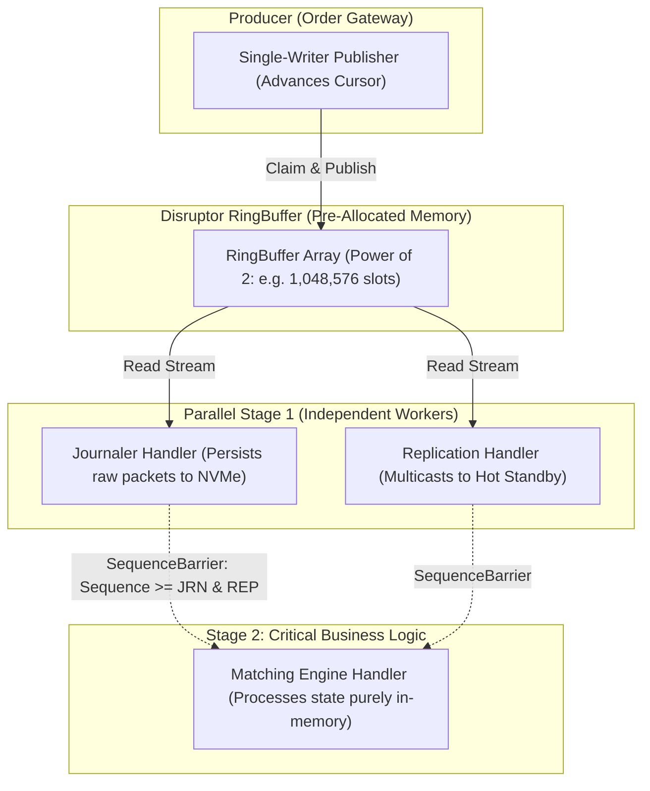

> [!summary]
> The LMAX Disruptor is a high-performance concurrency framework designed around hardware mechanical sympathy. By replacing concurrent bounded queues with a pre-allocated circular ring buffer, cache-padded sequence counters, and lock-free sequence barriers, the Disruptor coordinates complex multi-consumer processing pipelines (e.g., parallel journaling and replication feeding a single-writer matching engine) at over 25 million operations per second with sub-microsecond determinism.

---

## Why it matters
Traditional concurrent systems connect processing stages using bounded queues (e.g., `Queue<Order>` between Gateway, Journaler, and Business Logic). 

Bounded queues suffer from three fatal hardware bottlenecks:
1. **Lock & Condition Variable Contention**: Threads block on OS mutexes and context switches.
2. **False Sharing & Cache Contention**: Head and tail pointers sit in shared cache lines and bounce continuously across cores.
3. **Dynamic Node Allocation**: Enqueuing wraps objects in heap-allocated nodes, thrashing L1/L2 caches.

The Disruptor eliminates queues entirely. All stages read and write to a **single shared pre-allocated ring buffer**, coordinating exclusively via **monotonically increasing 64-bit sequence numbers**.



---

## Mechanism

### 1. The Core Primitives
1. **RingBuffer**: A contiguous array pre-allocated at startup. Slots are overwritten in-place, eliminating dynamic allocation.
2. **Sequence**: A padded 64-bit atomic integer (`alignas(128)`) representing the latest published or processed position in the ring.
3. **SequenceBarrier**: Coordinates consumers without locks. If Consumer 3 (Matching Engine) depends on Consumer 1 (Journaler) and Consumer 2 (Replication), Consumer 3 queries a barrier that returns $\min(\text{Seq}_1, \text{Seq}_2)$.
4. **WaitStrategy**: Defines how waiting threads poll for new sequences:
   - `BusySpinWaitStrategy`: 100% CPU spinning (lowest latency: **~5–10 ns**).
   - `YieldingWaitStrategy`: Calls `_mm_pause()` / `sched_yield()` (moderate latency: **~50–200 ns**).
   - `BlockingWaitStrategy`: Uses mutex/condvar for non-latency batch threads.

### 2. Batched Consumption Under Market Microbursts
When a burst of 1,000 orders arrives simultaneously:
- Instead of processing orders one-by-one with 1,000 independent synchronization events, the Consumer queries the barrier and observes that the Publisher's sequence has jumped from 100 to 1,100.
- The Consumer processes all 1,000 orders in a tight, cache-hot sequential loop, **updating its sequence atomic only once at the end**.
- **Result: Throughput scales up as load increases (Self-Amortizing Batching).**

---

## In Practice

### Minimal C++20 Disruptor Pipeline Engine

```cpp
#include <atomic>
#include <cstdint>
#include <array>
#include <new>
#include <algorithm>
#include <iostream>

template <typename T, size_t Capacity>
class DisruptorRing {
    static_assert((Capacity & (Capacity - 1)) == 0, "Capacity must be a power of two");

private:
    static constexpr size_t CACHE_LINE_SIZE = 128;
    static constexpr size_t MASK = Capacity - 1;

    // Cache-aligned padded sequence counter
    struct alignas(CACHE_LINE_SIZE) PaddedSequence {
        std::atomic<int64_t> value{-1};
        uint8_t pad[CACHE_LINE_SIZE - sizeof(std::atomic<int64_t>)];
    };

    alignas(CACHE_LINE_SIZE) T ring_[Capacity];
    PaddedSequence cursor_; // Publisher sequence

public:
    DisruptorRing() = default;

    // Publisher claims next sequence
    inline int64_t next() noexcept {
        return cursor_.value.load(std::memory_order_relaxed) + 1;
    }

    inline T& get(int64_t sequence) noexcept {
        return ring_[sequence & MASK];
    }

    // Publish event to consumers
    inline void publish(int64_t sequence) noexcept {
        cursor_.value.store(sequence, std::memory_order_release);
    }

    [[nodiscard]] inline int64_t get_cursor() const noexcept {
        return cursor_.value.load(std::memory_order_acquire);
    }
};

// Sequence Barrier coordinating dependency between handlers
class SequenceBarrier {
private:
    const std::atomic<int64_t>& upstream_sequence_;

public:
    explicit SequenceBarrier(const std::atomic<int64_t>& upstream) : upstream_sequence_(upstream) {}

    // Wait until available sequence >= next_sequence (BusySpin)
    inline int64_t wait_for(int64_t next_sequence) noexcept {
        int64_t available_seq;
        while ((available_seq = upstream_sequence_.load(std::memory_order_acquire)) < next_sequence) {
            _mm_pause(); // Low-power CPU spin
        }
        return available_seq; // Returns highest available sequence for batching!
    }
};
```

---

## Numbers

*Hardware Baseline: Intel Xeon Sapphire Rapids @ 4.0 GHz.*

| Concurrency Pattern | Single-Threaded Latency | Burst Throughput (Batching) | CPU Overhead |
| :--- | :--- | :--- | :--- |
| **`std::queue` + `std::mutex`** | **650–1,800 ns** | ~1.5M msgs/sec | High (Context switches) |
| **Blocking Concurrent Queue** | **250–600 ns** | ~4.2M msgs/sec | Medium (Condition vars) |
| **Disruptor (BusySpin Strategy)** | **12–25 ns** | **>45M msgs/sec** | Dedicated Core (100%) |
| **Disruptor (Yielding Strategy)** | **45–90 ns** | **>28M msgs/sec** | Low (Yields CPU) |

---

## Trade-offs

| Architectural Feature | Advantage | Limitation / Cost |
| :--- | :--- | :--- |
| **Single-Writer RingBuffer** | Zero lock contention; pure sequential cache writes. | Multiple publishers must synchronize via a sequencer or separate inbound rings. |
| **Self-Amortizing Batching** | Automatically handles market microbursts without latency degradation. | Individual tick latency under low load is governed by pure polling interval. |
| **Complex Dependency Graphs** | Pipeline stages (journal, replicate, match) run with zero intermediate queues. | Slower consumers can stall the publisher if the ring buffer fills completely. |

---

> [!warning] Gotchas
> 1. **Slow Consumer Ring Buffer Wrap Around**: If the Journaler consumer falls behind by `Capacity` slots, the Publisher will wrap around and overwrite unpersisted events. *The Publisher must always verify: `next_seq - min(consumer_sequences) < Capacity` before writing.*
> 2. **Cache Line False Sharing on Sequence Arrays**: Storing consumer sequences in a standard array (`std::vector<int64_t> sequences`) places adjacent sequence counters on the same 64-byte line, creating severe false sharing between consumer cores. *Every sequence counter must be padded to 128 bytes.*

---

## Lab
**Objective**: Build a 3-stage Disruptor pipeline: Publisher (Core 2) $\to$ Journaler (Core 4) + Replicator (Core 6) $\to$ Matching Engine (Core 8). Measure end-to-end throughput across 20,000,000 events.

**Success Criteria**:
1. Prove that the Matching Engine processes events only *after* both Journaler and Replicator have passed the sequence.
2. Demonstrate sustained throughput exceeding **25,000,000 events/second**.

---

> [!question]- Self-test
> 1. **How does the Disruptor pattern coordinate multiple consumers with dependencies (e.g., Matching Engine depends on Journaler) without using locks or intermediate queues?**
>    *Answer*: Both consumers read from the same shared pre-allocated `RingBuffer`. The dependent consumer (Matching Engine) is assigned a `SequenceBarrier` that tracks the upstream consumer's (Journaler) atomic sequence counter. The Matching Engine simply polls the barrier until the Journaler's sequence is greater than or equal to its desired sequence, executing zero locks or memory copies.
> 2. **What is "Self-Amortizing Batching" in the Disruptor and why does it improve performance during high market volatility?**
>    *Answer*: When a sudden burst of market events arrives, the consumer's sequence check against the publisher's cursor returns a sequence number that is multiple slots ahead (e.g., 500 events ahead). The consumer can process all 500 events in a tight, cache-hot sequential loop and update its own sequence atomic only once at the end, amortizing cross-core synchronization and atomic write overhead over the entire batch.
> 3. **Why must the `Sequence` class in the Disruptor be padded with 56–120 bytes of dummy data?**
>    *Answer*: An atomic `int64_t` occupies only 8 bytes. If multiple sequence counters (e.g., publisher cursor, journaler sequence, matching engine sequence) are allocated near each other, they will reside on the same 64-byte cache line (or adjacent 128-byte prefetch line pair), causing violent false sharing and MESI cache line bouncing every time any thread updates its progress. Padding isolates each counter onto its own dedicated cache line.

---

## Related
- [[Notes/Shared Memory IPC Topologies]]
- [[Notes/Aeron Messaging Transport]]
- [[Notes/Lock-Free SPSC Ring Buffer Design]]
- [[Notes/False Sharing and Cache Contention]]
- [[MOC - 09 Messaging & IPC]]

## Sources
- [[Sources/The LMAX Architecture by Martin Fowler]]
- [[Sources/The LMAX Disruptor Technical Paper]]
- [[Sources/Mechanical Sympathy by Martin Thompson]]
