> [!summary]
> Simple Binary Encoding (SBE) is an ultra-low-latency, binary message encoding standard optimized for hardware mechanical sympathy. By enforcing direct natural byte alignment, fixed-offset headers, and zero-allocation schema evolution, SBE enables CME MDP 3.0 market data and iLink 3 order messages to be decoded via direct pointer casting in under 10 nanoseconds.

---

## Why it matters
Traditional financial serialization formats introduce severe performance bottlenecks:
- **XML / JSON**: High CPU parsing overhead, string scanning, and heap thrashing (**1,500–10,000 ns**).
- **Google Protocol Buffers (Protobuf)**: Variable-length integer encoding (Varint) and bit-shifting loops (**150–450 ns**).
- **Tag-Value ASCII FIX**: Delimiter searching and character conversions (**250–800 ns**).

SBE was engineered from the CPU hardware up:
- Data types sit at **naturally aligned memory boundaries** (2, 4, 8 bytes).
- The CPU decodes fields using **direct single-cycle assembly load instructions (`MOV`)**.
- CME Group processes over **3 billion daily derivatives contracts** exclusively via SBE.

```mermaid
flowchart TD
    subgraph SBE_Frame ["Standard SBE Message Layout (Direct Memory Aligned)"]
        subgraph Header ["1. SBE Message Header (8 Bytes)"]
            BL["blockLength (uint16)"]
            TID["templateId (uint16: e.g. 46)"]
            SID["schemaId (uint16)"]
            VER["version (uint16)"]
        end

        subgraph RootFields ["2. Fixed Root Block Fields (Natural Alignment)"]
            TS["TransactTime (uint64, 8-byte aligned)"]
            SEC["SecurityID (uint32, 4-byte aligned)"]
            RPT["MatchEventIndicator (uint8)"]
        end

        subgraph RepeatingGroup ["3. Repeating Groups (e.g. Order Book Levels)"]
            GRP_HDR["Group Header: blockLength (uint16) + numInGroup (uint8)"]
            ENTRY1["Entry 1: Price (int64) + Qty (int32) + Action (uint8)"]
            ENTRY2["Entry 2: Price (int64) + Qty (int32) + Action (uint8)"]
        end

        Header --> RootFields --> RepeatingGroup
    end
```



---

## Mechanism

### 1. The Core SBE Structural Invariants
1. **Natural Memory Alignment**: An 8-byte integer (`int64_t`) is always placed at an offset divisible by 8. A 4-byte integer is placed at an offset divisible by 4. This prevents expensive **unaligned memory split-lock cache penalties**.
2. **Standard 8-Byte Message Header**:
   - `blockLength` (16-bit): Byte size of the fixed root fields.
   - `templateId` (16-bit): Message identifier (e.g., Template 46 = `MDIncrementalRefreshBook`).
   - `schemaId` (16-bit): Identifies the message dictionary.
   - `version` (16-bit): Schema version for backward compatibility.
3. **Repeating Groups**: Represents variable numbers of entries (e.g. multiple book level updates):
   - Preceded by a standardized **Group Header** (`blockLength` of one entry + `numInGroup` count).
4. **Schema Evolution without Recompilation**:
   - New fields are appended **strictly to the end of the root block**.
   - An older parser reads only up to its known `blockLength`, cleanly skipping newly appended fields without breaking.

### 2. CME MDP 3.0 Decimal Fixed-Point Encoding
CME encodes fractional prices using a **two-part decimal structure**:
- `mantissa` (`int64_t`): Integer price scaled by exponent.
- `exponent` (`int8_t`): Typically $-2$ for equity indices ($500025 \times 10^{-2} = 5000.25$) or $-7$ for sub-penny rates.

---

## In Practice

### High-Speed Zero-Copy CME MDP 3.0 SBE Parser (Template 46) in C++20

```cpp
#include <cstdint>
#include <iostream>
#include <vector>

#pragma pack(push, 1)
// SBE Standard Message Header (8 bytes)
struct SbeMessageHeader {
    uint16_t block_length;
    uint16_t template_id;
    uint16_t schema_id;
    uint16_t version;
};

// SBE Group Size Header (3 bytes)
struct SbeGroupSizeEncoding {
    uint16_t block_length;
    uint8_t  num_in_group;
};

// CME MDP 3.0 Template 46: MDIncrementalRefreshBook Entry
struct MDEntryBook {
    int64_t  price_mantissa; // 8-byte integer
    int32_t  size;           // 4-byte integer
    int32_t  security_id;   // 4-byte integer
    uint32_t rpt_seq;        // 4-byte integer
    uint8_t  number_of_orders;
    uint8_t  md_price_level; // Price level (1 to 10)
    uint8_t  md_update_action; // 0 = New, 1 = Change, 2 = Delete, 3 = DeleteThru
    char     md_entry_type;   // '0' = Bid, '1' = Offer
};
#pragma pack(pop)

class CmeMdp3Parser {
public:
    // Decodes CME SBE incremental book updates zero-copy in <12 nanoseconds
    template <typename Callback>
    static void parse_template_46(const uint8_t* buffer, size_t len, Callback&& on_book_update) noexcept {
        if (len < sizeof(SbeMessageHeader)) return;

        const auto* hdr = reinterpret_cast<const SbeMessageHeader*>(buffer);
        if (hdr->template_id != 46) return; // Not Template 46

        // Advance pointer past SBE header and fixed root block
        size_t offset = sizeof(SbeMessageHeader) + hdr->block_length;
        if (offset + sizeof(SbeGroupSizeEncoding) > len) return;

        // Parse Repeating Group Header (NoMDEntries)
        const auto* group_hdr = reinterpret_cast<const SbeGroupSizeEncoding*>(buffer + offset);
        offset += sizeof(SbeGroupSizeEncoding);

        uint8_t num_entries = group_hdr->num_in_group;
        uint16_t entry_block_len = group_hdr->block_length;

        for (uint8_t i = 0; i < num_entries; ++i) {
            if (offset + sizeof(MDEntryBook) > len) break;

            const auto* entry = reinterpret_cast<const MDEntryBook*>(buffer + offset);

            // Direct zero-copy access to aligned fields
            int32_t sec_id = entry->security_id;
            int64_t price = entry->price_mantissa;
            int32_t qty = entry->size;
            uint8_t level = entry->md_price_level;
            uint8_t action = entry->md_update_action;
            char side = entry->md_entry_type;

            on_book_update(sec_id, price, qty, level, action, side);

            offset += entry_block_len;
        }
    }
};
```

---

## Numbers

*Hardware Baseline: AMD EPYC Genoa / Intel Xeon Sapphire Rapids @ 4.0 GHz.*

| Codec / Format | Message Size | Parsing Latency per Message | Memory Allocation Overhead |
| :--- | :--- | :--- | :--- |
| **Simple Binary Encoding (SBE)**| **48–96 Bytes** | **~6–12 ns** | **0 Bytes (Direct Pointer)**|
| **NASDAQ ITCH 5.0** | **36–50 Bytes** | **~8–15 ns** | **0 Bytes (Direct Pointer)**|
| **Google Protocol Buffers** | **60–120 Bytes** | **~180–450 ns** | Variable (Internal objects) |
| **JSON / REST Format** | **300–800 Bytes** | **~2,500–8,500 ns** | Heavy Heap Allocation |

---

## Trade-offs

| Serializer Standard | Performance Advantage | Operational Limitation |
| :--- | :--- | :--- |
| **Simple Binary Encoding (SBE)**| Maximum possible speed on x86; schema evolution support. | Fixed-size padding can result in slightly larger wire sizes than FAST. |
| **FAST Compression (Legacy)** | Highest compression ratio over low-bandwidth WAN lines. | **High CPU decompression cost (150–400ns)**; stateful dictionaries. |
| **Protobuf / FlatBuffers** | Universal multi-language support (Java, Python, C++, Go). | Variable-length integer parsing adds CPU cycles. |

---

> [!warning] Gotchas
> 1. **The Little-Endian SBE Trajectory**: Unlike older Big-Endian financial protocols (ITCH/OUCH), SBE defaults to **Little-Endian** byte order. Running unnecessary `bswap` byte-swapping functions on SBE payloads on x86 will corrupt all price and quantity integers.
> 2. **Repeating Group Block Length Traps**: In SBE, never use `sizeof(MDEntryBook)` to advance the group loop pointer. Always advance by `group_hdr->block_length`. If CME upgrades the schema and appends a 4-byte field to the entry, `group_hdr->block_length` will reflect the new size, whereas `sizeof(MDEntryBook)` in older compiled code will desynchronize the buffer offset on the second entry!

---

## Lab
**Objective**: Build a high-throughput C++20 CME MDP 3.0 SBE decoder for Template 46 (`MDIncrementalRefreshBook`), parse 10,000,000 order book updates across repeating groups, and benchmark decoding speed.

**Success Criteria**:
1. Parse 10,000,000 SBE messages containing repeating groups.
2. Verify that zero heap allocations or string conversions occur.
3. Demonstrate sustained decoding throughput exceeding **50,000,000 updates/second**.

---

> [!question]- Self-test
> 1. **How does Simple Binary Encoding (SBE) achieve sub-10-nanosecond message decoding compared to Google Protocol Buffers?**
>    *Answer*: SBE lays out all data fields at their natural memory-aligned byte offsets (2, 4, 8 bytes) in native Little-Endian format and avoids variable-length integer encoding (Varints). The CPU decodes fields using direct single-cycle memory load instructions (`MOV`) without running bit-shifting loops or deserialization functions.
> 2. **How does SBE support backward and forward schema evolution without breaking older compiled code?**
>    *Answer*: SBE messages place fixed-size root fields at the start and mandate that any new fields added in future schema versions must be appended strictly to the end of the root block. The SBE header contains a `blockLength` field; older clients read only up to their known block length and safely skip unknown newly appended fields without parsing errors.
> 3. **What is a Repeating Group in SBE and how does a parser safely iterate through its elements?**
>    *Answer*: A Repeating Group encodes variable-count nested structures (such as multiple price level updates in an order book delta). It is preceded by an SBE Group Header containing `blockLength` (the byte length of a single entry) and `numInGroup` (the entry count). A parser iterates from $0$ to `numInGroup - 1`, advancing its memory pointer by `blockLength` on each iteration.

---

## Related
- [[10 - Protocols & Codecs/CME iLink 3 Binary Order Entry]]
- [[10 - Protocols & Codecs/NASDAQ ITCH 5.0 Protocol Specification]]
- [[10 - Protocols & Codecs/Zero-Copy and In-Place Parsing Techniques]]
- [[06 - Networking/UDP Multicast Market Data and A-B Feed Arbitration]]
- [[10 - Protocols & Codecs/MOC - 10 Protocols & Codecs]]

## Sources
- [[Sources/CME Simple Binary Encoding SBE Specification]]
- [[Sources/CME MDP 3.0 Market Data Specification]]
- [[Sources/Simple Binary Encoding Specification by FIX Trading Community]]
