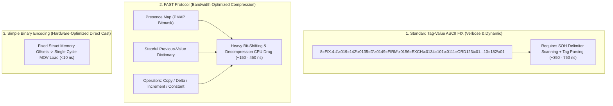

> [!summary]
> The Financial Information eXchange (FIX) protocol is the universal standard for global financial messaging. While legacy Tag-Value ASCII FIX and compressed FAST (FIX Adapted for STreaming) enabled widespread institutional interoperability, their high CPU parsing overhead (250–800ns) led low-latency trading venues to replace them with zero-copy binary protocols like SBE and OUCH.

---

## Why it matters
Every institutional broker, crossing network, and clearing house supports FIX (typically FIX 4.2 or 4.4). Even in proprietary high-frequency trading firms with custom binary gateways, FIX remains mandatory for **Drop Copy, institutional client DMA routing, and middle-office post-trade clearing**.

Understanding FIX framing, fast delimiter scanning, and the historical mechanics of FAST compression provides critical insight into why modern exchanges migrated from bandwidth-optimized protocols to **CPU-optimized binary standards**.



---

## Mechanism

### 1. Anatomy of Standard Tag-Value ASCII FIX
A standard FIX message consists of key-value pairs separated by the non-printable ASCII `0x01` (SOH - Start of Header) character:

$$\text{Tag Number} = \text{Field Value} \ \mathbf{\backslash x01}$$

- **Standard Header**:
  - `8=FIX.4.4\x01` (BeginString: Protocol Version)
  - `9=128\x01` (BodyLength: Number of bytes from Tag 35 up to Tag 10)
  - `35=D\x01` (MsgType: e.g. `'D'` = NewOrderSingle, `'8'` = ExecutionReport)
  - `49=SENDER\x0156=TARGET\x0134=101\x0152=20260822-14:00:00.123\x01`
- **Business Body**:
  - `11=ORD_99\x0155=AAPL\x0154=1\x0138=100\x0144=150.50\x0140=2\x01...`
- **Standard Trailer**:
  - `10=182\x01` (CheckSum: Modulo 256 sum of all preceding bytes in message)

### 2. FAST (FIX Adapted for STreaming) Mechanics
FAST was standardized by ITU-T (Recommendation V.761) to compress market data over low-bandwidth telecommunications links:
1. **Presence Map (PMAP)**: A leading bitmask where each bit indicates whether a specific field is present or modified in the current message.
2. **Field Operators**:
   - `Copy`: If bit is 0 in PMAP, use the value from the previous message in the dictionary.
   - `Delta`: Transmit only the mathematical difference from the previous message.
   - `Increment`: Value automatically increases by $+1$ (used for sequence numbers).
   - `Constant`: Field value is fixed in the XML template and never transmitted over the wire.
3. **Stop-Bit Encoding**: Integers are encoded in 7-bit chunks where the Most Significant Bit (MSB, Bit 7) is set to `1` on the final byte of the integer.

### 3. Why the Industry Abandoned FAST for SBE
- **The 2005 Bandwidth Context**: 1 Mbps T1 lines were expensive; saving bytes was worth spending CPU decompression cycles.
- **The Modern Colocation Reality**: 10G and 25G optical fiber links provide gigabytes of cheap bandwidth. Spending 250ns of CPU time decoding stateful FAST dictionaries creates an unacceptable latency drag. SBE was built to trade bandwidth for **zero CPU decompression time**.

---

## In Practice

### High-Speed FIX Checksum & Fast Tag-Value Parser in C++20

```cpp
#include <cstdint>
#include <string_view>
#include <iostream>
#include <cstring>

class FastFixParser {
public:
    static constexpr char SOH = '\x01';

    // Computes FIX Modulo-256 Checksum in <15 nanoseconds
    static inline uint8_t compute_fix_checksum(const char* buf, size_t len) noexcept {
        uint32_t sum = 0;
        for (size_t i = 0; i < len; ++i) {
            sum += static_cast<uint8_t>(buf[i]);
        }
        return static_cast<uint8_t>(sum & 0xFF);
    }

    // Fast inline tag lookup by scanning SOH delimiters
    static std::string_view get_tag_value(std::string_view fix_msg, std::string_view target_tag) noexcept {
        // Target pattern: e.g. "\x0135=" or "35=" at start
        std::string search_pattern;
        search_pattern.reserve(target_tag.size() + 2);
        search_pattern.push_back(SOH);
        search_pattern.append(target_tag);
        search_pattern.push_back('=');

        size_t pos = fix_msg.find(search_pattern);
        if (pos == std::string_view::npos) {
            // Check if tag is at the very beginning of the message
            if (fix_msg.starts_with(target_tag) && fix_msg.size() > target_tag.size() && fix_msg[target_tag.size()] == '=') {
                pos = 0;
                size_t val_start = target_tag.size() + 1;
                size_t val_end = fix_msg.find(SOH, val_start);
                return fix_msg.substr(val_start, val_end - val_start);
            }
            return "";
        }

        size_t val_start = pos + search_pattern.size();
        size_t val_end = fix_msg.find(SOH, val_start);
        if (val_end == std::string_view::npos) return "";

        return fix_msg.substr(val_start, val_end - val_start);
    }
};
```

---

## Numbers

*Hardware Baseline: AMD EPYC Genoa / Intel Xeon Sapphire Rapids @ 4.0 GHz.*

| Protocol / Codec | Average Message Size | Decode Time per Message | Primary CPU Bottleneck |
| :--- | :--- | :--- | :--- |
| **Simple Binary Encoding (SBE)**| **72 Bytes** | **~6–12 ns** | Single-cycle `MOV` instructions |
| **FAST Protocol (Decompressed)**| **32 Bytes (Compressed)**| **~180–420 ns** | PMAP bit-shifts + dictionary lookup |
| **Optimized ASCII FIX (SIMD)** | **240 Bytes** | **~120–280 ns** | AVX2 delimiter scan + ASCII parse |
| **Naive ASCII FIX (`strtok/std`)**| **240 Bytes** | **~650–1,800 ns** | String allocation + heap copies |

---

## Trade-offs

| Protocol Standard | Strengths | Operational Vulnerabilities |
| :--- | :--- | :--- |
| **Tag-Value ASCII FIX** | Universal industry adoption; human-readable in network logs. | High CPU serialization cost; large network bandwidth footprint. |
| **FAST Protocol** | Extreme bandwidth compression ratio (~80% size reduction). | **Stateful dictionary dependency**: dropped packet corrupts all subsequent messages! |
| **Binary SBE** | Sub-10ns zero-copy performance; stateless schema evolution. | Larger wire footprint than FAST; non-human-readable without schema tools. |

---

> [!warning] Gotchas
> 1. **The FAST Stateful Dictionary Crash Hazard**: Because FAST maintains running state in internal dictionaries (e.g. `Copy` and `Delta` operators), if a single UDP packet is dropped and not immediately detected, all subsequent messages will decompress using corrupted dictionary base values, silently corrupting the entire order book!
> 2. **Tag Number Ambiguity in Custom Repeating Groups**: Standard Tag-Value FIX does not specify the end of a repeating group with an explicit closing tag. Parsers determine the end of a group entry when they encounter a repeated leading tag or a tag that is not part of the group definition, requiring complex branching in naive parsers.

---

## Lab
**Objective**: Build a FIX message validator in C++ that computes Modulo-256 checksums, extracts `MsgType (35)`, `ClOrdID (11)`, and `Price (44)` across 1,000,000 ASCII FIX strings, and benchmarks parsing speed.

**Success Criteria**:
1. Compute and verify Modulo-256 checksums for 1,000,000 FIX messages.
2. Extract required business tags without performing a single dynamic heap allocation (`std::string`).
3. Verify that parsing latency is **under 150 nanoseconds** per message.

---

> [!question]- Self-test
> 1. **How is the standard FIX message Checksum (Tag 10) calculated and formatted?**
>    *Answer*: The FIX checksum is calculated by taking the sum of all ASCII byte values in the message starting from the very first character of `8=FIX...` up to and including the SOH delimiter immediately preceding `10=`. The total sum is modulo-reduced by 256 ($\text{Sum} \pmod{256}$) and formatted as a 3-character zero-padded string (e.g. `10=082\x01`).
> 2. **What is a Presence Map (PMAP) in the FAST protocol?**
>    *Answer*: A Presence Map (PMAP) is a bitmask prepended to a FAST message where each bit corresponds to a field defined in the XML template. A bit value of `1` indicates that the field is present on the wire and must be decoded, while a bit value of `0` instructs the decoder to omit the field or apply a default/copy operator from the previous dictionary entry.
> 3. **Why is a stateful compression protocol like FAST dangerous for real-time market data over UDP Multicast?**
>    *Answer*: In FAST, decoding a message often depends on dictionary state established by previous messages (e.g., using `Copy` or `Delta` operators). If a UDP packet is lost on the network, the decoder's internal dictionary falls out of synchronization, causing all subsequent received messages to decompress with mathematically corrupted prices and quantities until a full dictionary reset occurs.

---

## Related
- [[10 - Protocols & Codecs/CME MDP 3.0 and Simple Binary Encoding SBE]]
- [[10 - Protocols & Codecs/NASDAQ OUCH 4.2 Protocol Specification]]
- [[10 - Protocols & Codecs/SIMD-Accelerated Text Parsing]]
- [[02 - Exchange Architecture/Drop Copy and Clearing Feeds]]
- [[10 - Protocols & Codecs/MOC - 10 Protocols & Codecs]]

## Sources
- [[Sources/FIX Protocol Standards - FIX 4.4 Specification]]
- [[Sources/ITU-T Recommendation V.761 - FAST Protocol Specification]]
- [[Sources/How to Build an Exchange by Jane Street]]
