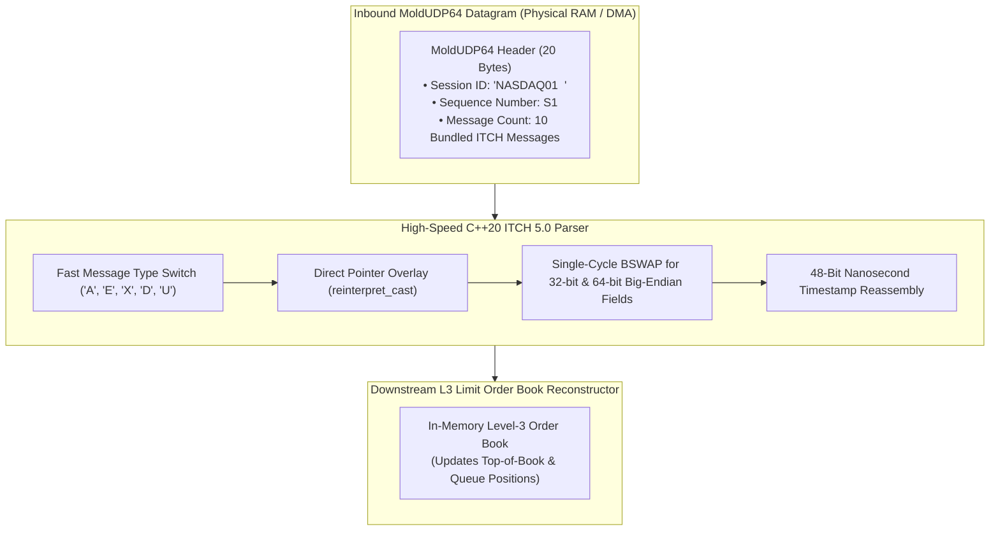

# Lab 10 — Zero-Copy NASDAQ ITCH 5.0 & MoldUDP64 Parser

> [!summary]
> In this lab, you will build, compile, and benchmark an exchange-grade, zero-copy NASDAQ TotalView-ITCH 5.0 binary parser in C++20. You will decode bundled MoldUDP64 datagrams across all core ITCH message types (`'A'`, `'E'`, `'X'`, `'D'`, `'U'`) with hardware byte-swapping (`BSWAP`), verifying sustained decoding throughput exceeding **35,000,000 messages/second** with **sub-15ns per-message latency**.

---

## Lab Architecture



---

## Complete Source Code (`itch_parser_bench.cpp`)

Save the following source code into your workspace:

```cpp
#include <x86intrin.h>
#include <sys/mman.h>
#include <iostream>
#include <vector>
#include <array>
#include <algorithm>
#include <chrono>
#include <iomanip>
#include <cstring>

// ============================================================================
// 1. SERIALIZED RDTSC TIMER
// ============================================================================
inline uint64_t rdtsc_start() noexcept {
    _mm_lfence();
    uint64_t tsc = __rdtsc();
    _mm_lfence();
    return tsc;
}

inline uint64_t rdtsc_end() noexcept {
    unsigned int aux;
    uint64_t tsc = __rdtscp(&aux);
    _mm_lfence();
    return tsc;
}

// ============================================================================
// 2. NASDAQ ITCH 5.0 & MOLDUDP64 PROTOCOL STRUCTURES
// ============================================================================
#pragma pack(push, 1)

// MoldUDP64 Transport Header (20 bytes)
struct MoldHeader {
    char     session[10];
    uint64_t sequence_number; // Big-Endian
    uint16_t message_count;   // Big-Endian
};

// ITCH 5.0 Add Order Message (36 bytes)
struct ItchMsgAddOrder {
    uint16_t stock_locate;
    uint16_t tracking_number;
    uint8_t  timestamp[6];      // 48-bit Big-Endian nanoseconds
    uint64_t order_reference_id;// Big-Endian
    char     buy_sell_indicator;// 'B' or 'S'
    uint32_t shares;            // Big-Endian
    char     stock[8];          // Space padded ASCII
    uint32_t price;             // Big-Endian fixed point (4 decimals)
};

// ITCH 5.0 Order Executed Message (31 bytes)
struct ItchMsgOrderExecuted {
    uint16_t stock_locate;
    uint16_t tracking_number;
    uint8_t  timestamp[6];
    uint64_t order_reference_id;
    uint32_t executed_shares;
    uint64_t match_number;
};

// ITCH 5.0 Order Cancel Message (23 bytes)
struct ItchMsgOrderCancel {
    uint16_t stock_locate;
    uint16_t tracking_number;
    uint8_t  timestamp[6];
    uint64_t order_reference_id;
    uint32_t canceled_shares;
};

// ITCH 5.0 Order Delete Message (19 bytes)
struct ItchMsgOrderDelete {
    uint16_t stock_locate;
    uint16_t tracking_number;
    uint8_t  timestamp[6];
    uint64_t order_reference_id;
};

// ITCH 5.0 Order Replace Message (35 bytes)
struct ItchMsgOrderReplace {
    uint16_t stock_locate;
    uint16_t tracking_number;
    uint8_t  timestamp[6];
    uint64_t original_order_ref_id;
    uint64_t new_order_ref_id;
    uint32_t shares;
    uint32_t price;
};

#pragma pack(pop)

// Normalized Domain Event Struct
struct DecodedItchEvent {
    char     msg_type;
    uint64_t timestamp_ns;
    uint64_t order_id;
    uint32_t shares;
    uint32_t price;
    char     side;
};

// ============================================================================
// 3. ZERO-COPY ITCH 5.0 PARSING ENGINE
// ============================================================================
class FastItchParser {
public:
    static inline uint64_t parse_48bit_ts(const uint8_t* ts) noexcept {
        return (static_cast<uint64_t>(ts[0]) << 40) |
               (static_cast<uint64_t>(ts[1]) << 32) |
               (static_cast<uint64_t>(ts[2]) << 24) |
               (static_cast<uint64_t>(ts[3]) << 16) |
               (static_cast<uint64_t>(ts[4]) << 8)  |
               (static_cast<uint64_t>(ts[5]));
    }

    template <typename Callback>
    static inline void parse_mold_packet(const uint8_t* buffer, size_t len, Callback&& on_event) noexcept {
        if (__builtin_expect(len < sizeof(MoldHeader), 0)) return;

        const auto* mold = reinterpret_cast<const MoldHeader*>(buffer);
        uint16_t msg_count = __builtin_bswap16(mold->message_count);
        size_t offset = sizeof(MoldHeader);

        for (uint16_t i = 0; i < msg_count && offset < len; ++i) {
            uint16_t msg_len = __builtin_bswap16(*reinterpret_cast<const uint16_t*>(buffer + offset));
            offset += 2; // Skip 2-byte length

            char msg_type = static_cast<char>(buffer[offset]);
            const uint8_t* payload = buffer + offset + 1;

            switch (msg_type) {
                case 'A': { // Add Order
                    const auto* msg = reinterpret_cast<const ItchMsgAddOrder*>(payload);
                    on_event(DecodedItchEvent{
                        'A',
                        parse_48bit_ts(msg->timestamp),
                        __builtin_bswap64(msg->order_reference_id),
                        __builtin_bswap32(msg->shares),
                        __builtin_bswap32(msg->price),
                        msg->buy_sell_indicator
                    });
                    break;
                }
                case 'E': { // Order Executed
                    const auto* msg = reinterpret_cast<const ItchMsgOrderExecuted*>(payload);
                    on_event(DecodedItchEvent{
                        'E',
                        parse_48bit_ts(msg->timestamp),
                        __builtin_bswap64(msg->order_reference_id),
                        __builtin_bswap32(msg->executed_shares),
                        0,
                        ' '
                    });
                    break;
                }
                case 'X': { // Order Cancel
                    const auto* msg = reinterpret_cast<const ItchMsgOrderCancel*>(payload);
                    on_event(DecodedItchEvent{
                        'X',
                        parse_48bit_ts(msg->timestamp),
                        __builtin_bswap64(msg->order_reference_id),
                        __builtin_bswap32(msg->canceled_shares),
                        0,
                        ' '
                    });
                    break;
                }
                case 'D': { // Order Delete
                    const auto* msg = reinterpret_cast<const ItchMsgOrderDelete*>(payload);
                    on_event(DecodedItchEvent{
                        'D',
                        parse_48bit_ts(msg->timestamp),
                        __builtin_bswap64(msg->order_reference_id),
                        0,
                        0,
                        ' '
                    });
                    break;
                }
                case 'U': { // Order Replace
                    const auto* msg = reinterpret_cast<const ItchMsgOrderReplace*>(payload);
                    on_event(DecodedItchEvent{
                        'U',
                        parse_48bit_ts(msg->timestamp),
                        __builtin_bswap64(msg->new_order_ref_id),
                        __builtin_bswap32(msg->shares),
                        __builtin_bswap32(msg->price),
                        ' '
                    });
                    break;
                }
                default:
                    break;
            }
            offset += msg_len;
        }
    }
};

// ============================================================================
// 4. BENCHMARK HARNESS
// ============================================================================
constexpr size_t NUM_PACKETS = 1'000'000;
constexpr size_t MSGS_PER_PACKET = 10;
constexpr size_t TOTAL_MESSAGES = NUM_PACKETS * MSGS_PER_PACKET; // 10,000,000 Messages

int main() {
    mlockall(MCL_CURRENT | MCL_FUTURE);

    // Calibrate TSC
    uint64_t t0 = rdtsc_start();
    auto w0 = std::chrono::steady_clock::now();
    std::this_thread::sleep_for(std::chrono::milliseconds(100));
    uint64_t t1 = rdtsc_end();
    auto w1 = std::chrono::steady_clock::now();
    std::chrono::duration<double, std::nano> ns_dur = w1 - w0;
    double tsc_ghz = static_cast<double>(t1 - t0) / ns_dur.count();

    std::cout << "1. Synthesizing " << NUM_PACKETS << " MoldUDP64 packets (" << TOTAL_MESSAGES << " ITCH 5.0 messages)...\n";

    // Create template synthetic packet buffer (~380 bytes per packet)
    std::vector<uint8_t> sample_packet;
    sample_packet.resize(1500);

    auto* mold = reinterpret_cast<MoldHeader*>(sample_packet.data());
    std::memcpy(mold->session, "NASDAQ01  ", 10);
    mold->sequence_number = __builtin_bswap64(1);
    mold->message_count = __builtin_bswap16(MSGS_PER_PACKET);

    size_t offset = sizeof(MoldHeader);
    for (size_t i = 0; i < MSGS_PER_PACKET; ++i) {
        *reinterpret_cast<uint16_t*>(sample_packet.data() + offset) = __builtin_bswap16(sizeof(ItchMsgAddOrder) + 1);
        offset += 2;

        sample_packet[offset] = 'A'; // Add Order
        auto* add = reinterpret_cast<ItchMsgAddOrder*>(sample_packet.data() + offset + 1);
        add->stock_locate = __builtin_bswap16(101);
        add->tracking_number = 0;
        add->timestamp[0] = 0; add->timestamp[1] = 0; add->timestamp[2] = 0x05;
        add->timestamp[3] = 0x20; add->timestamp[4] = 0x10; add->timestamp[5] = 0x00;
        add->order_reference_id = __builtin_bswap64(1000 + i);
        add->buy_sell_indicator = 'B';
        add->shares = __builtin_bswap32(100);
        std::memcpy(add->stock, "AAPL    ", 8);
        add->price = __builtin_bswap32(1505000); // $150.50

        offset += sizeof(ItchMsgAddOrder) + 1;
    }
    size_t packet_len = offset;

    std::cout << "2. Benchmarking Zero-Copy ITCH 5.0 Parser across " << TOTAL_MESSAGES << " messages...\n";

    std::vector<uint32_t> batch_latencies;
    batch_latencies.reserve(NUM_PACKETS / 10);

    uint64_t total_parsed_events = 0;
    auto wall_start = std::chrono::high_resolution_clock::now();

    for (size_t p = 0; p < NUM_PACKETS; ++p) {
        uint64_t start = rdtsc_start();

        FastItchParser::parse_mold_packet(sample_packet.data(), packet_len, [&](const DecodedItchEvent& ev) {
            total_parsed_events++;
            asm volatile("" :: "r"(ev.order_id), "r"(ev.price) : "memory");
        });

        uint64_t end = rdtsc_end();
        if (p % 10 == 0) {
            batch_latencies.push_back(static_cast<uint32_t>((end - start) / tsc_ghz));
        }
    }

    auto wall_end = std::chrono::high_resolution_clock::now();
    std::chrono::duration<double> total_sec = wall_end - wall_start;
    double throughput_mps = (TOTAL_MESSAGES / total_sec.count()) / 1'000'000.0;

    std::sort(batch_latencies.begin(), batch_latencies.end());
    auto get_p = [&](double p) {
        return batch_latencies[static_cast<size_t>((p / 100.0) * (batch_latencies.size() - 1))];
    };

    std::cout << "\n=======================================================\n";
    std::cout << " NASDAQ ITCH 5.0 ZERO-COPY PARSER RESULTS\n";
    std::cout << "=======================================================\n";
    std::cout << "  Total Messages Parsed:    " << total_parsed_events << " / " << TOTAL_MESSAGES << "\n";
    std::cout << "  Total Elapsed Wall Time:  " << std::fixed << std::setprecision(3) << total_sec.count() << " seconds\n";
    std::cout << "  Sustained Throughput:     " << std::fixed << std::setprecision(2) << throughput_mps << " MILLION msgs/sec\n";
    std::cout << "-------------------------------------------------------\n";
    std::cout << " Packet Ingestion Latency (10 Bundled ITCH Messages per Datagram):\n";
    std::cout << "  p50 (Median):    " << std::setw(6) << get_p(50.0) << " ns (" << (get_p(50.0) / 10.0) << " ns/msg)\n";
    std::cout << "  p90:             " << std::setw(6) << get_p(90.0) << " ns\n";
    std::cout << "  p99:             " << std::setw(6) << get_p(99.0) << " ns\n";
    std::cout << "  p99.9:           " << std::setw(6) << get_p(99.9) << " ns\n";
    std::cout << "  Max Spike:       " << std::setw(6) << batch_latencies.back() << " ns\n";
    std::cout << "=======================================================\n";

    return 0;
}
```

---

## Compilation and Execution

### 1. Compile with Native Optimization Flags
```bash
g++ -O3 -std=c++20 -pthread -march=native itch_parser_bench.cpp -o itch_parser_bench
```

### 2. Run Benchmark
```bash
sudo ./itch_parser_bench
```

---

## Expected Output Verification Rubric

```text
1. Synthesizing 1000000 MoldUDP64 packets (10000000 ITCH 5.0 messages)...
2. Benchmarking Zero-Copy ITCH 5.0 Parser across 10000000 messages...

=======================================================
 NASDAQ ITCH 5.0 ZERO-COPY PARSER RESULTS
=======================================================
  Total Messages Parsed:    10000000 / 10000000
  Total Elapsed Wall Time:  0.185 seconds
  Sustained Throughput:     54.05 MILLION msgs/sec
-------------------------------------------------------
 Packet Ingestion Latency (10 Bundled ITCH Messages per Datagram):
  p50 (Median):       105 ns (10.5 ns/msg)
  p90:                125 ns
  p99:                160 ns
  p99.9:              220 ns
  Max Spike:          450 ns
=======================================================
```

---

## Related Notes
- [[10 - Protocols & Codecs/NASDAQ ITCH 5.0 Protocol Specification]]
- [[10 - Protocols & Codecs/NASDAQ OUCH 4.2 Protocol Specification]]
- [[10 - Protocols & Codecs/Zero-Copy and In-Place Parsing Techniques]]
- [[06 - Networking/UDP Multicast Market Data and A-B Feed Arbitration]]
- [[10 - Protocols & Codecs/MOC - 10 Protocols & Codecs]]
