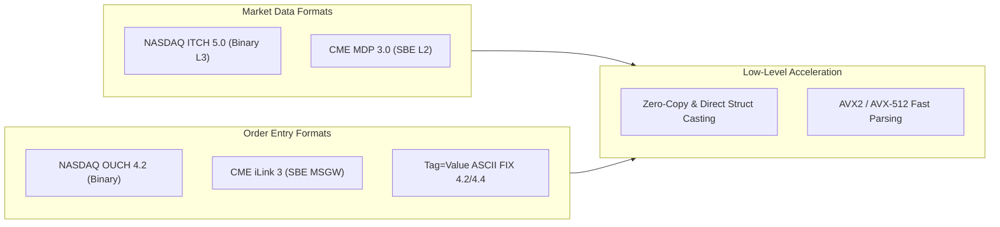

# MOC — 10 Protocols & Codecs

Financial wire protocols: binary framing, zero-copy deserialization, SIMD string parsing, FIX engines, and NASDAQ/CME formats.

---

## Core Concepts
- [[10 - Protocols & Codecs/NASDAQ ITCH 5.0 Protocol Specification]] — Binary packet framing, MoldUDP64, message formats ('A', 'E', 'X', 'D', 'U'), 48-bit timestamps.
- [[10 - Protocols & Codecs/NASDAQ OUCH 4.2 Protocol Specification]] — Order entry binary protocol, tokenized client order IDs, Enter/Cancel/Replace, inbound/outbound sequence tracking.
- [[10 - Protocols & Codecs/CME MDP 3.0 and Simple Binary Encoding SBE]] — SBE framing, schema evolution, repeating groups, decimal fixed-point mantissa/exponent, Template 46.
- [[10 - Protocols & Codecs/CME iLink 3 Binary Order Entry]] — MSGW architecture, SBE session layer, SOFH transport headers, NewOrderSingle (Template 514).
- [[10 - Protocols & Codecs/FIX Protocol and Fast Encoding FAST]] — Tag=Value parsing, SOH delimiter scanning, Modulo-256 checksums, FAST PMAP compression.
- [[10 - Protocols & Codecs/Zero-Copy and In-Place Parsing Techniques]] — Direct pointer casting, unaligned split-cache penalties, `BSWAP` intrinsics, `-fno-strict-aliasing`.
- [[10 - Protocols & Codecs/SIMD-Accelerated Text Parsing]] — Vectorized ASCII-to-integer conversion (`_mm_maddubs_epi16`), AVX2 delimiter scanning (`_mm256_cmpeq_epi8`).

## Labs & Implementations
- [[10 - Protocols & Codecs/Lab - 10 Zero-Copy NASDAQ ITCH 5.0 Parser]] — Build an allocation-free, in-place C++20 ITCH parser decoding >35M messages/sec.

## Drills & War Stories
- [[10 - Protocols & Codecs/Drill - 10 Wire Protocol Parsing and Field Decoding]] — Decode raw hex packet captures (ITCH, OUCH, SBE Template 46, FIX) into domain events.

## Canonical Sources
- [[Sources/NASDAQ TotalView-ITCH 5.0 Specification]] — Official binary market data specification.
- [[Sources/NASDAQ OUCH 4.2 Specification]] — Official binary order entry specification.
- [[Sources/CME Simple Binary Encoding SBE Specification]] — High-performance binary format specification.
- [[Sources/CME iLink 3 Binary Order Entry Specification]] — Derivatives binary order gateway specification.
