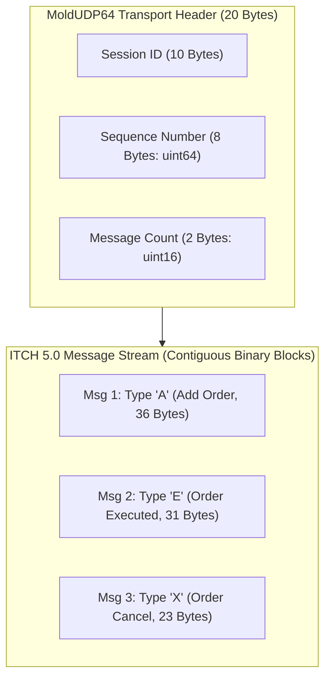

> [!summary]
> NASDAQ TotalView-ITCH 5.0 is the direct, order-by-order (Level-3) market data protocol for NASDAQ-listed equities. Transmitted over MoldUDP64 multicast transport, ITCH 5.0 delivers fixed-offset binary messages representing every quote addition, execution, cancellation, and cross auction uncrossing with nanosecond timestamps.

---

## Why it matters
In high-frequency equity trading, ITCH 5.0 is the primary market data feed used by automated market makers to reconstruct the exact, full-depth limit order book.

Unlike aggregated Level-2 feeds (which publish only the sum of volume at each price level):
- ITCH delivers **individual order events tagged with unique 64-bit Order Reference IDs**.
- Algorithms track their **exact queue position** down to the single share.
- Because ITCH 5.0 uses **fixed-offset binary structs**, a C++ feed handler decodes incoming packets via direct pointer casting with **zero memory copies in under 15 nanoseconds**.



---

## Mechanism

### 1. MoldUDP64 Transport Layer Framing
ITCH packets are framed inside the **MoldUDP64** protocol header:
- **Session (10 bytes ASCII)**: Identifies the active market data session.
- **Sequence Number (8 bytes Big-Endian `uint64_t`)**: The sequence number of the *first* message in the payload.
- **Message Count (2 bytes Big-Endian `uint16_t`)**: The number of ITCH messages bundled inside this UDP datagram ($0 \implies \text{Heartbeat}$).

### 2. Core ITCH 5.0 Message Types

| Type | Name | Payload Size | Key Fields | Trading Purpose |
| :--- | :--- | :--- | :--- | :--- |
| **`'A'`** | **Add Order (No MPID)** | 36 Bytes | `OrderRefID`, `Side`, `Shares`, `Stock`, `Price` | New resting limit order placed in book. |
| **`'F'`** | **Add Order (With MPID)**| 40 Bytes | Same as `'A'` + `Attribution (MPID: 4 chars)` | Attributed quote from designated market maker. |
| **`'E'`** | **Order Executed** | 31 Bytes | `OrderRefID`, `ExecutedShares`, `MatchNumber` | Resting order matched at displayed price. |
| **`'C'`** | **Order Executed (Price)**| 36 Bytes | `OrderRefID`, `ExecutedShares`, `MatchNumber`, `Printable`, `Price` | Resting order matched at non-displayed price. |
| **`'X'`** | **Order Cancel** | 23 Bytes | `OrderRefID`, `CanceledShares` | Partial quantity reduction of resting order. |
| **`'D'`** | **Order Delete** | 19 Bytes | `OrderRefID` | Order completely removed from the book. |
| **`'U'`** | **Order Replace** | 35 Bytes | `OrigOrderRefID`, `NewOrderRefID`, `Shares`, `Price` | Order price/size modified (loses queue priority).|
| **`'Q'`** | **Cross Trade** | 40 Bytes | `Shares`, `Stock`, `CrossPrice`, `CrossType` | Opening / Closing Cross mass execution print. |
| **`'I'`** | **NOII Imbalance** | 50 Bytes | `PairedShares`, `ImbalanceShares`, `NearPrice`, `FarPrice` | Net Order Imbalance Indicator for auction. |

### 3. Binary Byte Layout & Timestamping
- **Timestamps (6 Bytes / 48-bit Big-Endian Integer)**: Represents nanoseconds since midnight EDT ($0 \text{ to } 86,400,000,000,000\text{ ns}$).
- **Prices (4 Bytes / 32-bit Big-Endian Integer)**: Fixed-point integer with 4 implied decimal places ($\$100.50 \implies 1,005,000$).

---

## In Practice

### High-Speed Zero-Copy ITCH 5.0 Packet Parser in C++20

```cpp
#include <cstdint>
#include <cstring>
#include <iostream>
#include <arpa/inet.h>

#pragma pack(push, 1)
// MoldUDP64 Header (20 bytes)
struct MoldHeader {
    char     session[10];
    uint64_t sequence_number;
    uint16_t message_count;
};

// ITCH 5.0 Add Order Message (36 bytes)
struct ItchMsgAddOrder {
    uint16_t stock_locate;
    uint16_t tracking_number;
    uint8_t  timestamp[6]; // 48-bit integer
    uint64_t order_reference_id;
    char     side;         // 'B' or 'S'
    uint32_t shares;
    char     stock[8];
    uint32_t price;        // Fixed point (4 decimals)
};

// ITCH 5.0 Order Executed Message (31 bytes)
struct ItchMsgOrderExecuted {
    uint16_t stock_locate;
    uint16_t tracking_number;
    uint8_t  timestamp[6];
    uint64_t order_reference_id;
    uint32_t executed_shares;
    uint64_t match_number;
};
#pragma pack(pop)

class ItchParser {
public:
    // Extract 48-bit Big-Endian timestamp into uint64_t nanoseconds
    static inline uint64_t parse_48bit_timestamp(const uint8_t* ts) noexcept {
        return (static_cast<uint64_t>(ts[0]) << 40) |
               (static_cast<uint64_t>(ts[1]) << 32) |
               (static_cast<uint64_t>(ts[2]) << 24) |
               (static_cast<uint64_t>(ts[3]) << 16) |
               (static_cast<uint64_t>(ts[4]) << 8)  |
               (static_cast<uint64_t>(ts[5]));
    }

    // Ingests raw UDP packet buffer and parses bundled ITCH messages zero-copy
    static void parse_packet(const uint8_t* buffer, size_t len) noexcept {
        if (len < sizeof(MoldHeader)) return;

        const auto* mold = reinterpret_cast<const MoldHeader*>(buffer);
        uint16_t msg_count = __builtin_bswap16(mold->message_count);
        size_t offset = sizeof(MoldHeader);

        for (uint16_t i = 0; i < msg_count && offset < len; ++i) {
            uint16_t msg_len = __builtin_bswap16(*reinterpret_cast<const uint16_t*>(buffer + offset));
            offset += 2; // Skip 2-byte length header

            char msg_type = static_cast<char>(buffer[offset]);
            const uint8_t* payload = buffer + offset + 1;

            switch (msg_type) {
                case 'A': { // Add Order
                    const auto* add = reinterpret_cast<const ItchMsgAddOrder*>(payload);
                    uint64_t order_id = __builtin_bswap64(add->order_reference_id);
                    uint32_t shares = __builtin_bswap32(add->shares);
                    uint32_t price = __builtin_bswap32(add->price);
                    uint64_t ts_ns = parse_48bit_timestamp(add->timestamp);
                    // Pass to L3 order book...
                    break;
                }
                case 'E': { // Order Executed
                    const auto* exec = reinterpret_cast<const ItchMsgOrderExecuted*>(payload);
                    uint64_t order_id = __builtin_bswap64(exec->order_reference_id);
                    uint32_t shares = __builtin_bswap32(exec->executed_shares);
                    // Pass to L3 order book...
                    break;
                }
                default:
                    break;
            }
            offset += msg_len;
        }
    }
};
```

---

## Numbers

*Hardware Baseline: Intel Xeon Sapphire Rapids @ 4.0 GHz.*

| ITCH 5.0 Parsing Stage | Latency per Message | Instructions Executed |
| :--- | :--- | :--- |
| **MoldUDP64 Header Parse** | **~2–3 ns** | 4–6 instructions (`bswap16`, `bswap64`) |
| **Message Type Dispatch (`switch`)**| **~1–2 ns** | Single jump table / direct branch |
| **Struct Cast & Field Decode** | **~4–8 ns** | Single-cycle `BSWAP` opcodes |
| **48-Bit Timestamp Reassembly** | **~2–4 ns** | Bitwise shift and OR operations |
| **Total Message Decode Overhead** | **~9–17 ns** | **>60M messages/sec Throughput** |

---

## Trade-offs

| Protocol Feature | Advantage | Engineering Constraint |
| :--- | :--- | :--- |
| **Order-by-Order Level 3** | Exact queue position tracking; full market visibility. | Requires large in-memory hash tables / arrays for order IDs. |
| **Fixed-Offset Binary Structs** | Sub-15ns parsing; zero string manipulation. | Big-endian requires explicit byte-swapping on Little-Endian x86. |
| **48-Bit Timestamp Format** | Saves 2 bytes per message over 10Gbps multicast lines. | Requires custom 6-byte bit-shifting logic. |

---

> [!warning] Gotchas
> 1. **The 2-Byte Mold Length Header Trap**: Inside a MoldUDP64 packet, every ITCH message is preceded by a **2-byte Big-Endian message length header**. Failing to advance the buffer pointer past these 2 bytes causes the parser to read the length as the message type, corrupting all subsequent message offsets in the packet.
> 2. **Stock Symbol Right-Padding**: ITCH symbols are 8-character ASCII fields padded on the right with spaces (`"AAPL    "`). If an algorithm forgets to trim trailing spaces before looking up symbols in a hash map, string comparisons will fail.

---

## Lab
**Objective**: Build an allocation-free C++20 ITCH 5.0 binary parser that ingests 10,000,000 synthetic ITCH messages ('A', 'E', 'X', 'D', 'U'), decodes fields zero-copy, and measures sustained message decoding throughput.

**Success Criteria**:
1. Ingest 10,000,000 ITCH 5.0 messages.
2. Measure per-message parsing latency using `rdtsc`.
3. Verify sustained parsing throughput exceeds **35,000,000 messages/second**.

---

> [!question]- Self-test
> 1. **What is the difference between an ITCH 5.0 Order Executed (`'E'`) message and an Order Executed with Price (`'C'`) message?**
>    *Answer*: An `'E'` message indicates that a resting limit order was matched at its displayed limit price; the message omits the price field because the price is already known from the original Add Order (`'A'`) message. A `'C'` message indicates that a resting order was executed at a *different, non-displayed price* (e.g. a midpoint trade or price-improved cross), and therefore explicitly includes a 4-byte execution price field.
> 2. **Why does ITCH 5.0 use a 48-bit (6-byte) integer for timestamps instead of a standard 64-bit (8-byte) integer?**
>    *Answer*: An 8-byte integer is unnecessarily large for representing nanoseconds in a single trading day ($86.4\text{ trillion nanoseconds} \approx 2^{46.3}$ bits). Using a 6-byte integer accommodates up to $2.81 \times 10^{14}$ nanoseconds (over 3 days) while saving 2 bytes of network bandwidth per message across billions of multicast packets transmitted daily.
> 3. **How does MoldUDP64 handle packet framing and how does a receiver detect sequence gaps?**
>    *Answer*: The MoldUDP64 header contains a 64-bit starting sequence number and a 16-bit message count. If a client receives a MoldUDP64 packet whose sequence number is greater than the client's expected sequence number ($S_{\text{received}} > S_{\text{expected}}$), the client immediately detects that intermediate UDP packets were lost and initiates an A/B feed arbitration recovery or TCP historical replay request.

---

## Related
- [[10 - Protocols & Codecs/NASDAQ OUCH 4.2 Protocol Specification]]
- [[10 - Protocols & Codecs/CME MDP 3.0 and Simple Binary Encoding SBE]]
- [[10 - Protocols & Codecs/Zero-Copy and In-Place Parsing Techniques]]
- [[06 - Networking/UDP Multicast Market Data and A-B Feed Arbitration]]
- [[10 - Protocols & Codecs/MOC - 10 Protocols & Codecs]]

## Sources
- [[Sources/NASDAQ TotalView-ITCH 5.0 Specification]]
- [[Sources/MoldUDP64 Protocol Specification]]
- [[Sources/How to Build an Exchange by Jane Street]]
