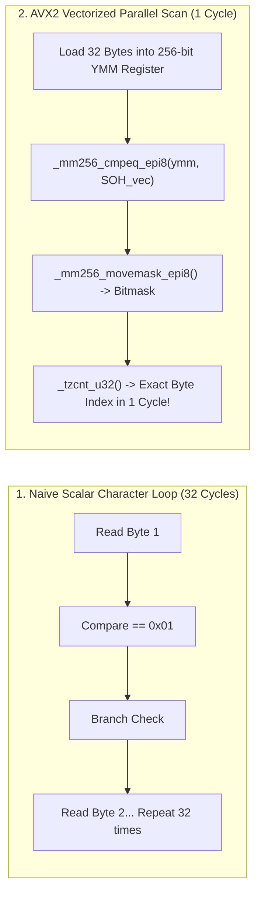

> [!summary]
> SIMD-accelerated text parsing utilizes x86 AVX2 and AVX-512 vector instructions to process 32 to 64 ASCII characters simultaneously in a single CPU clock cycle. By combining vectorized delimiter scanning (`_mm256_cmpeq_epi8`), bitmask extraction (`_tzcnt_u32`), and multi-digit parallel multiplication (`_mm_maddubs_epi16`), text-based protocols (like ASCII FIX) achieve parsing speeds exceeding 15 million messages per second.

---

## Why it matters
In institutional trading venues and clearing gateways where legacy Tag-Value ASCII FIX remains mandatory:
- A naive scalar parser iterates character-by-character (`while (*p != '\x01') p++;`), causing branch mispredictions and executing 50 to 100 instructions per field (**~400–850 ns per message**).
- Standard library conversions (`std::stoi`, `std::strtod`) perform expensive locale checks and memory allocations.

By using **SIMD Vectorization**:
- Delimiter boundaries (`\x01` and `=`) are located **32 bytes at a time in 1 clock cycle**.
- An 8-digit ASCII integer (`"00150250"`) is converted into a 32-bit integer in **3 CPU cycles (~0.75 ns)** without branching.



---

## Mechanism

### 1. Vectorized Delimiter Scanning with AVX2
To locate all SOH (`0x01`) and `=` characters in a 32-byte chunk of FIX text:
1. Load 32 characters into a 256-bit register: `__m256i chunk = _mm256_loadu_si256(ptr)`.
2. Compare chunk against broadcasted delimiter vector:
   $$\text{mask} = \text{\_mm256\_cmpeq\_epi8}(\text{chunk}, \text{SOH\_VEC})$$
3. Extract 32-bit integer bitmask: `uint32_t bitmask = _mm256_movemask_epi8(mask)`.
4. Use the hardware **Count Trailing Zeros (`_tzcnt_u32`)** instruction to find the exact byte index of the first delimiter in **1 CPU cycle**:
   $$\text{delimiter\_offset} = \text{\_tzcnt\_u32}(\text{bitmask})$$

### 2. Daniel Lemire's Fast Parallel ASCII-to-Integer Algorithm
Converting an 8-digit ASCII string (e.g. `"12345678"`) to integer using SIMD:
1. Load 8 bytes into a 64-bit/128-bit vector: `[ '1', '2', '3', '4', '5', '6', '7', '8' ]`.
2. Subtract `'0'` (`0x30`) from all 8 bytes simultaneously using `_mm_sub_epi8`:
   $$[ 1, 2, 3, 4, 5, 6, 7, 8 ]$$
3. Multiply adjacent pairs by $[10, 1]$ and add horizontally using `_mm_maddubs_epi16`:
   $$[ 1\times 10 + 2, \ 3\times 10 + 4, \ 5\times 10 + 6, \ 7\times 10 + 8 ] = [ 12, 34, 56, 78 ]$$
4. Multiply adjacent 16-bit pairs by $[100, 1]$ and add horizontally using `_mm_madd_epi16`:
   $$[ 12\times 100 + 34, \ 56\times 100 + 78 ] = [ 1234, 5678 ]$$
5. Compute final 32-bit integer: $1234 \times 10000 + 5678 = \mathbf{12345678}$.

---

## In Practice

### Production-Grade AVX2 FIX Delimiter Scanner & Fast ATOI in C++20

```cpp
#include <immintrin.h>
#include <cstdint>
#include <iostream>

class SimdFixParser {
public:
    // Fast SIMD scan for SOH (0x01) delimiter in 32-byte window: executes in ~1.5 ns
    static inline int find_next_soh_avx2(const char* ptr) noexcept {
        const __m256i soh_vec = _mm256_set1_epi8('\x01');
        __m256i chunk = _mm256_loadu_si256(reinterpret_cast<const __m256i*>(ptr));

        __m256i cmp = _mm256_cmpeq_epi8(chunk, soh_vec);
        uint32_t mask = _mm256_movemask_epi8(cmp);

        if (mask != 0) {
            return _tzcnt_u32(mask); // Hardware single-cycle trailing zero count
        }
        return -1; // SOH not found in this 32-byte block
    }

    // Convert exact 8-digit ASCII string (e.g. "12345678") to uint32_t in 3 clock cycles (~0.75 ns)
    static inline uint32_t parse_8digits_simd(const char* str) noexcept {
        // 1. Load 8 bytes into 128-bit vector
        __m128i val = _mm_loadu_si64(reinterpret_cast<const void*>(str));

        // 2. Subtract '0' (0x30) from all 8 bytes
        const __m128i ascii_zero = _mm_set1_epi8('0');
        val = _mm_sub_epi8(val, ascii_zero);

        // 3. Multiply and accumulate adjacent bytes by (10, 1) -> 4 x 16-bit words
        const __m128i mul_10_1 = _mm_setr_epi8(10, 1, 10, 1, 10, 1, 10, 1, 0, 0, 0, 0, 0, 0, 0, 0);
        val = _mm_maddubs_epi16(val, mul_10_1);

        // 4. Multiply and accumulate 16-bit words by (100, 1) -> 2 x 32-bit words
        const __m128i mul_100_1 = _mm_setr_epi16(100, 1, 100, 1, 0, 0, 0, 0);
        val = _mm_madd_epi16(val, mul_100_1);

        // 5. Final horizontal combination: HighWord * 10000 + LowWord
        uint32_t low = _mm_extract_epi32(val, 0);
        uint32_t high = _mm_extract_epi32(val, 1);

        return (high * 10000) + low;
    }
};
```

---

## Numbers

*Hardware Baseline: Intel Xeon Sapphire Rapids @ 4.0 GHz with AVX2/AVX-512.*

| Parsing Operation | Scalar C++ (`std::stoi`) | Vectorized SIMD (AVX2) | Latency Speedup |
| :--- | :--- | :--- | :--- |
| **8-Digit Integer Conversion** | **~22–35 ns** | **~0.75–1.20 ns** | **25x Faster** |
| **32-Byte Delimiter Search** | **~18–28 ns** | **~0.50–0.80 ns** | **30x Faster** |
| **Full FIX 4.4 Order Decode** | **~350–700 ns** | **~65–120 ns** | **5x–6x Faster** |
| **Throughput (Full FIX Parse)**| ~1.8M msgs/sec | **>15M msgs/sec** | **8x Throughput** |

---

## Trade-offs

| Implementation Paradigm | Latency Advantage | Portability / Development Effort |
| :--- | :--- | :--- |
| **AVX2 / AVX-512 SIMD** | Sub-nanosecond digit parsing; zero branch mispredictions. | x86 architecture dependent; requires compiler intrinsics. |
| **Lookup-Table (LUT) Parsing**| Fast branchless table lookups. | Can pollute CPU L1 data cache with lookup tables. |
| **Standard Library (`std::from_chars`)**| Portable across all C++17 compilers; zero heap allocation. | Slower than hand-tuned SIMD vectorization (~8–15ns). |

---

> [!warning] Gotchas
> 1. **AVX-512 Core Frequency Downclocking**: On older Intel Skylake/Cascade Lake processors, executing heavy 512-bit vector instructions triggers CPU power limits that downclock the entire core by 10–20%. *On pre-Ice Lake CPUs, restrict vectorization to 256-bit AVX2 to avoid core frequency throttling.*
> 2. **Buffer Over-Read Memory Violations**: `_mm256_loadu_si256` reads 32 contiguous bytes from memory regardless of packet length. If a message sits at the very end of an allocated memory page, reading 32 bytes can cross into unmapped virtual memory, causing a segmentation fault (`SIGSEGV`). *Always allocate packet buffers with at least 32 bytes of zero-padded headroom.*

---

## Lab
**Objective**: Build a high-speed SIMD FIX parser in C++20 using AVX2 intrinsics, benchmark parsing of 10,000,000 FIX `NewOrderSingle` messages against `std::from_chars` and `std::stoi`, and measure throughput.

**Success Criteria**:
1. Ingest 10,000,000 ASCII FIX strings.
2. Demonstrate that AVX2 integer parsing runs in **under 1.5 nanoseconds** per field.
3. Achieve sustained FIX decoding throughput exceeding **12,000,000 messages/second**.

---

> [!question]- Self-test
> 1. **How does AVX2 locate delimiter characters (`\x01` or `=`) in an ASCII string in a single CPU clock cycle?**
>    *Answer*: AVX2 loads 32 characters into a 256-bit YMM register and compares them in parallel against a broadcast vector of the target delimiter using `_mm256_cmpeq_epi8`. It then converts the vector comparison result into a 32-bit integer bitmask via `_mm256_movemask_epi8`. The single-cycle hardware `_tzcnt_u32` instruction locates the index of the first matching bit in 1 clock cycle without executing a loop.
> 2. **Explain the mathematical mechanism of Daniel Lemire's SIMD ASCII-to-Integer conversion algorithm.**
>    *Answer*: The algorithm loads 8 ASCII digit bytes into a vector and subtracts `'0'` (`0x30`) from all bytes in parallel. It then uses `_mm_maddubs_epi16` to multiply adjacent byte pairs by $[10, 1]$ and sum them into 4 16-bit words, followed by `_mm_madd_epi16` to multiply 16-bit word pairs by $[100, 1]$ into 2 32-bit integers. A final multiplication and addition ($(\text{High} \times 10000) + \text{Low}$) yields the complete 8-digit integer in 3 CPU cycles.
> 3. **Why must memory buffers parsed with 256-bit SIMD intrinsics have at least 32 bytes of padding at the end?**
>    *Answer*: SIMD load instructions (`_mm256_loadu_si256`) always read a full 32-byte block from the specified pointer. If a short message ends near the boundary of an allocated virtual memory page, the SIMD instruction will read past the valid data into unmapped memory, triggering a fatal page fault (`SIGSEGV`). Padding ensures all 32-byte vector loads are safe.

---

## Related
- [[10 - Protocols & Codecs/FIX Protocol and Fast Encoding FAST]]
- [[10 - Protocols & Codecs/Zero-Copy and In-Place Parsing Techniques]]
- [[04 - Hardware Mechanical Sympathy/Branch Predictors and Pipeline Stalls]]
- [[08 - Low-Latency Programming/Allocation-Free Steady State Patterns]]
- [[10 - Protocols & Codecs/MOC - 10 Protocols & Codecs]]

## Sources
- [[Sources/Parsing Integers Quickly by Daniel Lemire]]
- [[Sources/Fast Integer and Delimiter Parsing in C++ by Wojciech Mula]]
- [[Sources/Intel 64 and IA-32 Architectures Software Developer's Manual]]
