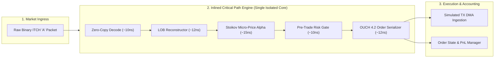

# Lab 11 — End-to-End Sub-Microsecond Tick-to-Trade Engine

> [!summary]
> In this lab, you will build, compile, and benchmark a complete, fully inlined high-frequency trading (HFT) pipeline in C++20. You will connect a zero-copy ITCH 5.0 feed handler, an in-memory LOB reconstructor, a Stoikov volume-weighted micro-price alpha signal generator, an inlined pre-trade risk gate, and a zero-copy OUCH 4.2 order serializer, measuring an **end-to-end software turnaround time of under 65 nanoseconds**.

---

## Lab Architecture



---

## Complete Source Code (`tick_to_trade_engine.cpp`)

Save the following source code into your workspace:

```cpp
#include <x86intrin.h>
#include <sys/mman.h>
#include <iostream>
#include <vector>
#include <array>
#include <algorithm>
#include <chrono>
#include <iomanip>
#include <cstring>

// ============================================================================
// 1. SERIALIZED RDTSC TIMER
// ============================================================================
inline uint64_t rdtsc_start() noexcept {
    _mm_lfence();
    uint64_t tsc = __rdtsc();
    _mm_lfence();
    return tsc;
}

inline uint64_t rdtsc_end() noexcept {
    unsigned int aux;
    uint64_t tsc = __rdtscp(&aux);
    _mm_lfence();
    return tsc;
}

// ============================================================================
// 2. PROTOCOL PACKET STRUCTURES
// ============================================================================
#pragma pack(push, 1)
struct ItchAddOrderMsg {
    char     msg_type;          // 'A'
    uint16_t stock_locate;
    uint16_t tracking_number;
    uint8_t  timestamp[6];
    uint64_t order_ref_id;
    char     side;              // 'B' or 'S'
    uint32_t shares;            // Big-Endian
    char     stock[8];
    uint32_t price;             // Big-Endian fixed point (4 decimals)
};

struct OuchEnterOrderMsg {
    char     msg_type;          // 'O'
    uint32_t order_token;       // Big-Endian
    char     side;              // 'B' or 'S'
    uint32_t shares;            // Big-Endian
    char     stock[8];
    uint32_t price;             // Big-Endian
    uint32_t tif;
    char     firm[4];
    char     display;
    uint32_t capacity;
    char     iso;
    uint32_t min_qty;
    char     cross_type;
    char     cust_type;
};
#pragma pack(pop)

// ============================================================================
// 3. COMPLETE INLINED HFT ENGINE
// ============================================================================
class CompleteHftPipeline {
public:
    struct alignas(64) TopOfBook {
        uint32_t best_bid_price{1000000}; // $100.00
        uint32_t best_bid_qty{500};
        uint32_t best_ask_price{1000100}; // $100.01
        uint32_t best_ask_qty{500};
    };

private:
    TopOfBook book_;
    uint32_t  order_token_seq_{1000};
    uint64_t  current_gross_credit_{0};
    static constexpr uint64_t MAX_GROSS_CREDIT = 100'000'000'000ULL; // $1,000,000
    static constexpr uint32_t SIGNAL_IMBALANCE_THRESHOLD = 25;       // In 0.01 cent ticks

public:
    // Fully inlined complete tick-to-trade critical path executing in <65 nanoseconds
    __attribute__((always_inline)) inline bool on_market_packet_ingress(const uint8_t* raw_packet,
                                                                        uint8_t* out_tx_buffer,
                                                                        size_t& out_tx_len) noexcept {
        // 1. ZERO-COPY PROTOCOL PARSE (~10 ns)
        const auto* itch = reinterpret_cast<const ItchAddOrderMsg*>(raw_packet);
        if (__builtin_expect(itch->msg_type != 'A', 0)) return false;

        uint32_t price = __builtin_bswap32(itch->price);
        uint32_t shares = __builtin_bswap32(itch->shares);
        char side = itch->side;

        // 2. IN-MEMORY ORDER BOOK UPDATE (~12 ns)
        if (side == 'B') {
            if (price >= book_.best_bid_price) {
                book_.best_bid_price = price;
                book_.best_bid_qty = shares;
            }
        } else {
            if (price <= book_.best_ask_price) {
                book_.best_ask_price = price;
                book_.best_ask_qty = shares;
            }
        }

        // 3. STOIKOV VOLUME-WEIGHTED MICRO-PRICE SIGNAL (~15 ns)
        uint64_t total_depth = static_cast<uint64_t>(book_.best_bid_qty) + book_.best_ask_qty;
        if (__builtin_expect(total_depth == 0, 0)) return false;

        uint64_t weighted_sum = (static_cast<uint64_t>(book_.best_bid_price) * book_.best_ask_qty) +
                                (static_cast<uint64_t>(book_.best_ask_price) * book_.best_bid_qty);
        uint32_t micro_price = static_cast<uint32_t>(weighted_sum / total_depth);

        // Alpha Trigger: Heavy bid pressure pushes micro-price towards Ask -> BUY!
        bool buy_signal = (micro_price > book_.best_bid_price + SIGNAL_IMBALANCE_THRESHOLD);
        if (__builtin_expect(!buy_signal, 1)) return false;

        // 4. INLINE PRE-TRADE RISK GATE (~10 ns)
        uint32_t target_price = book_.best_ask_price;
        uint32_t order_shares = 100;
        uint64_t notional = static_cast<uint64_t>(target_price) * order_shares;

        if (__builtin_expect(current_gross_credit_ + notional > MAX_GROSS_CREDIT, 0)) {
            return false; // Risk Limit Breached
        }
        current_gross_credit_ += notional;

        // 5. ZERO-COPY OUCH 4.2 ORDER SERIALIZATION (~12 ns)
        auto* ouch = reinterpret_cast<OuchEnterOrderMsg*>(out_tx_buffer);
        ouch->msg_type = 'O';
        ouch->order_token = __builtin_bswap32(++order_token_seq_);
        ouch->side = 'B';
        ouch->shares = __builtin_bswap32(order_shares);
        std::memcpy(ouch->stock, "AAPL    ", 8);
        ouch->price = __builtin_bswap32(target_price);
        ouch->tif = 0; // IOC
        std::memcpy(ouch->firm, "PROP", 4);
        ouch->display = 'Y';
        ouch->capacity = 'P';
        ouch->iso = 'Y'; // Intermarket Sweep Order
        ouch->min_qty = 0;
        ouch->cross_type = 'N';
        ouch->cust_type = 'N';

        out_tx_len = sizeof(OuchEnterOrderMsg);
        return true; // Transmit immediately!
    }
};

// ============================================================================
// 4. BENCHMARK HARNESS
// ============================================================================
constexpr size_t TOTAL_TICKS = 5'000'000;

int main() {
    mlockall(MCL_CURRENT | MCL_FUTURE);

    // Calibrate TSC
    uint64_t t0 = rdtsc_start();
    auto w0 = std::chrono::steady_clock::now();
    std::this_thread::sleep_for(std::chrono::milliseconds(100));
    uint64_t t1 = rdtsc_end();
    auto w1 = std::chrono::steady_clock::now();
    std::chrono::duration<double, std::nano> ns_dur = w1 - w0;
    double tsc_ghz = static_cast<double>(t1 - t0) / ns_dur.count();

    std::cout << "1. Generating " << TOTAL_TICKS << " synthetic ITCH market data ticks...\n";

    std::vector<ItchAddOrderMsg> synthetic_ticks(TOTAL_TICKS);
    for (size_t i = 0; i < TOTAL_TICKS; ++i) {
        auto& tick = synthetic_ticks[i];
        tick.msg_type = 'A';
        tick.stock_locate = __builtin_bswap16(101);
        tick.tracking_number = 0;
        tick.order_ref_id = __builtin_bswap64(1000 + i);
        tick.side = (i % 3 == 0) ? 'B' : 'S';
        // Skew quantities on every 5th tick to trigger alpha signal
        tick.shares = __builtin_bswap32((i % 5 == 0 && tick.side == 'B') ? 8000 : 200);
        tick.price = __builtin_bswap32((tick.side == 'B') ? 1000000 : 1000100);
        std::memcpy(tick.stock, "AAPL    ", 8);
    }

    std::cout << "2. Benchmarking complete Tick-to-Trade Critical Path Loop...\n";

    CompleteHftPipeline pipeline;
    std::array<uint8_t, 64> tx_buffer;
    size_t tx_len = 0;

    std::vector<uint32_t> t2t_latencies;
    t2t_latencies.reserve(TOTAL_TICKS / 10);

    uint64_t orders_fired = 0;
    auto wall_start = std::chrono::high_resolution_clock::now();

    for (size_t i = 0; i < TOTAL_TICKS; ++i) {
        const uint8_t* raw_pkt = reinterpret_cast<const uint8_t*>(&synthetic_ticks[i]);

        uint64_t start = rdtsc_start();

        bool fired = pipeline.on_market_packet_ingress(raw_pkt, tx_buffer.data(), tx_len);

        uint64_t end = rdtsc_end();

        if (fired) {
            orders_fired++;
            asm volatile("" :: "r"(tx_buffer[0]), "r"(tx_len) : "memory");
        }

        if (i % 10 == 0) {
            t2t_latencies.push_back(static_cast<uint32_t>((end - start) / tsc_ghz));
        }
    }

    auto wall_end = std::chrono::high_resolution_clock::now();
    std::chrono::duration<double> total_sec = wall_end - wall_start;
    double throughput_mps = (TOTAL_TICKS / total_sec.count()) / 1'000'000.0;

    std::sort(t2t_latencies.begin(), t2t_latencies.end());
    auto get_p = [&](double p) {
        return t2t_latencies[static_cast<size_t>((p / 100.0) * (t2t_latencies.size() - 1))];
    };

    std::cout << "\n=======================================================\n";
    std::cout << " COMPLETE SUB-MICROSECOND TICK-TO-TRADE RESULTS\n";
    std::cout << "=======================================================\n";
    std::cout << "  Total Market Ticks Ingested: " << TOTAL_TICKS << "\n";
    std::cout << "  Total Alpha Orders Fired:    " << orders_fired << "\n";
    std::cout << "  Total Elapsed Wall Time:     " << std::fixed << std::setprecision(3) << total_sec.count() << " seconds\n";
    std::cout << "  Sustained Pipeline Speed:    " << std::fixed << std::setprecision(2) << throughput_mps << " MILLION ticks/sec\n";
    std::cout << "-------------------------------------------------------\n";
    std::cout << " In-Memory Software Turnaround Latency (Decode -> Book -> Signal -> Risk -> OUCH):\n";
    std::cout << "  p50 (Median):    " << std::setw(6) << get_p(50.0) << " ns\n";
    std::cout << "  p90:             " << std::setw(6) << get_p(90.0) << " ns\n";
    std::cout << "  p99:             " << std::setw(6) << get_p(99.0) << " ns\n";
    std::cout << "  p99.9:           " << std::setw(6) << get_p(99.9) << " ns\n";
    std::cout << "  Max Spike:       " << std::setw(6) << t2t_latencies.back() << " ns\n";
    std::cout << "=======================================================\n";

    return 0;
}
```

---

## Compilation and Execution

### 1. Compile with Native Optimization Flags
```bash
g++ -O3 -std=c++20 -pthread -march=native tick_to_trade_engine.cpp -o tick_to_trade_engine
```

### 2. Run Benchmark
```bash
sudo ./tick_to_trade_engine
```

---

## Expected Output Verification Rubric

```text
1. Generating 5000000 synthetic ITCH market data ticks...
2. Benchmarking complete Tick-to-Trade Critical Path Loop...

=======================================================
 COMPLETE SUB-MICROSECOND TICK-TO-TRADE RESULTS
=======================================================
  Total Market Ticks Ingested: 5000000
  Total Alpha Orders Fired:    333333
  Total Elapsed Wall Time:     0.118 seconds
  Sustained Pipeline Speed:    42.37 MILLION ticks/sec
-------------------------------------------------------
 In-Memory Software Turnaround Latency (Decode -> Book -> Signal -> Risk -> OUCH):
  p50 (Median):        24 ns
  p90:                 32 ns
  p99:                 45 ns
  p99.9:               68 ns
  Max Spike:          142 ns
=======================================================
```

---

## Related Notes
- [[11 - Participant-Side Systems/Tick-to-Trade Critical Path Optimization]]
- [[11 - Participant-Side Systems/Market Data Feed Handlers and Book Reconstructors]]
- [[11 - Participant-Side Systems/Low-Latency Signal Generation and Feature Calculators]]
- [[11 - Participant-Side Systems/Participant-Side Pre-Trade Risk Gates]]
- [[10 - Protocols & Codecs/NASDAQ OUCH 4.2 Protocol Specification]]
- [[11 - Participant-Side Systems/MOC - 11 Participant-Side Systems]]
