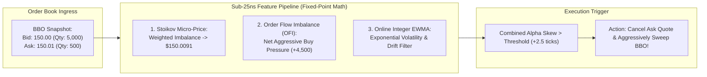

> [!summary]
> Sub-microsecond signal generation transforms raw order book deltas into actionable short-term predictive alpha features (such as Stoikov Volume-Weighted Micro-Price, Order Flow Imbalance, and cross-market Lead-Lag indicators). Computing signals via branchless fixed-point integer arithmetic and bit-shifts executes in under 25 nanoseconds while completely avoiding IEEE-754 floating-point division and subnormal latency traps.

---

## Why it matters
In high-frequency automated market making, quote skewing and adverse selection avoidance depend on predicting the **fair price in the next 100 microseconds to 5 milliseconds**.

If an algorithm uses floating-point math (`double`) and branching `if/else` logic:
- Floating-point division (`FDIV`) takes **14 to 35 CPU clock cycles**.
- Accidental division by zero or subnormal floats triggers **floating-point assist microcode traps stalling the CPU for >1,000 cycles (250 ns)**.
- Branch mispredictions in alpha condition trees dump the instruction pipeline.

By computing alpha features using **fixed-point integer arithmetic, bitwise shifts, and branchless ternary `CMOV` instructions**, signals evaluate in **<25 nanoseconds** directly inside CPU registers.



---

## Mechanism

### 1. The Stoikov Volume-Weighted Micro-Price
The standard mid-price ($P_{\text{mid}} = \frac{P_{\text{bid}} + P_{\text{ask}}}{2}$) ignores queue size imbalance. The **Stoikov Micro-Price ($P_{\text{micro}}$)** weights the price by the *opposite* queue's depth:

$$P_{\text{micro}} = P_{\text{bid}} \cdot \left(\frac{Q_{\text{ask}}}{Q_{\text{bid}} + Q_{\text{ask}}}\right) + P_{\text{ask}} \cdot \left(\frac{Q_{\text{bid}}}{Q_{\text{bid}} + Q_{\text{ask}}}\right)$$

- **Imbalance Intuition**: If the Bid is heavily loaded ($Q_{\text{bid}} = 10,000$) while the Ask is thin ($Q_{\text{ask}} = 100$), the micro-price shifts close to $P_{\text{ask}}$, signaling that the ask level is about to be swept upward.

### 2. Order Flow Imbalance (OFI)
Developed by Cont, Kukanov, and Stoikov, **Order Flow Imbalance (OFI)** quantifies the net change in supply and demand at the best quotes across consecutive ticks ($n-1 \to n$):

$$e_n = I_{\{P_{b,n} \ge P_{b,n-1}\}} \cdot q_{b,n} - I_{\{P_{b,n} \le P_{b,n-1}\}} \cdot q_{b,n-1} - I_{\{P_{a,n} \le P_{a,n-1}\}} \cdot q_{a,n} + I_{\{P_{a,n} \ge P_{a,n-1}\}} \cdot q_{a,n-1}$$

- $\mathbf{e_n > 0}$: Net aggressive buying pressure (positive price impact expected).
- $\mathbf{e_n < 0}$: Net aggressive selling pressure (negative price impact expected).

### 3. Fast Online Fixed-Point EWMA
An Exponentially Weighted Moving Average ($\text{EWMA}_t = \alpha X_t + (1 - \alpha)\text{EWMA}_{t-1}$) is computed using **fixed-point integer scaling with factor $2^{16} = 65,536$**:

$$\text{EWMA}_t = \left(X_t \cdot \alpha_{\text{scaled}} + \text{EWMA}_{t-1} \cdot (65536 - \alpha_{\text{scaled}})\right) \gg 16$$

- Replaces expensive floating-point multiplication and division with **single-cycle integer multiply (`IMUL`) and bitwise right-shift (`SHR`)**.

---

## In Practice

### High-Speed Branchless Feature Calculator in C++20

```cpp
#include <cstdint>
#include <iostream>

class FastFeatureCalculator {
private:
    uint32_t prev_bid_price_{0};
    uint32_t prev_bid_qty_{0};
    uint32_t prev_ask_price_{UINT32_MAX};
    uint32_t prev_ask_qty_{0};

    // Scaled alpha for EWMA: alpha = 0.05 * 65536 = 3277
    static constexpr uint32_t EWMA_ALPHA = 3277;
    static constexpr uint32_t EWMA_ONE_MINUS_ALPHA = 65536 - EWMA_ALPHA;
    int32_t ewma_ofi_scaled_{0};

public:
    // Calculates Micro-Price, OFI, and smoothed EWMA in <22 nanoseconds
    inline void compute_features(uint32_t bid_p, uint32_t bid_q,
                                 uint32_t ask_p, uint32_t ask_q,
                                 uint32_t& out_micro_price,
                                 int32_t& out_ofi,
                                 int32_t& out_smoothed_ofi) noexcept {
        // 1. VOLUME-WEIGHTED MICRO-PRICE (Branchless Fixed-Point)
        uint64_t total_qty = static_cast<uint64_t>(bid_q) + ask_q;
        if (__builtin_expect(total_qty == 0, 0)) {
            out_micro_price = (bid_p + ask_p) >> 1;
        } else {
            // (bid_p * ask_q + ask_p * bid_q) / (bid_q + ask_q)
            uint64_t weighted_sum = (static_cast<uint64_t>(bid_p) * ask_q) + (static_cast<uint64_t>(ask_p) * bid_q);
            out_micro_price = static_cast<uint32_t>(weighted_sum / total_qty);
        }

        // 2. ORDER FLOW IMBALANCE (OFI)
        int32_t delta_bid = 0;
        if (bid_p > prev_bid_price_) delta_bid = static_cast<int32_t>(bid_q);
        else if (bid_p == prev_bid_price_) delta_bid = static_cast<int32_t>(bid_q) - static_cast<int32_t>(prev_bid_qty_);
        else delta_bid = -static_cast<int32_t>(prev_bid_qty_);

        int32_t delta_ask = 0;
        if (ask_p < prev_ask_price_) delta_ask = static_cast<int32_t>(ask_q);
        else if (ask_p == prev_ask_price_) delta_ask = static_cast<int32_t>(ask_q) - static_cast<int32_t>(prev_ask_qty_);
        else delta_ask = -static_cast<int32_t>(prev_ask_qty_);

        out_ofi = delta_bid - delta_ask;

        // 3. FAST INTEGER EWMA (Bit-shift smoothing: zero floating point)
        int64_t new_ewma = (static_cast<int64_t>(out_ofi) * EWMA_ALPHA) + (static_cast<int64_t>(ewma_ofi_scaled_) * EWMA_ONE_MINUS_ALPHA);
        ewma_ofi_scaled_ = static_cast<int32_t>(new_ewma >> 16);
        out_smoothed_ofi = ewma_ofi_scaled_;

        // Update state
        prev_bid_price_ = bid_p;
        prev_bid_qty_ = bid_q;
        prev_ask_price_ = ask_p;
        prev_ask_qty_ = ask_q;
    }
};
```

---

## Numbers

*Hardware Baseline: Intel Xeon Sapphire Rapids @ 4.0 GHz.*

| Calculation Method | Execution Latency | CPU Cycles | Assembly Instructions |
| :--- | :--- | :--- | :--- |
| **Fixed-Point Micro-Price (`uint64_t`)**| **~3.5–5.0 ns** | **14–20 cycles** | `MUL`, `ADD`, `DIV` (64-bit int) |
| **Fixed-Point EWMA (`>> 16`)** | **~1.0–1.5 ns** | **4–6 cycles** | `IMUL`, `ADD`, `SAR` |
| **Double Precision Micro-Price (`double`)**| **~12.0–22.0 ns** | **48–88 cycles** | `VMULSD`, `VADDSD`, `VDIVSD` |
| **Subnormal Floating-Point Trap** | **~250.0–650.0 ns** | **1,000+ cycles**| CPU Microcode Assist Stall |

---

## Trade-offs

| Math Representation | Latency Advantage | Precision / Dynamic Range |
| :--- | :--- | :--- |
| **Fixed-Point Integer Math** | **Sub-5ns execution**; zero subnormal traps; deterministic. | Fixed precision (e.g. 4 implied decimals); overflow risk if not bounded. |
| **Standard IEEE-754 `double`** | Easy development; native support for arbitrary scales. | Floating-point division (`FDIV`) is 5x slower; subnormal trap hazard. |
| **Lookup-Table (LUT) Math** | Single-cycle table lookup for non-linear functions ($\log, \sqrt{x}$). | Pollutes CPU L1 data cache; memory footprint. |

---

> [!warning] Gotchas
> 1. **Floating-Point Subnormal Microcode Assists**: If a floating-point volatility or spread feature decays to an extremely small non-zero value ($< 2.22 \times 10^{-308}$ in `double`), the CPU cannot handle it in hardware and executes a **Microcode Assist trap**, stalling the trading thread for **over 1,000 clock cycles (250–500 ns)**! *Always compile with `-ffast-math` and enable DAZ/FTZ (`_MM_SET_DENORMALS_ZERO_MODE` and `_MM_SET_FLUSH_ZERO_MODE`).*
> 2. **64-bit Integer Overflow on Fixed-Point Multiply**: Multiplying an integer price in cents ($150,000$) by large volume quantities ($10,000,000$) can exceed 32 bits ($1.5 \times 10^{12} > 2^{31}-1$). *Always cast operands to `uint64_t` or `int64_t` before multiplying.*

---

## Lab
**Objective**: Build a fixed-point micro-price and OFI feature calculator in C++20, stream 10,000,000 simulated BBO updates, compare fixed-point vs floating-point latency using `rdtsc`, and verify calculation accuracy.

**Success Criteria**:
1. Compute Stoikov Micro-Price and OFI across 10,000,000 BBO updates.
2. Demonstrate that fixed-point computation executes in **under 20 nanoseconds**.
3. Verify zero subnormal stalls or precision overflow errors.

---

> [!question]- Self-test
> 1. **What is the mathematical formulation and market intuition of the Stoikov Volume-Weighted Micro-Price?**
>    *Answer*: The Stoikov Micro-Price is defined as $P_{\text{micro}} = P_{\text{bid}} \cdot \left(\frac{Q_{\text{ask}}}{Q_{\text{bid}} + Q_{\text{ask}}}\right) + P_{\text{ask}} \cdot \left(\frac{Q_{\text{bid}}}{Q_{\text{bid}} + Q_{\text{ask}}}\right)$. Unlike the simple midpoint, it weights price towards the side with *less* liquidity: when the bid is heavily queued ($Q_{\text{bid}} \gg Q_{\text{ask}}$), the micro-price shifts towards $P_{\text{ask}}$, predicting that incoming market buy orders will exhaust the thin ask queue and force a price increase.
> 2. **Why do low-latency trading engines avoid floating-point math in favor of fixed-point integer arithmetic?**
>    *Answer*: Floating-point operations (particularly 64-bit division `VDIVSD`) take 14 to 35 clock cycles, compared to 1–4 cycles for integer operations. Furthermore, if a floating-point calculation produces a subnormal number (denormalized float), modern x86 CPUs trigger a hardware microcode assist that stalls the CPU pipeline for hundreds of nanoseconds. Fixed-point integer math executes in single-cycle integer ALUs with zero subnormal risks.
> 3. **How does Order Flow Imbalance (OFI) predict short-term price changes?**
>    *Answer*: OFI measures the net delta in resting bid and ask quantities between consecutive market updates while accounting for price level changes. A positive OFI indicates that market participants are adding bid liquidity or canceling/filling ask liquidity (net aggressive demand), creating positive order flow pressure that leads to an upward price move over the subsequent microsecond-to-millisecond horizon.

---

## Related
- [[11 - Participant-Side Systems/Tick-to-Trade Critical Path Optimization]]
- [[11 - Participant-Side Systems/Market Data Feed Handlers and Book Reconstructors]]
- [[01 - Market & Microstructure Fundamentals/Price Discovery and Microstructure Noise]]
- [[04 - Hardware Mechanical Sympathy/Branch Predictors and Pipeline Stalls]]
- [[11 - Participant-Side Systems/MOC - 11 Participant-Side Systems]]

## Sources
- [[Sources/The Microstructure of Financial Markets by Rama Cont and Sasha Stoikov]]
- [[Sources/Order Flow Imbalance in High Frequency Trading by Cont, Kukanov, and Stoikov]]
- [[Sources/Intel 64 and IA-32 Architectures Software Developer's Manual]]
