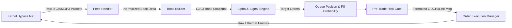

# MOC — 11 Participant-Side Systems

Architecture of high-frequency trading engines: tick-to-trade critical path, market data ingestion, book builders, alpha pipelines, queue position tracking, and execution managers.

---

## Core Concepts
- [[11 - Participant-Side Systems/Tick-to-Trade Critical Path Optimization]] — Step-by-step nanosecond latency budget from wire RX to wire TX, inlined single-thread architecture.
- [[11 - Participant-Side Systems/Market Data Feed Handlers and Book Reconstructors]] — Multicast stream normalization, flat price array LOBs, sub-5ns bit-scan BBO caching (`_tzcnt_u64`).
- [[11 - Participant-Side Systems/Low-Latency Signal Generation and Feature Calculators]] — Stoikov volume-weighted micro-price, Order Flow Imbalance (OFI), branchless fixed-point EWMA.
- [[11 - Participant-Side Systems/Order Queue Position Tracking and Fill Probability]] — Level-3 deterministic vs Level-2 proportional cancellation models, Poisson trade arrival fill probability estimators.
- [[11 - Participant-Side Systems/Smart Order Routing and Execution Algorithms]] — Fee-adjusted synthetic NBBO, Intermarket Sweep Orders (ISO), inverted venue queue positioning.
- [[11 - Participant-Side Systems/Participant-Side Pre-Trade Risk Gates]] — SEC 15c3-5 / CFTC 1.73 compliance, fat-finger filters, price collars, leaky-bucket throttles in <15ns.
- [[11 - Participant-Side Systems/Order State Management and Position Tracking]] — Direct Lookup Table (LUT) token mapping, in-flight cancel-vs-fill races, real-time Mark-to-Market PnL.

## Labs & Implementations
- [[11 - Participant-Side Systems/Lab - 11 End-to-End Sub-Microsecond Tick-to-Trade Engine]] — Build a complete inlined HFT pipeline (Feed Handler -> Book -> Signal -> Risk -> OUCH) with <65ns software turnaround.

## Drills & War Stories
- [[11 - Participant-Side Systems/Drill - 11 Tick-to-Trade Pipeline Bottleneck Hunting]] — Profile an end-to-end trading loop with `perf`, isolate 2.8µs tail spikes, and refactor for determinism.

## Canonical Sources
- [[Sources/The Microstructure of Financial Markets by Rama Cont and Sasha Stoikov]] — Foundational quantitative microstructure models.
- [[Sources/Trading and Exchanges by Larry Harris]] — Order queue priority and dealer economics.
- [[Sources/How to Build an Exchange by Jane Street]] — Production systems architecture in electronic trading.
