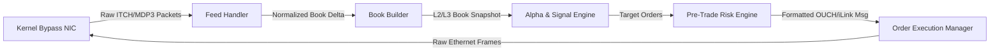

# MOC — 11 Participant-Side Systems

Architecture of high-frequency trading engines: tick-to-trade critical path, market data ingestion, book builders, alpha pipelines, and execution managers.

---

## Core Concepts
- [[Notes/Tick-to-Trade Critical Path Optimization]] — Step-by-step nanosecond latency budget from wire RX to wire TX.
- [[Notes/Market Data Feed Handlers]] — Multicast stream normalization, packet reconstruction, handling packet drops and snapshots.
- [[Notes/Participant-Side Order Book Reconstructors]] — Maintaining L2/L3 top-of-book caches optimized for strategy lookup.
- [[Notes/Signal Generation and Low-Latency Pricing]] — Microstructure alpha calculation, EWMA updates, branchless pricing formulas.
- [[Notes/Smart Order Routing and Execution Algorithms]] — Cross-venue routing, queue positioning, latency arbitrage defense.
- [[Notes/Pre-Trade Risk Gates for Participants]] — Maximum order size, position limits, fat-finger checks, circuit breakers in <20ns.
- [[Notes/Order State Management and Position Tracking]] — Tracking working orders, partial fills, cancel-replace states with zero allocation.

## Labs & Implementations
- [[Labs/Lab - 11 End-to-End Sub-Microsecond Tick-to-Trade Engine]] — Build a complete toy HFT pipeline (Feed Handler -> Book -> Signal -> Risk -> Outbound Order) with <500ns latency.

## Drills & War Stories
- [[Drills/Drill - 11 Tick-to-Trade Pipeline Bottleneck Hunting]] — Profile an end-to-end trading loop, isolate 2µs stalls, and refactor for determinism.
- [[Notes/War Story - The Desynchronized Book Self-Trade Fiasco]] — How an unhandled crossed-market packet caused an algorithm to execute against itself.

## Canonical Sources
- [[Sources/High Frequency Trading by Irene Aldridge]] — Quantitative and architectural foundations of HFT.
