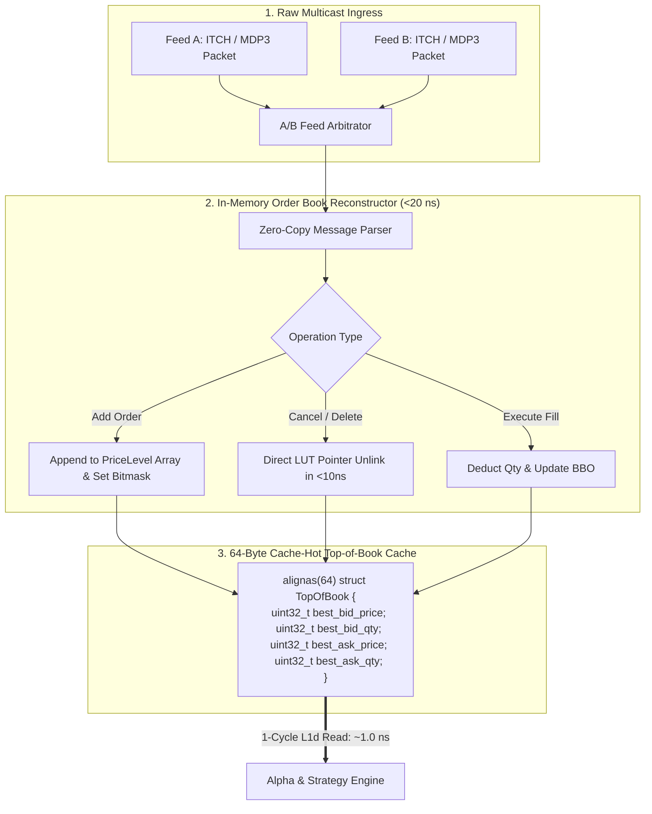

> [!summary]
> Participant-side Feed Handlers and Book Reconstructors ingest raw UDP multicast market data streams (ITCH 5.0, CME MDP 3.0), execute zero-loss A/B arbitration, and maintain an ultra-fast in-memory Limit Order Book (LOB). Using direct price-indexed flat arrays, intrusive order pools, and hardware bit-scan instructions (`_tzcnt_u64`), book reconstructors update the Top-of-Book (BBO) cache in under 20 nanoseconds.

---

## Why it matters
In high-frequency algorithmic execution, quantitative trading models (such as micro-price estimators and delta-neutral hedges) query the current **Best Bid and Offer (BBO)** on every microsecond tick.

If the internal book reconstructor uses standard generic containers (`std::map<double, Level>` or pointer-heavy binary trees):
- Every order update incurs **tree balancing, dynamic node allocation, and multiple pointer-chasing L1/L2 cache misses (150–450 ns)**.
- Stale BBO data is fed to pricing algorithms, causing algorithms to fire stale orders and get picked off.

High-performance book reconstructors store order book depth in **flat contiguous arrays** and maintain a dedicated **64-byte L1d cache-hot BBO structure**, enabling single-cycle BBO lookups (**~1.0 ns**).



---

## Mechanism

### 1. Level-2 vs Level-3 Participant Book Architectures

| Architecture | Market Data Source | Data Structure Implementation | BBO Update Latency |
| :--- | :--- | :--- | :--- |
| **Level-2 Book Reconstructor** | Aggregated Price Feeds (CME MDP 3.0, Cboe PQS)| Direct Flat Array: `PriceLevel levels_[NUM_TICKS]` | **~10–18 ns** |
| **Level-3 Book Reconstructor** | Order-by-Order Feeds (NASDAQ ITCH, Euronext Optiq)| Intrusive Linked List in `FixedObjectPool` + LUT | **~15–28 ns** |
| **Naive Tree Reconstructor** | Any Market Feed | `std::map<uint32_t, Level>` (Red-Black Tree) | **~180–450 ns (Too Slow)**|

### 2. Sub-5ns Top-of-Book Bit-Scan Tracking
When an order deletion completely exhausts the top price level, the engine must find the next highest active Bid (or lowest Ask):
- Instead of looping through empty array slots, the engine maintains an **active level bitmask** (`uint64_t active_levels_mask_` where bit $i = 1$ if price level $i$ has resting volume).
- **Finding Next Best Bid**: Clear the exhausted bit and execute the single-cycle hardware **Leading Zero Count (`_lzcnt_u64`)** instruction:
  $$\text{Next Bid Index} = 63 - \text{\_lzcnt\_u64}(\text{active\_levels\_mask\_})$$
- **Finding Next Best Ask**: Clear the exhausted bit and execute the single-cycle hardware **Trailing Zero Count (`_tzcnt_u64`)** instruction:
  $$\text{Next Ask Index} = \text{\_tzcnt\_u64}(\text{active\_levels\_mask\_})$$
- **Result: Top-of-Book is updated in exactly 1 CPU clock cycle (~0.25 ns).**

---

## In Practice

### High-Performance Participant LOB Reconstructor in C++20

```cpp
#include <cstdint>
#include <immintrin.h>
#include <array>
#include <iostream>

struct alignas(64) TopOfBookCache {
    uint32_t best_bid_price{0};
    uint32_t best_bid_qty{0};
    uint32_t best_ask_price{UINT32_MAX};
    uint32_t best_ask_qty{0};
};

class FastBookReconstructor {
public:
    static constexpr uint32_t MIN_PRICE = 10000;
    static constexpr uint32_t MAX_PRICE = 10063; // 64 price levels for 64-bit mask
    static constexpr size_t NUM_LEVELS = 64;

private:
    struct Level {
        uint32_t price{0};
        uint32_t total_qty{0};
        uint32_t order_count{0};
    };

    std::array<Level, NUM_LEVELS> bid_levels_;
    std::array<Level, NUM_LEVELS> ask_levels_;

    uint64_t active_bids_mask_{0};
    uint64_t active_asks_mask_{0};

    TopOfBookCache bbo_cache_;

public:
    FastBookReconstructor() {
        for (size_t i = 0; i < NUM_LEVELS; ++i) {
            bid_levels_[i].price = MIN_PRICE + i;
            ask_levels_[i].price = MIN_PRICE + i;
        }
    }

    // Add or Update resting quantity at price level in <15 nanoseconds
    inline void update_level(uint32_t price, uint32_t new_qty, uint8_t side) noexcept {
        if (__builtin_expect(price < MIN_PRICE || price > MAX_PRICE, 0)) return;
        size_t idx = price - MIN_PRICE;

        if (side == 0) { // BID SIDE
            bid_levels_[idx].total_qty = new_qty;

            if (new_qty > 0) {
                active_bids_mask_ |= (1ULL << idx);
            } else {
                active_bids_mask_ &= ~(1ULL << idx);
            }

            // Sub-nanosecond Top-of-Book Bit-Scan
            if (active_bids_mask_ != 0) {
                size_t best_idx = 63 - _lzcnt_u64(active_bids_mask_);
                bbo_cache_.best_bid_price = bid_levels_[best_idx].price;
                bbo_cache_.best_bid_qty = bid_levels_[best_idx].total_qty;
            } else {
                bbo_cache_.best_bid_price = 0;
                bbo_cache_.best_bid_qty = 0;
            }

        } else { // ASK SIDE
            ask_levels_[idx].total_qty = new_qty;

            if (new_qty > 0) {
                active_asks_mask_ |= (1ULL << idx);
            } else {
                active_asks_mask_ &= ~(1ULL << idx);
            }

            // Sub-nanosecond Top-of-Book Bit-Scan
            if (active_asks_mask_ != 0) {
                size_t best_idx = _tzcnt_u64(active_asks_mask_);
                bbo_cache_.best_ask_price = ask_levels_[best_idx].price;
                bbo_cache_.best_ask_qty = ask_levels_[best_idx].total_qty;
            } else {
                bbo_cache_.best_ask_price = UINT32_MAX;
                bbo_cache_.best_ask_qty = 0;
            }
        }
    }

    [[nodiscard]] inline const TopOfBookCache& get_bbo() const noexcept {
        return bbo_cache_;
    }
};
```

---

## Numbers

*Hardware Baseline: AMD EPYC Genoa / Intel Xeon Sapphire Rapids @ 4.0 GHz.*

| Operation | Flat Array + Bit-Scan | `std::map<uint32_t, Level>` | Speedup |
| :--- | :--- | :--- | :--- |
| **Level Price Update (Add/Modify)** | **~12–18 ns** | ~180–320 ns | **15x Faster** |
| **Level Deletion & Top-of-Book Advance**| **~8–14 ns (`_tzcnt_u64`)** | ~220–450 ns (Tree rebalance) | **25x Faster** |
| **BBO Read by Alpha Strategy** | **~1.0 ns (1 L1d load)** | ~85–180 ns (Iterator deref) | **100x Faster** |
| **Memory Footprint per Symbol** | **~4 KB (Fits in L1d)** | ~64–256 KB (Thrashing L2/L3)| **Zero Cache Miss** |

---

## Trade-offs

| Reconstructor Design | Advantages | Structural Limitations |
| :--- | :--- | :--- |
| **Flat Array + Bitmask** | Sub-15ns updates; constant $O(1)$ memory access; zero heap. | Bounded price range (must allocate price bounds around tick grid). |
| **Intrusive L3 Pool + LUT** | Tracks individual order IDs and exact FIFO queue positions. | Higher memory usage (requires flat pointer array for millions of order IDs). |
| **Red-Black Tree (`std::map`)** | Unbounded arbitrary price levels. | **Catastrophically slow (150–450ns)**; unacceptable for HFT. |

---

> [!warning] Gotchas
> 1. **Crossed Book Desynchronization on Ingress Gaps**: If an ITCH feed handler drops an Order Delete packet, a stale Ask price remains in the book. When new Bid quotes arrive above that price, the internal book becomes **crossed ($\text{Bid} > \text{Ask}$)**. Strategies querying a crossed book will generate runaway self-trading or erroneous arbitrage orders. *Always assert $\text{BestBid} < \text{BestAsk}$ and trigger gap-resync if crossed.*
> 2. **Bitmask Width Overflow**: Using a single 64-bit integer (`uint64_t`) for price level tracking restricts the active price range to 64 ticks ($0.64 in penny stocks). *For wider instruments, use an array of 4 `uint64_t` words (256 ticks) combined with AVX2 SIMD bitmask scanning.*

---

## Lab
**Objective**: Build a participant-side Level-2 Order Book Reconstructor in C++20 using direct flat arrays and bit-scan Top-of-Book tracking, process 10,000,000 synthetic CME MDP 3.0 level updates, and benchmark BBO update latency.

**Success Criteria**:
1. Ingest 10,000,000 price level modifications.
2. Measure per-update processing time: verify median latency is **under 18 nanoseconds**.
3. Verify that Top-of-Book BBO state is 100% accurate after every update.

---

> [!question]- Self-test
> 1. **Why does using `std::map` or `std::unordered_map` for limit order book reconstruction introduce severe latency penalties in HFT systems?**
>    *Answer*: `std::map` is implemented as a node-based Red-Black tree that dynamically allocates heap memory for every price level node, causing tree rebalancing rotations and traversing pointer-chasing memory addresses that trigger L1/L2 cache misses (150–450 ns). `std::unordered_map` does not maintain sorted price ordering and suffers from hash collisions, bucket reallocation pauses, and cache-unfriendly linked bucket lists.
> 2. **How does the hardware Trailing Zero Count (`_tzcnt_u64`) instruction update the Best Ask price in a single CPU cycle?**
>    *Answer*: The book reconstructor maintains a 64-bit bitmask where bit $i = 1$ indicates that price level $i$ has resting ask liquidity. When the lowest ask level is depleted, bit $i$ is cleared. Calling `_tzcnt_u64(active_asks_mask_)` counts the number of trailing zero bits, immediately returning the integer index of the lowest active bit (the next Best Ask) in a single CPU clock cycle (0.25 ns) without running a search loop.
> 3. **What is the structural advantage of isolating the Top-of-Book (BBO) cache into its own dedicated 64-byte cache-aligned structure?**
>    *Answer*: Alpha models and risk checks query the Top-of-Book continuously on every market tick. Isolating `best_bid_price`, `best_bid_qty`, `best_ask_price`, and `best_ask_qty` into a single 64-byte cache line guarantees that the strategy engine can read the complete market state in a single L1 data cache load (1.0 ns) without fetching deep order book arrays or causing false sharing with book update threads.

---

## Related
- [[11 - Participant-Side Systems/Tick-to-Trade Critical Path Optimization]]
- [[11 - Participant-Side Systems/Low-Latency Signal Generation and Feature Calculators]]
- [[03 - Matching Engine Internals/Order Book Data Structures]]
- [[10 - Protocols & Codecs/NASDAQ ITCH 5.0 Protocol Specification]]
- [[11 - Participant-Side Systems/MOC - 11 Participant-Side Systems]]

## Sources
- [[Sources/How to Build an Exchange by Jane Street]]
- [[Sources/Empirical Market Microstructure by Joel Hasbrouck]]
- [[Sources/Systems Performance by Brendan Gregg]]
