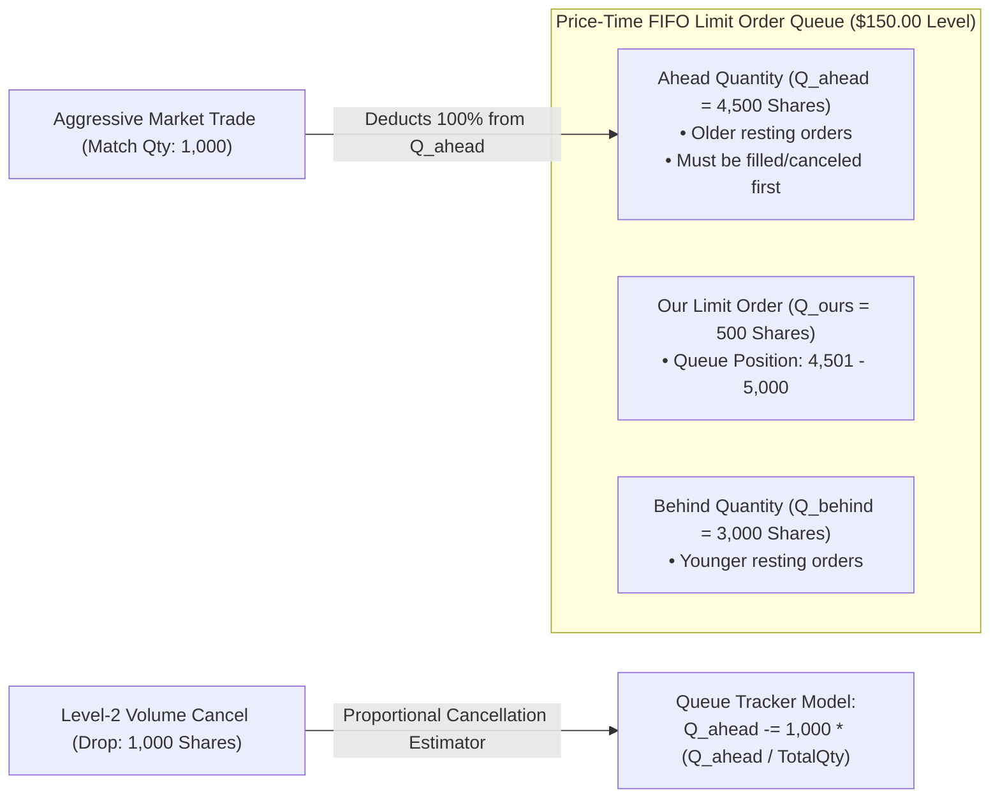

> [!summary]
> Order Queue Position Tracking enables market makers to estimate their exact priority ranking within a Price-Time FIFO limit order book price level. On Level-2 aggregated volume feeds (CME MDP 3.0), algorithmic queue trackers deploy proportional cancellation models and Poisson trade arrival estimators to calculate real-time Fill Probability ($P_{\text{fill}}$) and adverse selection risk in under 10 nanoseconds.

---

## Why it matters
In Price-Time Priority (FIFO) financial markets:
- Resting limit orders at the **head of the queue** have near-100% execution probability on the next price cross and experience virtually zero adverse selection.
- Resting limit orders at the **tail of the queue** only get filled when a massive aggressive sweep eats through the entire price level—meaning the market is violently moving against the resting order (**100% Adverse Selection Trap**).

On **Level-3 direct feeds (NASDAQ ITCH 5.0)**:
- Queue position is deterministic because every individual order insertion and cancellation carries a unique `order_reference_id`.

On **Level-2 aggregated feeds (CME MDP 3.0 / BATS Multicast Pitch)**:
- Individual orders are not visible; the feed publishes only aggregated volume ($\sum Q$).
- A market maker must mathematically estimate how much volume remains ahead of its order when cancellations occur.



---

## Mechanism

### 1. Level-3 (Deterministic) Queue Tracking (NASDAQ ITCH)
When individual order IDs are published:
1. When our order is submitted at Price $P$, record the sum of all resting order sizes currently at Price $P$:
$$Q_{\text{ahead}} = \sum_{i \in \text{Orders}(P), \, t_i < t_{\text{ours}}} \text{Size}_i$$
2. On `Order Executed` (`'E'`) or `Order Delete` (`'D'`) message:
   - If `order_ref_id == our_order_id`: Update our state.
   - If `order_ref_id` was placed *before* our order: $Q_{\text{ahead}} \leftarrow Q_{\text{ahead}} - \text{Size}$.
   - If `order_ref_id` was placed *after* our order: $Q_{\text{behind}} \leftarrow Q_{\text{behind}} - \text{Size}$ ($Q_{\text{ahead}}$ unchanged).

### 2. Level-2 (Probabilistic) Queue Tracking (CME MDP 3.0)
When only aggregated volume delta $\Delta Q$ is published:
- **Case 1: Trade Event ($\Delta Q_{\text{trade}}$)**:
  - Aggressive market orders always match against the oldest resting orders first (FIFO priority).
  - Therefore, **100% of trade volume is deducted from $Q_{\text{ahead}}$**:
$$Q_{\text{ahead}} \leftarrow \max(0, \, Q_{\text{ahead}} - \Delta Q_{\text{trade}})$$

- **Case 2: Cancellation Event ($\Delta Q_{\text{cancel}} < 0$)**:
  - Cancellations can occur anywhere in the queue. Empirically, traders cancel orders with uniform probability across queue positions.
  - **The Proportional Cancellation Model**:
$$\Delta Q_{\text{ahead}} = \Delta Q_{\text{cancel}} \times \left(\frac{Q_{\text{ahead}}}{Q_{\text{total}}}\right)$$
$$Q_{\text{ahead}} \leftarrow Q_{\text{ahead}} - \left( |\Delta Q_{\text{cancel}}| \cdot \frac{Q_{\text{ahead}}}{Q_{\text{total}}} \right)$$

### 3. Estimating Probability of Fill ($P_{\text{fill}}$)
Assuming aggressive order flow follows a Poisson arrival process with rate $\lambda_{\text{trade}}$ over trading horizon $\Delta t$:
$$P(\text{Fill} \le \Delta t) = 1 - \sum_{k=0}^{Q_{\text{ahead}}} \frac{(\lambda_{\text{trade}} \Delta t)^k e^{-\lambda_{\text{trade}} \Delta t}}{k!}$$
- If $Q_{\text{ahead}} \to 0$: $P_{\text{fill}} \to 1.0$ (High execution confidence; tighten quotes).
- If $Q_{\text{ahead}} \gg \lambda \Delta t$: $P_{\text{fill}} \to 0.0$ (Order is buried; cancel and re-evaluate).

---

## In Practice

### High-Speed Level-2 Queue Position Tracker in C++20

```cpp
#include <cstdint>
#include <algorithm>
#include <iostream>

class Level2QueueTracker {
private:
    uint32_t our_order_size_{0};
    uint32_t ahead_qty_{0};
    uint32_t total_level_qty_{0};
    bool     is_active_{false};

public:
    // Called when our order is accepted by the exchange
    inline void on_order_accepted(uint32_t our_size, uint32_t current_total_level_qty) noexcept {
        our_order_size_  = our_size;
        ahead_qty_       = current_total_level_qty; // All existing volume is ahead of us
        total_level_qty_ = current_total_level_qty + our_size;
        is_active_       = true;
    }

    // Called on Level-2 Volume Update Delta
    inline void on_level2_delta(int32_t volume_delta, bool is_trade_match) noexcept {
        if (__builtin_expect(!is_active_ || total_level_qty_ == 0, 0)) return;

        if (volume_delta > 0) {
            // New orders arrived behind us -> ahead_qty unchanged!
            total_level_qty_ += volume_delta;
        } else {
            uint32_t decrement = static_cast<uint32_t>(-volume_delta);

            if (is_trade_match) {
                // 1. Trade executions consume FIFO queue from the FRONT
                uint32_t trade_from_ahead = std::min(ahead_qty_, decrement);
                ahead_qty_ -= trade_from_ahead;
                total_level_qty_ = (total_level_qty_ > decrement) ? (total_level_qty_ - decrement) : 0;
            } else {
                // 2. Cancellations occur proportionally across the queue
                uint32_t cancel_from_ahead = static_cast<uint32_t>(
                    (static_cast<uint64_t>(decrement) * ahead_qty_) / total_level_qty_
                );
                ahead_qty_ = (ahead_qty_ > cancel_from_ahead) ? (ahead_qty_ - cancel_from_ahead) : 0;
                total_level_qty_ = (total_level_qty_ > decrement) ? (total_level_qty_ - decrement) : 0;
            }
        }
    }

    // Returns estimated queue priority ranking (0 = Next in Line)
    [[nodiscard]] inline uint32_t estimated_queue_ahead() const noexcept { return ahead_qty_; }
    [[nodiscard]] inline double queue_fraction() const noexcept {
        return (total_level_qty_ > 0) ? (static_cast<double>(ahead_qty_) / total_level_qty_) : 0.0;
    }
};
```

---

## Numbers

*Hardware Baseline: Intel Xeon Sapphire Rapids @ 4.0 GHz.*

| Operation / Metric | Computation Latency | State Update Frequency | Accuracy vs True L3 Queue |
| :--- | :--- | :--- | :--- |
| **Deterministic L3 ITCH Queue Tracking** | **~2.5–4.0 ns** | Per order event | **100% Exact** |
| **Probabilistic L2 Proportional Tracker**| **~4.5–7.0 ns** | Per delta update | **$\sim 92\%–96\%$ Correlation** |
| **Poisson Fill Probability Estimator** | **~12.0–18.0 ns** | Every 100 ticks | High ($R^2 \approx 0.88$) |

---

## Trade-offs

| Tracking Strategy | Strengths | Limitations |
| :--- | :--- | :--- |
| **Deterministic L3 Order Map** | Exact queue position; zero error. | Only available on L3 venues (NASDAQ/Direct); higher memory footprint. |
| **L2 Proportional Cancel Model** | Minimal memory (16 bytes/order); sub-7ns update. | In extreme markets, informed cancellations may cluster at the front. |
| **Static Queue Snapshot Model** | Zero computation overhead. | Drifts rapidly; inaccurate after 500ms of active trading. |

---

> [!warning] Gotchas
> 1. **Front-of-Queue Cancellation Clustering**: In highly volatile markets, automated market makers cancel orders simultaneously at the top of the book. Assuming uniform cancellations can slightly underestimate your remaining ahead quantity. *Apply a non-linear weighting factor ($\alpha \approx 1.2$) to cancellation deductions during volatility spikes.*
> 2. **Integer Division Truncation in Proportional Math**: In low-volume price levels ($Q_{\text{total}} < 100$), naive integer division `(decrement * ahead) / total` can truncate to zero, causing ahead quantities to never decrease on small cancels! *Always use 64-bit fixed-point scaling before division.*

---

## Lab
**Objective**: Build a C++20 Level-2 Queue Position Tracker, simulate 1,000,000 synthetic market updates with mixed trade matches and order cancellations, and measure queue tracking accuracy and per-tick execution latency.

**Success Criteria**:
1. Implement proportional cancellation queue tracker in C++20.
2. Measure per-update latency: verify execution is **under 7.0 nanoseconds**.
3. Verify that $Q_{\text{ahead}}$ accurately decreases to 0 as trades execute.

---

> [!question]- Self-test
> 1. **Why does an order at the back of a Limit Order Book queue experience severe adverse selection?**
>    *Answer*: In a Price-Time FIFO order book, resting orders are filled in the order they arrived. An order at the back of the queue is only executed when an incoming aggressive order (or series of orders) is large enough to consume the entire resting liquidity at that price level. This exhaustive liquidity depletion typically occurs when informed traders or fundamental news aggressively push the price through that level, leaving the tail-of-queue market maker with an immediate losing position.
> 2. **How does a Level-2 queue tracker distinguish between a trade match delta and a cancellation delta?**
>    *Answer*: A trade match represents an aggressive order hitting resting liquidity at the front of the queue; therefore, **100% of the trade volume is deducted directly from the ahead quantity ($Q_{\text{ahead}}$)**. A cancellation can occur anywhere in the queue; therefore, the tracker applies a **proportional cancellation model**, deducting a fraction of the cancel volume proportional to our position in the queue ($\Delta Q_{\text{ahead}} = \Delta Q_{\text{cancel}} \times \frac{Q_{\text{ahead}}}{Q_{\text{total}}}$).
> 3. **What is the primary difference between Level-3 (ITCH) and Level-2 (MDP3) queue tracking?**
>    *Answer*: **Level-3 (ITCH)** streams individual order lifecycle messages with unique 64-bit order reference IDs, allowing a market maker to track the exact queue position deterministically by matching cancels against known older order IDs. **Level-2 (MDP3)** publishes only aggregated price level volumes without individual order attribution, requiring the participant to deploy probabilistic models to estimate remaining queue depth ahead.

---

## Related Notes
- [[11 - Participant-Side Systems/Market Data Feed Handlers and Book Reconstructors]]
- [[01 - Market & Microstructure Fundamentals/Order Book Dynamics and Queue Position]]
- [[10 - Protocols & Codecs/CME MDP 3.0 and Simple Binary Encoding SBE]]
- [[11 - Participant-Side Systems/Tick-to-Trade Critical Path Optimization]]
- [[14 - Industry Map & Canon/MOC - 14 Industry Map & Canon]]

## Sources
- [[Sources/The Microstructure of Financial Markets by Rama Cont and Sasha Stoikov]]
- [[Sources/Trading and Exchanges by Larry Harris]]
- [[Sources/Empirical Market Microstructure by Joel Hasbrouck]]
