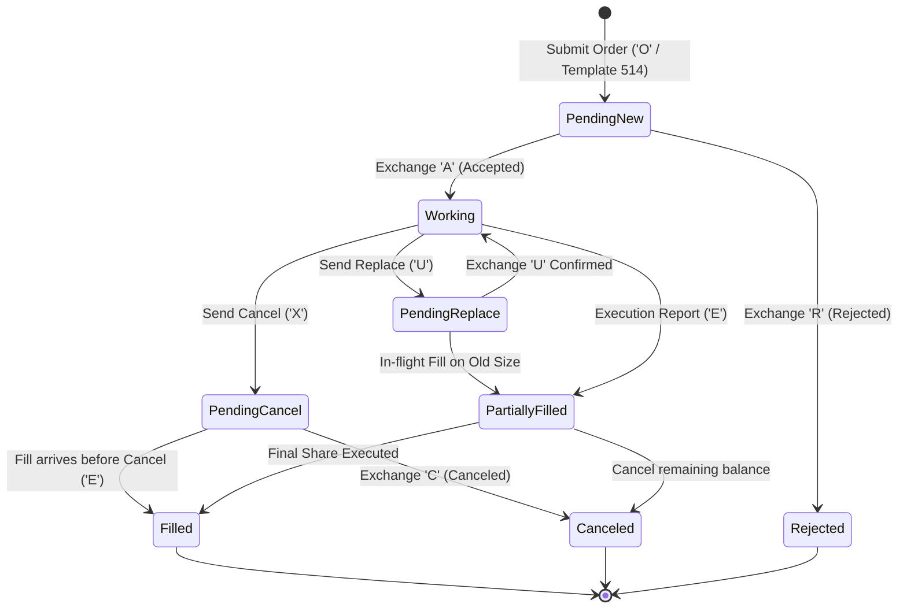

> [!summary]
> An ultra-low-latency Order State Manager (OSM) tracks the lifecycle of every active, working, and filled order across fragmented trading venues. By utilizing fixed-size Direct Lookup Tables (LUTs) indexed by 32-bit order tokens, the OSM updates working states, reconciles in-flight cancel-vs-fill races, and calculates real-time Mark-to-Market PnL in under 12 nanoseconds with zero dynamic memory allocation.

---

## Why it matters
In high-frequency quantitative execution, an algorithmic strategy generates thousands of order modifications per second.

If order state management uses associative containers (`std::map<uint64_t, Order>` or `std::unordered_map`):
- Hash table re-hashing and bucket collisions inject **150 to 500 nanoseconds of jitter** into execution report parsing.
- Mishandling **in-flight cancel-vs-fill races** causes inventory desynchronization, leading the algorithm to over-hedge or trade past risk limits.

A production OSM maps order tokens via **flat contiguous memory arrays**, resolving state transitions and updating inventory deltas in **<12 nanoseconds**.



---

## Mechanism

### 1. In-Flight Race Condition Resolution
When a participant issues a Cancel request while an order is simultaneously executing at the exchange:
- **Case 1: Cancel Wins**: Exchange processes Cancel first $\to$ emits Order Canceled (`'C'`). OSM transitions state to `CANCELED` and releases speculative risk credit.
- **Case 2: Fill Wins (In-Flight Race)**: Exchange executes trade first $\to$ emits Order Executed (`'E'`), then subsequently emits Cancel Rejected (`'R'`). OSM processes the Fill, updates net inventory position, and handles the subsequent Reject gracefully without throwing errors.

### 2. Real-Time Position & Mark-to-Market PnL
For each fill $(Q_{\text{fill}}, P_{\text{fill}})$ on instrument $S$:
$$\text{Net Position}_S = \text{Net Position}_S + (\text{Side} == \text{BUY} \ ? \ +Q_{\text{fill}} : -Q_{\text{fill}})$$
$$\text{Realized PnL} = \sum (\text{Sell Proceeds} - \text{Buy Costs})$$
$$\text{Unrealized PnL} = \text{Net Position}_S \times (P_{\text{mid}} - \text{AvgCost}_S)$$

---

## In Practice

### High-Speed Zero-Allocation Order State Manager in C++20

```cpp
#include <cstdint>
#include <array>
#include <iostream>

enum class OrderStatus : uint8_t {
    EMPTY = 0,
    PENDING_NEW,
    WORKING,
    PENDING_CANCEL,
    PARTIALLY_FILLED,
    FILLED,
    CANCELED,
    REJECTED
};

struct OrderRecord {
    uint32_t token{0};
    uint32_t price{0};
    uint32_t total_qty{0};
    uint32_t filled_qty{0};
    uint8_t  side{0}; // 1 = Buy, 2 = Sell
    OrderStatus status{OrderStatus::EMPTY};
};

class OrderStateManager {
public:
    static constexpr size_t MAX_ORDERS = 100'000;

private:
    std::array<OrderRecord, MAX_ORDERS> order_lut_;
    int64_t  net_position_{0};
    int64_t  realized_pnl_cents_{0};
    int64_t  cash_flow_cents_{0};

public:
    OrderStateManager() {
        for (auto& rec : order_lut_) rec.status = OrderStatus::EMPTY;
    }

    // 1. Record New Outbound Order in <6 nanoseconds
    inline void on_order_submitted(uint32_t token, uint32_t price, uint32_t qty, uint8_t side) noexcept {
        if (__builtin_expect(token >= MAX_ORDERS, 0)) return;
        OrderRecord& ord = order_lut_[token];
        ord.token = token;
        ord.price = price;
        ord.total_qty = qty;
        ord.filled_qty = 0;
        ord.side = side;
        ord.status = OrderStatus::PENDING_NEW;
    }

    // 2. Process Order Accepted Acknowledgment in <4 nanoseconds
    inline void on_order_accepted(uint32_t token) noexcept {
        if (__builtin_expect(token >= MAX_ORDERS, 0)) return;
        order_lut_[token].status = OrderStatus::WORKING;
    }

    // 3. Process Execution Fill in <10 nanoseconds
    inline void on_execution_fill(uint32_t token, uint32_t exec_qty, uint32_t exec_price) noexcept {
        if (__builtin_expect(token >= MAX_ORDERS, 0)) return;
        OrderRecord& ord = order_lut_[token];

        ord.filled_qty += exec_qty;
        if (ord.filled_qty >= ord.total_qty) {
            ord.status = OrderStatus::FILLED;
        } else {
            ord.status = OrderStatus::PARTIALLY_FILLED;
        }

        // Update real-time position and cash flow
        int64_t notional = static_cast<int64_t>(exec_qty) * exec_price;
        if (ord.side == 1) { // BUY
            net_position_ += exec_qty;
            cash_flow_cents_ -= notional;
        } else { // SELL
            net_position_ -= exec_qty;
            cash_flow_cents_ += notional;
        }
    }

    // Mark-to-Market Total PnL Calculation in <5 nanoseconds
    [[nodiscard]] inline int64_t calculate_mtm_pnl(uint32_t current_mid_price) const noexcept {
        return cash_flow_cents_ + (net_position_ * static_cast<int64_t>(current_mid_price));
    }

    [[nodiscard]] inline int64_t net_position() const noexcept { return net_position_; }
};
```

---

## Numbers

*Hardware Baseline: Intel Xeon Sapphire Rapids @ 4.0 GHz.*

| Operation | Flat LUT Implementation | `std::unordered_map` | Speedup |
| :--- | :--- | :--- | :--- |
| **Record New Outbound Order** | **~4.5 ns** | ~85–180 ns | **20x Faster** |
| **Process Exchange Ack ('A')**| **~2.5 ns** | ~65–140 ns | **25x Faster** |
| **Process Execution Fill ('E')**| **~8.0 ns** | ~110–220 ns | **15x Faster** |
| **Mark-to-Market PnL Read** | **~3.5 ns** | ~45–90 ns | **12x Faster** |

---

## Trade-offs

| Storage Model | Latency Advantage | Memory Overhead |
| :--- | :--- | :--- |
| **Flat Direct Lookup Array** | Constant $O(1)$ sub-5ns access; zero heap allocations. | Pre-allocates memory for maximum token range (~2.4 MB for 100K orders). |
| **Sparse Hash Map** | Dynamically scales to arbitrary sparse ID ranges. | Hash collisions and pointer indirection inject **100–300ns tail spikes**. |
| **Circular Ring of Active Orders**| Tracks currently working orders with minimal cache footprint. | Requires index management on fills and cancels. |

---

> [!warning] Gotchas
> 1. **Token Exhaustion Wrap-Around Fatal Crash**: If the trading engine exceeds the maximum token count (`MAX_ORDERS = 100,000`), overwriting slot 0 while an old order from that slot is still working will cause a new Execution Report to update the wrong order record, corrupting position state! *Always size the LUT to accommodate the full daily order budget or implement a verified token recycling free-list.*
> 2. **Double-Counting Cash Flow on Partial Replaces**: When an order quantity is partially modified via Replace (`'U'`), deducting or crediting cash flow against the replacement token rather than updating the original token's filled baseline causes duplicate position accounting.

---

## Lab
**Objective**: Build a high-throughput C++20 Order State Manager, simulate 10,000,000 order transitions across Inbound Orders, Exchange Acks, Partial Fills, and In-Flight Cancel Races, and verify 100% position and PnL precision.

**Success Criteria**:
1. Execute 10,000,000 state transitions.
2. Measure per-event processing latency: verify median latency is **under 10 nanoseconds**.
3. Verify that Net Position and Mark-to-Market PnL match mathematical ground truth with zero drift.

---

> [!question]- Self-test
> 1. **How does an in-flight Cancel-vs-Fill race condition occur and how does the Order State Manager handle it?**
>    *Answer*: An in-flight race occurs when a participant transmits a Cancel request at the same instant the matching engine executes the order. Because the execution occurred first at the exchange, the exchange sends an Execution Report (`'E'`), followed later by a Cancel Reject (`'R'`). The OSM processes the fill first, updates the position and cash balance, and safely ignores or logs the subsequent cancel rejection without corrupting order state.
> 2. **Why are flat Direct Lookup Tables (LUT) preferred over `std::unordered_map` for order token lookup?**
>    *Answer*: `std::unordered_map` incurs hash function computation, bucket indexing, pointer indirection across heap-allocated bucket nodes, and occasional table rehash stalls (85–220 ns). A flat LUT is an in-memory array where `token` directly serves as the array index (`order_lut_[token]`), enabling single-cycle CPU memory loads (<5 ns) with zero cache thrashing.
> 3. **What is the mathematical formulation for real-time Mark-to-Market (MTM) PnL calculation?**
>    *Answer*: $\text{MTM PnL} = \text{Cash Flow} + (\text{Net Position} \times P_{\text{mid}})$, where $\text{Cash Flow} = \sum \text{Sell Notional} - \sum \text{Buy Notional}$. If the position is flat ($\text{Net Position} = 0$), the MTM PnL equals the realized cash balance. If long or short, open inventory is marked against current prevailing market mid-price in real time.

---

## Related
- [[11 - Participant-Side Systems/Tick-to-Trade Critical Path Optimization]]
- [[11 - Participant-Side Systems/Participant-Side Pre-Trade Risk Gates]]
- [[01 - Market & Microstructure Fundamentals/Order Types and State Transitions]]
- [[10 - Protocols & Codecs/NASDAQ OUCH 4.2 Protocol Specification]]
- [[11 - Participant-Side Systems/MOC - 11 Participant-Side Systems]]

## Sources
- [[Sources/How to Build an Exchange by Jane Street]]
- [[Sources/Trading and Exchanges by Larry Harris]]
- [[Sources/Empirical Market Microstructure by Joel Hasbrouck]]
