> [!summary]
> Tick-to-Trade (T2T) is the total elapsed time from the arrival of a market data packet at the participant's NIC to the egress of a generated order packet back onto the network wire. Achieving a sub-800ns wire-to-wire (and sub-100ns internal software) latency requires inlining the entire feed handler, book reconstructor, alpha model, risk gate, and order builder into a single thread operating exclusively inside the CPU L1 data cache.

---

## Why it matters
In latency-sensitive automated market making and statistical arbitrage, profitability is governed by the **Tick-to-Trade race**:
- When a correlated macro signal moves (e.g. CME E-mini futures jump 2 ticks), all market makers race to cancel stale quotes in underlying equity ETFs (SPY, QQQ) and cross-asset equities.
- The participant whose cancel or aggressive hedge order arrives first wins 100% of the trade or avoids 100% of the adverse selection loss.
- A firm with an 850ns Tick-to-Trade loop beats a firm with a 1,200ns loop on **>90% of volatile market events**, making sub-microsecond T2T engineering the core determinant of quantitative trading viability.

```mermaid
flowchart LR
    subgraph IngressHW ["1. Hardware Ingress (~300 ns)"]
        OPT_IN[Photons Ingress SFP28] --> PHY_IN[PHY / SerDes Deserializer]
        PHY_IN --> MAC_IN[MAC Parser & CAM Filter]
        MAC_IN --> DMA_IN[PCIe DMA Write to Host RAM]
    end

    subgraph SoftwareCriticalPath ["2. Software Tick-to-Trade Loop (<100 ns In-Memory)"]
        FH["Feed Handler Decode (~15 ns)"] --> BR["Book Reconstructor (~20 ns)"]
        BR --> SIG["Alpha & Micro-Price Signal (~25 ns)"]
        SIG --> RISK["Inline Pre-Trade Risk (~15 ns)"]
        RISK --> OE["OUCH / iLink Order Formatter (~15 ns)"]
    end

    subgraph EgressHW ["3. Hardware Egress (~250 ns)"]
        PIO["PCIe PIO / Doorbell Push (~120 ns)"] --> MAC_OUT[NIC MAC & FIFO]
        MAC_OUT --> PHY_OUT[PHY / SerDes Serializer]
        PHY_OUT --> OPT_OUT[Photons Egress Wire]
    end

    DMA_IN ==>|Memory-Mapped Poll| FH
    OE ==>|Direct TX Ring Push| PIO
```



---

## Mechanism

### 1. The Step-by-Step Nanosecond Latency Budget

| Stage | Operation | Platform / Subsystem | Latency (ns) |
| :--- | :--- | :--- | :--- |
| **1. Wire Ingress** | Optical transceiver + PHY SerDes | SFP28 Optical Receiver | **~60–90 ns** |
| **2. NIC MAC & Filter** | CRC check + CAM 5-tuple filter | NIC Hardware ASIC | **~30–60 ns** |
| **3. PCIe DMA Ingress**| TLP Memory Write over PCIe Gen4/5 | PCIe Bus to Host RAM | **~150–220 ns** |
| **4. Feed Handler** | Zero-copy ITCH/SBE struct decode | User-Space C++ Core | **~12–18 ns** |
| **5. Book Builder** | Top-of-Book cache update | In-Memory Flat Array | **~15–25 ns** |
| **6. Alpha / Signal** | Micro-price & threshold calculation | Branchless Register Math | **~18–30 ns** |
| **7. Pre-Trade Risk** | Gross credit & price collar check | Inlined L1d Validation | **~12–18 ns** |
| **8. Order Builder** | OUCH / iLink binary framing | In-Place TX Struct Fill | **~14–22 ns** |
| **9. PCIe TX Push** | Programmed I/O (PIO) / DMA doorbell | Host to NIC PCIe Push | **~110–180 ns** |
| **10. Wire Egress** | MAC frame assembly + PHY serialization | SFP28 Optical Transmitter | **~60–90 ns** |
| **TOTAL** | **Full Wire-to-Wire Tick-to-Trade** | **Hardware + Software** | **~481–755 ns** |

### 2. Core Architectural Optimization Doctrines
1. **Single-Threaded Inlining (No Inter-Core IPC on Hot Path)**:
   - Passing market data from a Feed Handler thread to a Strategy thread over a shared-memory ring buffer injects **15 to 35 nanoseconds of cross-core cache invalidation latency**.
   - Ultra-low-latency engines execute the **entire pipeline (Poll $\to$ Book $\to$ Signal $\to$ Risk $\to$ TX) sequentially inside a single thread pinned to an isolated core**.
2. **Zero Dynamic Allocation**:
   - All memory buffers, order lookup tables, and network TX descriptors are pre-allocated at startup in HugePages.
3. **L1 Data Cache Hotness**:
   - The active book state, strategy parameters, and TX templates are structured to fit entirely within the **32KB/48KB L1 data cache** (access time: **~1.0 ns / 4 cycles**).

---

## In Practice

### High-Speed Inlined Tick-to-Trade Loop in C++20

```cpp
#include <cstdint>
#include <immintrin.h>
#include <iostream>
#include <cstring>

struct alignas(64) TopOfBook {
    uint32_t best_bid_price{0};
    uint32_t best_bid_qty{0};
    uint32_t best_ask_price{UINT32_MAX};
    uint32_t best_ask_qty{0};
};

class FastTickToTradePipeline {
private:
    TopOfBook book_;
    uint64_t current_gross_credit_{0};
    static constexpr uint64_t MAX_CREDIT = 10'000'000;
    static constexpr uint32_t SIGNAL_THRESHOLD = 50; // In cents

public:
    // Single-threaded, fully inlined tick-to-trade handler executing in <65 nanoseconds
    __attribute__((always_inline)) inline bool on_market_tick_execute(uint32_t new_bid, uint32_t bid_qty,
                                                                      uint32_t new_ask, uint32_t ask_qty,
                                                                      uint8_t* tx_dma_buffer,
                                                                      size_t& tx_len) noexcept {
        // 1. UPDATE BOOK (L1 Cache Hot: ~12 ns)
        book_.best_bid_price = new_bid;
        book_.best_bid_qty = bid_qty;
        book_.best_ask_price = new_ask;
        book_.best_ask_qty = ask_qty;

        // 2. SIGNAL GENERATION: Compute Volume-Weighted Micro-Price (~18 ns)
        // MicroPrice = (BidPrice * AskQty + AskPrice * BidQty) / (BidQty + AskQty)
        uint64_t total_qty = static_cast<uint64_t>(bid_qty) + ask_qty;
        if (__builtin_expect(total_qty == 0, 0)) return false;

        uint64_t weighted_sum = (static_cast<uint64_t>(new_bid) * ask_qty) + (static_cast<uint64_t>(new_ask) * bid_qty);
        uint32_t micro_price = static_cast<uint32_t>(weighted_sum / total_qty);

        // 3. STRATEGY TRIGGER: Aggressive Buy if Micro-Price indicates upward pressure (~10 ns)
        bool should_buy = (micro_price > new_bid + SIGNAL_THRESHOLD);
        if (__builtin_expect(!should_buy, 1)) return false;

        // 4. INLINE PRE-TRADE RISK (~10 ns)
        uint64_t order_notional = static_cast<uint64_t>(new_ask) * 100;
        if (__builtin_expect(current_gross_credit_ + order_notional > MAX_CREDIT, 0)) {
            return false; // Risk breach
        }
        current_gross_credit_ += order_notional;

        // 5. IN-PLACE OUCH ORDER SERIALIZATION (~15 ns)
        // Direct struct overlay onto NIC TX DMA memory
        tx_dma_buffer[0] = 'O'; // Enter Order
        *reinterpret_cast<uint32_t*>(tx_dma_buffer + 1) = __builtin_bswap32(1001); // Token
        tx_dma_buffer[5] = 'B'; // Buy
        *reinterpret_cast<uint32_t*>(tx_dma_buffer + 6) = __builtin_bswap32(100);  // 100 Shares
        std::memcpy(tx_dma_buffer + 10, "AAPL    ", 8);
        *reinterpret_cast<uint32_t*>(tx_dma_buffer + 18) = __builtin_bswap32(new_ask); // Price
        *reinterpret_cast<uint32_t*>(tx_dma_buffer + 22) = 0; // IOC

        tx_len = 48;
        return true; // Trigger immediate NIC TX push!
    }
};
```

---

## Numbers

*Hardware Baseline: Intel Xeon Sapphire Rapids / AMD EPYC Genoa @ 4.0 GHz with Solarflare X2522.*

| Pipeline Stage | Optimized Inlined Architecture | Multi-Threaded Queue Architecture |
| :--- | :--- | :--- |
| **Ingress Polling to Book Update** | **~25–40 ns** | ~180–450 ns (Cross-core queue) |
| **Signal & Risk Evaluation** | **~25–45 ns** | ~120–280 ns |
| **Order Formatting to TX Push** | **~25–40 ns** | ~150–350 ns (Ring handoff) |
| **Total In-Memory Software T2T** | **~75–125 ns** | **~450–1,080 ns (10x Slower)** |
| **Total Wire-to-Wire T2T** | **~550–820 ns** | **~1,250–2,500 ns** |

---

## Trade-offs

| Pipeline Topology | Latency Advantage | Architectural Limitation |
| :--- | :--- | :--- |
| **Single-Threaded Inlined Pipeline**| **Fastest possible (<100ns software)**; zero cross-core cache invalidation. | Single core must handle both ingress and egress; limited multi-market scaling. |
| **Multi-Core Pipeline (SPSC Rings)**| High modularity; scales across 10+ symbols concurrently. | Cross-core cache invalidation adds **30–80ns** to every tick. |
| **FPGA Full Tick-to-Trade Pipeline**| **Sub-150ns Wire-to-Wire**; zero CPU involvement. | Extreme hardware complexity; difficult to deploy complex statistical models. |

---

> [!warning] Gotchas
> 1. **Cross-Core L3 Cache Thrashing on Core Handoffs**: Splitting the feed handler and strategy onto two separate cores connected by an SPSC ring causes the book state cache line to bounce between the L2 caches of both cores. The resulting MESI `Read-For-Ownership` (RFO) invalidation stalls the CPU for **40 to 80 nanoseconds**, completely erasing the theoretical advantage of pipelining.
> 2. **Branch Misprediction ROB Flushes in Alpha Logic**: A complex `if/else` decision tree inside the alpha calculation that mispredicts causes a 15 to 20-cycle Reorder Buffer (ROB) flush, adding **4–5 nanoseconds of stall time**. *Use branchless ternary arithmetic and `CMOV` instructions for all pricing thresholds.*

---

## Lab
**Objective**: Build an end-to-end inlined C++20 Tick-to-Trade pipeline, ingest 5,000,000 synthetic market ticks, evaluate a micro-price signal, execute pre-trade risk, format an OUCH order, and measure software latency with hardware `rdtsc`.

**Success Criteria**:
1. Run 5,000,000 complete Tick-to-Trade iterations on an isolated core.
2. Measure software turnaround time (Tick Ingress $\to$ Order Formatted).
3. Verify median software turnaround latency is **under 100 nanoseconds**.

---

> [!question]- Self-test
> 1. **What is the difference between "Software Tick-to-Trade Latency" and "Wire-to-Wire Tick-to-Trade Latency"?**
>    *Answer*: **Software Tick-to-Trade Latency** measures only the internal in-memory execution time from the moment the user-space feed handler receives the packet from the NIC DMA ring to the moment the order builder finishes writing the outbound order into the TX descriptor (~75–125 ns). **Wire-to-Wire Latency** includes the entire physical hardware path: optical ingress, PHY SerDes deserialization, NIC MAC parsing, PCIe DMA ingress, software processing, PCIe TX push, and optical serialization (~550–820 ns).
> 2. **Why do ultra-low-latency HFT systems execute the Feed Handler, Book Builder, Signal Generator, Risk Gate, and Order Builder inside a single thread rather than pipelining them across multiple CPU cores?**
>    *Answer*: Passing data between cores requires writing and reading shared memory across the CPU's cache coherence fabric (MESI/MOESI protocol). Transferring an event between Core A and Core B incurs an L3 cache hit and cross-core cache invalidation penalty of 25 to 50 nanoseconds per hop. Inlining the entire pipeline into a single thread allows all data structures to stay hot inside Core A's private L1 data cache (1.0 ns access), eliminating cross-core cache bouncing.
> 3. **What is the typical latency penalty of executing a PCIe Programmed I/O (PIO) or MMIO doorbell write during the outbound order egress stage?**
>    *Answer*: An MMIO doorbell write is an uncached, non-posted PCIe bus transaction that requires traversing the CPU's PCIe root complex to write directly to a physical hardware register on the NIC ASIC, stalling the CPU instruction pipeline for **110 to 250 nanoseconds**.

---

## Related
- [[11 - Participant-Side Systems/Market Data Feed Handlers and Book Reconstructors]]
- [[11 - Participant-Side Systems/Low-Latency Signal Generation and Feature Calculators]]
- [[11 - Participant-Side Systems/Participant-Side Pre-Trade Risk Gates]]
- [[04 - Hardware Mechanical Sympathy/Latency Numbers Every Trading Engineer Knows]]
- [[11 - Participant-Side Systems/MOC - 11 Participant-Side Systems]]

## Sources
- [[Sources/How to Build an Exchange by Jane Street]]
- [[Sources/High Frequency Trading by Irene Aldridge]]
- [[Sources/Systems Performance by Brendan Gregg]]
