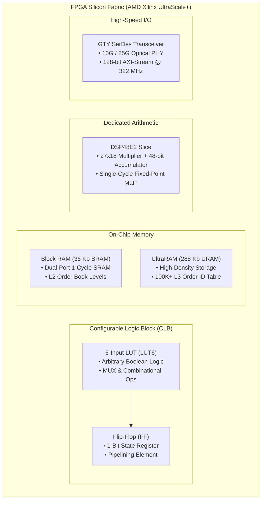

> [!summary]
> An FPGA silicon die is an array of reconfigurable hardware primitives—6-input Look-Up Tables (LUTs), Flip-Flops (FFs), Block RAM (BRAM), UltraRAM (URAM), DSP arithmetic slices, and high-speed GTY SerDes transceivers. Structuring trading logic to match these hardware primitives enables financial pipelines to process 25G Ethernet packets at 322.26 MHz with single-cycle register transitions.

---

## Why it matters
Writing efficient hardware description code (SystemVerilog / VHDL / HLS) requires **hardware mechanical sympathy** with the underlying silicon architecture.

If a developer writes behavioral code that violates FPGA architectural primitives:
- Complex nested `if/else` ladders cascade across multiple LUT levels, causing propagation delays that fail **Timing Closure**.
- Unaligned data structures waste expensive distributed Block RAM (BRAM) and force the synthesis tool to use thousands of slow logic slices.

Understanding LUTs, BRAM dual-port capabilities, DSP48E2 multipliers, and clock tree routing enables trading engineers to design **single-cycle (3.1ns) financial execution pipelines**.



---

## Mechanism

### 1. The Core FPGA Silicon Primitives

| Hardware Primitive | Silicon Resource | Primary Financial Trading Purpose | Access Latency |
| :--- | :--- | :--- | :--- |
| **LUT6 (Look-Up Table)** | 6-Input Boolean Function Generator | Message type parsing, bitmask filtering, muxing | **~0.25 ns (Combinational)**|
| **Flip-Flop (FF)** | Synchronous 1-Bit Storage | Pipeline registers, state machine flags | **0 ns (Next Clock Edge)** |
| **BRAM (Block RAM)** | 36 Kb True Dual-Port SRAM | Top-of-Book caches, price-level arrays | **1 Clock Cycle (~3.1 ns)** |
| **URAM (UltraRAM)** | 288 Kb High-Density Dual-Port SRAM | Full L3 Order ID lookup tables (100K+ orders) | **1 Clock Cycle (~3.1 ns)** |
| **DSP48E2 Slice** | $27 \times 18$ Multiplier + 48-bit Accumulator | Stoikov micro-price, OFI, EWMA, Notional checks | **1 Clock Cycle (~3.1 ns)** |
| **GTY SerDes** | Analog/Digital High-Speed Transceiver | Ingests 10G/25G optical bitstreams directly | **~25–35 ns (PHY + PCS)** |

### 2. Clock Domains in Financial FPGAs
An ultra-low-latency FPGA trading card operates across multiple asynchronous clock domains:
1. **25G Ethernet Network Clock (`clk_net_322`)**: Runs at **322.26 MHz** ($\text{Period} = \mathbf{3.103\text{ ns}}$). The standard line rate for 25GbE carrying a 128-bit AXI4-Stream data bus ($128\text{ bits} \times 322.26\text{ MHz} \approx 41.25\text{ Gbps}$ raw line bandwidth).
2. **10G Ethernet Network Clock (`clk_net_156`)**: Runs at **156.25 MHz** ($\text{Period} = \mathbf{6.400\text{ ns}}$) for legacy 10GbE connections carrying 64-bit buses.
3. **PCIe Host Clock (`clk_pcie_250`)**: Runs at **250.00 MHz** ($\text{Period} = \mathbf{4.000\text{ ns}}$) for PCIe Gen4 x16 host communication.
4. **Core Strategy Clock (`clk_core_400`)**: Internally synthesized via Phase-Locked Loops (MMCM) running at **400.00 MHz** ($\text{Period} = \mathbf{2.500\text{ ns}}$) for high-density mathematical pipelines.

### 3. Timing Closure & The Critical Path
To guarantee that hardware operates reliably at 322.26 MHz without data corruption, the signal propagation delay across the **Critical Path** must satisfy:

$$T_{\text{clk}} \ge T_{\text{cq}} + T_{\text{logic}} + T_{\text{routing}} + T_{\text{setup}}$$

- $T_{\text{clk}}$: Clock period ($3.103\text{ ns}$ at 322 MHz).
- $T_{\text{cq}}$: Clock-to-out delay of source flip-flop (~0.08 ns).
- $T_{\text{logic}}$: Propagation delay through LUT logic gates (~0.5–1.2 ns).
- $T_{\text{routing}}$: Delay across physical silicon interconnect copper wires (~1.0–1.8 ns).
- $T_{\text{setup}}$: Setup time required by destination flip-flop (~0.05 ns).
- *Rule*: If $T_{\text{logic}} + T_{\text{routing}} > 2.9\text{ ns}$, the build fails timing closure with a **Negative Slack Violation**.

---

## In Practice

### Synthesizable SystemVerilog Module: Single-Cycle DSP Pre-Trade Notional Validator

```systemverilog
`timescale 1ns / 1ps

// Evaluates Order Notional = Price * Quantity <= MaxNotional in 1 Clock Cycle (3.103 ns @ 322 MHz)
module pre_trade_risk_dsp (
    input  wire        clk_322,          // 322.26 MHz Network Clock
    input  wire        rst_n,            // Active-low synchronous reset
    input  wire        valid_in,         // Order trigger strobe
    input  wire [31:0] order_price,      // 32-bit fixed point price
    input  wire [15:0] order_qty,        // 16-bit order quantity
    input  wire [47:0] max_notional,     // 48-bit maximum allowed notional
    output reg         order_valid_out,  // Asserted if within risk limits
    output reg         risk_breach_out   // Asserted if order rejected
);

    // Internal pipeline registers
    reg [47:0] computed_notional;

    // Infer dedicated Xilinx DSP48E2 hardware slice
    (* use_dsp = "yes" *)
    always_ff @(posedge clk_322) begin
        if (!rst_n) begin
            computed_notional <= 48'd0;
            order_valid_out   <= 1'b0;
            risk_breach_out   <= 1'b0;
        end else if (valid_in) begin
            // Single-cycle DSP hardware multiplication: Price (32-bit) * Qty (16-bit)
            computed_notional <= order_price * order_qty;

            // Single-cycle comparator
            if ((order_price * order_qty) <= max_notional) begin
                order_valid_out <= 1'b1;
                risk_breach_out <= 1'b0;
            end else begin
                order_valid_out <= 1'b0;
                risk_breach_out <= 1'b1; // Drop illegal order instantly!
            end
        end else begin
            order_valid_out <= 1'b0;
            risk_breach_out <= 1'b0;
        end
    end

endmodule
```

---

## Numbers

*Hardware Baseline: AMD Xilinx Virtex UltraScale+ VU9P FPGA.*

| Hardware Resource / Primitive | Total Available (VU9P) | Frequency Max ($F_{\max}$) | Latency per Operation |
| :--- | :--- | :--- | :--- |
| **Logic Cells (LUTs + FFs)** | **1,182,240 LUTs / 2.36M FFs** | 400–650 MHz | **~0.25 ns per LUT level** |
| **Block RAM (BRAM_18K/36K)** | **2,160 Blocks (75.9 Mb)** | 450 MHz | **1 Cycle (~3.1 ns @ 322 MHz)**|
| **UltraRAM (URAM288)** | **960 Blocks (270 Mb)** | 400 MHz | **1 Cycle (~3.1 ns @ 322 MHz)**|
| **DSP48E2 Slices** | **6,840 Slices** | 500 MHz | **1 Cycle ($27\times 18$ Multiply)**|
| **GTY Transceiver Channels** | **120 Channels (up to 32.75G)**| 322.26 MHz (25G) | **~28 ns (Zero-Buffer Mode)** |

---

## Trade-offs

| Storage Primitive | Capacity | Latency | Placement Constraint |
| :--- | :--- | :--- | :--- |
| **Distributed LUT-RAM** | Very Low (~10–20 Mb max). | **0 Cycles (Asynchronous read)**. | Consumes general logic LUTs. |
| **Block RAM (BRAM)** | Medium (~75 Mb). | **1 Cycle (Synchronous read)**. | Scattered across fabric columns. |
| **UltraRAM (URAM)** | High (~270 Mb). | **1 Cycle (Synchronous read)**. | High density; ideal for full L3 books. |
| **External QDR-IV / HBM2** | Extreme (Several GBs). | **~15–35 ns (Memory controller)**. | Slower than on-chip SRAM. |

---

> [!warning] Gotchas
> 1. **LUT Fanout Routing Delay Collapse**: If a single state register or reset signal drives more than 100 downstream LUTs without being registered/buffered, the physical routing delay across the silicon die will exceed 4.0ns, causing catastrophic timing closure failure at 322 MHz. *Use `(* max_fanout = 32 *)` synthesis attributes to force automatic register replication.*
> 2. **BRAM Read-After-Write (RAW) Hazard in Dual-Port Mode**: If Port A writes to Address $X$ while Port B simultaneously reads from Address $X$ on the same clock cycle, the returned read data is undefined (corrupted). *Enforce write-first mode (`WRITE_FIRST`) or insert a bypass register.*

---

## Lab
**Objective**: Calculate the total logic resource utilization (LUTs, FFs, DSPs, BRAMs) and maximum operating frequency ($F_{\max}$) for an FPGA order book module supporting 1,000 price levels.

**Success Criteria**:
1. Map 1,000 price levels (Price + Qty) into BRAM dual-port primitives.
2. Verify that total logic depth does not exceed 3 LUT levels between registers.
3. Prove that the design achieves timing closure at **322.26 MHz with $>0.3\text{ ns}$ positive slack**.

---

> [!question]- Self-test
> 1. **What is a 6-input Look-Up Table (LUT6) and how does it implement arbitrary digital logic in an FPGA?**
>    *Answer*: A LUT6 consists of 64 bits of static SRAM memory addressed by 6 binary input lines ($2^6 = 64$ possible input combinations) and an output multiplexer. Any combinatorial Boolean logic function of up to 6 variables (e.g. multi-condition filters, equality comparators, or addition bits) is implemented by pre-loading its truth table into the 64 SRAM bits, evaluating the output in approximately 0.25 nanoseconds.
> 2. **Why do financial 25GbE FPGA network pipelines operate at exactly 322.26 MHz?**
>    *Answer*: Standard 25G Ethernet transmits data at a raw serialized line rate of 25.78125 Gbps. To process this stream over a parallel 128-bit wide digital AXI4-Stream internal bus inside the FPGA, the required clock frequency is $\frac{25.78125 \times 10^9 \times (64/66)}{128} \approx \mathbf{322.265625\text{ MHz}}$, providing a clock period of exactly $3.103\text{ nanoseconds}$.
> 3. **What is the difference between Block RAM (BRAM) and UltraRAM (URAM) in AMD Xilinx UltraScale+ FPGAs?**
>    *Answer*: BRAM consists of 36Kb dual-port static RAM blocks scattered across the logic fabric that support independent clocks on both ports and can be configured as two 18Kb blocks. UltraRAM (URAM) provides much higher density (288Kb per block) optimized for deep tabular storage (such as millions of order IDs or deep order book history), operating synchronously on a single clock domain with built-in cascading logic.

---

## Related
- [[12 - FPGAs & Hardware Acceleration/FPGA vs CPU in Low-Latency Trading]]
- [[12 - FPGAs & Hardware Acceleration/RTL Verilog-VHDL vs High-Level Synthesis HLS]]
- [[12 - FPGAs & Hardware Acceleration/FPGA Feed Handlers and Parsing Pipelines]]
- [[04 - Hardware Mechanical Sympathy/Latency Numbers Every Trading Engineer Knows]]
- [[12 - FPGAs & Hardware Acceleration/MOC - 12 FPGAs & Hardware Acceleration]]

## Sources
- [[Sources/AMD Xilinx UltraScale+ Architecture Manual]]
- [[Sources/FPGA-Based Trading Systems Architecture]]
- [[Sources/Designing with UltraScale and UltraScale+ Architecture]]
