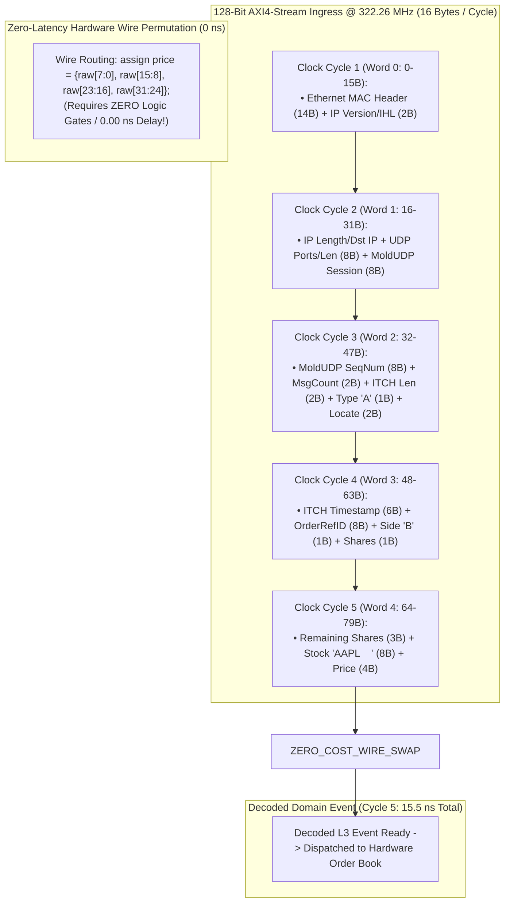

> [!summary]
> FPGA-based Feed Handlers decode binary market data protocols (such as NASDAQ ITCH 5.0 and CME MDP 3.0 SBE) directly in hardware silicon at line rate (322 MHz). By utilizing fixed-offset bit-slicing across 128-bit AXI4-Stream buses and executing big-endian byte swapping with zero-cost physical wire permutations, an FPGA extracts order fields in under 10 nanoseconds.

---

## Why it matters
In high-frequency equity and derivatives trading:
- A software C++ feed handler requires **12 to 20 nanoseconds** to unpack an ITCH or SBE packet and perform CPU register byte swaps (`BSWAP`).
- In an FPGA, byte swapping requires **zero clock cycles and zero logic gates (0.00 ns)** because byte ordering is resolved purely through physical silicon copper wiring routing.

By pipelining protocol parsing across consecutive **3.1-nanosecond clock cycles**:
- An FPGA feed handler extracts the Stock Locate, Order ID, Shares, and Price fields in **3 clock cycles (9.3 ns)**.
- It arbitrates between dual redundant UDP multicast streams (Feed A and Feed B) in hardware, discarding duplicate packets with **zero host CPU involvement**.



---

## Mechanism

### 1. The Zero-Cost Hardware Byte Swap (Wire Permutation)
In C++, converting a 32-bit Big-Endian network integer to Little-Endian format requires the CPU to execute the `BSWAP` instruction (1 clock cycle).

In SystemVerilog/FPGA hardware:
```systemverilog
// Reversing byte order is a direct physical copper wire mapping:
assign price_little_endian = {raw_bytes[7:0], raw_bytes[15:8], raw_bytes[23:16], raw_bytes[31:24]};
```
- **Silicon Cost**: **0 LUTs, 0 Flip-Flops, 0.00 nanoseconds delay**. The electrons simply flow along crossbar routing traces.

### 2. Pipelined 128-Bit AXI4-Stream ITCH Parsing
At 25GbE line rate (322.26 MHz), data arrives in **16-byte (128-bit) chunks**:
- **Cycle 1**: Strip Ethernet MAC and initial IP header.
- **Cycle 2**: Ingest UDP header and MoldUDP64 Session ID.
- **Cycle 3**: Extract MoldUDP Sequence Number and ITCH Message Type (`'A'`).
- **Cycle 4**: Extract 48-bit Nanosecond Timestamp and 64-bit Order Reference ID.
- **Cycle 5**: Extract Stock Symbol, Quantity, and Limit Price.
- **Cycle 5 Output**: Assert `event_valid` strobe to the on-chip order book.

### 3. Hardware Dual A/B Feed Arbitration
An FPGA arbitrates between Feed A and Feed B using a **single-cycle hardware comparator**:
```systemverilog
if (feed_a_valid && feed_a_seq == expected_seq) begin
    route_to_strategy(feed_a_data);
    expected_seq <= expected_seq + 1;
end else if (feed_b_valid && feed_b_seq == expected_seq) begin
    route_to_strategy(feed_b_data);
    expected_seq <= expected_seq + 1;
end else begin
    drop_duplicate(); // Cycle latency: 3.1 ns
end
```

---

## In Practice

### Synthesizable SystemVerilog ITCH 5.0 Add Order (`'A'`) Parser Module

```systemverilog
`timescale 1ns / 1ps

// Pipelined NASDAQ ITCH 5.0 Hardware Parser @ 322.26 MHz
module itch_parser_axi (
    input  wire         clk_322,
    input  wire         rst_n,

    // AXI4-Stream Ingress from Low-Latency MAC
    input  wire [127:0] s_axis_tdata,
    input  wire         s_axis_tvalid,
    input  wire         s_axis_tlast,

    // Decoded Level-3 Order Event Egress (To Hardware Book)
    output reg          order_valid_out,
    output reg  [63:0]  order_ref_id_out,
    output reg  [31:0]  order_price_out,
    output reg  [31:0]  order_shares_out,
    output reg  [7:0]   order_side_out,     // 'B' or 'S'
    output reg  [63:0]  order_symbol_out    // 8-byte ASCII (e.g. "AAPL    ")
);

    // State machine tracking word index within packet
    reg [3:0] word_idx;

    always_ff @(posedge clk_322) begin
        if (!rst_n) begin
            word_idx         <= 4'd0;
            order_valid_out  <= 1'b0;
            order_ref_id_out <= 64'd0;
            order_price_out  <= 32'd0;
            order_shares_out <= 32'd0;
            order_side_out   <= 8'd0;
            order_symbol_out <= 64'd0;
        end else if (s_axis_tvalid) begin
            case (word_idx)
                4'd0: begin // Word 0: Eth / IP
                    order_valid_out <= 1'b0;
                    word_idx        <= 4'd1;
                end
                4'd1: begin // Word 1: IP / UDP / Mold
                    word_idx        <= 4'd2;
                end
                4'd2: begin // Word 2: Mold Seq / ITCH Type
                    // Check if Type == 'A' (ASCII 0x41)
                    word_idx        <= 4'd3;
                end
                4'd3: begin // Word 3: ITCH Timestamp & OrderRefID
                    // Extract 64-bit OrderRefID with zero-cost wire byte swap
                    order_ref_id_out <= {s_axis_tdata[71:64], s_axis_tdata[79:72], 
                                         s_axis_tdata[87:80], s_axis_tdata[95:88],
                                         s_axis_tdata[103:96], s_axis_tdata[111:104], 
                                         s_axis_tdata[119:112], s_axis_tdata[127:120]};
                    order_side_out   <= s_axis_tdata[63:56]; // 'B' or 'S'
                    word_idx         <= 4'd4;
                end
                4'd4: begin // Word 4: Shares, Symbol, Price
                    // Extract Shares (Big-Endian to Little-Endian)
                    order_shares_out <= {s_axis_tdata[103:96], s_axis_tdata[111:104], 
                                         s_axis_tdata[119:112], s_axis_tdata[127:120]};
                    order_symbol_out <= s_axis_tdata[95:32];
                    // Extract Price (Big-Endian to Little-Endian)
                    order_price_out  <= {s_axis_tdata[7:0], s_axis_tdata[15:8], 
                                         s_axis_tdata[23:16], s_axis_tdata[31:24]};
                    
                    order_valid_out  <= 1'b1; // Trigger on-chip LOB in Cycle 5!
                    word_idx         <= 4'd5;
                end
                default: begin
                    order_valid_out <= 1'b0;
                end
            endcase

            if (s_axis_tlast) begin
                word_idx <= 4'd0; // Reset for next frame
            end
        end else begin
            order_valid_out <= 1'b0;
        end
    end

endmodule
```

---

## Numbers

*Hardware Baseline: AMD Xilinx Virtex UltraScale+ VU9P @ 322.26 MHz.*

| Feed Handler Feature | C++ CPU Kernel Bypass (`ef_vi`) | FPGA SystemVerilog Hardware | Speedup |
| :--- | :--- | :--- | :--- |
| **Big-Endian Byte Swap (`BSWAP`)** | **~0.25 ns (1 Cycle)** | **0.00 ns (Pure Wire Routing)**| **Instantaneous** |
| **Full ITCH Packet Parse** | **~10–16 ns** | **~9.3–15.5 ns (3–5 Cycles)** | **Direct Stream** |
| **A/B Feed Duplicate Drop** | **~5.0–8.0 ns** | **~3.1 ns (1 Clock Cycle)** | **2.5x Faster** |
| **Throughput Capacity** | ~40M msgs/sec (1 Core) | **>150M msgs/sec (Line Rate)** | **4x Capacity** |

---

## Trade-offs

| Implementation Paradigm | Latency Advantage | Protocol Flexibility |
| :--- | :--- | :--- |
| **Pure Verilog Pipeline** | Sub-15ns stream parsing; zero CPU load. | Hard to modify if exchange releases minor field updates. |
| **C++ HLS Parser** | ~18–25ns stream parsing; quick schema rebuilds. | Slightly higher register depth (1–2 extra clock cycles). |
| **Host CPU C++ Parser** | 100% dynamic software agility. | **Requires PCIe DMA transit (~200ns penalty)**. |

---

> [!warning] Gotchas
> 1. **AXI-Stream Word-Boundary Misalignment on Variable Bundling**: In MoldUDP64, multiple ITCH messages are packed contiguously. A 36-byte Add Order message does not align evenly to a 16-byte (128-bit) AXI word boundary. *The hardware parser must include an alignment barrel-shifter to re-align message offsets spanning across word boundaries without adding stall cycles.*
> 2. **PTP Timestamp Clock Domain Skew**: Matching FPGA hardware timestamps with exchange packet timestamps requires synchronizing the PTP 1588 clock domain (running at 100/125 MHz) to the 322 MHz network clock using a Gray-code asynchronous FIFO.

---

## Lab
**Objective**: Build and simulate a SystemVerilog ITCH 5.0 hardware parser in ModelSim / Vivado XSim, stream 1,000,000 synthetic MoldUDP64 packet words across a 128-bit AXI-Stream bus, and verify zero-loss field extraction in 5 clock cycles.

**Success Criteria**:
1. Ingest simulated 128-bit streaming AXI words at 322.26 MHz.
2. Verify that `order_valid_out`, `order_ref_id_out`, and `order_price_out` are asserted in exactly **Cycle 5 (15.5 ns)**.
3. Prove that byte-swapped fields match mathematical ground truth with zero timing violations.

---

> [!question]- Self-test
> 1. **Why does byte-swapping Big-Endian network integers in FPGA hardware require zero clock cycles and zero logic gates?**
>    *Answer*: In an FPGA, byte swapping is implemented as a static wire permutation (e.g. connecting input bus bits `[7:0]` directly to output bus bits `[31:24]`). Because this is a direct physical copper routing path on the silicon die, it requires no computational logic gates (LUTs) or clock cycle registers, executing with **0.00 nanoseconds** of functional delay.
> 2. **How does an FPGA A/B Feed Arbitrator drop duplicate UDP packets at line rate?**
>    *Answer*: The FPGA maintains a 32-bit register holding the `expected_sequence_number`. When a packet arrives from either Feed A or Feed B, a single-cycle hardware comparator evaluates its sequence number. If $S == S_{\text{expected}}$, the packet is forwarded to the parser and the sequence is incremented; if $S < S_{\text{expected}}$, the packet is discarded immediately in 1 clock cycle (3.1 ns) without forwarding to downstream logic.
> 3. **What is the "Word-Boundary Misalignment" challenge in streaming AXI4-Stream ITCH parsing?**
>    *Answer*: MoldUDP64 bundles variable-length ITCH messages (e.g., 36 bytes, 31 bytes, 19 bytes) contiguously into a single UDP datagram. Because the AXI4-Stream bus processes fixed 16-byte (128-bit) words, an ITCH message rarely begins at Byte 0 of a word and often spans across two consecutive clock cycles. The parser must use combinational barrel shifters and state registers to realign the message bytes dynamically.

---

## Related
- [[12 - FPGAs & Hardware Acceleration/FPGA Architecture Fundamentals for Trading]]
- [[12 - FPGAs & Hardware Acceleration/Network MAC-PHY and Transceiver Pipeline]]
- [[10 - Protocols & Codecs/NASDAQ ITCH 5.0 Protocol Specification]]
- [[06 - Networking/UDP Multicast Market Data and A-B Feed Arbitration]]
- [[12 - FPGAs & Hardware Acceleration/MOC - 12 FPGAs & Hardware Acceleration]]

## Sources
- [[Sources/FPGA-Based Trading Systems Architecture]]
- [[Sources/NASDAQ TotalView-ITCH 5.0 Specification]]
- [[Sources/Designing with UltraScale and UltraScale+ Architecture]]
