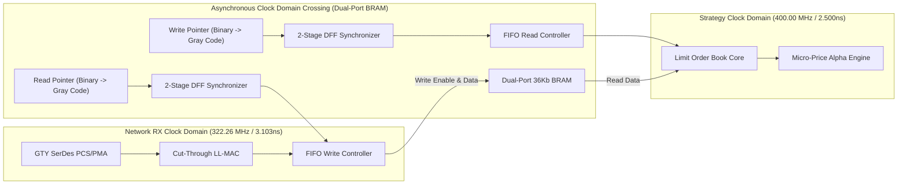

> [!summary]
> Clock Domain Crossing (CDC) and Timing Closure are the most critical hardware engineering challenges in FPGA trading systems. High-speed SmartNICs interface a 322.26 MHz Ethernet transceiver clock domain with a 250 MHz / 400 MHz strategy clock domain. By implementing multi-stage dual-flip-flop synchronizers, Gray-code pointer asynchronous FIFOs, and resolving setup/hold timing violations, hardware pipelines achieve zero-loss data transfer without metastability.

---

## Why it matters
In high-frequency FPGA trading:
- The **Physical Layer Transceiver (GTY SerDes)** recovers a clock directly from the 25Gbps optical bitstream, running synchronously at **$322.26\text{ MHz}$** ($T_{\text{clk}} = 3.103\text{ ns}$).
- The **Strategy Alpha & Book Engine** often runs on an independent, internal clock domain (e.g. **$250\text{ MHz}$ or $400\text{ MHz}$**) synthesized from an on-board crystal oscillator via a Phase-Locked Loop (PLL / MMCM).

Crossing signals between these asynchronous clock domains without proper hardware synchronizers causes **Metastability**:
- A flip-flop input changes during its setup or hold time window.
- The flip-flop enters an intermediate, undefined voltage state between '0' and '1', oscillating unpredictably for nanoseconds.
- In production, metastability causes **corrupted order IDs, duplicate trade signals, and catastrophic FPGA fabric crashes**.



---

## Mechanism

### 1. The Physics of Metastability & The MTBF Law
When a signal transitions within the setup time ($T_{\text{setup}}$) or hold time ($T_{\text{hold}}$) of a destination flip-flop:
$$\text{Metastable State Duration}: \quad V_{\text{out}}(t) \approx V_{\text{mid}} \cdot e^{\frac{t}{\tau}}$$
- The **Mean Time Between Failures (MTBF)** for an unsynchronized asynchronous signal crossing is given by:
$$\text{MTBF} = \frac{e^{\frac{T_{\text{slack}}}{\tau}}}{T_{\text{window}} \cdot f_{\text{clk}} \cdot f_{\text{data}}}$$
- In a 25G trading pipeline processing 30 million packets/second, an unsynchronized CDC will suffer a **metastability failure every few minutes!**

### 2. Multi-Stage Dual-Flip-Flop Synchronizer (1-Bit Signals)
For slow 1-bit control signals (e.g. `kill_switch_active`, `link_up`), pass the signal through two cascaded flip-flops in the destination clock domain:
```verilog
// 2-Stage DFF Synchronizer for Single-Bit CDC
module sync_1bit (
    input  wire clk_dest,
    input  wire async_sig,
    output wire sync_sig
);
    (* ASYNC_REG = "TRUE" *) reg stage1, stage2;

    always @(posedge clk_dest) begin
        stage1 <= async_sig;
        stage2 <= stage1;
    end

    assign sync_sig = stage2;
endmodule
```
- Setting the synthesis attribute `(* ASYNC_REG = "TRUE" *)` forces the FPGA placement tool (Vivado) to place both flip-flops in the **exact same Slice**, maximizing setup slack and increasing MTBF to **$>10,000\text{ years}$**.

### 3. Multi-Bit Data CDC: Gray-Code Asynchronous FIFO
- You cannot use dual-flip-flops for multi-bit data buses (e.g. 128-bit AXI words), because different bits experience slight routing delay skews, causing the destination domain to capture an invalid intermediate value (e.g., transitioning $0111_2 \to 1000_2$ might be read as $0000_2$ or $1111_2$).
- **The Solution: Gray Code Pointer Synchronizer**:
  1. Data is written into a Dual-Port Block RAM (BRAM).
  2. The Write and Read pointers are converted to **Gray Code**, where **only a single bit changes per increment** ($00 \to 01 \to 11 \to 10$).
  3. The Gray-code pointers are passed through 2-stage synchronizers across clock domains to safely compute `FIFO_FULL` and `FIFO_EMPTY` flags with **zero data corruption**.

---

## In Practice

### High-Speed Gray-Code Asynchronous FIFO in SystemVerilog

```systemverilog
`timescale 1ns / 1ps

module async_fifo_322_to_400 #(
    parameter DATA_WIDTH = 128,
    parameter ADDR_WIDTH = 4   // Depth = 16 entries
)(
    // Write Domain (322.26 MHz Ethernet Clock)
    input  wire                   wr_clk,
    input  wire                   wr_rst_n,
    input  wire                   wr_en,
    input  wire [DATA_WIDTH-1:0]  wr_data,
    output wire                   full,

    // Read Domain (400.00 MHz Strategy Clock)
    input  wire                   rd_clk,
    input  wire                   rd_rst_n,
    input  wire                   rd_en,
    output wire [DATA_WIDTH-1:0]  rd_data,
    output wire                   empty
);

    localparam DEPTH = 1 << ADDR_WIDTH;

    // Dual-Port RAM Memory Array (Inferred BRAM/LUTRAM)
    reg [DATA_WIDTH-1:0] mem [0:DEPTH-1];

    reg [ADDR_WIDTH:0] wr_ptr_bin, wr_ptr_gray;
    reg [ADDR_WIDTH:0] rd_ptr_bin, rd_ptr_gray;

    (* ASYNC_REG = "TRUE" *) reg [ADDR_WIDTH:0] wr_gray_sync1, wr_gray_sync2;
    (* ASYNC_REG = "TRUE" *) reg [ADDR_WIDTH:0] rd_gray_sync1, rd_gray_sync2;

    // 1. WRITE CLOCK DOMAIN LOGIC (322 MHz)
    always @(posedge wr_clk or negedge wr_rst_n) begin
        if (!wr_rst_n) begin
            wr_ptr_bin  <= 0;
            wr_ptr_gray <= 0;
        end else if (wr_en && !full) begin
            mem[wr_ptr_bin[ADDR_WIDTH-1:0]] <= wr_data;
            wr_ptr_bin  <= wr_ptr_bin + 1'b1;
            wr_ptr_gray <= (wr_ptr_bin + 1'b1) ^ ((wr_ptr_bin + 1'b1) >> 1); // Binary to Gray
        end
    end

    // 2. READ CLOCK DOMAIN LOGIC (400 MHz)
    always @(posedge rd_clk or negedge rd_rst_n) begin
        if (!rd_rst_n) begin
            rd_ptr_bin  <= 0;
            rd_ptr_gray <= 0;
        end else if (rd_en && !empty) begin
            rd_ptr_bin  <= rd_ptr_bin + 1'b1;
            rd_ptr_gray <= (rd_ptr_bin + 1'b1) ^ ((rd_ptr_bin + 1'b1) >> 1); // Binary to Gray
        end
    end

    assign rd_data = mem[rd_ptr_bin[ADDR_WIDTH-1:0]];

    // 3. SYNCHRONIZE POINTERS ACROSS DOMAINS (2-Stage DFF)
    always @(posedge wr_clk) begin
        rd_gray_sync1 <= rd_ptr_gray;
        rd_gray_sync2 <= rd_gray_sync1;
    end

    always @(posedge rd_clk) begin
        wr_gray_sync1 <= wr_ptr_gray;
        wr_gray_sync2 <= wr_gray_sync1;
    end

    // 4. FULL & EMPTY FLAG GENERATION
    assign empty = (rd_ptr_gray == wr_gray_sync2);
    assign full  = (wr_ptr_gray == {~rd_gray_sync2[ADDR_WIDTH:ADDR_WIDTH-1], rd_gray_sync2[ADDR_WIDTH-2:0]});

endmodule
```

---

## Timing Closure Physics & Constraints

### 1. The Setup & Hold Time Equation
For an FPGA pipeline operating at 322.26 MHz ($T_{\text{clk}} = 3.103\text{ ns}$):
$$T_{\text{slack}} = T_{\text{clk}} - (T_{\text{cq}} + T_{\text{logic}} + T_{\text{routing}} + T_{\text{setup}}) \ge \mathbf{0.00\text{ ns}}$$

| Timing Component | Typical AMD UltraScale+ Value | Description |
| :--- | :--- | :--- |
| **Clock Period ($T_{\text{clk}}$)** | **$3.103\text{ ns}$** | 322.26 MHz Ethernet clock. |
| **Clock-to-Out ($T_{\text{cq}}$)** | **$\sim 0.09\text{ ns}$** | Flip-flop output propagation delay. |
| **Logic Delay ($T_{\text{logic}}$)** | **$\sim 0.85\text{ ns}$** | Delay through 2–3 LUT6 levels and Carry Chains (`CARRY8`). |
| **Routing Delay ($T_{\text{routing}}$)**| **$\sim 1.85\text{ ns}$** | Physical copper wire transit across FPGA silicon dies (SLRs). |
| **Setup Time ($T_{\text{setup}}$)** | **$\sim 0.06\text{ ns}$** | Destination flip-flop setup window. |
| **Total Slack ($T_{\text{slack}}$)** | **$\mathbf{\approx +0.253\text{ ns}}$** | **Timing Closed Successfully!** |

### 2. XDC Timing Constraints for CDC
Tell the Vivado timing analyzer to ignore false timing paths between asynchronous clock domains, while setting max delay constraints on Gray pointers:
```tcl
# Define primary clocks
create_clock -period 3.103 -name clk_net_322 [get_ports wr_clk]
create_clock -period 2.500 -name clk_strat_400 [get_ports rd_clk]

# Set Asynchronous Clock Groups (Prevents timing engine from reporting false paths)
set_clock_groups -asynchronous -group [get_clocks clk_net_322] -group [get_clocks clk_strat_400]

# Constrain Gray pointer bus skew across CDC
set_max_delay -from [get_cells wr_ptr_gray_reg*] -to [get_cells wr_gray_sync1_reg*] 3.103 -datapath_only
```

---

## Trade-offs

| CDC Architecture | Latency Overhead | Logic / Resource Usage | Robustness |
| :--- | :--- | :--- | :--- |
| **Gray-Code Async FIFO** | **2–3 clock cycles (~6.2–9.3 ns)** | Moderate (Dual-Port BRAM + Registers) | **100% Robust ($MTBF > 10^5\text{ yrs}$)** |
| **Single-Clock Synchronous Pipeline** | **0.00 ns CDC overhead** | Minimal (Standard registers) | Requires entire FPGA to run at 322 MHz (hard to close timing). |
| **Handshake Protocol (Req/Ack)** | High (5–8 cycles / >20 ns) | Low | Overly slow for tick-to-trade streaming. |

---

> [!warning] Gotchas
> 1. **Multi-Die Super Logic Region (SLR) Crossing Latency**: On large FPGAs (e.g. Xilinx Virtex UltraScale+ VU9P), crossing an SLR inter-die boundary adds **~1.5 to 2.5ns of routing delay**. *Always insert dedicated pipeline flip-flops (`register slices`) directly on SLR crossing wires to close timing at 322 MHz.*
> 2. **Missing `(* ASYNC_REG = "TRUE" *)` Attributes**: If omitted, the FPGA placer might place the two synchronizer flip-flops in distant slices across the chip, causing the routing delay between the two stages to exceed $T_{\text{clk}}$, completely defeating the synchronizer!

---

## Lab
**Objective**: Build and simulate an asynchronous FIFO in SystemVerilog transferring 128-bit ITCH market data packets from a 322.26 MHz network clock domain to a 400.00 MHz strategy clock domain, verifying zero data loss across 1,000,000 packets.

**Success Criteria**:
1. Implement Gray-code pointer CDC logic in synthesizable SystemVerilog.
2. Run ModelSim / QuestaSim testbench with randomized write/read delays.
3. Verify that 100% of data words are read in exact sequence with zero metastability glitches.

---

> [!question]- Self-test
> 1. **What is Metastability in FPGA digital circuits and why is it dangerous in low-latency trading?**
>    *Answer*: Metastability occurs when an input signal to a flip-flop transitions within its setup or hold time window. The flip-flop enters an unstable intermediate voltage state, oscillating between logic '0' and '1' for an indeterminate duration. In trading systems, metastability results in corrupted price/order IDs, desynchronized FIFO pointers, or dropped execution frames.
> 2. **Why must multi-bit data buses use Gray code pointers rather than binary counters when crossing clock domains?**
>    *Answer*: In binary counters, transitioning between values often flips multiple bits simultaneously (e.g. $0111_2 \to 1000_2$ flips all 4 bits). Due to physical routing skew, the destination clock domain may capture some bit transitions before others, reading an invalid intermediate state. In Gray code, **only one bit changes per increment** ($00 \to 01 \to 11 \to 10$), guaranteeing that even if a transition occurs during a clock edge, the destination domain reads either the old valid value or the new valid value, with zero corrupted data.
> 3. **What is the purpose of the `(* ASYNC_REG = "TRUE" *)` synthesis attribute in FPGA RTL?**
>    *Answer*: `(* ASYNC_REG = "TRUE" *)` instructs the FPGA placement tool to place the two synchronizer flip-flops as physically close together as possible (inside the same logic slice). This minimizes routing delay between the two stages, maximizing the available settling time for any metastable condition to resolve and increasing the circuit's Mean Time Between Failures (MTBF) to over 10,000 years.

---

## Related Notes
- [[12 - FPGAs & Hardware Acceleration/FPGA Architecture Fundamentals for Trading]]
- [[12 - FPGAs & Hardware Acceleration/Network MAC-PHY and Transceiver Pipeline]]
- [[12 - FPGAs & Hardware Acceleration/FPGA Feed Handlers and Parsing Pipelines]]
- [[04 - Hardware Mechanical Sympathy/Latency Numbers Every Trading Engineer Knows]]
- [[14 - Industry Map & Canon/MOC - 14 Industry Map & Canon]]

## Sources
- [[Sources/AMD Xilinx UltraScale+ Architecture Manual]]
- [[Sources/Synthesis and Scripting Techniques for Designing Multi-Asynchronous Clock Designs by Clifford Cummings]]
- [[Sources/Systems Performance by Brendan Gregg]]
