> [!summary]
> In electronic trading, Field-Programmable Gate Arrays (FPGAs) replace sequential CPU von Neumann execution with dedicated spatial hardware pipelines. By processing network packets directly in custom silicon registers at line rate (322 MHz), FPGAs achieve a wire-to-wire Tick-to-Trade latency of under 180 nanoseconds with absolute, zero-jitter determinism ($p50 = p99.99$).

---

## Why it matters
In high-frequency market making and cross-venue arbitrage, winning the queue position race requires sub-microsecond execution determinism.

While modern x86-64 CPUs are exceptionally fast:
- A CPU relies on **sequential instruction fetching, cache hierarchies, branch predictors, and PCIe bus traversals**.
- A sudden L3 cache miss, branch misprediction, or PCIe DMA contention injects **200 to 2,000 nanoseconds of unpredictable tail jitter ($p99.9$)**.

An FPGA operates via **Spatial Computing**:
- Thousands of hardware logic gates execute in parallel on every clock cycle.
- Incoming optical bits stream from the transceiver directly into parsing registers **without traversing a PCIe bus or operating system**.
- Latency is strictly fixed by the number of clock cycles in the hardware pipeline: **Jitter is zero.**

```mermaid
flowchart TD
    subgraph CPU_Pipeline ["1. Optimized C++ CPU Architecture (~650 - 1,200 ns + Jitter)"]
        SFP1[SFP28 Ingress] --> PHY1[PHY SerDes]
        PHY1 --> MAC1[NIC MAC & DMA Engine]
        MAC1 ==>|PCIe Gen4 DMA Bus: ~200ns| RAM1[Host RAM HugePages]
        RAM1 --> CPU[CPU Core: Decode -> Book -> Risk -> OUCH]
        CPU ==>|PCIe PIO Push: ~150ns| MAC1_TX[NIC TX Doorbell]
        MAC1_TX --> SFP1_TX[SFP28 Egress]
    end

    subgraph FPGA_Pipeline ["2. Pure FPGA Hardware Pipeline (~120 - 180 ns Deterministic)"]
        SFP2[SFP28 Ingress] --> GTY[GTY SerDes / Low-Latency MAC]
        GTY --> PIPE["Hardware Pipeline (AXI4-Stream @ 322 MHz):\n• Zero-Copy Struct Unpack (1 Cycle: 3.1ns)\n• Book & Stoikov Signal (2 Cycles: 6.2ns)\n• Bump-in-Wire Risk Check (1 Cycle: 3.1ns)\n• OUCH Frame Builder (2 Cycles: 6.2ns)"]
        PIPE --> TX_MAC[Hardware TX MAC / 10G PCS]
        TX_MAC --> SFP2_TX[SFP28 Egress]
    end
```



---

## Mechanism

### 1. Architectural Comparison: Von Neumann CPU vs Spatial FPGA

| Dimension | x86-64 CPU (Sapphire Rapids / Genoa) | FPGA (AMD Xilinx UltraScale+ / Agilex) |
| :--- | :--- | :--- |
| **Execution Paradigm** | Sequential Instructions (Von Neumann) | Spatial Hardware Circuits (Dedicated Silicon) |
| **Clock Frequency** | High: **3.8 – 4.5 GHz** ($0.22\text{ ns/cycle}$) | Moderate: **250 – 400 MHz** ($2.5–4.0\text{ ns/cycle}$) |
| **Concurrency** | 32–64 Cores (Hardware Threads) | Millions of Parallel Logic Gates & DSPs |
| **Network Ingress Path** | SFP $\to$ NIC ASIC $\to$ PCIe $\to$ Host RAM | SFP $\to$ Integrated GTY SerDes $\to$ Logic Registers |
| **Wire-to-Wire Latency** | **~550–850 ns** | **~120–180 ns (3x–5x Faster)** |
| **Tail Latency ($p99.99$)**| **~1,500–5,000 ns (Jitter Vulnerable)** | **~120–180 ns (Zero Jitter)** |
| **Development Cycle** | Fast: Hours/Days in C++20 | Slow: Weeks/Months in SystemVerilog / VHDL |

### 2. Why FPGAs Eliminate Latency Jitter
1. **No Instruction Cache / TLB Misses**: Logic gates are physically wired together; instructions do not exist.
2. **No Dynamic Branch Mispredictions**: All logical paths execute simultaneously in hardware; the winning branch is selected via multiplexer in 0 nanoseconds.
3. **No PCIe Bus Traversal on Hot Path**: The trading strategy sits directly between the optical input port and optical output port inside the same silicon chip.

### 3. The Hybrid CPU-FPGA Architecture (Industry Standard)
Because implementing complex statistical models (e.g. multi-variate regressions or machine learning) in Verilog is prohibitively expensive, tier-1 trading firms deploy a **Hybrid Partitioning Model**:
- **FPGA Domain**: Market data feed decoding, Top-of-Book maintenance, simple threshold alpha (cross-market micro-price sweeps), and "bump-in-the-wire" pre-trade risk gates.
- **CPU Domain**: Complex alpha modeling, portfolio optimization, parameter calibration, and drop-copy logging. The CPU continuously writes updated risk and pricing parameters into FPGA memory-mapped registers via PCIe.

---

## In Practice

### High-Speed Tick-to-Trade Path Partitioning Matrix

```text
+-----------------------------------------------------------------------------------+
|                            HYBRID TRADING ARCHITECTURE                            |
+-----------------------------------------------------------------------------------+
| [ FAST PATH: Pure FPGA Silicon (<150 ns) ]                                        |
|                                                                                   |
|  Optical RX ---> [ GTY Transceiver ] ---> [ ITCH Parser ]                         |
|                                                  |                                |
|                                           [ L3 Order Book ]                       |
|                                                  |                                |
|                                           [ Imbalance Alpha ]                     |
|                                                  |                                |
|  Optical TX <--- [ Low-Latency MAC ] <--- [ Pre-Trade Risk ]                      |
+-----------------------------------------------------------------------------------+
                                   | (PCIe DMA Async Stream)
                                   v
+-----------------------------------------------------------------------------------+
| [ SLOW PATH: Multi-Core Linux CPU (Milliseconds / Microseconds) ]                |
|                                                                                   |
|  - Quantitative Alpha Parameter Calibration (Python / C++20)                      |
|  - Complex Multi-Factor Fair Value Calculation                                    |
|  - Historical Logging & Drop Copy Cleared Feeds                                  |
|  - Updates FPGA Pricing Registers over PCIe BAR0 MMIO                             |
+-----------------------------------------------------------------------------------+
```

---

## Numbers

*Hardware Baseline: AMD Xilinx Virtex UltraScale+ VU9P @ 322.26 MHz vs Intel Xeon Sapphire Rapids @ 4.0 GHz.*

| Pipeline Stage | C++ CPU Kernel Bypass | FPGA Hardware Implementation | Latency Advantage |
| :--- | :--- | :--- | :--- |
| **Transceiver & MAC Ingress** | ~120–180 ns | **~28–35 ns (Ultra-Low Latency MAC)**| **5x Faster** |
| **PCIe Ingress DMA to Host** | ~150–220 ns | **0 ns (Bypassed Completely)** | **Eliminated** |
| **Protocol Parsing (ITCH/SBE)**| ~12–18 ns | **~3.1–6.2 ns (1–2 Clock Cycles)** | **3x Faster** |
| **Top-of-Book Update** | ~15–25 ns | **~3.1 ns (1 Clock Cycle)** | **6x Faster** |
| **Pre-Trade Risk Verification**| ~12–18 ns | **~3.1 ns (Single-Cycle DSP Compare)**| **4x Faster** |
| **Outbound Order Formatting** | ~14–22 ns | **~6.2 ns (2 Clock Cycles)** | **3x Faster** |
| **PCIe Egress Doorbell Push** | ~110–180 ns | **0 ns (Direct Transceiver Egress)** | **Eliminated** |
| **TOTAL WIRE-TO-WIRE T2T** | **~550–820 ns** | **~125–175 ns** | **4.5x FASTER** |

---

## Trade-offs

| Platform Choice | Competitive Advantages | Engineering Constraints |
| :--- | :--- | :--- |
| **Pure FPGA Pipeline** | **Lowest possible latency (<150ns)**; absolute zero jitter. | Extremely complex RTL debugging; long compile/synthesis times (2–6 hours). |
| **Optimized C++ CPU** | Rapid feature development; complex mathematical models. | Subject to PCIe bus latency and tail jitter ($p99.9 > 1.5\text{ µs}$). |
| **Hybrid CPU-FPGA** | Sub-150ns execution with CPU-driven parameter flexibility. | Requires designing custom PCIe DMA drivers and memory-mapped control registers. |

---

> [!warning] Gotchas
> 1. **Timing Closure Synthesis Failures**: Adding complex logic to an FPGA design can increase propagation delay between flip-flops, causing setup time violations during place-and-route. The developer must manually insert pipeline register stages, which increases cycle latency.
> 2. **Metastability on Clock Domain Crossings (CDC)**: Passing signals between the 322 MHz network clock domain and the 250 MHz PCIe clock domain without proper multi-stage synchronizers or asynchronous FIFOs causes **metastable bit corruption**, silently modifying order prices or sequence numbers.

---

## Lab
**Objective**: Calculate the exact clock cycle budget for a 25G Ethernet FPGA tick-to-trade pipeline running at 322.26 MHz, determining the maximum permissible logic depth per pipeline stage to ensure zero timing violations.

**Success Criteria**:
1. Calculate clock period at 322.26 MHz down to picoseconds ($T = 3.103\text{ ns}$).
2. Partition the pipeline across 6 discrete clock cycles (Ingress MAC $\to$ Parse $\to$ Book $\to$ Alpha $\to$ Risk $\to$ TX MAC).
3. Prove that total silicon turnaround latency is **under 20 nanoseconds**.

---

> [!question]- Self-test
> 1. **Why does an FPGA achieve significantly lower wire-to-wire latency than an optimized C++ program running on a 4.5 GHz CPU?**
>    *Answer*: An FPGA eliminates the PCIe bus traversal (~350–400 ns round-trip) and OS network stack entirely by connecting the optical network transceivers (GTY SerDes) directly to custom hardware logic registers on the same chip. In addition, the FPGA executes protocol parsing, order book updating, alpha calculation, and risk filtering concurrently in dedicated hardware clock cycles (10–20 ns total silicon delay), whereas the CPU must process steps sequentially and fetch data across cache hierarchies.
> 2. **Why are FPGAs characterized by "Zero Tail Latency Jitter" ($p50 = p99.99$)?**
>    *Answer*: FPGAs are synchronous hardware state machines where every operation executes in a strictly fixed number of clock cycles. There are no operating system context switches, CPU interrupts, dynamic branch mispredictions, cache misses, or garbage collection pauses. As a result, if an FPGA pipeline is designed to execute in 40 clock cycles, every single packet will complete in exactly 40 clock cycles (124 nanoseconds), guaranteeing identical latency across all percentiles.
> 3. **What is the standard "Hybrid CPU-FPGA" architecture used by quantitative trading firms?**
>    *Answer*: In a hybrid architecture, the ultra-fast, simple tasks (market data feed decoding, basic Top-of-Book tracking, order formatting, and pre-trade risk checks) run entirely inside the FPGA silicon for sub-150ns execution. The complex mathematical algorithms, quantitative machine learning models, and portfolio risk calculations run on host CPU cores in C++, which periodically push updated pricing thresholds, volatility skews, and risk parameters to the FPGA via PCIe memory-mapped I/O (MMIO).

---

## Related
- [[12 - FPGAs & Hardware Acceleration/FPGA Architecture Fundamentals for Trading]]
- [[12 - FPGAs & Hardware Acceleration/RTL Verilog-VHDL vs High-Level Synthesis HLS]]
- [[12 - FPGAs & Hardware Acceleration/Network MAC-PHY and Transceiver Pipeline]]
- [[11 - Participant-Side Systems/Tick-to-Trade Critical Path Optimization]]
- [[12 - FPGAs & Hardware Acceleration/MOC - 12 FPGAs & Hardware Acceleration]]

## Sources
- [[Sources/FPGA-Based Trading Systems Architecture]]
- [[Sources/AMD Xilinx UltraScale+ Architecture Manual]]
- [[Sources/How to Build an Exchange by Jane Street]]
