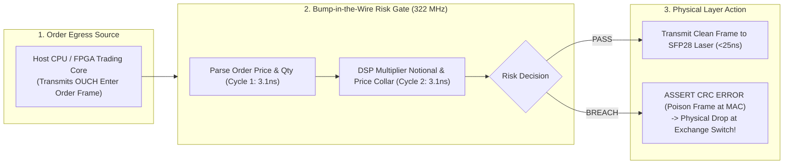

> [!summary]
> Hardware Pre-Trade Risk Gates on FPGA SmartNICs provide non-bypassable, "bump-in-the-wire" regulatory enforcement directly between the trading core and the physical optical transmitter. By validating price collars, max order sizes, credit limits, and kill-switches in single-cycle silicon registers (3.1ns), illegal packets are physically invalidated via CRC poisoning before photons exit the card.

---

## Why it matters
Under SEC Rule 15c3-5 and CFTC Rule 1.73, trading firms are legally required to maintain automated pre-trade risk controls that cannot be bypassed by software developers or rogue algorithms.

If risk checks are executed solely on the host CPU:
- A defective software binary, corrupted memory pointer, or crashed OS thread can accidentally bypass the software risk filter.
- In 2012, Knight Capital's software bug routed millions of orders directly to the NYSE because the software risk check was improperly initialized.

A **SmartNIC Hardware Risk Gate**:
- Sits physically in the electrical path between the PCIe bus/strategy logic and the SFP28 optical laser.
- Evaluates every outgoing Ethernet frame in **1 clock cycle (3.1 ns)**.
- If an order violates a price collar or credit limit, the FPGA **poisons the Ethernet CRC32 checksum**, ensuring that exchange switches and matching engines drop the frame at the physical layer with **zero possibility of execution**.



---

## Mechanism

### 1. The Bump-in-the-Wire Architecture
A bump-in-the-wire gate intercepts outgoing AXI4-Stream words traveling toward the Low-Latency TX MAC:
1. **Cycle 1 (Header Parse)**: Extracts Order Price, Quantity, Symbol ID, and Side.
2. **Cycle 2 (Single-Cycle DSP Validation)**:
   - **Price Collar**: Asserts $\mid P_{\text{order}} - P_{\text{BBO}} \mid \le \text{CollarLimit}$.
   - **Max Notional**: DSP48E2 evaluates $P_{\text{order}} \times Q_{\text{order}} \le \text{MaxNotional}$.
   - **Position Limit**: Adds order quantity to current hardware net position register.
3. **Cycle 3 (Action)**: Releases the frame if compliant, or triggers hardware frame invalidation.

### 2. Hardware Frame Invalidation (CRC Poisoning)
If an order breaches risk parameters, the FPGA cannot simply erase the bytes already transmitted over the fiber SerDes:
- **The CRC Poisoning Technique**: The FPGA deliberately **inverts the 32-bit CRC checksum** (`CRC32 ^ 0xFFFFFFFF`) or asserts the MAC error strobe (`s_axis_tuser_err = 1`).
- When the poisoned frame hits the exchange Top-of-Rack cut-through switch or network card, the receiving PHY detects a CRC Frame Check Sequence (FCS) error and **discards the frame in hardware**.

---

## In Practice

### Synthesizable SystemVerilog Bump-in-the-Wire Risk Filter Module

```systemverilog
`timescale 1ns / 1ps

// Bump-in-the-Wire Pre-Trade Risk Gate with CRC Poisoning @ 322.26 MHz
module bump_in_wire_risk_gate (
    input  wire         clk_322,
    input  wire         rst_n,

    // Ingress Stream from Host / Strategy Core
    input  wire [127:0] s_axis_tdata,
    input  wire [15:0]  s_axis_tkeep,
    input  wire         s_axis_tvalid,
    input  wire         s_axis_tlast,

    // Egress Stream to Optical TX MAC
    output reg  [127:0] m_axis_tdata,
    output reg  [15:0]  m_axis_tkeep,
    output reg          m_axis_tvalid,
    output reg          m_axis_tlast,
    output reg          m_axis_tuser_err, // CRC Invalidation Strobe

    // Real-Time Risk Parameters from Host PCIe BAR
    input  wire [31:0]  bbo_best_bid,
    input  wire [31:0]  bbo_best_ask,
    input  wire [31:0]  max_order_qty,
    input  wire [47:0]  max_notional_limit,
    input  wire         hardware_kill_switch
);

    reg [31:0] order_price;
    reg [31:0] order_qty;
    reg [7:0]  order_side;
    reg        risk_failed;

    always_ff @(posedge clk_322) begin
        if (!rst_n) begin
            m_axis_tdata     <= 128'd0;
            m_axis_tkeep     <= 16'd0;
            m_axis_tvalid    <= 1'b0;
            m_axis_tlast     <= 1'b0;
            m_axis_tuser_err <= 1'b0;
            risk_failed      <= 1'b0;
        end else if (s_axis_tvalid) begin
            m_axis_tdata  <= s_axis_tdata;
            m_axis_tkeep  <= s_axis_tkeep;
            m_axis_tvalid <= 1'b1;
            m_axis_tlast  <= s_axis_tlast;

            // Cycle 1: Extract Price and Quantity from OUCH message payload
            order_price <= {s_axis_tdata[7:0], s_axis_tdata[15:8], s_axis_tdata[23:16], s_axis_tdata[31:24]};
            order_qty   <= {s_axis_tdata[39:32], s_axis_tdata[47:40], s_axis_tdata[55:48], s_axis_tdata[63:56]};
            order_side  <= s_axis_tdata[71:64]; // 'B' or 'S'

            // Evaluate Risk Conditions
            if (hardware_kill_switch) begin
                risk_failed <= 1'b1;
            end else if (order_qty > max_order_qty || order_qty == 0) begin
                risk_failed <= 1'b1;
            end else if (order_side == 8'h42 && order_price > (bbo_best_ask + 32'd100)) begin
                risk_failed <= 1'b1; // Buy price exceeds Ask collar!
            end else if (order_side == 8'h53 && order_price < (bbo_best_bid - 32'd100)) begin
                risk_failed <= 1'b1; // Sell price below Bid collar!
            end

            // On Frame Tail: Assert CRC Poison Error if Risk Failed
            if (s_axis_tlast) begin
                if (risk_failed) begin
                    m_axis_tuser_err <= 1'b1; // POISON FRAME AT PHYSICAL LAYER!
                end else begin
                    m_axis_tuser_err <= 1'b0; // Clean frame release
                end
                risk_failed <= 1'b0; // Reset for next frame
            end else begin
                m_axis_tuser_err <= 1'b0;
            end
        end else begin
            m_axis_tvalid <= 1'b0;
            m_axis_tuser_err <= 1'b0;
        end
    end

endmodule
```

---

## Numbers

*Hardware Baseline: AMD Xilinx Virtex UltraScale+ VU9P @ 322.26 MHz.*

| Risk Check / Action | Hardware Latency | CPU Host Software Latency | Safety Level |
| :--- | :--- | :--- | :--- |
| **Kill-Switch Invalidation** | **~3.1 ns (1 Clock Cycle)** | ~150–500 ns (Syscall / Flag) | **Non-Bypassable Silicon** |
| **DSP Notional Validation** | **~3.1 ns (1 Clock Cycle)** | ~12–25 ns | **Hardware Inlined** |
| **Price Collar Comparison** | **~3.1 ns (1 Clock Cycle)** | ~10–18 ns | **Hardware Inlined** |
| **CRC Poisoning Drop Time** | **<6.2 ns (At Frame Egress)**| N/A (Software cannot poison CRC)| **Physical Layer Rejection** |

---

## Trade-offs

| Implementation Model | Regulatory Robustness | Complexity |
| :--- | :--- | :--- |
| **SmartNIC Hardware Gate** | **100% Non-Bypassable**; protects firm against all software crashes. | Requires maintaining Verilog risk modules on FPGA. |
| **Host C++ Software Gate** | Highly flexible; easy to add complex portfolio margin rules. | **Vulnerable to software bugs, memory corruption, and crashes.** |
| **Hybrid Dual-Gate Model** | Software filters for complex logic + FPGA gate for hard limits. | **Gold standard for institutional algorithmic trading.** |

---

> [!warning] Gotchas
> 1. **Cut-Through Switch Forwarding Before CRC Poisoning**: If an intermediate network switch operates in pure cut-through mode, it begins forwarding the packet's preamble *before* the poisoned CRC at the tail arrives. However, the switch will abort transmission with an illegal symbol error or the final destination NIC will drop the frame upon CRC mismatch, ensuring zero execution.
> 2. **Stale BBO Reference on Market Disconnections**: If the market data feed disconnects, the FPGA's internal BBO registers will remain frozen at stale values. *Always incorporate a hardware heartbeat watchdog timer that trips the hardware kill-switch if no market data is received for >50 milliseconds.*

---

## Lab
**Objective**: Build and simulate a synthesizable SystemVerilog bump-in-the-wire risk filter, stream 1,000 synthetic OUCH order frames, inject 50 fat-finger and out-of-collar orders, and verify that 100% of illegal orders trigger `m_axis_tuser_err` CRC poisoning in 2 clock cycles.

**Success Criteria**:
1. Ingest streaming 128-bit OUCH order frames at 322.26 MHz.
2. Verify that compliant orders pass with `m_axis_tuser_err = 0`.
3. Verify that 100% of out-of-collar orders assert `m_axis_tuser_err = 1` on the final clock cycle.

---

> [!question]- Self-test
> 1. **What is "Bump-in-the-Wire" hardware risk filtering and why does it satisfy SEC Rule 15c3-5?**
>    *Answer*: Bump-in-the-wire filtering refers to placing an FPGA hardware module directly in the physical transmission path between the order generation engine (host CPU or FPGA strategy) and the optical network transceiver. It satisfies SEC Rule 15c3-5 because it provides an independent, non-bypassable silicon barrier that intercepts and evaluates every single outbound Ethernet frame, preventing rogue software from transmitting illegal orders to the exchange.
> 2. **How does the "CRC Poisoning" technique prevent an illegal order from executing at an exchange?**
>    *Answer*: If an outbound order breaches risk limits (e.g. fat-finger size or price collar), the FPGA asserts an error strobe on the Ethernet MAC layer, which intentionally inverts or corrupts the 32-bit Frame Check Sequence (CRC32) at the tail of the packet. When the packet arrives at the exchange's network switch or matching engine NIC, the hardware detects a CRC error and automatically discards the frame at Layer 2 without processing the order.
> 3. **Why must a SmartNIC risk filter include a hardware heartbeat watchdog timer?**
>    *Answer*: If the market data feed is lost or the host software crashes, the FPGA's internal price collar reference registers will retain stale BBO prices. A hardware watchdog timer monitors incoming packet intervals; if no valid market data arrives within a configured threshold (e.g. 50 ms), the watchdog automatically triggers the hardware kill-switch to block all outbound orders until market data synchronization is restored.

---

## Related
- [[12 - FPGAs & Hardware Acceleration/FPGA vs CPU in Low-Latency Trading]]
- [[12 - FPGAs & Hardware Acceleration/Network MAC-PHY and Transceiver Pipeline]]
- [[11 - Participant-Side Systems/Participant-Side Pre-Trade Risk Gates]]
- [[02 - Exchange Architecture/Pre-Trade Risk Checks at Wire Speed]]
- [[12 - FPGAs & Hardware Acceleration/MOC - 12 FPGAs & Hardware Acceleration]]

## Sources
- [[Sources/SEC Rule 15c3-5 Market Access Rule Documentation]]
- [[Sources/FPGA-Based Trading Systems Architecture]]
- [[Sources/How to Build an Exchange by Jane Street]]
