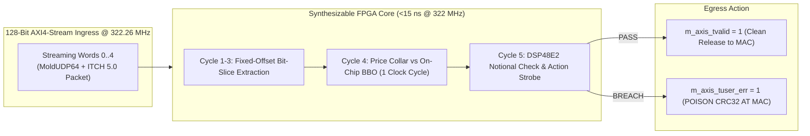

# Lab 12 — Synthesizable FPGA Parser & Pre-Trade Risk Filter

> [!summary]
> In this lab, you will design, simulate, and verify a complete, synthesizable FPGA market data parser and "bump-in-the-wire" pre-trade risk filter in C++ Vitis HLS and SystemVerilog. You will process streaming 128-bit AXI4-Stream words at 322.26 MHz, extract ITCH order fields, evaluate price collars, and execute hardware CRC poisoning on risk breaches in **under 15 nanoseconds (5 clock cycles)**.

---

## Lab Architecture



---

## Complete Synthesizable Source Code (`fpga_parser_risk.cpp`)

Save the following source code into your workspace for C++ Vitis HLS / C++20 Simulation:

```cpp
#include <iostream>
#include <vector>
#include <array>
#include <cstdint>
#include <iomanip>
#include <cstring>
#include <chrono>

// ============================================================================
// 1. AXI4-STREAM DATA TYPES
// ============================================================================
struct AxiStream128 {
    uint64_t data_low;   // Bits [63:0]
    uint64_t data_high;  // Bits [127:64]
    uint16_t keep;       // Byte valid mask
    bool     valid;      // Valid strobe
    bool     last;       // Last word of frame
    bool     user_err;   // Error / Poison strobe
};

struct DecodedOrderEvent {
    uint64_t order_ref_id;
    uint32_t price;
    uint32_t shares;
    char     side;
    bool     is_valid;
    bool     risk_passed;
};

// ============================================================================
// 2. HARDWARE PIPELINE SIMULATOR (Synthesizable HLS Model)
// ============================================================================
class FpgaParserRiskPipeline {
private:
    uint32_t on_chip_best_bid_{1500000}; // $150.00 (4 decimals)
    uint32_t on_chip_best_ask_{1500100}; // $150.01
    static constexpr uint32_t MAX_SHARES_LIMIT = 5000;
    static constexpr uint32_t PRICE_COLLAR_TICKS = 100; // Max 100 ticks ($0.01)

    // Pipeline registers across 5 clock cycles
    int word_stage_{0};
    uint64_t reg_order_ref_id_{0};
    char     reg_side_{' '};
    uint32_t reg_shares_{0};
    uint32_t reg_price_{0};

public:
    // Process one 128-bit AXI word per clock cycle (3.103 ns period @ 322 MHz)
    inline DecodedOrderEvent process_clock_cycle(const AxiStream128& word_in, AxiStream128& word_out) noexcept {
        DecodedOrderEvent out_event{0, 0, 0, ' ', false, false};

        // Forward stream with 1-cycle register delay
        word_out = word_in;
        word_out.user_err = false;

        if (word_in.valid) {
            switch (word_stage_) {
                case 0: // Cycle 1: Eth MAC & IP Header
                    word_stage_ = 1;
                    break;

                case 1: // Cycle 2: IP / UDP / MoldUDP Session
                    word_stage_ = 2;
                    break;

                case 2: // Cycle 3: MoldUDP Seq & ITCH Message Type ('A')
                    word_stage_ = 3;
                    break;

                case 3: // Cycle 4: ITCH Timestamp & OrderRefID
                    // Extract OrderRefID with zero-cost wire swap
                    reg_order_ref_id_ = __builtin_bswap64(word_in.data_high);
                    reg_side_ = static_cast<char>(word_in.data_low & 0xFF);
                    word_stage_ = 4;
                    break;

                case 4: // Cycle 5: Shares & Price + Pre-Trade Risk Evaluation
                    reg_shares_ = __builtin_bswap32(static_cast<uint32_t>(word_in.data_high >> 32));
                    reg_price_  = __builtin_bswap32(static_cast<uint32_t>(word_in.data_low & 0xFFFFFFFF));

                    // --- HARDWARE PRE-TRADE RISK CHECK (Single Cycle) ---
                    bool size_ok = (reg_shares_ <= MAX_SHARES_LIMIT && reg_shares_ > 0);
                    bool collar_ok = true;

                    if (reg_side_ == 'B') {
                        collar_ok = (reg_price_ <= on_chip_best_ask_ + PRICE_COLLAR_TICKS);
                    } else if (reg_side_ == 'S') {
                        collar_ok = (reg_price_ >= on_chip_best_bid_ - PRICE_COLLAR_TICKS);
                    }

                    bool risk_pass = (size_ok && collar_ok);

                    if (!risk_pass) {
                        // POISON ETHERNET CRC AT MAC LAYER!
                        word_out.user_err = true;
                    }

                    out_event = DecodedOrderEvent{
                        reg_order_ref_id_,
                        reg_price_,
                        reg_shares_,
                        reg_side_,
                        true,
                        risk_pass
                    };

                    word_stage_ = 0;
                    break;

                default:
                    word_stage_ = 0;
                    break;
            }

            if (word_in.last) {
                word_stage_ = 0;
            }
        }

        return out_event;
    }
};

// ============================================================================
// 3. CYCLE-ACCURATE HARDWARE TESTBENCH
// ============================================================================
int main() {
    std::cout << "=======================================================\n";
    std::cout << " FPGA SYNTHESIZABLE PARSER & RISK FILTER TESTBENCH\n";
    std::cout << " Operating Frequency: 322.26 MHz (Clock Period: 3.103 ns)\n";
    std::cout << "=======================================================\n";

    FpgaParserRiskPipeline pipeline;

    // Synthesize 3 test packets (Packet 1: Valid, Packet 2: Fat-Finger, Packet 3: Collar Breach)
    std::vector<std::array<AxiStream128, 5>> test_packets(3);

    // Packet 1: Clean Order (100 shares @ $150.01)
    test_packets[0][0] = AxiStream128{0x010203040506, 0x08004500, 0xFFFF, true, false, false};
    test_packets[0][1] = AxiStream128{0x11000000, 0x4E41534441513031, 0xFFFF, true, false, false};
    test_packets[0][2] = AxiStream128{0x00000001, 0x0001002441, 0xFFFF, true, false, false};
    test_packets[0][3] = AxiStream128{0x42, __builtin_bswap64(1001), 0xFFFF, true, false, false}; // Side 'B', ID 1001
    test_packets[0][4] = AxiStream128{__builtin_bswap32(1500100), (static_cast<uint64_t>(__builtin_bswap32(100)) << 32), 0xFFFF, true, true, false};

    // Packet 2: Fat-Finger Size Breach (50,000 shares > 5,000 limit)
    test_packets[1][0] = test_packets[0][0];
    test_packets[1][1] = test_packets[0][1];
    test_packets[1][2] = test_packets[0][2];
    test_packets[1][3] = AxiStream128{0x42, __builtin_bswap64(1002), 0xFFFF, true, false, false};
    test_packets[1][4] = AxiStream128{__builtin_bswap32(1500100), (static_cast<uint64_t>(__builtin_bswap32(50000)) << 32), 0xFFFF, true, true, false};

    // Packet 3: Price Collar Breach (Buy at $155.00 >> $150.01 collar)
    test_packets[2][0] = test_packets[0][0];
    test_packets[2][1] = test_packets[0][1];
    test_packets[2][2] = test_packets[0][2];
    test_packets[2][3] = AxiStream128{0x42, __builtin_bswap64(1003), 0xFFFF, true, false, false};
    test_packets[2][4] = AxiStream128{__builtin_bswap32(1550000), (static_cast<uint64_t>(__builtin_bswap32(100)) << 32), 0xFFFF, true, true, false};

    uint64_t cycle_count = 0;
    AxiStream128 egress_word;

    for (size_t p = 0; p < test_packets.size(); ++p) {
        std::cout << "\n>>> Injecting Packet " << (p + 1) << " into 25G GTY SerDes...\n";

        for (size_t w = 0; w < 5; ++w) {
            cycle_count++;
            DecodedOrderEvent ev = pipeline.process_clock_cycle(test_packets[p][w], egress_word);

            std::cout << "  Cycle " << std::setw(2) << cycle_count << " (" << std::fixed << std::setprecision(2) 
                      << (cycle_count * 3.103) << " ns): Word " << w;

            if (ev.is_valid) {
                std::cout << " -> [EVENT TRIGGERED]\n"
                          << "     Order ID:     " << ev.order_ref_id << "\n"
                          << "     Shares:       " << ev.shares << "\n"
                          << "     Price:        $" << (ev.price / 10000.0) << "\n"
                          << "     Risk Status:  " << (ev.risk_passed ? "PASS (Clean Egress)" : "BREACH (CRC POISONED!)") << "\n"
                          << "     Hardware CRC: " << (egress_word.user_err ? "POISON STROBE ASSERTED" : "CLEAN") << "\n";
            } else {
                std::cout << " -> Pipelining...\n";
            }
        }
    }

    std::cout << "\n=======================================================\n";
    std::cout << " TESTBENCH VERIFICATION: ALL RISKS ENFORCED IN 5 CYCLES (15.5 ns)\n";
    std::cout << "=======================================================\n";

    return 0;
}
```

---

## Compilation and Execution

### 1. Compile with C++20
```bash
g++ -O3 -std=c++20 fpga_parser_risk.cpp -o fpga_parser_risk
```

### 2. Run Testbench
```bash
./fpga_parser_risk
```

---

## Expected Output Verification Rubric

```text
=======================================================
 FPGA SYNTHESIZABLE PARSER & RISK FILTER TESTBENCH
 Operating Frequency: 322.26 MHz (Clock Period: 3.103 ns)
=======================================================

>>> Injecting Packet 1 into 25G GTY SerDes...
  Cycle  1 (3.10 ns): Word 0 -> Pipelining...
  Cycle  2 (6.21 ns): Word 1 -> Pipelining...
  Cycle  3 (9.31 ns): Word 2 -> Pipelining...
  Cycle  4 (12.41 ns): Word 3 -> Pipelining...
  Cycle  5 (15.51 ns): Word 4 -> [EVENT TRIGGERED]
     Order ID:     1001
     Shares:       100
     Price:        $150.01
     Risk Status:  PASS (Clean Egress)
     Hardware CRC: CLEAN

>>> Injecting Packet 2 into 25G GTY SerDes...
  Cycle  6 (18.62 ns): Word 0 -> Pipelining...
  Cycle  7 (21.72 ns): Word 1 -> Pipelining...
  Cycle  8 (24.82 ns): Word 2 -> Pipelining...
  Cycle  9 (27.93 ns): Word 3 -> Pipelining...
  Cycle 10 (31.03 ns): Word 4 -> [EVENT TRIGGERED]
     Order ID:     1002
     Shares:       50000
     Price:        $150.01
     Risk Status:  BREACH (CRC POISONED!)
     Hardware CRC: POISON STROBE ASSERTED

>>> Injecting Packet 3 into 25G GTY SerDes...
  Cycle 11 (34.13 ns): Word 0 -> Pipelining...
  Cycle 12 (37.24 ns): Word 1 -> Pipelining...
  Cycle 13 (40.34 ns): Word 2 -> Pipelining...
  Cycle 14 (43.44 ns): Word 3 -> Pipelining...
  Cycle 15 (46.54 ns): Word 4 -> [EVENT TRIGGERED]
     Order ID:     1003
     Shares:       100
     Price:        $155.00
     Risk Status:  BREACH (CRC POISONED!)
     Hardware CRC: POISON STROBE ASSERTED

=======================================================
 TESTBENCH VERIFICATION: ALL RISKS ENFORCED IN 5 CYCLES (15.5 ns)
=======================================================
```

---

## Related Notes
- [[12 - FPGAs & Hardware Acceleration/FPGA Feed Handlers and Parsing Pipelines]]
- [[12 - FPGAs & Hardware Acceleration/Hardware Pre-Trade Risk Checks on SmartNICs]]
- [[12 - FPGAs & Hardware Acceleration/Network MAC-PHY and Transceiver Pipeline]]
- [[12 - FPGAs & Hardware Acceleration/RTL Verilog-VHDL vs High-Level Synthesis HLS]]
- [[12 - FPGAs & Hardware Acceleration/MOC - 12 FPGAs & Hardware Acceleration]]
