# MOC — 12 FPGAs & Hardware Acceleration

Hardware acceleration in electronic trading: FPGAs, SmartNICs, RTL vs. HLS, line-rate feed decoding, clock domain crossing, and hardware pre-trade risk checks.

```mermaid
flowchart LR
    OPT_IN[Optical Ingress] --> PHY[GTY SerDes PHY]
    PHY --> MAC[Cut-Through LL-MAC]
    MAC --> CDC[Async FIFO Clock Domain Crossing]
    CDC --> PARSE[Hardware ITCH/SBE Parser]
    PARSE --> BOOK[BRAM Order Book Core]
    BOOK --> ALPHA[DSP Micro-Price Alpha]
    ALPHA --> RISK[Bump-in-the-Wire Risk Gate]
    RISK --> TX_MAC[Hardware OUCH Formatter & TX MAC]
    TX_MAC --> OPT_OUT[Optical Egress]
```

---

## Core Concepts
- [[12 - FPGAs & Hardware Acceleration/FPGA vs CPU in Low-Latency Trading]] — Von Neumann CPU vs Spatial FPGA computing, wire-to-wire latency (<180ns), zero-jitter determinism ($p50=p99.99$).
- [[12 - FPGAs & Hardware Acceleration/FPGA Architecture Fundamentals for Trading]] — 6-input LUTs, Flip-Flops, BRAM (36Kb), UltraRAM (URAM 288Kb), DSP48E2 slices, 322.26 MHz network clock domain, timing closure.
- [[12 - FPGAs & Hardware Acceleration/FPGA Network Clock Domain Crossing and Timing Closure]] — 322 MHz network domain to 400 MHz strategy domain, Gray code asynchronous FIFOs, dual-flip-flop synchronizers, setup/hold slack equations.
- [[12 - FPGAs & Hardware Acceleration/RTL Verilog-VHDL vs High-Level Synthesis HLS]] — Register-Transfer Level (RTL) vs C++ Vitis HLS, Initiation Interval ($II=1$), array partitioning, development velocity trade-offs.
- [[12 - FPGAs & Hardware Acceleration/Network MAC-PHY and Transceiver Pipeline]] — SFP28 optics, GTY SerDes PMA/PCS layers, 64b/66b gearbox, cut-through streaming LL-MAC (<32ns ingress).
- [[12 - FPGAs & Hardware Acceleration/FPGA Feed Handlers and Parsing Pipelines]] — 128-bit AXI4-Stream parsing, zero-cost physical wire byte swapping, hardware A/B feed arbitration.
- [[12 - FPGAs & Hardware Acceleration/Hardware Pre-Trade Risk Checks on SmartNICs]] — Non-bypassable SEC 15c3-5 enforcement, single-cycle DSP price collars, CRC32 poisoning & frame invalidation.
- [[12 - FPGAs & Hardware Acceleration/PCIe DMA Engine Design for SmartNICs]] — PCIe Gen4/Gen5 TLP transport, Scatter-Gather DMA, Intel DDIO direct L3 cache injection, eliminating MMIO reads.

## Labs & Implementations
- [[12 - FPGAs & Hardware Acceleration/Lab - 12 Synthesizable FPGA Parser and Pre-Trade Risk Filter]] — Design a synthesizable C++ HLS / SystemVerilog module parsing binary ITCH and enforcing risk in <15ns (5 clock cycles).

## Drills & War Stories
- [[12 - FPGAs & Hardware Acceleration/Drill - 12 Hybrid CPU-FPGA Architecture Design]] — Principal systems design drill partitioning cross-asset CME-to-NASDAQ statistical arbitrage with full nanosecond budget calculations.

## Canonical Sources
- [[Sources/AMD Xilinx UltraScale+ Architecture Manual]] — Silicon hardware primitives specification.
- [[Sources/How to Build an Exchange by Jane Street]] — Production hardware and software trading infrastructure.
- [[Sources/Systems Performance by Brendan Gregg]] — Observability and hardware profiling.
