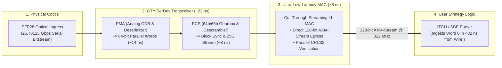

> [!summary]
> The FPGA Network MAC-PHY pipeline connects physical optical fiber transceivers (SFP28) directly to user logic registers. By replacing standard store-and-forward IEEE 802.3 MACs with Ultra-Low-Latency MACs (LL-MAC) that stream unbuffered AXI4-Stream words while computing CRC32 checksums in parallel, the total optical-to-register ingress delay is compressed to under 32 nanoseconds.

---

## Why it matters
Before an FPGA algorithm can inspect a single byte of an incoming market data packet:
- Serialized optical photon pulses must be converted to electrical signals, deserialized, descrambled, and framed into digital words.
- A standard commercial Ethernet MAC buffers the entire 1500-byte frame to verify the 32-bit CRC checksum, adding **over 1,200 nanoseconds of latency**.

In electronic trading, **Low-Latency MACs (LL-MAC)** bypass frame buffering:
- The MAC streams the packet's preamble and header into the parser **within 8 nanoseconds of the first bit hitting the SerDes**.
- Strategy logic evaluates pricing and generates orders **while the tail of the incoming packet is still arriving on the physical fiber**.



---

## Mechanism

### 1. Detailed Physical Layer (PHY/MAC) Traversal Breakdown

| Layer / Component | Physical Operation | Processing Method | Latency (ns) |
| :--- | :--- | :--- | :--- |
| **1. SFP28 Optical Module**| Photodiode photon-to-electron conversion | Analog Laser/PIN Diode | **~1.5–3.0 ns** |
| **2. GTY PMA Deserializer**| Clock and Data Recovery (CDR) + 1-to-64 Deserialization | Hard Silicon Analog Mixed-Signal | **~14.0–18.0 ns** |
| **3. GTY PCS Layer** | 64b/66b Block Sync, Descrambler, Alignment Markers | Hard Silicon Digital PCS | **~8.0–12.0 ns** |
| **4. Low-Latency MAC (LL-MAC)**| Strips Preamble, Start-of-Frame Delimiter (SFD) | Streaming Cut-Through Registers | **~5.0–8.0 ns** |
| **TOTAL INGRESS (Wire to Parser)**| **Complete Physical Ingress Pipeline** | **Silicon Hardware Path** | **~28.5–41.0 ns** |

### 2. Standard Store-and-Forward MAC vs Low-Latency Streaming MAC
- **Standard IEEE 802.3 MAC**: Ingests all 64 to 1500 bytes of the Ethernet frame into an internal FIFO, calculates the CRC32 Frame Check Sequence (FCS), verifies mathematical validity, and only then releases the first byte to user logic.
  $$\text{Standard MAC Latency} = \frac{\text{Frame Size (Bits)}}{25\text{ Gbps}} + \text{Internal Delay} \approx \mathbf{500–1,200\text{ ns}}$$
- **Low-Latency Cut-Through MAC (LL-MAC)**: Emits the destination MAC and IP header into user logic on the **very first clock cycle after the SFD arrives** ($3.1\text{ ns}$). It computes CRC32 in parallel; if the frame is corrupted, it asserts an error strobe (`rx_er`) on the final cycle, instructing the strategy to discard the speculative action.
  $$\text{LL-MAC Latency} = \mathbf{\sim 5–8\text{ ns (Constant across all packet sizes)}}$$

---

## In Practice

### Synthesizable SystemVerilog AXI4-Stream Interface from Low-Latency MAC

```systemverilog
`timescale 1ns / 1ps

// Ingests 128-bit AXI4-Stream words from Low-Latency 25G MAC at 322.26 MHz
module ll_mac_axis_ingress (
    input  wire         clk_322,          // 322.26 MHz Network Clock
    input  wire         rst_n,            // Active-low synchronous reset

    // AXI4-Stream Ingress from Low-Latency MAC Core
    input  wire [127:0] s_axis_tdata,     // 128-bit data word
    input  wire [15:0]  s_axis_tkeep,     // Byte valid mask
    input  wire         s_axis_tvalid,    // Data valid strobe
    input  wire         s_axis_tlast,     // End-of-frame indicator
    input  wire         s_axis_tuser_err, // Parallel CRC32 error flag

    // Clean Market Data Stream to Parser
    output reg  [127:0] m_axis_tdata,
    output reg          m_axis_tvalid,
    output reg          m_axis_tlast,
    output reg          frame_corrupt_drop
);

    always_ff @(posedge clk_322) begin
        if (!rst_n) begin
            m_axis_tdata       <= 128'd0;
            m_axis_tvalid      <= 1'b0;
            m_axis_tlast       <= 1'b0;
            frame_corrupt_drop <= 1'b0;
        end else begin
            // Direct register forwarding: exactly 1 clock cycle (3.103 ns)
            m_axis_tdata  <= s_axis_tdata;
            m_axis_tvalid <= s_axis_tvalid;
            m_axis_tlast  <= s_axis_tlast;

            // Handle parallel CRC32 error strobe on frame tail
            if (s_axis_tvalid && s_axis_tlast && s_axis_tuser_err) begin
                frame_corrupt_drop <= 1'b1; // Abort in-flight speculative state
            end else begin
                frame_corrupt_drop <= 1'b0;
            end
        end
    end

endmodule
```

---

## Numbers

*Hardware Baseline: AMD Xilinx UltraScale+ GTY Transceiver at 25.78125 Gbps.*

| MAC / PHY Configuration | Ingress Latency (Wire-to-User) | Egress Latency (User-to-Wire) | Cut-Through Mode |
| :--- | :--- | :--- | :--- |
| **Xilinx Low-Latency 25G Ethernet MAC** | **~28.5–32.0 ns** | **~24.0–28.0 ns** | **Yes (Zero-Buffering)** |
| **Enyx nxEnsemble 25G MAC Core** | **~24.5–27.0 ns** | **~21.0–24.0 ns** | **Yes (Direct Cut-Through)** |
| **Standard Xilinx AXI 10G/25G MAC** | **~180–450 ns** | **~150–380 ns** | No (FIFO Buffer Mode) |
| **Commercial Enterprise 25G ASIC** | **~1,200–3,500 ns** | **~1,000–2,800 ns** | Store-and-Forward |

---

## Trade-offs

| MAC Architecture | Latency Advantage | Operational Hazard |
| :--- | :--- | :--- |
| **Cut-Through Low-Latency MAC** | **Sub-30ns ingress**; stream-based parsing. | Delivers corrupted CRC frames to parser; requires speculative rollback logic. |
| **Standard Buffered MAC** | Guarantees only 100% valid CRC frames reach user logic. | **Catastrophically slow (500–1,200 ns penalty)**. |
| **Raw PCS Bypass MAC** | Absolute minimum latency (~20ns). | Custom framing; requires building custom Ethernet framing logic. |

---

> [!warning] Gotchas
> 1. **Speculative Execution on Cut-Through Corrupted Frames**: In cut-through LL-MACs, the parser processes headers before the frame CRC is verified. If lightning or optical noise corrupts a price field, the strategy might fire an erroneous order before the MAC asserts `s_axis_tuser_err`! *Ensure the outbound TX stage holds packet release until the final CRC strobe verifies valid framing.*
> 2. **GTY Transceiver Phase-Locked Loop (QPLL) Loss of Lock**: Transceiver PLLs require a high-stability reference clock (e.g. Si5345 with <100fs phase jitter). Using a jittery reference clock causes the QPLL to lose frequency lock during rapid temperature fluctuations in the server chassis, dropping optical links.

---

## Lab
**Objective**: Build an AXI4-Stream network ingress filter in SystemVerilog that receives streaming 128-bit words from a 25G Low-Latency MAC, extracts the Ethernet/IP/UDP header in Cycle 1, and aborts order execution if `s_axis_tuser_err` is asserted on the final cycle.

**Success Criteria**:
1. Ingest simulated 25G Ethernet frames over a 128-bit AXI-Stream interface at 322.26 MHz.
2. Demonstrate that Header Word 0 is forwarded to the parser in **exactly 1 clock cycle (3.1 ns)**.
3. Verify that frames with CRC errors trigger immediate speculative state rollback.

---

> [!question]- Self-test
> 1. **What is the difference between a Standard Store-and-Forward Ethernet MAC and a Cut-Through Low-Latency MAC (LL-MAC)?**
>    *Answer*: A standard MAC buffers the entire incoming Ethernet frame into an internal FIFO memory to calculate and verify the 32-bit CRC Frame Check Sequence (FCS) before releasing data, adding 500 to 1,200 nanoseconds of latency. A Low-Latency MAC streams incoming 64-bit or 128-bit words directly into user logic registers on the very first clock cycle (5–8 ns delay), computing the CRC in parallel and asserting an error flag on the final cycle if corruption occurred.
> 2. **What are the roles of the PMA and PCS layers inside an FPGA GTY Transceiver?**
>    *Answer*: The **PMA (Physical Medium Attachment)** is the analog mixed-signal layer that performs Clock and Data Recovery (CDR) and deserializes the incoming 25.78125 Gbps serial bitstream into 64-bit parallel words (~14–18 ns). The **PCS (Physical Coding Sublayer)** is the digital layer that performs 64b/66b block synchronization, alignment marker removal, and descrambling to yield standard Ethernet frames (~8–12 ns).
> 3. **Why must an FPGA trading engine implement speculative execution rollback when paired with a Cut-Through LL-MAC?**
>    *Answer*: Because a cut-through LL-MAC releases header bytes to the strategy engine hundreds of nanoseconds before the end of the packet (where the CRC checksum resides), the strategy parses and acts on data speculatively. If the final packet checksum fails, the MAC asserts an error strobe, requiring the trading engine to immediately cancel or drop the generated order before it is serialized onto the outbound wire.

---

## Related
- [[12 - FPGAs & Hardware Acceleration/FPGA vs CPU in Low-Latency Trading]]
- [[12 - FPGAs & Hardware Acceleration/FPGA Architecture Fundamentals for Trading]]
- [[12 - FPGAs & Hardware Acceleration/FPGA Feed Handlers and Parsing Pipelines]]
- [[06 - Networking/Network Interface Card Architecture]]
- [[12 - FPGAs & Hardware Acceleration/MOC - 12 FPGAs & Hardware Acceleration]]

## Sources
- [[Sources/AMD Xilinx UltraScale+ GTY Transceiver User Guide]]
- [[Sources/Enyx Low-Latency 25G Ethernet MAC Architecture]]
- [[Sources/FPGA-Based Trading Systems Architecture]]
