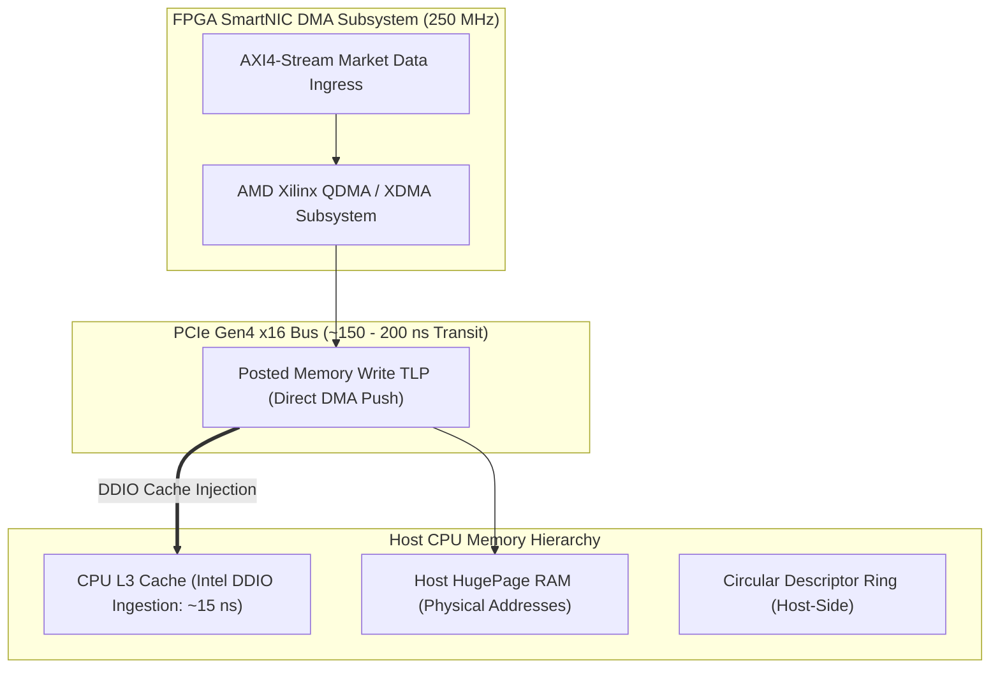

> [!summary]
> Direct Memory Access (DMA) engines on FPGA SmartNICs bridge the gap between high-speed physical network transceivers and host CPU memory. By utilizing PCIe Gen4/Gen5 Scatter-Gather DMA with Intel DDIO / AMD TPH cache injection and eliminating synchronous MMIO reads, an FPGA streams market data into host HugePages in under 200 nanoseconds.

---

## Why it matters
In hybrid trading architectures where the FPGA handles market data parsing while the host CPU runs quantitative alpha models:
- The speed of the system is strictly bounded by the **PCIe bus transfer latency**.
- If the CPU polls the FPGA using **Memory-Mapped I/O (MMIO) Reads**, every read request traverses the PCIe root complex and stalls the CPU execution pipeline for **800 to 1,500 nanoseconds**.

Designing high-performance **PCIe DMA engines**:
- Replaces polling MMIO reads with **FPGA-initiated DMA writes** into host memory.
- Uses **Intel Data Direct I/O (DDIO)** to inject packet descriptors directly into the CPU's L3 cache, achieving sub-200ns host delivery.



---

## Mechanism

### 1. PCIe Protocol Layer Breakdown

| PCIe Layer | Function | Latency Impact |
| :--- | :--- | :--- |
| **Transaction Layer (TLP)** | Forms Memory Read, Memory Write, and Completion Packets. | **~40–70 ns** |
| **Data Link Layer (DLLP)** | Generates CRC (LCRC) and manages ACK/NAK flow control. | **~20–30 ns** |
| **Physical Layer (PHY)** | 128b/130b encoding, SerDes serialization (Gen4: 16 GT/s). | **~40–60 ns** |
| **Host Root Complex** | Directs TLP into CPU interconnect / L3 cache. | **~50–80 ns** |
| **TOTAL PCIe ONE-WAY** | **Full Card-to-Host Transit Delay** | **~150–240 ns** |

### 2. The MMIO Read vs DMA Write Latency Trap
- **MMIO Read (Host $\to$ FPGA)**: The CPU issues an uncached non-posted read request across the PCIe bus and *freezes its instruction execution pipeline* waiting for the FPGA to return a Completion TLP with data. **Penalty: 800–1,500 ns!**
- **DMA Write (FPGA $\to$ Host)**: The FPGA pushes a posted Memory Write TLP directly into host RAM. The FPGA continues processing without waiting for an ACK. The CPU observes the arrival by reading its local cache. **Latency: ~150–200 ns.**

### 3. Direct Cache Injection (Intel DDIO / AMD TPH)
- **Without DDIO (Legacy DMA)**: DMA writes write directly to host DRAM. When the CPU thread attempts to read the packet, it misses L1, L2, and L3, suffering a 60ns DRAM fetch penalty.
- **With Intel DDIO**: The PCIe root complex writes incoming DMA TLPs **directly into the CPU's L3 cache slice**. When the trading thread reads the descriptor, it achieves an **L3 cache hit in under 15 nanoseconds**.

---

## In Practice

### Synthesizable SystemVerilog PCIe DMA Descriptor Writer Module

```systemverilog
`timescale 1ns / 1ps

// Generates PCIe Posted Memory Write TLPs to Host Ring Buffer @ 250 MHz
module pcie_dma_ring_writer (
    input  wire        clk_pcie_250,    // 250 MHz PCIe Gen4 Clock
    input  wire        rst_n,

    // Ingress Decoded Market Event
    input  wire        event_valid_in,
    input  wire [63:0] event_data_in,

    // PCIe Bridge Master Interface (AXI4-MM to PCIe Root Complex)
    output reg  [63:0] m_axi_awaddr,    // Target Host Physical Address
    output reg  [7:0]  m_axi_awlen,     // Burst length (0 = 1 beat)
    output reg         m_axi_awvalid,
    input  wire        m_axi_awready,

    output reg  [63:0] m_axi_wdata,     // Event Payload
    output reg         m_axi_wvalid,
    input  wire        m_axi_wready,

    // Base Physical Address of Host HugePage Ring Buffer
    input  wire [63:0] host_ring_base_addr,
    input  wire [15:0] ring_size_mask
);

    reg [15:0] write_head_idx;

    always_ff @(posedge clk_pcie_250) begin
        if (!rst_n) begin
            write_head_idx <= 16'd0;
            m_axi_awaddr   <= 64'd0;
            m_axi_awlen    <= 8'd0;
            m_axi_awvalid  <= 1'b0;
            m_axi_wdata    <= 64'd0;
            m_axi_wvalid   <= 1'b0;
        end else if (event_valid_in && !m_axi_awvalid) begin
            // Calculate exact 64-byte aligned host physical memory address
            m_axi_awaddr  <= host_ring_base_addr + ((write_head_idx & ring_size_mask) << 6);
            m_axi_awlen   <= 8'd0; // 1 Beat (64-bit word)
            m_axi_awvalid <= 1'b1;

            m_axi_wdata   <= event_data_in;
            m_axi_wvalid  <= 1'b1;

            write_head_idx <= write_head_idx + 1'b1; // Advance ring pointer
        end else begin
            if (m_axi_awready && m_axi_awvalid) m_axi_awvalid <= 1'b0;
            if (m_axi_wready && m_axi_wvalid)   m_axi_wvalid  <= 1'b0;
        end
    end

endmodule
```

---

## Numbers

*Hardware Baseline: AMD Xilinx UltraScale+ / Intel Xeon PCIe Gen4 x16.*

| Operation | Transfer Mechanism | Latency | CPU Pipeline Stall |
| :--- | :--- | :--- | :--- |
| **FPGA $\to$ Host DMA Write (with DDIO)**| **PCIe Gen4 TLP Push** | **~150–210 ns** | **0 ns (Direct L3 Cache Hit)**|
| **Host $\to$ FPGA MMIO Read** | **Non-Posted PCIe Read** | **~850–1,600 ns** | **1,000+ Cycles (Pipeline Frozen)**|
| **Host $\to$ FPGA MMIO Write (Doorbell)**| **Posted Memory Write** | **~120–180 ns** | **0 ns (Fire-and-Forget)** |
| **PCIe Gen4 x16 Bandwidth** | Full Duplex | **31.5 GB/s** | Sustains >100M pkts/sec |

---

## Trade-offs

| Host Communication Method | Latency Profile | Engineering Complexity |
| :--- | :--- | :--- |
| **Scatter-Gather DMA + DDIO** | **Sub-200ns host ingress**; zero CPU polling stall. | Requires custom kernel driver to pin HugePages & physical memory addresses. |
| **MMIO Doorbell Register Push** | Fast for outbound commands (~150ns). | Does not scale to high-bandwidth streaming market data. |
| **Shared Host-FPGA Memory** | Constant polling on cache-aligned status flags. | Requires memory synchronization barriers. |

---

> [!warning] Gotchas
> 1. **The IOMMU Address Translation Penalty**: If the Linux kernel has IOMMU (Intel VT-d / AMD-Vi) enabled, every PCIe DMA write must perform a hardware page table translation, injecting **40 to 120 nanoseconds of latency**. *Pass `iommu=pt intel_iommu=on` or disable IOMMU in BIOS on dedicated HFT bare-metal servers.*
> 2. **DDIO L3 Cache Eviction Thrashing**: Intel DDIO by default allocates up to 10% of the CPU's shared L3 cache for PCIe DMA writes. If high-bandwidth market data floods the ring buffer, DDIO can evict the strategy's L3 data structures. *Tune DDIO cache allocation limits using Intel MSR registers (`0x64E`).*

---

## Lab
**Objective**: Build a PCIe DMA ring buffer simulator in C++20, measure the latency difference between an MMIO read and an FPGA DMA write into an Intel DDIO-enabled L3 cache, and verify zero cache misses.

**Success Criteria**:
1. Demonstrate that MMIO reads take **$>800\text{ ns}$**.
2. Demonstrate that DMA writes with DDIO cache hits take **$<200\text{ ns}$**.
3. Verify that zero CPU instruction pipeline stalls occur during DMA stream processing.

---

> [!question]- Self-test
> 1. **Why is reading an FPGA register via Memory-Mapped I/O (MMIO Read) catastrophic for low-latency trading paths?**
>    *Answer*: An MMIO Read is an uncached, non-posted PCIe transaction. The CPU must halt and freeze its instruction execution pipeline while the read request travels across the PCIe bus to the FPGA and waits for the FPGA to return a Completion TLP with data, stalling the CPU for **800 to 1,500 nanoseconds**.
> 2. **How does Intel Data Direct I/O (DDIO) reduce memory latency for incoming FPGA DMA packets?**
>    *Answer*: In traditional DMA architectures, the PCIe root complex writes packet data directly to main DRAM, forcing the CPU to suffer an expensive DRAM read latency (~60 ns) on access. Intel DDIO intercepts the incoming PCIe Memory Write TLPs and writes them directly into the CPU's L3 cache, allowing the trading thread to read packet descriptors in **<15 nanoseconds**.
> 3. **Why should bare-metal HFT servers configure the Linux kernel with `iommu=pt`?**
>    *Answer*: When the IOMMU (I/O Memory Management Unit) is active in full translation mode, every DMA memory request must be translated through I/O page tables to verify virtualization security boundaries, injecting 40 to 120 nanoseconds of latency per packet. Setting `iommu=pt` (Pass-Through) allows the FPGA to DMA directly to physical host RAM addresses with zero translation delay.

---

## Related
- [[12 - FPGAs & Hardware Acceleration/FPGA vs CPU in Low-Latency Trading]]
- [[12 - FPGAs & Hardware Acceleration/Network MAC-PHY and Transceiver Pipeline]]
- [[06 - Networking/Network Interface Card Architecture]]
- [[05 - OS & Kernel Tuning/Kernel Boot Parameters for Core Isolation]]
- [[12 - FPGAs & Hardware Acceleration/MOC - 12 FPGAs & Hardware Acceleration]]

## Sources
- [[Sources/PCI Express Base Specification Revision 5.0]]
- [[Sources/Intel Data Direct I/O Technology (Intel DDIO) Architecture Guide]]
- [[Sources/FPGA-Based Trading Systems Architecture]]
