> [!summary]
> Register-Transfer Level (RTL in SystemVerilog/VHDL) provides cycle-accurate manual control over FPGA logic, achieving minimum possible silicon latency. High-Level Synthesis (HLS in C/C++) compiles algorithmic code into synthesizable hardware pipelines using pragmas (`#pragma HLS pipeline II=1`), trading 5 to 15 nanoseconds of latency for a 10x acceleration in quantitative development velocity.

---

## Why it matters
In proprietary trading firms, hardware engineering teams face a perpetual dilemma:
- **Pure RTL (SystemVerilog)**: Delivers the absolute lowest wire-to-wire latency (sub-125ns), but implementing a new trading strategy or modifying an exchange feed codec requires **weeks or months of hardware redesign, synthesis, and verification**.
- **High-Level Synthesis (HLS)**: Allows quantitative developers to write trading logic in **modern C++** and compile directly to synthesizable RTL in hours.

Understanding how to structure HLS code to achieve an **Initiation Interval of 1 ($II=1$)** and knowing when to drop down to hand-crafted RTL for the critical path is essential for low-latency systems engineering.

```mermaid
flowchart TD
    subgraph RTL_Workflow ["1. Hand-Crafted RTL (SystemVerilog / VHDL)"]
        R1["Explicit Clock-by-Clock Register Assignment"]
        R2["Manual LUT Routing & Pipeline Balancing"]
        R3["Sub-125ns Wire-to-Wire Execution (<10ns Silicon Turnaround)"]
        R4["Development Velocity: Weeks to Months"]
        R1 --> R2 --> R3 --> R4
    end

    subgraph HLS_Workflow ["2. High-Level Synthesis (C/C++ Vitis HLS)"]
        H1["Algorithmic C++ Code + #pragma HLS pipeline II=1"]
        H2["Automated LLVM Clang to Verilog Synthesis"]
        H3["Sub-140ns Wire-to-Wire Execution (~15-25ns Silicon Turnaround)"]
        H4["Development Velocity: Days to Weeks"]
        H1 --> H2 --> H3 --> H4
    end
```



---

## Mechanism

### 1. Comparative Architecture: RTL vs HLS

| Dimension | Register-Transfer Level (RTL) | High-Level Synthesis (HLS) |
| :--- | :--- | :--- |
| **Source Language** | SystemVerilog / VHDL | C++ / OpenCL (Vitis HLS) |
| **Control Granularity**| Cycle-by-cycle explicit registers (`always_ff`) | Inferred state machines from loops/functions |
| **Silicon Turnaround Latency**| **~6–12 ns (2–4 Clock Cycles)** | **~15–25 ns (5–8 Clock Cycles)** |
| **Throughput / Initiation Interval**| Guaranteed $II = 1$ (1 cycle per packet word) | Requires `#pragma HLS pipeline II=1` |
| **Logic Resource Efficiency** | Optimal (Hand-tuned LUT/FF sharing) | Moderate (Compiler inserts extra registers) |
| **Verification Speed** | Slow (ModelSim / QuestaVerilog testbenches) | Fast (Native C++ compilation + GDB/Valgrind) |
| **Primary Domain** | Transceivers, Low-Latency MAC, Feed Parsers | Signal modeling, pricing formulas, risk rules |

### 2. The Golden Rule of Financial HLS: Initiation Interval ($II=1$)
- **Initiation Interval ($II$)**: The number of clock cycles between consecutive inputs that the hardware pipeline can accept.
- **$II = 1$ Mandate**: In a 25G Ethernet network stream running at 322.26 MHz, a new 128-bit data chunk arrives **on every single clock cycle**. If an HLS pipeline has $II = 2$, it can only process data every second cycle, causing hardware FIFO buffer overflows and dropped packets.
- **Enforcing $II=1$ in HLS**:
  ```cpp
  #pragma HLS pipeline II=1
  #pragma HLS array_partition variable=book_depth complete
  ```

### 3. Essential HLS Pragmas for Low Latency
1. `#pragma HLS pipeline II=1`: Pipelines the loop or function to process one input per clock cycle.
2. `#pragma HLS unroll factor=N`: Replicates hardware functional units to execute $N$ loop iterations concurrently in parallel silicon ALUs.
3. `#pragma HLS array_partition variable=arr complete`: Dissolves an in-memory array into individual hardware registers, enabling all elements to be read simultaneously in a single clock cycle.
4. `#pragma HLS interface axis port=stream`: Generates native AXI4-Stream hardware interfaces with `tdata`, `tvalid`, `tready`, and `tlast`.

---

## In Practice

### High-Speed CME MDP 3.0 SBE Decoder in C++ Vitis HLS ($II=1$)

```cpp
#include <ap_int.h>
#include <hls_stream.h>

// 128-bit AXI4-Stream Network Word Definition
struct AxiStreamWord {
    ap_uint<128> data;
    ap_uint<16>  keep;
    ap_uint<1>   last;
};

struct DecodedTradeEvent {
    ap_uint<32> security_id;
    ap_int<64>  price;
    ap_uint<32> qty;
    ap_uint<1>  is_valid;
};

// Top-Level Synthesizable HLS Pipeline Function
void cme_sbe_hls_parser(hls::stream<AxiStreamWord>& raw_ingress_stream,
                        hls::stream<DecodedTradeEvent>& decoded_trade_out) {
    #pragma HLS INTERFACE axis port=raw_ingress_stream
    #pragma HLS INTERFACE axis port=decoded_trade_out
    #pragma HLS INTERFACE ap_ctrl_none port=return
    #pragma HLS PIPELINE II=1

    if (!raw_ingress_stream.empty()) {
        AxiStreamWord word = raw_ingress_stream.read();

        // Direct bit-slice extraction in hardware (0 nanoseconds wiring delay!)
        ap_uint<16> template_id = word.data.range(31, 16);
        DecodedTradeEvent event;

        if (template_id == 48) { // Template 48: MDIncrementalRefreshTradeSummary
            event.security_id = word.data.range(63, 32);
            event.price       = word.data.range(127, 64);
            event.qty         = 100;
            event.is_valid    = 1;
            decoded_trade_out.write(event);
        }
    }
}
```

---

## Numbers

*Hardware Baseline: AMD Xilinx Virtex UltraScale+ VU9P @ 322.26 MHz.*

| Metric | Hand-Crafted SystemVerilog (RTL) | Vitis High-Level Synthesis (HLS) |
| :--- | :--- | :--- |
| **Pipeline Clock Cycles (Ingress $\to$ Trigger)**| **3 Cycles (9.3 ns)** | **6 Cycles (18.6 ns)** |
| **Initiation Interval ($II$)** | **$II = 1$ (Deterministic)** | **$II = 1$ (With pragmas)** |
| **LUT Utilization (Sample Parser)** | **420 LUTs** | **890 LUTs (2.1x overhead)** |
| **Flip-Flop Utilization** | **310 FFs** | **680 FFs** |
| **Implementation & Debug Time** | **~4–6 Weeks** | **~3–5 Days (10x Faster)** |

---

## Trade-offs

| Development Approach | Performance Profile | Team Scalability |
| :--- | :--- | :--- |
| **Pure SystemVerilog / VHDL** | **Absolute minimum latency (<10ns silicon)**; maximum resource efficiency. | Requires specialized FPGA engineers; slow feature iteration. |
| **High-Level Synthesis (HLS)**| Near-RTL speed (~15–20ns silicon); rapid algorithmic modifications. | Compiler-generated state machines can add 2–4 extra clock cycles. |
| **Hybrid RTL/HLS Framework** | RTL for network MAC/parser; HLS for quantitative signal math. | **Industry standard optimal balance of speed and agility.** |

---

> [!warning] Gotchas
> 1. **The HLS Dynamic Loop Trip Count Pipeline Stall**: In HLS, writing a `for` loop with a variable condition (e.g. `for (int i = 0; i < packet_len; i++)`) prevents the compiler from pipelining the loop at $II=1$, causing the pipeline to stall for dozens of clock cycles. *Always use fixed loop bounds with `#pragma HLS loop_tripcount max=8` or unroll completely.*
> 2. **Memory Port Contention Violations in HLS**: If a C++ function attempts to read from two different elements of a single BRAM array on the same clock cycle, HLS will fail to achieve $II=1$ because a standard BRAM has only two physical ports. *Use `#pragma HLS array_partition complete` to split array elements across separate registers.*

---

## Lab
**Objective**: Build and synthesize a synthesizable C++ Vitis HLS module that parses a binary MoldUDP64/ITCH packet stream, executes a pre-trade size filter, and verifies that the synthesis report achieves an Initiation Interval of 1 ($II=1$) at 322.26 MHz.

**Success Criteria**:
1. Write synthesizable C++ HLS parser with `#pragma HLS pipeline II=1`.
2. Verify in synthesis report that Latency $\le 6\text{ cycles}$ and $II = 1$.
3. Verify zero memory port contention stalls or unpartitioned array bottlenecks.

---

> [!question]- Self-test
> 1. **What is an Initiation Interval ($II$) in High-Level Synthesis and why is $II=1$ mandatory for 25GbE trading pipelines?**
>    *Answer*: The Initiation Interval ($II$) is the number of clock cycles that must elapse before a hardware pipeline can accept the next new input data word. At 25GbE line rates (322.26 MHz), a new 128-bit packet chunk arrives on *every single clock cycle*. If $II > 1$, the hardware cannot process streaming data at wire speed, causing input FIFOs to overflow and dropping market data packets.
> 2. **Why does hand-crafted SystemVerilog RTL achieve 5 to 15 nanoseconds lower latency than HLS-generated code?**
>    *Answer*: An RTL engineer manually places registers at exact logic boundaries, shares combinational paths, and collapses state transitions into single-cycle parallel logic. HLS compilers insert generic pipeline staging registers, conservative interlocks, and standardized AXI handshake state machines to guarantee functional safety across general C++ semantics, adding 2 to 5 extra clock cycles (6–15 ns) of latency.
> 3. **What is the purpose of `#pragma HLS array_partition complete` in HLS trading systems?**
>    *Answer*: By default, HLS maps C++ arrays into Block RAM (BRAM) blocks, which only support up to 2 simultaneous memory reads per clock cycle. `#pragma HLS array_partition complete` instructs the compiler to dissolve the array completely into individual flip-flop registers, allowing all array elements to be read or written simultaneously in a single clock cycle without memory port contention.

---

## Related
- [[12 - FPGAs & Hardware Acceleration/FPGA vs CPU in Low-Latency Trading]]
- [[12 - FPGAs & Hardware Acceleration/FPGA Architecture Fundamentals for Trading]]
- [[12 - FPGAs & Hardware Acceleration/FPGA Feed Handlers and Parsing Pipelines]]
- [[10 - Protocols & Codecs/NASDAQ ITCH 5.0 Protocol Specification]]
- [[12 - FPGAs & Hardware Acceleration/MOC - 12 FPGAs & Hardware Acceleration]]

## Sources
- [[Sources/AMD Xilinx Vitis HLS User Guide]]
- [[Sources/FPGA-Based Trading Systems Architecture]]
- [[Sources/Parallel Programming for FPGAs by Kastner, Matai, and Neuendorffer]]
