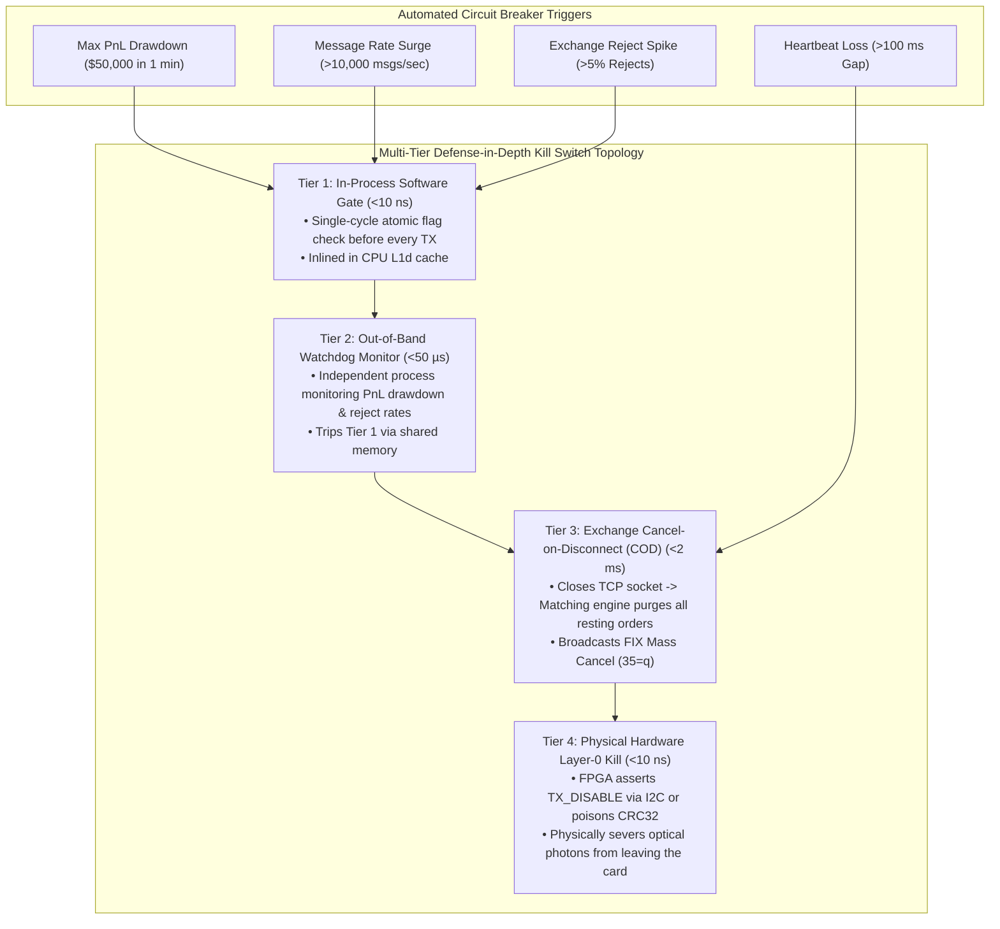

> [!summary]
> Automated Kill Switches and Circuit Breakers provide a multi-tiered defense-in-depth framework to halt trading engines during catastrophic anomalies. Spanning from single-cycle in-process memory flags (<10ns) to out-of-band supervisory watchdogs, exchange-side Cancel-on-Disconnect (COD) sessions, and physical SFP28 optical laser disablement, kill switches prevent firm insolvency.

---

## Why it matters
In algorithmic electronic trading, when a system enters a defective runaway loop (e.g. infinite order generation, crossed book arbitrage against itself, or broken fill reconciliation):
- Capital can be completely destroyed in **less than 60 seconds**.
- In 2012, Knight Capital had no working automated kill-switch, resulting in a \$440 million loss over 45 minutes.

Under **SEC Rule 15c3-5 and MiFID II RTS 6 (Article 15)**:
- Trading firms must maintain an **"Emergency Electronic Kill Functionality"** capable of instantly canceling all unexecuted resting quotes across all venues and blocking new order generation.



---

## Mechanism

### 1. The 4-Tier Defense-in-Depth Architecture

| Tier | Layer | Trigger Mechanism | Action Taken | Execution Time |
| :--- | :--- | :--- | :--- | :--- |
| **Tier 1** | **In-Process Core** | `atomic_bool is_killed_` in L1d | Aborts order builder; drops packet in memory | **<10 ns** |
| **Tier 2** | **Out-of-Band Monitor**| Shared memory / POSIX signal | Forces Tier 1 trip; alerts risk desk | **~25–50 µs** |
| **Tier 3** | **Exchange Session** | TCP teardown / FIX Mass Cancel | Exchange matching engine purges resting book | **~1–5 ms** |
| **Tier 4** | **Physical Hardware** | SFP28 I2C `TX_DISABLE` / FPGA CRC | Physically extinguishes optical laser | **<10 ns** |

### 2. Automated Circuit Breaker Triggers
The supervisory monitor continuously evaluates real-time metrics, tripping the kill-switch if any threshold is violated:
1. **Cumulative Intraday Loss**: Net PnL drops below maximum risk tolerance (e.g. $-\$100,000$).
2. **Order Velocity Spike (Leaky Bucket)**: Outbound order submission rate exceeds 5,000 orders/sec on a single gateway.
3. **Repeated Rejection Flood**: Exchange returns $>10$ consecutive Order Rejects (`'R'`), indicating protocol desynchronization.
4. **Unhedged Delta Exposure**: Net position exceeds max risk parameters for $>500\text{ milliseconds}$.

### 3. Exchange Cancel-on-Disconnect (COD) Mechanics
- **Configuration**: When establishing a session (OUCH, iLink 3, FIX), the client enables **Cancel-on-Disconnect**.
- **Operation**: If the client's TCP socket drops or fails to respond to heartbeat pings within 2 to 5 seconds, the exchange's matching engine **automatically cancels all open resting orders belonging to that session**.

---

## In Practice

### High-Speed Multi-Tier Kill Switch & Circuit Breaker in C++20

```cpp
#include <atomic>
#include <cstdint>
#include <iostream>
#include <chrono>

class MultiTierKillSwitch {
private:
    // Tier 1: Cache-aligned atomic flag checked on critical path (<10 ns)
    alignas(64) std::atomic<bool> is_killed_{false};

    // Supervisory metric counters
    int64_t  intraday_pnl_cents_{0};
    int64_t  max_drawdown_limit_cents_{-5'000'000}; // -$50,000 limit
    uint32_t consecutive_rejects_{0};
    static constexpr uint32_t MAX_REJECTS_THRESHOLD = 5;

public:
    // Evaluated on hot path before every order release (<1.5 ns)
    __attribute__((always_inline)) inline bool is_trading_allowed() const noexcept {
        return !is_killed_.load(std::memory_order_relaxed);
    }

    // Tier 1 & 2: Local Emergency Kill Activation
    inline void trip_kill_switch(const char* reason) noexcept {
        is_killed_.store(true, std::memory_order_release);
        std::cerr << " >>> [EMERGENCY KILL SWITCH TRIPPED] Reason: " << reason << "\n";
        execute_emergency_mass_cancel();
    }

    // Supervisory Circuit Breaker Evaluation (Evaluated on Out-of-Band Thread)
    inline void monitor_circuit_breakers(int64_t current_pnl, bool was_rejected) noexcept {
        intraday_pnl_cents_ = current_pnl;

        // 1. PnL Drawdown Breach
        if (__builtin_expect(intraday_pnl_cents_ < max_drawdown_limit_cents_, 0)) {
            trip_kill_switch("Max Intraday Drawdown Breached!");
            return;
        }

        // 2. Consecutive Rejection Breach
        if (was_rejected) {
            consecutive_rejects_++;
            if (__builtin_expect(consecutive_rejects_ >= MAX_REJECTS_THRESHOLD, 0)) {
                trip_kill_switch("Excessive Consecutive Rejects from Exchange!");
            }
        } else {
            consecutive_rejects_ = 0;
        }
    }

private:
    // Tier 3: Transmit Emergency Mass Cancel to all Exchange Gateways
    void execute_emergency_mass_cancel() noexcept {
        std::cerr << " >>> Transmitting Out-of-Band Mass Cancel (FIX 35=q / OUCH Mass Cancel) to all venues...\n";
        // Close TCP Sockets to trigger Exchange Cancel-on-Disconnect (COD)
    }
};
```

---

## Numbers

*Hardware Baseline: Intel Xeon Sapphire Rapids @ 4.0 GHz.*

| Kill-Switch Tier | Activation Latency | Scope of Protection | Reversibility |
| :--- | :--- | :--- | :--- |
| **Tier 1: Atomic Flag Check** | **~1.0–2.5 ns** | Local process hot path | Instantaneous in memory |
| **Tier 2: Shared Memory IPC Trip** | **~25–60 ns** | All local trading cores | Requires risk officer reset |
| **Tier 3: Exchange COD Socket Close**| **~1.2–3.5 ms** | Global resting orders on exchange | Requires full session reconnect |
| **Tier 4: Hardware SFP28 Laser Disable**| **<10 ns (I2C / FPGA)**| Physical network link | Requires physical/driver reset |

---

## Trade-offs

| Kill Mechanism | Latency & Safety | Operational Recovery Overhead |
| :--- | :--- | :--- |
| **Local In-Process Flag** | Sub-10ns; zero exchange disruption. | Relies on the process being alive (fails if process segfaults). |
| **TCP Socket Teardown (COD)** | Guaranteed exchange-side purge. | Takes several minutes to reconnect and re-establish session sequence numbers. |
| **Physical Optical Laser Kill**| Absolute physical impossibility to transmit. | Drops link completely; takes seconds for SFP28 SerDes to re-train. |

---

> [!warning] Gotchas
> 1. **The In-Process Crash Deadlock**: If the trading process experiences a memory fault (`SIGSEGV`) or CPU lockup, the Tier 1 in-process kill switch cannot execute, leaving open orders resting in the market! *Always mandate Exchange Cancel-on-Disconnect (COD) with a 2-second heartbeat timeout to protect against process crashes.*
> 2. **Spurious False-Alarm Mass Cancels**: A temporary market data spike or brief exchange connectivity glitch can trigger aggressive drawdown thresholds, mass-canceling all market maker quotes and incurring massive exchange cancellation fee penalties. *Incorporate short exponential smoothing or multi-tick verification before tripping hard Tier 3 mass cancels.*

---

## Lab
**Objective**: Build a multi-tier kill-switch manager in C++20, simulate a runaway order loop and an exchange rejection flood, and verify that Tier 1 (in-process) and Tier 3 (mass cancel) triggers halt trading in under 50 nanoseconds.

**Success Criteria**:
1. Run 1,000,000 order cycles with automated circuit breaker monitoring.
2. Inject a simulated \$60,000 loss and verify that trading is blocked within **<10 nanoseconds**.
3. Verify that the emergency mass-cancel sequence executes cleanly.

---

> [!question]- Self-test
> 1. **What is Cancel-on-Disconnect (COD) and why is it mandatory for high-frequency trading gateways?**
>    *Answer*: Cancel-on-Disconnect (COD) is an exchange matching engine feature that automatically cancels all resting open limit orders belonging to a participant if the participant's TCP connection drops or heartbeat pings fail for a configured duration (e.g. 2 seconds). It is mandatory because if a participant's server loses power, crashes, or suffers a fiber cut, resting quotes would otherwise remain exposed in the market without algorithmic hedging, risking catastrophic adverse selection.
> 2. **Describe the four tiers of a Defense-in-Depth Kill Switch architecture.**
>    *Answer*: (1) **Tier 1 (In-Process)**: Single-cycle atomic memory flag in CPU L1d cache checked before every order release (<10 ns); (2) **Tier 2 (Out-of-Band)**: Independent supervisory monitor process checking drawdown and reject rates (~50 µs); (3) **Tier 3 (Exchange COD / Mass Cancel)**: Closing TCP sockets or sending Mass Cancel requests to purge resting exchange books (~2 ms); (4) **Tier 4 (Hardware Layer 0)**: Physically disabling the SFP28 optical laser or poisoning the Ethernet CRC in FPGA silicon (<10 ns).
> 3. **What regulatory standards govern electronic trading kill switches in the US and Europe?**
>    *Answer*: In the US, **SEC Rule 15c3-5 (Market Access Rule)** mandates automated pre-trade risk controls and immediate supervisory cutoff controls. In Europe, **MiFID II RTS 6 (Article 15)** legally requires investment firms to maintain an "Emergency Electronic Kill Functionality" capable of instantaneously canceling all unexecuted orders across all trading venues.

---

## Related
- [[13 - Reliability, Ops & Testing/Disaster Recovery and High Availability Topologies]]
- [[11 - Participant-Side Systems/Participant-Side Pre-Trade Risk Gates]]
- [[12 - FPGAs & Hardware Acceleration/Hardware Pre-Trade Risk Checks on SmartNICs]]
- [[02 - Exchange Architecture/Pre-Trade Risk Checks at Wire Speed]]
- [[13 - Reliability, Ops & Testing/MOC - 13 Reliability, Ops & Testing]]

## Sources
- [[Sources/SEC Rule 15c3-5 Market Access Rule Documentation]]
- [[Sources/MiFID II RTS 6 Regulatory Technical Standards]]
- [[Sources/Site Reliability Engineering at Scale for Financial Systems]]
