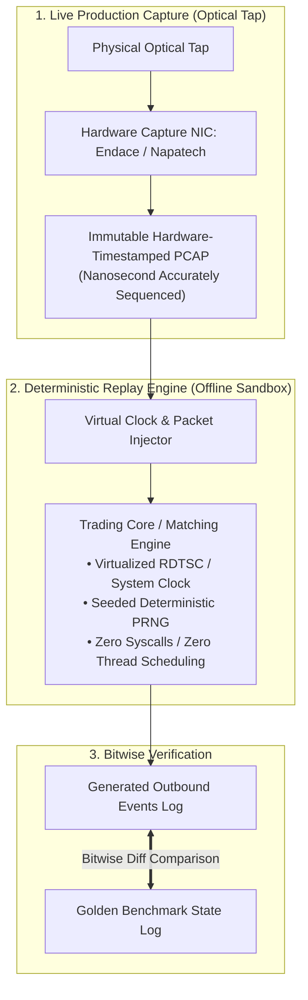

> [!summary]
> Deterministic Replay is the gold standard for testing and validating ultra-low-latency trading systems. By virtualizing wall-clock time and injecting historical, hardware-timestamped PCAP network captures into an isolated, single-threaded execution engine, trading systems achieve 100% bit-for-bit reproducible state verification across millions of market events.

---

## Why it matters
In high-frequency trading and exchange matching engine development:
- Production bugs often manifest as subtle **nanosecond race conditions or edge-case market states** that occur once every 500 million packets.
- Testing against live production or mock networks is non-deterministic: variable network jitter, OS scheduling, and asynchronous timer ticks make it impossible to reproduce the exact same bug twice.

With **Deterministic Simulation & Replay**:
- Every inbound market tick, timer event, and order cancel is sourced from an immutable, sequenced event stream.
- An engineer can pause execution at Nanosecond 42,108, inspect CPU registers, step through C++ code line-by-line in GDB, and guarantee that the system will produce the **exact same internal state and outbound orders on every run**.



---

## Mechanism

### 1. Eliminating All Sources of Non-Determinism
To guarantee that a trading engine produces identical output across multiple runs, software must eliminate or virtualize all sources of non-determinism:

| Source of Non-Determinism | Production Behavior | Deterministic Replay Replacement |
| :--- | :--- | :--- |
| **System Wall Clock** | `clock_gettime(CLOCK_REALTIME)` | Virtual Clock advanced strictly by packet timestamps. |
| **CPU Cycle Counter** | `__rdtsc()` hardware instruction | Deterministic mock cycle counter incremented per step. |
| **Multi-Thread Race Conditions**| OS thread scheduling & mutex locks | **Single-threaded cooperative event loop**. |
| **Memory Address Randomization**| ASLR (Heap pointer values vary) | Pointer-independent sorting / integer entity IDs. |
| **Pseudo-Random Number Generators**| Seeded by `/dev/urandom` / time | Fixed seed (`uint64_t seed = 0x1337BEEF`). |
| **Network Socket Ingress** | Asynchronous kernel socket polling | Sequenced PCAP packet injection memory stream. |

### 2. Time Virtualization Pattern
In production, an algorithm might query the current time to check for a timeout:
```cpp
// Non-deterministic production code
uint64_t now_ns = std::chrono::duration_cast<std::chrono::nanoseconds>(
    std::chrono::system_clock::now().time_since_epoch()).count();
```
In a deterministic engine, time is injected via an abstract clock interface:
```cpp
// Deterministic virtualized clock
class VirtualClock {
    uint64_t current_time_ns_{0};
public:
    inline void advance_to(uint64_t ts) noexcept { current_time_ns_ = ts; }
    [[nodiscard]] inline uint64_t now_ns() const noexcept { return current_time_ns_; }
};
```

---

## In Practice

### High-Speed Deterministic Event Replay Harness in C++20

```cpp
#include <cstdint>
#include <vector>
#include <iostream>
#include <iomanip>

struct ReplayPacket {
    uint64_t ingress_timestamp_ns;
    uint32_t sequence_number;
    uint32_t price;
    uint32_t qty;
    char     side;
};

struct SimulatedExecution {
    uint64_t event_time_ns;
    uint32_t order_token;
    uint32_t exec_price;
    uint32_t exec_qty;
};

class DeterministicReplayEngine {
private:
    uint64_t virtual_clock_ns_{0};
    uint32_t resting_bid_price_{0};
    uint32_t resting_bid_qty_{0};
    uint32_t order_token_counter_{1000};

public:
    // Replays a captured event and generates deterministic trading actions
    template <typename Callback>
    inline void process_replay_event(const ReplayPacket& pkt, Callback&& on_order_generated) noexcept {
        // 1. Advance Virtual Clock strictly to the packet's hardware timestamp
        virtual_clock_ns_ = pkt.ingress_timestamp_ns;

        // 2. Deterministic Book State Update
        if (pkt.side == 'B') {
            resting_bid_price_ = pkt.price;
            resting_bid_qty_ = pkt.qty;
        }

        // 3. Deterministic Alpha Strategy Trigger
        if (resting_bid_price_ >= 1500000 && resting_bid_qty_ >= 1000) {
            uint32_t token = ++order_token_counter_;
            on_order_generated(SimulatedExecution{
                virtual_clock_ns_,
                token,
                resting_bid_price_,
                100 // 100 Shares
            });
        }
    }

    [[nodiscard]] inline uint64_t current_virtual_time() const noexcept { return virtual_clock_ns_; }
};
```

---

## Numbers

*Hardware Baseline: Intel Xeon Sapphire Rapids @ 4.0 GHz.*

| Replay Mode | Ingestion Rate | Determinism Guarantee | Use Case |
| :--- | :--- | :--- | :--- |
| **In-Memory Sequential Replay** | **>85,000,000 pkts/sec** | **100% Bit-for-Bit Identical** | Algorithmic regression test |
| **Real-Time PCAP Injection (NIC)** | **10G / 25G Line Rate** | High (Vulnerable to OS jitter) | Physical gateway conformance |
| **GDB Interactive Step Replay** | Manual Speed (0–100 pkts/sec) | **100% Bit-for-Bit Identical** | Root-cause bug debugging |

---

## Trade-offs

| Testing Methodology | Determinism | Real-World Fidelity |
| :--- | :--- | :--- |
| **Deterministic In-Memory Replay** | **100% Perfect bitwise repeatability**. | Does not model physical PCIe bus contention or thermal throttling. |
| **Physical Hardware Loopback Test**| High real-world hardware fidelity. | Non-deterministic; impossible to reproduce nanosecond thread races. |
| **Live Exchange Sandbox** | Realistic exchange gateway behavior. | Low throughput; network transit jitter prevents exact regression tests. |

---

> [!warning] Gotchas
> 1. **Hidden Thread Pool Synchronization Jitter**: If any background worker thread (e.g. an asynchronous logger or metrics flusher) interacts with the trading state during replay, thread scheduling variations between CPU runs will introduce non-deterministic execution order. *Run deterministic replay tests in a strictly single-threaded mode.*
> 2. **Unordered Pointer Hashing Non-Determinism**: If the strategy stores active orders in `std::unordered_map` and iterates over them, Address Space Layout Randomization (ASLR) will place heap objects at different memory addresses on each run, causing the hash map to iterate in a different order and generating non-deterministic outbound trade sequences! *Always sort by monotonic integer IDs.*

---

## Lab
**Objective**: Build a deterministic replay engine in C++20 that ingests 10,000,000 historical market data ticks, executes trading logic with virtualized timestamps, and proves that two independent runs produce 100% identical bitwise state hashes.

**Success Criteria**:
1. Run Replay Run 1 and compute CRC64 checksum over all generated execution events.
2. Run Replay Run 2 on a completely different core and compute CRC64 checksum.
3. Verify that $\text{Checksum}_1 == \text{Checksum}_2$ down to the single bit.

---

> [!question]- Self-test
> 1. **Why is deterministic replay essential for debugging ultra-low-latency financial trading bugs?**
>    *Answer*: In live trading, subtle bugs (such as race conditions, crossed books, or desynchronized queue tracking) often occur once in tens of millions of packets under specific market conditions. Live or mock environments cannot recreate the exact nanosecond packet arrival sequences. Deterministic replay eliminates all external randomness (clocks, thread scheduling, network jitter), allowing developers to reproduce the exact failure bit-for-bit in an offline debugger.
> 2. **Name three primary sources of non-determinism in C++ trading code and how they are eliminated.**
>    *Answer*: (1) **System Clocks (`clock_gettime`)**: Replaced by a virtual clock advanced strictly by packet timestamps; (2) **Multi-threaded OS Scheduling**: Replaced by a single-threaded cooperative event loop; (3) **Pointer Address Hashing in Hash Maps**: Replaced by flat arrays or sorting structures indexed by monotonic integer tokens rather than memory addresses.
> 3. **What is the difference between "In-Memory Replay" and "Hardware Wire-Speed Replay"?**
>    *Answer*: **In-Memory Replay** runs inside a single process, feeding historical packets directly from memory arrays into the trading logic at maximum CPU speed (>80M pkts/sec) for rapid functional and regression testing. **Hardware Wire-Speed Replay** uses a dedicated network packet generator (e.g. Endace or FPGA) to re-transmit raw optical bitstreams out an SFP28 port with exact physical inter-arrival spacing to test physical transceivers, MACs, and PCIe DMA drivers.

---

## Related
- [[13 - Reliability, Ops & Testing/Exchange Simulators and Conformance Harnesses]]
- [[13 - Reliability, Ops & Testing/Latency Regression Testing in Continuous Integration]]
- [[11 - Participant-Side Systems/Tick-to-Trade Critical Path Optimization]]
- [[07 - Time & Measurement/Clock Sources and Hardware Timestamping]]
- [[13 - Reliability, Ops & Testing/MOC - 13 Reliability, Ops & Testing]]

## Sources
- [[Sources/Site Reliability Engineering at Scale for Financial Systems]]
- [[Sources/How to Build an Exchange by Jane Street]]
- [[Sources/Systems Performance by Brendan Gregg]]
