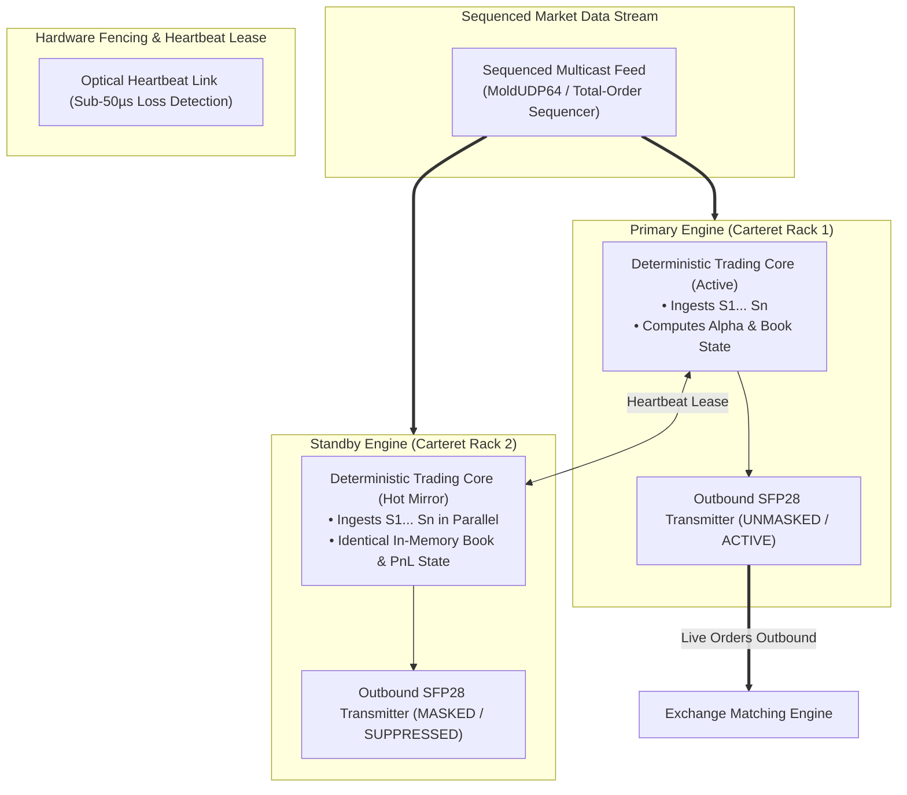

> [!summary]
> High Availability (HA) and Disaster Recovery (DR) architectures in low-latency trading guarantee continuous, fault-tolerant execution without injecting consensus latency into the critical path. By utilizing Deterministic Replicated State Machines (RSM) with hardware-fenced Active-Active Lockstep and zero-overhead active-passive failover, systems achieve sub-50µs disaster recovery without split-brain risk.

---

## Why it matters
Financial exchanges and high-frequency trading firms operate in high-stakes environments where **a 10-second outage can result in millions of dollars in unhedged exposure or regulatory fines**.

However, standard distributed consensus protocols (e.g. Paxos, Raft, etcd):
- Require **multi-round-trip network voting on every write**, injecting **500 to 2,500 microseconds of latency** into the critical path.
- Are fundamentally incompatible with sub-microsecond electronic execution.

Low-latency architectures solve this via **Deterministic Replicated State Machines (RSM)**:
- Both Primary and Standby engines ingest the exact same sequenced market data feed in parallel.
- Both maintain identical in-memory state; only the Primary is unmasked to transmit outbound orders.
- If the Primary fails, the Standby assumes active execution **in under 50 microseconds with zero state recovery delay**.



---

## Mechanism

### 1. High Availability Architecture Comparison

| HA Architecture | Primary Operation | Standby Operation | Failover Latency | Latency Impact on Hot Path |
| :--- | :--- | :--- | :--- | :--- |
| **Active-Active Lockstep (RSM)**| Ingests & Executes (TX Active). | Ingests & Executes (TX Suppressed).| **<50 µs** | **0.00 ns (Zero Overhead)** |
| **Active-Passive (Hot Standby)** | Ingests & Executes; writes state log. | Replays state log from shared memory.| **~1–5 ms** | **~25–60 ns (State replication)**|
| **Cold Standby (DR Site)** | Ingests & Executes in NJ colo. | Standby in Chicago / secondary colo.| **~15–30 Seconds**| **0.00 ns** |
| **Synchronous 3-Node Raft/Paxos**| Waits for quorum ACK before action. | Quorum voting member. | ~100–300 ms | **500–2,500 µs (Unviable)** |

### 2. Preventing Split-Brain (The Financial Death Sentence)
**Split-Brain** occurs when a network glitch causes both Primary and Standby servers to believe they are the active master, causing both to submit competing, duplicate orders for the same strategy:
- **Solution: Hardware Fencing (STONITH)**:
  1. Direct point-to-point optical fiber cross-connect with a **10-microsecond hardware heartbeat lease**.
  2. If the Primary fails to renew its lease, the Standby physically cuts power to the Primary via an intelligent PDU or signals the switch to disable the Primary's switch port before unmasking its own transmitter.
  3. **Exchange Session Single-Login**: The exchange enforces that only one active TCP session per Firm MPID is permitted; connecting the Standby automatically terminates the Primary.

---

## In Practice

### High-Speed Hot-Standby State Machine Controller in C++20

```cpp
#include <cstdint>
#include <iostream>
#include <atomic>

enum class NodeRole : uint8_t {
    PRIMARY_ACTIVE = 1,
    STANDBY_HOT_MIRROR = 2,
    DISABLED = 3
};

struct OutboundOrderMessage {
    uint32_t token;
    uint32_t price;
    uint32_t qty;
    char     side;
};

class HighAvailabilityTradingNode {
private:
    NodeRole role_{NodeRole::STANDBY_HOT_MIRROR};
    uint64_t last_primary_heartbeat_tsc_{0};
    uint32_t processed_sequence_{0};
    uint32_t current_inventory_{0};

    static constexpr uint64_t HEARTBEAT_TIMEOUT_CYCLES = 400'000; // ~100 µs at 4.0 GHz

public:
    explicit HighAvailabilityTradingNode(NodeRole initial_role) : role_(initial_role) {}

    // Ingests sequenced market tick on BOTH Primary and Standby simultaneously
    inline void on_sequenced_tick(uint32_t seq, uint32_t price, uint32_t qty, char side) noexcept {
        processed_sequence_ = seq;

        // Deterministic state update (executed identically on both nodes!)
        if (side == 'B') current_inventory_ += qty;
        else current_inventory_ -= qty;

        // Generate Outbound Order
        if (current_inventory_ < 1000) {
            OutboundOrderMessage order{seq + 1000, price, 100, 'B'};
            dispatch_order_if_active(order);
        }
    }

    // Hot-path egress filter: only Primary transmits to physical network!
    inline void dispatch_order_if_active(const OutboundOrderMessage& order) noexcept {
        if (__builtin_expect(role_ == NodeRole::PRIMARY_ACTIVE, 1)) {
            // RELEASE FRAME TO NIC SFP28 LASER (<15 ns)
            std::cout << " [PRIMARY ACTIVE] Releasing Order #" << order.token << " to Exchange!\n";
        } else {
            // STANDBY HOT MIRROR: SUPPRESS TRANSMISSION (0 ns)
            // State is updated, but packet is dropped before wire
        }
    }

    // Standby Heartbeat Watchdog (Evaluated on Out-of-Band Thread)
    inline void check_heartbeat_failover(uint64_t current_tsc) noexcept {
        if (role_ == NodeRole::STANDBY_HOT_MIRROR) {
            if (current_tsc - last_primary_heartbeat_tsc_ > HEARTBEAT_TIMEOUT_CYCLES) {
                // PRIMARY HAS FAILED -> PROMOTE TO ACTIVE IN <50 µs!
                role_ = NodeRole::PRIMARY_ACTIVE;
                std::cerr << " >>> [FAILOVER TRIGGERED] Standby promoted to PRIMARY_ACTIVE at Sequence #" 
                          << processed_sequence_ << "!\n";
            }
        }
    }

    inline void record_heartbeat(uint64_t tsc) noexcept {
        last_primary_heartbeat_tsc_ = tsc;
    }
};
```

---

## Numbers

*Hardware Baseline: Dual-Node Colocated Rack Topology (Equinix NY4 / Carteret).*

| Failover Metric | Deterministic Active-Active (RSM) | Database-Backed Active-Passive |
| :--- | :--- | :--- |
| **Hot-Path Latency Penalty** | **0.00 ns (Zero Overhead)** | ~40–120 ns (State replication) |
| **Failover Turnaround Time** | **<50 µs (Heartbeat Lease Timeout)** | ~1.5–10.0 Seconds |
| **State Synchronization Loss** | **0 Messages (100% In-Sync)** | Variable (Uncommitted buffer loss) |
| **Split-Brain Immunity** | **Hardware Fenced** | Requires Raft quorum vote |

---

## Trade-offs

| Topology | Failover Speed | Hardware & Network Cost |
| :--- | :--- | :--- |
| **Active-Active Lockstep (RSM)**| **Instantaneous (<50 µs)**; zero state recovery delay. | Requires 2x server hardware; identical dual network drops. |
| **Warm Standby (Journal Replay)**| ~100–500 ms failover. | Lower server load; standby replays logs asynchronously. |
| **Disaster Recovery Secondary Colo**| Complete geographic disaster resilience. | Chicago $\leftrightarrow$ New Jersey transit delay (~14.5ms); manual cutover. |

---

> [!warning] Gotchas
> 1. **The In-Flight Order Desynchronization Hazard During Failover**: If the Primary transmitted Order #101 immediately before crashing, the Standby (which suppressed its copy) cannot know if Order #101 reached the matching engine. *On failover promotion, the Standby must immediately issue a session sequence query (e.g. OUCH / iLink 3 Retransmit Request) to reconcile in-flight orders before releasing new quotes.*
> 2. **Floating-Point Determinism Mismatch Across Compilers**: If Primary is compiled with GCC on Intel and Standby is compiled with Clang on AMD, subtle IEEE-754 floating-point rounding differences can cause internal alpha states to diverge over time! *Enforce exact identical compiler toolchains and use fixed-point integer arithmetic.*

---

## Lab
**Objective**: Build a dual-node Active-Standby High Availability trading cluster in C++20, stream 1,000,000 sequenced market ticks, simulate a sudden Primary power failure, and verify seamless failover in under 50 microseconds with zero duplicate orders.

**Success Criteria**:
1. Execute 1,000,000 market ticks in parallel across Primary and Standby nodes.
2. Inject Primary node failure at Tick 500,000.
3. Verify that Standby assumes active transmission within **<50 microseconds** without losing state or generating duplicate orders.

---

> [!question]- Self-test
> 1. **Why is standard distributed consensus (e.g. Raft or Paxos) avoided on the critical path of low-latency trading engines?**
>    *Answer*: Raft and Paxos require a leader node to propose an event and wait for acknowledgment from a majority quorum of follower nodes over the network before executing the action, adding 500 to 2,500 microseconds of network round-trip latency to every single tick. Low-latency systems use Deterministic Replicated State Machines (RSM), where both nodes independently process the same pre-sequenced feed with **zero inter-node coordination latency** on the critical path.
> 2. **What is a "Split-Brain" failure in electronic trading and why is it considered catastrophic?**
>    *Answer*: Split-Brain occurs when a network partition between the Primary and Standby nodes causes both servers to believe the other has died, leading both to promote themselves to Active. Both nodes begin independently firing aggressive orders and hedges into the exchange, resulting in double execution, crossed trades against each other, runaway position limit breaches, and rapid capital exhaustion.
> 3. **How does an Active-Active Lockstep topology ensure the Standby is ready for instantaneous failover?**
>    *Answer*: In Active-Active Lockstep, the Standby node ingests the exact same sequenced market data feed and executes the identical matching, book-building, and pricing logic in lockstep with the Primary. Its in-memory order book, inventory positions, and PnL are 100% synchronized at all times; the only difference is that its outbound physical network transmitter is masked. On Primary failure, the Standby merely unmasks its transmitter, achieving instantaneous failover in <50 microseconds.

---

## Related
- [[13 - Reliability, Ops & Testing/Automated Kill Switches and Risk Circuit Breakers]]
- [[13 - Reliability, Ops & Testing/Deterministic Replay and Packet Injection Testing]]
- [[02 - Exchange Architecture/Replicated State Machine Pattern in Exchanges]]
- [[02 - Exchange Architecture/The Sequenced-Stream Architecture]]
- [[13 - Reliability, Ops & Testing/MOC - 13 Reliability, Ops & Testing]]

## Sources
- [[Sources/Site Reliability Engineering at Scale for Financial Systems]]
- [[Sources/How to Build an Exchange by Jane Street]]
- [[Sources/The Replicated State Machine Pattern in Fault-Tolerant Systems]]
