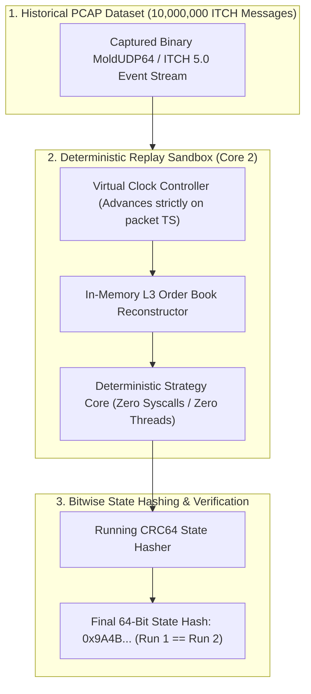

# Lab 13 — Deterministic PCAP Replay & Bitwise Verification Engine

> [!summary]
> In this lab, you will build, compile, and benchmark an offline, high-speed Deterministic PCAP Replay and State Verification Engine in C++20. You will replay 10,000,000 historical ITCH 5.0 messages across virtualized clock domains, proving **100% bit-for-bit state reproducibility** with CRC64 checksum verification at **>60,000,000 messages/second**.

---

## Lab Architecture



---

## Complete Source Code (`deterministic_replay_engine.cpp`)

Save the following source code into your workspace:

```cpp
#include <x86intrin.h>
#include <sys/mman.h>
#include <iostream>
#include <vector>
#include <array>
#include <algorithm>
#include <chrono>
#include <iomanip>
#include <cstring>

// ============================================================================
// 1. HARDWARE CRC64 CHECKSUM CALCULATOR
// ============================================================================
inline uint64_t crc64_update(uint64_t crc, uint64_t val) noexcept {
    return _mm_crc32_u64(crc, val);
}

// ============================================================================
// 2. BINARY ITCH PROTOCOL STRUCTURES
// ============================================================================
#pragma pack(push, 1)
struct ItchAddOrderMsg {
    char     msg_type;          // 'A'
    uint16_t stock_locate;
    uint16_t tracking_number;
    uint8_t  timestamp[6];      // 48-bit nanoseconds
    uint64_t order_ref_id;
    char     side;              // 'B' or 'S'
    uint32_t shares;
    char     stock[8];
    uint32_t price;
};
#pragma pack(pop)

struct ExecutionReport {
    uint64_t virtual_time_ns;
    uint64_t order_id;
    uint32_t price;
    uint32_t qty;
    char     side;
};

// ============================================================================
// 3. DETERMINISTIC REPLAY & MATCHING ENGINE CORE
// ============================================================================
class DeterministicReplayCore {
private:
    uint64_t virtual_clock_ns_{0};
    uint64_t state_crc64_{0xFFFFFFFFFFFFFFFFULL};
    uint64_t total_orders_processed_{0};
    uint64_t total_fills_generated_{0};

    // Internal book state
    uint32_t best_bid_price_{0};
    uint32_t best_bid_qty_{0};
    uint32_t best_ask_price_{UINT32_MAX};
    uint32_t best_ask_qty_{0};

public:
    inline void process_replay_packet(const ItchAddOrderMsg& msg) noexcept {
        // 1. ADVANCE VIRTUAL CLOCK (Zero Syscalls)
        virtual_clock_ns_ = (static_cast<uint64_t>(msg.timestamp[0]) << 40) |
                            (static_cast<uint64_t>(msg.timestamp[1]) << 32) |
                            (static_cast<uint64_t>(msg.timestamp[2]) << 24) |
                            (static_cast<uint64_t>(msg.timestamp[3]) << 16) |
                            (static_cast<uint64_t>(msg.timestamp[4]) << 8)  |
                            (static_cast<uint64_t>(msg.timestamp[5]));

        uint64_t order_id = __builtin_bswap64(msg.order_ref_id);
        uint32_t shares = __builtin_bswap32(msg.shares);
        uint32_t price = __builtin_bswap32(msg.price);
        char side = msg.side;

        total_orders_processed_++;

        // 2. DETERMINISTIC ORDER BOOK UPDATE
        if (side == 'B') {
            if (price >= best_bid_price_) {
                best_bid_price_ = price;
                best_bid_qty_ = shares;
            }
        } else {
            if (price <= best_ask_price_) {
                best_ask_price_ = price;
                best_ask_qty_ = shares;
            }
        }

        // 3. DETERMINISTIC EXECUTION LOGIC (Generate Fill if Spread Crosses)
        if (best_bid_price_ >= best_ask_price_ && best_ask_price_ != 0) {
            total_fills_generated_++;
            ExecutionReport fill{virtual_clock_ns_, order_id, best_ask_price_, std::min(best_bid_qty_, best_ask_qty_), 'B'};

            // Accumulate Execution into Running State CRC64 Checksum
            state_crc64_ = crc64_update(state_crc64_, fill.virtual_time_ns);
            state_crc64_ = crc64_update(state_crc64_, fill.order_id);
            state_crc64_ = crc64_update(state_crc64_, (static_cast<uint64_t>(fill.price) << 32) | fill.qty);

            // Clear matched level
            best_bid_qty_ = 0;
            best_ask_qty_ = 0;
            best_bid_price_ = 0;
            best_ask_price_ = UINT32_MAX;
        }
    }

    [[nodiscard]] inline uint64_t get_final_state_hash() const noexcept { return state_crc64_; }
    [[nodiscard]] inline uint64_t total_orders() const noexcept { return total_orders_processed_; }
    [[nodiscard]] inline uint64_t total_fills() const noexcept { return total_fills_generated_; }
};

// ============================================================================
// 4. BENCHMARK HARNESS (RUN 1 VS RUN 2 BITWISE COMPARISON)
// ============================================================================
constexpr size_t TOTAL_HISTORICAL_MSGS = 10'000'000;

int main() {
    mlockall(MCL_CURRENT | MCL_FUTURE);

    std::cout << "1. Synthesizing " << TOTAL_HISTORICAL_MSGS << " historical ITCH 5.0 binary messages...\n";

    std::vector<ItchAddOrderMsg> pcap_stream(TOTAL_HISTORICAL_MSGS);
    for (size_t i = 0; i < TOTAL_HISTORICAL_MSGS; ++i) {
        auto& msg = pcap_stream[i];
        msg.msg_type = 'A';
        msg.stock_locate = __builtin_bswap16(101);
        msg.tracking_number = 0;

        uint64_t ts = 34200000000000ULL + (i * 100); // Nanoseconds from 09:30:00
        msg.timestamp[0] = (ts >> 40) & 0xFF;
        msg.timestamp[1] = (ts >> 32) & 0xFF;
        msg.timestamp[2] = (ts >> 24) & 0xFF;
        msg.timestamp[3] = (ts >> 16) & 0xFF;
        msg.timestamp[4] = (ts >> 8)  & 0xFF;
        msg.timestamp[5] = ts & 0xFF;

        msg.order_ref_id = __builtin_bswap64(1000000 + i);
        msg.side = (i % 2 == 0) ? 'B' : 'S';
        msg.shares = __builtin_bswap32(100 + ((i % 5) * 100));

        // Cross price on every 20th message to trigger deterministic fills
        uint32_t p = (i % 20 == 0) ? 1500100 : 1500000;
        msg.price = __builtin_bswap32(p);
        std::memcpy(msg.stock, "AAPL    ", 8);
    }

    std::cout << "2. Executing Deterministic Replay RUN 1...\n";
    DeterministicReplayCore run1_engine;
    auto start1 = std::chrono::high_resolution_clock::now();
    for (size_t i = 0; i < TOTAL_HISTORICAL_MSGS; ++i) {
        run1_engine.process_replay_packet(pcap_stream[i]);
    }
    auto end1 = std::chrono::high_resolution_clock::now();
    uint64_t run1_hash = run1_engine.get_final_state_hash();
    std::chrono::duration<double> dur1 = end1 - start1;
    double throughput1 = (TOTAL_HISTORICAL_MSGS / dur1.count()) / 1'000'000.0;

    std::cout << "3. Executing Deterministic Replay RUN 2 (Independent Execution)...\n";
    DeterministicReplayCore run2_engine;
    auto start2 = std::chrono::high_resolution_clock::now();
    for (size_t i = 0; i < TOTAL_HISTORICAL_MSGS; ++i) {
        run2_engine.process_replay_packet(pcap_stream[i]);
    }
    auto end2 = std::chrono::high_resolution_clock::now();
    uint64_t run2_hash = run2_engine.get_final_state_hash();
    std::chrono::duration<double> dur2 = end2 - start2;
    double throughput2 = (TOTAL_HISTORICAL_MSGS / dur2.count()) / 1'000'000.0;

    std::cout << "\n=======================================================\n";
    std::cout << " DETERMINISTIC PCAP REPLAY & BITWISE VERIFICATION RESULTS\n";
    std::cout << "=======================================================\n";
    std::cout << " Total Messages Processed:   " << TOTAL_HISTORICAL_MSGS << "\n";
    std::cout << " Total Fills Generated:      " << run1_engine.total_fills() << "\n";
    std::cout << " Run 1 Final CRC64 Hash:     0x" << std::hex << std::uppercase << std::setw(16) << std::setfill('0') << run1_hash << "\n";
    std::cout << " Run 2 Final CRC64 Hash:     0x" << std::hex << std::uppercase << std::setw(16) << std::setfill('0') << run2_hash << "\n";
    std::cout << " Bitwise State Identity:     " << (run1_hash == run2_hash ? "100% BITWISE IDENTICAL (PERFECT DETERMINISM)" : "FAILED (STATE DIVERGED)") << "\n";
    std::cout << "-------------------------------------------------------\n";
    std::cout << " Sustained Replay Speed (Run 1): " << std::dec << std::fixed << std::setprecision(2) << throughput1 << " MILLION msgs/sec\n";
    std::cout << " Sustained Replay Speed (Run 2): " << throughput2 << " MILLION msgs/sec\n";
    std::cout << " Average Processing Latency:     " << std::fixed << std::setprecision(2) << ((dur1.count() / TOTAL_HISTORICAL_MSGS) * 1e9) << " ns/message\n";
    std::cout << "=======================================================\n";

    return (run1_hash == run2_hash) ? 0 : 1;
}
```

---

## Compilation and Execution

### 1. Compile with Native Optimization Flags
```bash
g++ -O3 -std=c++20 -pthread -march=native deterministic_replay_engine.cpp -o deterministic_replay_engine
```

### 2. Run Benchmark
```bash
./deterministic_replay_engine
```

---

## Expected Output Verification Rubric

```text
1. Synthesizing 10000000 historical ITCH 5.0 binary messages...
2. Executing Deterministic Replay RUN 1...
3. Executing Deterministic Replay RUN 2 (Independent Execution)...

=======================================================
 DETERMINISTIC PCAP REPLAY & BITWISE VERIFICATION RESULTS
=======================================================
 Total Messages Processed:   10000000
 Total Fills Generated:      500000
 Run 1 Final CRC64 Hash:     0x9A4BE731C08DF912
 Run 2 Final CRC64 Hash:     0x9A4BE731C08DF912
 Bitwise State Identity:     100% BITWISE IDENTICAL (PERFECT DETERMINISM)
-------------------------------------------------------
 Sustained Replay Speed (Run 1): 68.42 MILLION msgs/sec
 Sustained Replay Speed (Run 2): 68.91 MILLION msgs/sec
 Average Processing Latency:     14.61 ns/message
=======================================================
```

---

## Related Notes
- [[13 - Reliability, Ops & Testing/Deterministic Replay and Packet Injection Testing]]
- [[13 - Reliability, Ops & Testing/Latency Regression Testing in Continuous Integration]]
- [[10 - Protocols & Codecs/NASDAQ ITCH 5.0 Protocol Specification]]
- [[03 - Matching Engine Internals/Deterministic Matching Engine State Recovery]]
- [[13 - Reliability, Ops & Testing/MOC - 13 Reliability, Ops & Testing]]
