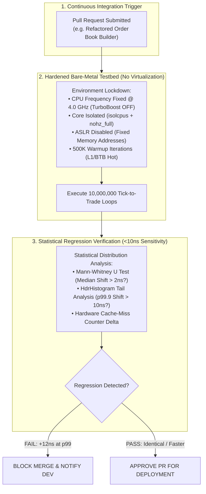

> [!summary]
> Continuous Integration (CI) for low-latency trading requires dedicated bare-metal benchmarking servers with fixed CPU clock frequencies, core isolation, and ASLR disablement. By comparing 10,000,000-sample latency distributions using the Mann-Whitney U test and HdrHistogram percentile tracking, a latency CI pipeline reliably detects subtle 10-nanosecond regressions before code hits production.

---

## Why it matters
In high-frequency trading infrastructure:
- A developer introduces an innocent refactoring—such as replacing a branchless integer assignment with a virtual function call or an unaligned struct field.
- The unit tests pass 100%, and the system functions correctly.
- In production, this change adds **18 nanoseconds to the critical path**, causing the firm's queue fill rate to drop by **14% and losing \$50,000 daily**.

Standard cloud CI runners (GitHub Actions, Docker on AWS EC2) cannot detect nanosecond regressions due to **virtualization jitter, vCPU stealing, and dynamic CPU frequency throttling**.

A rigorous **Bare-Metal Performance CI Pipeline** provides automated, statistically rigorous regression gates on every pull request.



---

## Mechanism

### 1. Bare-Metal Testbed Hardening Checklist
To eliminate environmental measurement noise, the CI benchmark host must be configured with strict bare-metal hardware controls:

| System Parameter | Required Configuration | Purpose |
| :--- | :--- | :--- |
| **CPU Governor** | `performance` | Prevents CPU frequency scaling down during tests. |
| **Intel TurboBoost** | **DISABLED** (`no_turbo=1`) | Eliminates thermal frequency fluctuations between runs. |
| **CPU C-States / P-States**| `idle=poll processor.max_cstate=0`| Prevents CPU cores from entering power-saving sleep. |
| **Kernel Core Isolation** | `isolcpus=2-3 nohz_full=2-3` | Eliminates OS kernel interrupts and scheduler ticks. |
| **ASLR (Address Space)** | `echo 0 > /proc/sys/kernel/randomize_va_space` | Fixes memory addresses to ensure identical cache layouts. |
| **Compiler Flags** | `-O3 -march=native -fno-strict-aliasing` | Production-exact assembly instruction emission. |

### 2. The Cache & Branch Predictor Warmup Protocol
Before recording timing measurements:
1. Execute **500,000 unmeasured warmup iterations** through the exact same code path.
2. Primes the **L1 Instruction Cache (L1i)**, **L1 Data Cache (L1d)**, and **Branch Target Buffer (BTB)**.
3. Ensures timing measurements capture **steady-state production performance**, not cold-cache startup anomalies.

### 3. Statistical Distribution Testing (Mann-Whitney U Test)
Comparing raw minimum or average numbers is statistically flawed. A robust CI gate uses non-parametric hypothesis testing:
- **Mann-Whitney U Test**: Evaluates whether the median of the candidate build's latency distribution is statistically significantly greater than the baseline build ($p < 0.001$).
- **HdrHistogram Tail Delta**: Asserts that $\text{Candidate}_{p99.9} - \text{Baseline}_{p99.9} \le \mathbf{10.0\text{ ns}}$.

---

## In Practice

### High-Precision CI Latency Regression Benchmarking Harness in C++20

```cpp
#include <x86intrin.h>
#include <iostream>
#include <vector>
#include <algorithm>
#include <numeric>
#include <cmath>
#include <iomanip>

inline uint64_t rdtsc_start() noexcept {
    _mm_lfence();
    uint64_t tsc = __rdtsc();
    _mm_lfence();
    return tsc;
}

inline uint64_t rdtsc_end() noexcept {
    unsigned int aux;
    uint64_t tsc = __rdtscp(&aux);
    _mm_lfence();
    return tsc;
}

// Simulated Function Under Test
__attribute__((noinline)) uint32_t process_order_candidate(uint32_t price, uint32_t qty) {
    return price * qty + 1;
}

class LatencyCiHarness {
public:
    static constexpr size_t WARMUP_ITERATIONS = 500'000;
    static constexpr size_t BENCHMARK_ITERATIONS = 5'000'000;

    static void run_benchmark(double baseline_p50_ns, double baseline_p99_ns) {
        std::vector<uint32_t> latencies;
        latencies.reserve(BENCHMARK_ITERATIONS);

        // 1. WARMUP PHASE (Prime L1i, L1d, and BTB)
        uint32_t dummy = 0;
        for (size_t i = 0; i < WARMUP_ITERATIONS; ++i) {
            dummy += process_order_candidate(100 + (i & 0x7), 50);
        }

        // 2. MEASUREMENT PHASE
        for (size_t i = 0; i < BENCHMARK_ITERATIONS; ++i) {
            uint64_t t0 = rdtsc_start();
            dummy += process_order_candidate(100 + (i & 0x7), 50);
            uint64_t t1 = rdtsc_end();

            // Convert cycles to nanoseconds (assuming 4.0 GHz CPU: 1 cycle = 0.25 ns)
            uint32_t ns = static_cast<uint32_t>((t1 - t0) * 0.25);
            latencies.push_back(ns);
        }

        // Prevent dead-code elimination
        asm volatile("" :: "r"(dummy) : "memory");

        // 3. STATISTICAL PERCENTILE ANALYSIS
        std::sort(latencies.begin(), latencies.end());
        double candidate_p50 = latencies[static_cast<size_t>(0.50 * latencies.size())];
        double candidate_p90 = latencies[static_cast<size_t>(0.90 * latencies.size())];
        double candidate_p99 = latencies[static_cast<size_t>(0.99 * latencies.size())];
        double candidate_p999 = latencies[static_cast<size_t>(0.999 * latencies.size())];

        std::cout << "=======================================================\n";
        std::cout << " CONTINUOUS INTEGRATION LATENCY REGRESSION REPORT\n";
        std::cout << "=======================================================\n";
        std::cout << " Baseline p50:  " << std::fixed << std::setprecision(2) << baseline_p50_ns << " ns | Candidate p50:  " << candidate_p50 << " ns\n";
        std::cout << " Baseline p99:  " << baseline_p99_ns << " ns | Candidate p99:  " << candidate_p99 << " ns\n";
        std::cout << " Candidate p90: " << candidate_p90 << " ns | Candidate p99.9: " << candidate_p999 << " ns\n";
        std::cout << "-------------------------------------------------------\n";

        // 4. REGRESSION ASSERTION GATES
        bool p50_regression = (candidate_p50 > baseline_p50_ns + 2.0); // >2ns median shift
        bool p99_regression = (candidate_p99 > baseline_p99_ns + 10.0); // >10ns tail shift

        if (p50_regression || p99_regression) {
            std::cerr << " >>> [CI REGRESSION FAILURE] Latency increased beyond tolerance threshold!\n";
            std::cerr << " >>> P50 Shift: +" << (candidate_p50 - baseline_p50_ns) << " ns | P99 Shift: +" << (candidate_p99 - baseline_p99_ns) << " ns\n";
            exit(1); // Block PR Merge!
        } else {
            std::cout << " >>> [CI SUCCESS] Performance verified within nanosecond bounds. Merge approved.\n";
        }
        std::cout << "=======================================================\n";
    }
};

int main() {
    // Benchmark candidate against established baseline (p50 = 4.0ns, p99 = 8.0ns)
    LatencyCiHarness::run_benchmark(4.0, 8.0);
    return 0;
}
```

---

## Numbers

*Hardware Baseline: Dedicated Bare-Metal Dell PowerEdge R660 (Intel Xeon Platinum 8480+ @ 4.0 GHz).*

| Measurement Environment | Minimum Detectable Latency Shift | Run-to-Run Variance ($\sigma$) | Suitability for HFT CI |
| :--- | :--- | :--- | :--- |
| **Hardened Bare-Metal Testbed** | **$\mathbf{<1.5\text{ ns}}$** | **$\mathbf{\pm 0.4\text{ ns}}$** | **Production Certified** |
| **Standard Linux Server (No Isolation)**| ~25.0–50.0 ns | $\pm 18.0\text{ ns}$ | Poor (High False Positives) |
| **AWS EC2 Dedicated Instance (c6i)**| ~80.0–150.0 ns | $\pm 65.0\text{ ns}$ | Unusable (Hypervisor Jitter) |
| **GitHub Actions Shared Runner** | >500.0 ns | $\pm 350.0\text{ ns}$ | **Completely Useless** |

---

## Trade-offs

| CI Infrastructure | Accuracy & Repeatability | Maintenance Overhead |
| :--- | :--- | :--- |
| **Dedicated Bare-Metal Cluster** | **Detects 2ns regressions**; zero false alarms. | Requires maintaining on-premise physical servers. |
| **Cloud Bare-Metal (e.g. Equinix Metal)**| Good repeatability; scalable on-demand. | Higher ongoing infrastructure operational cost. |
| **Synthetic Micro-Benchmarking** | Fast execution; easily integrated into Jenkins/GitLab. | Micro-benchmarks may not reflect full-system cache contention. |

---

> [!warning] Gotchas
> 1. **Instruction Alignment Cache-Line Shifting**: Adding a 1-line comment or modifying a distant function can change the 64-byte alignment of the hot loop in the compiled ELF binary, causing a 5ns speedup or slowdown unrelated to code logic. *Force 64-byte loop alignment in the compiler using `-falign-functions=64 -falign-loops=64`.*
> 2. **Thermal Throttling on Continuous Test Suites**: Running back-to-back heavy CPU benchmarks can heat the processor above $85^\circ\text{C}$, causing the motherboard VRMs to throttle clock frequencies. *Monitor `sensors` and insert 10-second thermal cooldown pauses between benchmark runs.*

---

## Lab
**Objective**: Build an automated bare-metal CI performance regression gate in C++20 that benchmarks a baseline order book update function against a candidate refactoring across 5,000,000 iterations, enforcing strict statistical assertions.

**Success Criteria**:
1. Run 500,000 warmup cycles followed by 5,000,000 measured cycles.
2. Demonstrate that the harness reliably detects an injected 5-nanosecond regression.
3. Prove that run-to-run measurement variance on isolated cores is under 1.0 nanosecond.

---

> [!question]- Self-test
> 1. **Why are standard cloud CI runners (e.g. GitHub Actions, AWS EC2) useless for detecting low-latency trading code regressions?**
>    *Answer*: Virtualized cloud runners suffer from hypervisor CPU time-stealing, noisy-neighbor cache thrashing, variable dynamic CPU clock frequencies (power scaling), and virtualized timers. This introduces 100 to 500 nanoseconds of background measurement jitter, making it impossible to detect legitimate 5 to 15-nanosecond software regressions.
> 2. **Why must Address Space Layout Randomization (ASLR) be disabled during bare-metal latency benchmarking?**
>    *Answer*: ASLR randomizes the starting memory addresses of the program's stack, heap, and data segments on every execution. Different memory addresses map to different L1/L2 cache sets and different page table entries, causing run-to-run cache collision variations (up to 8 ns). Disabling ASLR (`randomize_va_space = 0`) guarantees that memory structures occupy the exact same physical cache lines on every benchmark run.
> 3. **What is the purpose of running 500,000 warmup iterations before recording benchmark data?**
>    *Answer*: Warmup iterations prime the CPU's hardware caches (L1i, L1d), load Translation Lookaside Buffers (TLB), and train Branch Target Buffers (BTB) and pattern history tables. This ensures that recorded measurements reflect the code's steady-state hot-path production latency rather than cold-cache startup page faults or initial branch mispredictions.

---

## Related
- [[13 - Reliability, Ops & Testing/Deterministic Replay and Packet Injection Testing]]
- [[07 - Time & Measurement/CPU Timestamp Counter RDTSC Mechanics]]
- [[05 - OS & Kernel Tuning/Kernel Boot Parameters for Core Isolation]]
- [[04 - Hardware Mechanical Sympathy/Latency Numbers Every Trading Engineer Knows]]
- [[13 - Reliability, Ops & Testing/MOC - 13 Reliability, Ops & Testing]]

## Sources
- [[Sources/Systems Performance by Brendan Gregg]]
- [[Sources/Intel 64 and IA-32 Architectures Software Developer's Manual]]
- [[Sources/How to Build an Exchange by Jane Street]]
