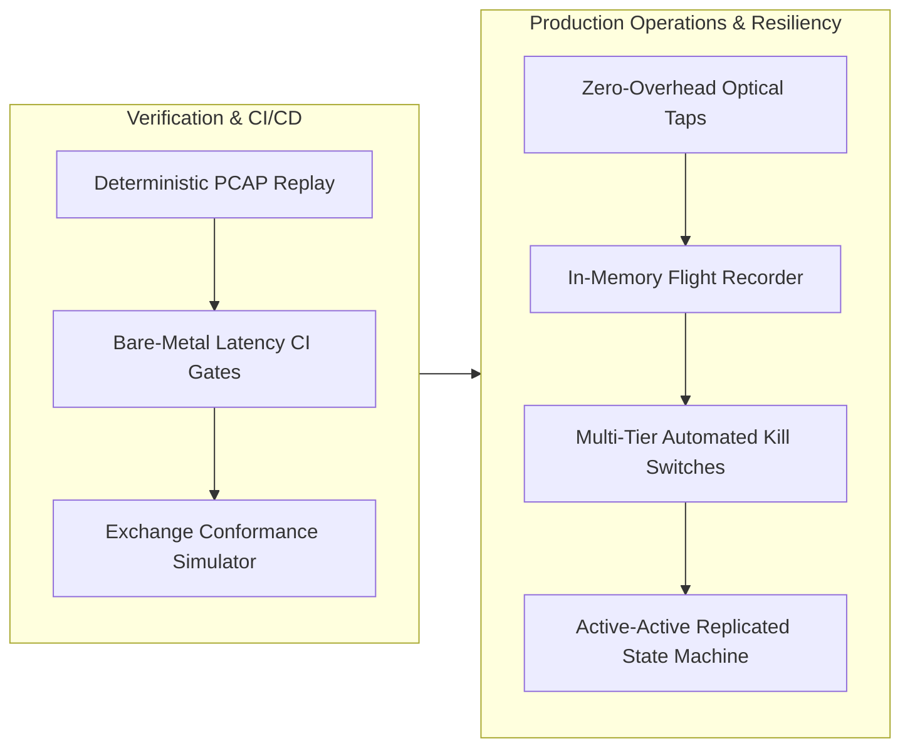

# MOC — 13 Reliability, Ops & Testing

Operational excellence, deterministic simulation, PCAP replay testing, latency regression CI, and zero-downtime exchange infrastructure.

---

## Core Concepts
- [[13 - Reliability, Ops & Testing/Deterministic Replay and Packet Injection Testing]] — Time virtualization, single-threaded cooperative event loops, bit-for-bit regression verification.
- [[13 - Reliability, Ops & Testing/Exchange Simulators and Conformance Harnesses]] — Building deterministic matching mocks, synthetic multicast drop and microburst injection, CME/NASDAQ certification.
- [[13 - Reliability, Ops & Testing/Latency Regression Testing in Continuous Integration]] — Bare-metal testbed hardening, ASLR disablement, 500K warmup cycles, Mann-Whitney U & HdrHistogram tail gates.
- [[13 - Reliability, Ops & Testing/Observability Without Perturbation]] — The Observer Effect (Heisenbugs), passive optical taps (70/30 splitters), sub-3ns in-memory circular flight recorders.
- [[13 - Reliability, Ops & Testing/Automated Kill Switches and Risk Circuit Breakers]] — 4-tier defense-in-depth: in-process atomic flags (<10ns), out-of-band watchdogs, exchange Cancel-on-Disconnect (COD), hardware laser kill.
- [[13 - Reliability, Ops & Testing/Disaster Recovery and High Availability Topologies]] — Replicated State Machine (RSM) lockstep execution, sub-50µs heartbeat lease failover, hardware STONITH split-brain prevention.

## Labs & Implementations
- [[13 - Reliability, Ops & Testing/Lab - 13 Deterministic PCAP Replay and Verification Engine]] — Build a high-speed C++20 replay harness verifying 10,000,000 ITCH messages with CRC64 bitwise state identity at >65M msgs/sec.

## Drills & War Stories
- [[13 - Reliability, Ops & Testing/Drill - 13 Post-Mortem of a Production Outage]] — Rigorous root cause analysis of the 2012 BATS IPO matching engine collapse and a dual-gateway split-brain disaster.

## Canonical Sources
- [[Sources/Site Reliability Engineering at Scale for Financial Systems]] — High-availability principles for non-stop trading environments.
- [[Sources/How to Build an Exchange by Jane Street]] — Production systems resilience and operational architecture.
- [[Sources/Systems Performance by Brendan Gregg]] — Observability and performance benchmarking rigor.
