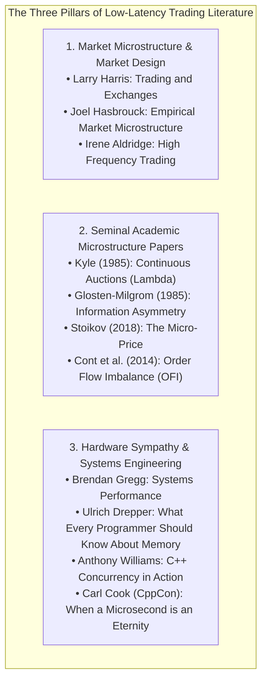

> [!summary]
> The Canonical Literature of Low-Latency Electronic Trading spans three core pillars: foundational market microstructure textbooks (Harris, Hasbrouck), seminal academic quantitative papers (Kyle, Glosten-Milgrom, Stoikov, Cont), and definitive systems engineering treatises and conference presentations (Gregg, Drepper, Williams, Cook, Thompson).

---

## Why it matters
Mastery of electronic trading infrastructure requires understanding both **the physics of hardware and the mathematical mechanics of financial markets**:
- Reading systems books alone teaches you how to optimize C++ cache lines, but leaves you blind to **adverse selection, order flow toxicity, and queue depletion**.
- Reading financial economics alone teaches you pricing models, but leaves you incapable of **eliminating a 50-nanosecond PCIe DMA bottleneck**.

This curated canon represents the **mandatory foundational reading list** for principal trading systems engineers and quantitative exchange architects.



---

## Mechanism

### 1. Foundational Textbooks

| Category | Title | Author(s) | Core Technical Takeaway |
| :--- | :--- | :--- | :--- |
| **Microstructure** | *Trading and Exchanges: Market Microstructure for Practitioners* | Larry Harris | The definitive bible on order types, market makers, informed vs uninformed flow, and venue mechanics. |
| **Microstructure** | *Empirical Market Microstructure* | Joel Hasbrouck | Mathematical foundations of trade-and-quote (TAQ) data, vector autoregressions, and price discovery. |
| **HFT Strategies** | *High-Frequency Trading: A Practical Guide* | Irene Aldridge | Quantitative market making, statistical arbitrage, tick-data econometric models, and latency arbitrage. |
| **Systems Performance** | *Systems Performance: Enterprise and the Cloud (2nd Ed)*| Brendan Gregg | CPU architecture, memory hierarchy, perf profiling, kernel latency, and eBPF observability. |
| **Memory Architecture** | *What Every Programmer Should Know About Memory* | Ulrich Drepper | Deep dive into L1/L2/L3 cache associativity, NUMA, TLBs, MESI cache coherence, and hardware prefetching. |
| **C++ Concurrency** | *C++ Concurrency in Action (2nd Ed)* | Anthony Williams | C++ memory models, atomics, lock-free data structures, memory order acquire-release semantics. |

### 2. Seminal Academic Papers

| Paper Title | Authors | Year | Core Mathematical Contribution |
| :--- | :--- | :--- | :--- |
| *Continuous Auctions and Informed Trader* | Albert S. Kyle | 1985 | Formulates **Kyle's $\lambda$** (price impact of order flow) and insider trading adverse selection. |
| *Bid, Ask and Transaction Prices in a Specialist Market*| Lawrence Glosten & Paul Milgrom | 1985 | Proves that the bid-ask spread is a dynamic response to **information asymmetry**. |
| *A Simple Implicit Measure of the Effective Spread* | Richard Roll | 1984 | Derives effective spread from serial covariance of price changes ($s = 2\sqrt{-\text{Cov}}$). |
| *The Price Impact of Order Book Events* | Rama Cont, Arseniy Kukanov, Sasha Stoikov | 2014 | Introduces **Order Flow Imbalance (OFI)** as a linear predictor of short-term tick price movements. |
| *The Micro-Price: A High-Frequency Estimator* | Sasha Stoikov | 2018 | Introduces the **Volume-Weighted Micro-Price** incorporating Markov transitions and queue imbalances. |
| *The High-Frequency Trading Arms Race* | Eric Budish, Peter Cramton, John Shim | 2015 | Explains the continuous double auction latency arbitrage race and proposes **Frequent Batch Auctions (FBA)**. |

### 3. Essential Industry Talks & Conference Presentations
1. **Carl Cook (CppCon 2017)** — *When a Microsecond is an Eternity: High Performance C++ in Very Fast Trading*:
   - Practical techniques for sub-microsecond C++: branch elimination, cache warming, avoiding runtime polymorphism, compiler optimization verification.
2. **Martin Thompson & Todd Montgomery (QCon / Strange Loop)** — *Designing for Hardware Mechanical Sympathy*:
   - Cache line padding (`alignas(64)`), lock-free ring buffer design (LMAX Disruptor), and zero-copy IPC over shared memory.
3. **Timur Doumler (CppCon 2020)** — *Type Punning and Undefined Behavior in Modern C++*:
   - Safe in-place network packet parsing, strict aliasing compliance, and `std::bit_cast` mechanics.
4. **Jane Street Tech Talks (Signals & Threads Podcast)** — *Building an Exchange from Scratch*:
   - Architectural deep-dive into matching engines, deterministic replicated state machines, and sequence-stream ordering.

---

## In Practice

### Canonical Low-Latency Study Curriculum Roadmap

```text
+-----------------------------------------------------------------------------------+
|                        THE CANONICAL STUDY CURRICULUM                             |
+-----------------------------------------------------------------------------------+
| PHASE 1: MICROSTRUCTURE & DOMAIN FOUNDATIONS                                      |
|   1. Read Larry Harris: Trading and Exchanges (Chapters 1-14).                   |
|   2. Study Kyle (1985) and Glosten-Milgrom (1985) information asymmetry models.  |
|   3. Implement Stoikov (2018) Micro-Price and Cont (2014) OFI in C++20.           |
|                                                                                   |
| PHASE 2: HARDWARE & MECHANICAL SYMPATHY                                           |
|   1. Read Ulrich Drepper: What Every Programmer Should Know About Memory.         |
|   2. Study Brendan Gregg: Systems Performance (CPU and Memory chapters).          |
|   3. Watch Carl Cook (CppCon 2017) and Martin Thompson Mechanical Sympathy talks. |
|                                                                                   |
| PHASE 3: LOW-LATENCY C++ CONCURRENCY & NETWORK PROTOCOLS                          |
|   1. Read Anthony Williams: C++ Concurrency in Action (Chapters 5 & 7 on Atomics).|
|   2. Implement lock-free SPSC circular ring buffers with acquire-release atomics. |
|   3. Build zero-copy parsers for official NASDAQ ITCH 5.0 and CME SBE specs.      |
|                                                                                   |
| PHASE 4: HARDWARE ACCELERATION & OPERATIONAL EXCELLENCE                           |
|   1. Study Xilinx UltraScale+ GTY Transceiver and Low-Latency MAC architecture.   |
|   2. Build synthesizable SystemVerilog / HLS parsers running at 322 MHz (II=1).   |
|   3. Implement deterministic replay harnesses with bitwise CRC64 verification.    |
+-----------------------------------------------------------------------------------+
```

---

## Trade-offs

| Literature Domain | Primary Strengths | Limitations |
| :--- | :--- | :--- |
| **Academic Finance Papers** | Deep mathematical models of price formation. | Often ignore physical hardware latency and real-world network packet framing. |
| **Systems Performance Books**| Deep mastery of Linux kernels and CPU caches. | Do not cover financial exchange protocols, order books, or trading rules. |
| **Conference Tech Talks** | Real-world cutting-edge trading patterns. | Can be narrow in scope; requires foundational textbook grounding. |

---

> [!warning] Gotchas
> 1. **Academic Continuous-Time Assumptions**: Academic papers often model market trading as a continuous Brownian motion or jump-diffusion process ($dt \to 0$). In physical reality, markets are discrete, asynchronous message queues governed by **finite packet serialization delays (4.89 ns/m) and queue priority**.
> 2. **Relying on Outdated Pre-C++11 Concurrency Books**: Concurrency literature written prior to the standardization of the C++11 memory model relied on compiler-specific memory barriers and volatile hacks. *Always study modern C++ atomics with explicit acquire-release semantics.*

---

## Lab
**Objective**: Build a personal research notebook implementing the mathematical formulations from the 5 seminal microstructure papers (Kyle's $\lambda$, Glosten-Milgrom spread, Roll's effective spread, Stoikov Micro-Price, and Cont OFI) in C++20, validating each model against simulated order book events.

**Success Criteria**:
1. Implement Kyle's Lambda price impact regression.
2. Implement Roll's serial covariance effective spread estimator.
3. Implement Stoikov's Volume-Weighted Micro-Price and verify that heavy bid queue depth accurately skews the micro-price towards the Ask.

---

> [!question]- Self-test
> 1. **What is the primary contribution of the Cont, Kukanov, and Stoikov (2014) paper on Order Flow Imbalance (OFI)?**
>    *Answer*: The paper introduces Order Flow Imbalance (OFI) as a quantitative metric that measures the net change in supply and demand at the best bid and ask quotes between consecutive order book events. It proves that short-term price changes are driven linearly by OFI, providing high-frequency market makers with a sub-microsecond predictive feature for price direction.
> 2. **Why is Ulrich Drepper's "What Every Programmer Should Know About Memory" considered mandatory reading for low-latency systems engineers?**
>    *Answer*: Drepper's paper provides the definitive engineering breakdown of CPU cache hierarchies, L1/L2/L3 cache line associativity, cache indexing, NUMA memory access latencies, Translation Lookaside Buffers (TLBs), and the MESI cache coherence protocol, explaining how software memory access patterns directly dictate hardware execution latency.
> 3. **What market structure problem does Eric Budish's "The High-Frequency Trading Arms Race" analyze?**
>    *Answer*: Budish demonstrates that the Continuous Double Auction (CDA) format creates a socially wasteful "arms race" where market participants spend millions of dollars competing for nanosecond latency advantages to snipe stale quotes across correlated markets. The paper proposes Frequent Batch Auctions (FBA)—discrete periodic uncrossings every 100 milliseconds—to eliminate latency arbitrage and promote price competition.

---

## Related
- [[14 - Industry Map & Canon/The Quantitative Trading Firm Landscape]]
- [[14 - Industry Map & Canon/The Low-Latency C++ Technical Interview Bar]]
- [[01 - Market & Microstructure Fundamentals/Price Discovery and Microstructure Noise]]
- [[11 - Participant-Side Systems/Low-Latency Signal Generation and Feature Calculators]]
- [[14 - Industry Map & Canon/MOC - 14 Industry Map & Canon]]

## Sources
- [[Sources/Trading and Exchanges by Larry Harris]]
- [[Sources/Systems Performance by Brendan Gregg]]
- [[Sources/What Every Programmer Should Know About Memory by Ulrich Drepper]]
- [[Sources/The Microstructure of Financial Markets by Rama Cont and Sasha Stoikov]]
