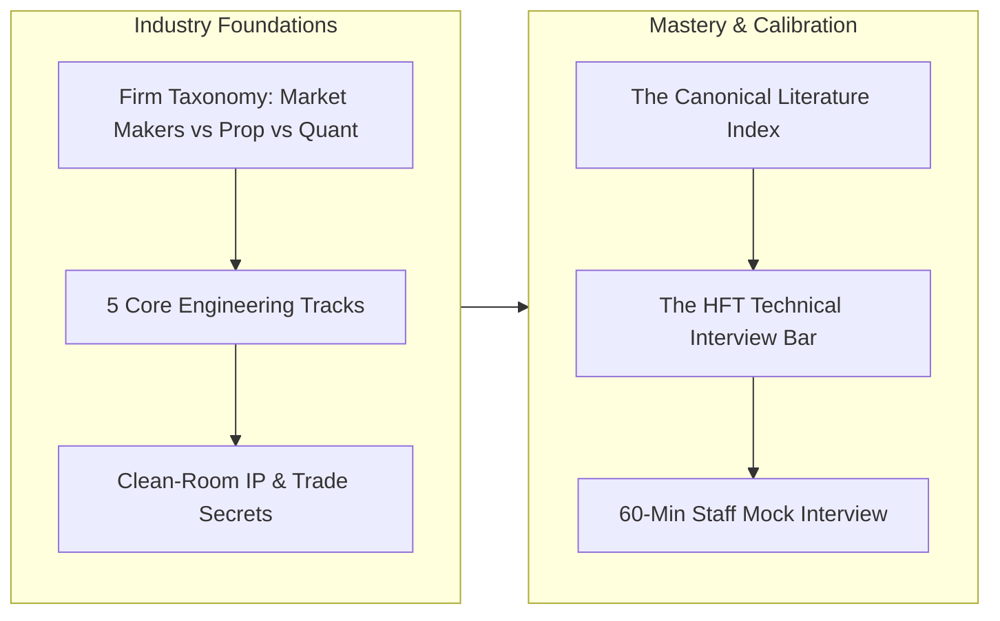

# MOC — 14 Industry Map & Canon

Landscape of quantitative trading firms, market makers, exchanges, interview technical bars, and essential literature.

---

## Core Concepts
- [[14 - Industry Map & Canon/The Quantitative Trading Firm Landscape]] — Citadel Securities, Jane Street, Jump Trading, Optiver, IMC, Virtu, DRW, HRT, CME, ICE, NASDAQ.
- [[14 - Industry Map & Canon/Core Engineering Roles in Low-Latency Trading]] — Core C++ Engineer, FPGA Engineer, Quantitative Developer, Systems Performance Engineer, Gateway Specialist.
- [[14 - Industry Map & Canon/Proprietary Secrecy vs Public Knowledge Boundary]] — Clean-room engineering, universal computer science vs protected alpha weights and microwave routes.
- [[14 - Industry Map & Canon/The Low-Latency C++ Technical Interview Bar]] — Modern C++ memory models, hardware mechanical sympathy, OS kernel tuning, and live system optimization.
- [[14 - Industry Map & Canon/Canonical Books, Papers, and Talks Index]] — The master bibliography of mandatory books (Harris, Gregg, Drepper, Williams) and academic papers (Kyle, Stoikov, Cont).

## Drills & War Stories
- [[14 - Industry Map & Canon/Drill - 14 Comprehensive Technical Mock Interview]] — Full-scale 60-minute Staff/Principal Low-Latency Engineer interview covering memory models, lock-free queues, kernel bypass, and 2µs tail spike triage.

## Canonical Sources
- [[Sources/How to Build an Exchange by Jane Street]] — Production systems architecture and operational engineering.
- [[Sources/Systems Performance by Brendan Gregg]] — Benchmarking, hardware performance counters, and kernel observability.
- [[Sources/Trading and Exchanges by Larry Harris]] — Market microstructure foundations.
