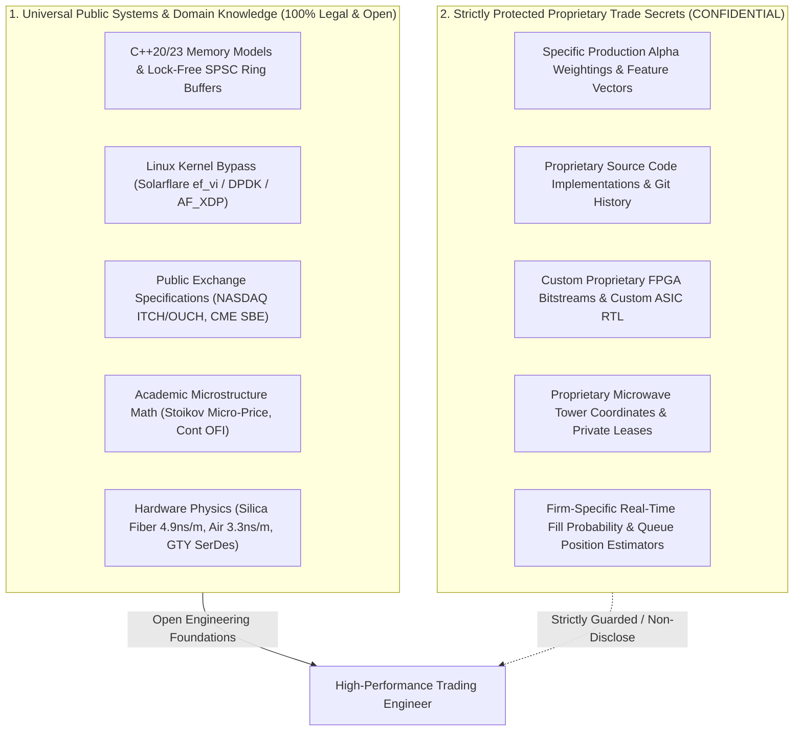

> [!summary]
> In electronic trading, maintaining a clear boundary between universal systems engineering knowledge (C++ memory models, kernel bypass, exchange protocols, public microstructure math) and strictly protected proprietary trade secrets (alpha weights, custom source code, microwave topologies) is essential for professional ethics, IP protection, and clean-room development.

---

## Why it matters
The high-frequency trading industry is renowned for intense secrecy:
- Firms guard their proprietary algorithms behind strict Non-Disclosure Agreements (NDAs), non-compete clauses, and IP litigation.
- In 2009, former Goldman Sachs quant developer Sergey Aleynikov was arrested by the FBI under the Economic Espionage Act for copying 32MB of proprietary trading gateway source code.

However:
- **Low-latency computer systems principles are universal computer science**: CPU cache optimization, acquire-release atomic synchronization, DPDK networking, and NASDAQ ITCH parsing are public knowledge.
- Understanding this boundary ensures engineers can build world-class, exchange-grade infrastructure with **100% clean-room integrity** while rigorously respecting IP law.



---

## Mechanism

### 1. The Boundary Classification Matrix

| Technical Category | Universal Public Knowledge (Open) | Strictly Proprietary Trade Secret (Protected) |
| :--- | :--- | :--- |
| **C++ & Systems Programming** | Memory models, `alignas(64)`, lock-free queues, SIMD integer parsing. | Internal proprietary utility libraries and production source code files. |
| **Exchange Protocols** | ITCH 5.0 binary framing, OUCH 4.2 structs, CME SBE Template 46. | Custom internal session manager architectures and proprietary transcoders. |
| **Quantitative Alpha Models** | Mathematical formulations (Stoikov, Kyle $\lambda$, OFI, Roll model). | **Exact calibrated coefficient weights, trained ML models, feature sets.** |
| **Network Infrastructure** | Physics of propagation ($c/n$), cut-through switching, PTP IEEE 1588. | Private microwave tower GPS coordinates, custom RF antenna designs. |
| **Hardware & FPGAs** | Xilinx UltraScale+ GTY SerDes, AXI-Stream, 322 MHz clock domains. | Proprietary synthesized Verilog bitstreams, custom ASIC mask designs. |
| **Regulations & Risk** | SEC Rule 15c3-5, MiFID II RTS 6/25, CFTC 1.73 pre-trade rules. | Specific firm-wide intraday risk limits and clearing broker credit agreements. |

### 2. Clean-Room Software Engineering Doctrine
When an engineer transitions between trading firms or builds an independent trading system:
1. **Zero Source Code Transfer**: Never take, email, copy, or reference source code, documentation, or configuration files from a previous employer.
2. **First-Principles Re-Implementation**: Re-implement data structures (ring buffers, parsers, order books) from scratch using publicly available documentation and specifications.
3. **No Retained Memory of Alpha Weights**: Mathematical models must be re-trained and re-calibrated on fresh, independently collected market data.

---

## In Practice

### Open-Source vs Proprietary Architecture Paradigm

```text
+-----------------------------------------------------------------------------------+
|                        CLEAN-ROOM SYSTEM ARCHITECTURE                             |
+-----------------------------------------------------------------------------------+
| [ PUBLIC / OPEN LAYER: Clean-Room Built ]                                         |
|                                                                                   |
|  - Ingests public NASDAQ ITCH 5.0 specification over public MoldUDP64.            |
|  - Uses standard Linux socket API tuned with public TCP_NODELAY / SO_BUSY_POLL.   |
|  - Implements published academic papers (e.g. Stoikov 2018 Volume-Weighted Model)|
|  - Memory-aligned C++20 structs with public BSWAP compiler intrinsics.            |
+-----------------------------------------------------------------------------------+
                                         |
                                         v
+-----------------------------------------------------------------------------------+
| [ PROPRIETARY VALUE-ADD LAYER: Unique Firm Alpha ]                               |
|                                                                                   |
|  - Unique proprietary feature combination discovered via statistical research.     |
|  - Dynamic inventory skew parameters tuned to firm's proprietary balance sheet.   |
|  - Real-time adverse selection avoidance logic customized to specific venues.     |
+-----------------------------------------------------------------------------------+
```

---

## Numbers

*Legal Precedents & Industry IP Benchmarks.*

| Case / Dispute | Key Legal Dispute | Outcome & Industry Precedent |
| :--- | :--- | :--- |
| **United States v. Aleynikov (2009–2016)**| Copying Goldman Sachs order gateway source code. | Clarified federal vs state trade secret statutes; established strict criminal penalties for stealing trading code. |
| **Citadel vs. Jump Trading (2014)** | Microwave latency topology trade secrets. | Confirmed that physical microwave tower path optimizations can constitute trade secrets if kept strictly confidential. |
| **Virtu Financial vs. SEC (2023)** | Internal order execution confidentiality. | Enforced strict supervisory controls over customer information barriers. |

---

## Trade-offs

| Development Philosophy | Advantages | Legal / Competitive Exposure |
| :--- | :--- | :--- |
| **Strict Clean-Room Development** | 100% Legal safety; zero IP contamination; high architectural purity. | Requires building foundational infrastructure from scratch. |
| **Leveraging Open-Source (DPDK/SBE)**| Rapid time-to-market; thoroughly tested by global community. | Shared with competitors; no proprietary latency advantage in the base layer. |
| **Proprietary Custom In-House Stack** | Maximum nanosecond optimization; tailored to exact hardware. | High development and maintenance overhead. |

---

> [!warning] Gotchas
> 1. **Accidental Muscle Memory Code Replication**: Re-typing identical proprietary utility functions or variable names from a previous firm's codebase can trigger copyright and trade secret infringement claims. *Always design architectures from first principles with independent naming conventions and structure.*
> 2. **Non-Compete Enforceability Variations**: Non-compete agreements vary dramatically by jurisdiction: strictly enforced for 6–12 months in New York, London, and Chicago (typically with garden leave pay), but historically void as a matter of public policy in California.

---

## Lab
**Objective**: Build a clean-room compliance checklist for developing an open-source low-latency trading engine, documenting the public technical sources (specifications, RFCs, academic papers) for every single component in the codebase.

**Success Criteria**:
1. Map all protocol parsers to official exchange specifications (NASDAQ, CME).
2. Map all quantitative signals to published peer-reviewed academic literature.
3. Verify that 100% of the codebase was constructed without referencing proprietary code.

---

> [!question]- Self-test
> 1. **What is the fundamental difference between universal systems engineering knowledge and a proprietary trade secret in electronic trading?**
>    *Answer*: **Universal systems engineering knowledge** comprises public computer science principles (C++ memory models, cache line alignment, lock-free queues, kernel bypass networking via DPDK/`ef_vi`, public ITCH/SBE specifications, and academic microstructure math). **Proprietary trade secrets** are confidential, firm-specific intellectual assets—such as calibrated alpha feature weights, internal source code, proprietary microwave tower coordinates, and custom FPGA bitstreams—that provide a private competitive advantage and are protected by law.
> 2. **What is "Clean-Room Engineering" and how does a developer practice it?**
>    *Answer*: Clean-Room Engineering is a software development methodology where systems are designed and implemented entirely from scratch without using, viewing, or copying proprietary source code or documentation from a competitor. A developer practices clean-room engineering by relying exclusively on public technical specifications, RFCs, and academic papers, ensuring zero intellectual property contamination.
> 3. **What was the legal significance of the landmark *United States v. Aleynikov* trade secrets case?**
>    *Answer*: The Aleynikov case highlighted the extreme legal sensitivity surrounding electronic trading source code. It demonstrated that taking proprietary trading infrastructure code (even infrastructure line handlers without alpha logic) can result in federal criminal prosecution, state-level trade secret theft convictions, and immediate permanent industry disqualification.

---

## Related
- [[14 - Industry Map & Canon/The Quantitative Trading Firm Landscape]]
- [[14 - Industry Map & Canon/Core Engineering Roles in Low-Latency Trading]]
- [[14 - Industry Map & Canon/Canonical Books, Papers, and Talks Index]]
- [[10 - Protocols & Codecs/NASDAQ ITCH 5.0 Protocol Specification]]
- [[14 - Industry Map & Canon/MOC - 14 Industry Map & Canon]]

## Sources
- [[Sources/Defend Trade Secrets Act of 2016 (DTSA)]]
- [[Sources/Flash Boys by Michael Lewis (Aleynikov Legal Background)]]
- [[Sources/How to Build an Exchange by Jane Street]]
